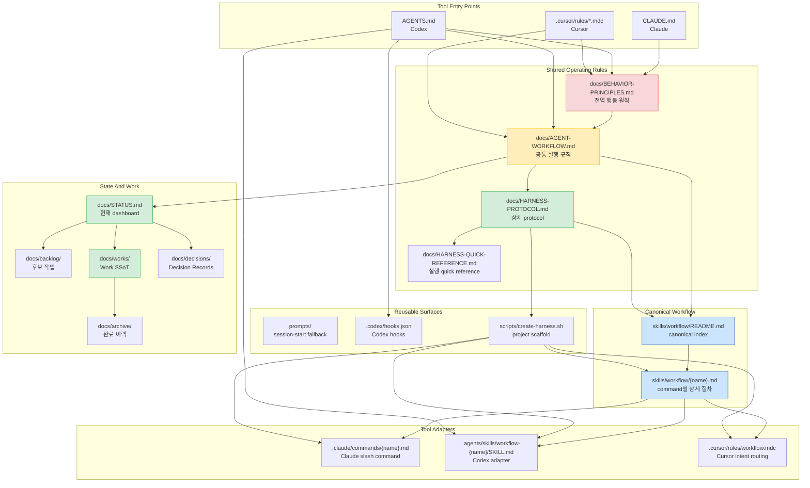
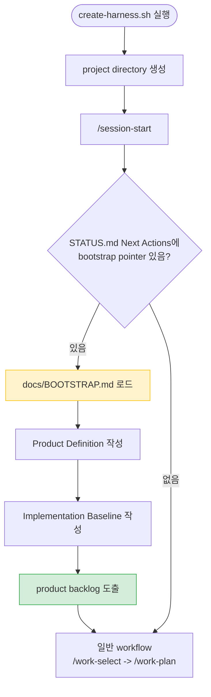
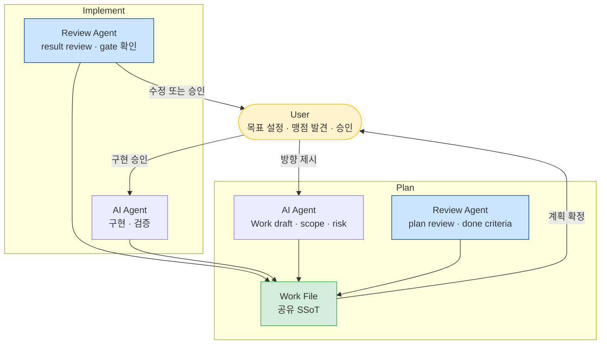
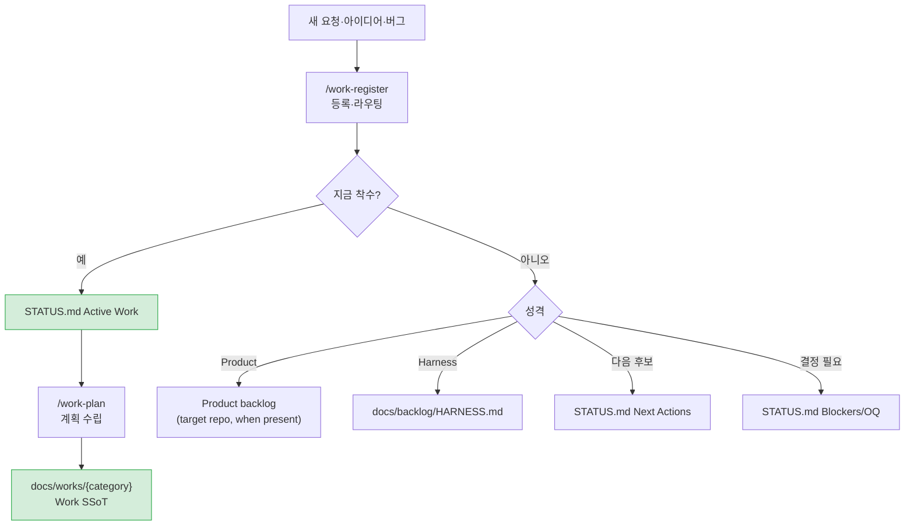

# ai-workflow-harness

프로젝트에 AI workflow를 적용하기 위한 **manual-first, approval-gated workflow harness**입니다.
Claude Code, Codex, Cursor 같은 AI 도구가 같은 상태 파일과 같은 절차를 보고 움직이도록 문서, command, skill, scaffold를 함께 제공합니다.

여러 세션에 걸쳐 AI와 일하다 보면 보통 세 가지 문제가 먼저 생깁니다. 범위가 조금씩 커지고, 승인 없이 파일이 바뀌고, 왜 그렇게 결정했는지가 대화 속에만 남습니다. 이 harness는 workflow engine을 새로 만들지 않고, **계획, 승인, 검증, 기록**으로 그 문제를 제어합니다.

---

## Start Here

먼저 자신이 어떤 사용자인지 고르세요.

| 목적 | 시작 위치 |
| --- | --- |
| 내 프로젝트에 AI workflow를 적용하고 싶습니다 | [Apply The Harness To Your Project](#apply-the-harness-to-your-project) |
| 이 repository를 fork/clone해서 나만의 harness source로 키우고 싶습니다 | [Adopter Modes And Maintenance](#adopter-modes-and-maintenance) |
| 이 upstream repository에 기여하고 싶습니다 | [Contributing](#contributing) |
| workflow 개념부터 보고 싶습니다 | [Workflow Overview](#workflow-overview) |

> [!IMPORTANT]
> 이 repository 자체를 직접 project-local workspace로 전환하지 마세요. 이 repository는 harness source입니다. 실제 제품, 서비스, 문서 프로젝트에는 `scripts/create-harness.sh`로 별도 project directory에 scaffold를 생성해 적용합니다.

처음 보는 사람이라면 이 순서로 시작하면 가장 덜 헷갈립니다.

1. 내 프로젝트에 적용하려는 경우: `scripts/create-harness.sh`로 별도 project directory를 만든다.
2. 생성된 project directory에서 `/session-start`를 실행한다.
3. `docs/STATUS.md`가 bootstrap onboarding을 가리키면 [Scaffold Onboarding Guide](docs/SCAFFOLD-ONBOARDING-GUIDE.md)로 이동한다.

### Requirements

- macOS 권장. Linux, WSL, Git Bash는 호환을 기대합니다.
- Windows native 지원은 별도 보완 예정입니다.
- scaffold script와 validation 예시는 `bash`, Unix-style path, `python3`를 전제합니다.
- 별도 package install은 필요 없습니다. 이 repository는 Markdown 문서와 shell script 중심입니다.

```bash
git clone https://github.com/kyungseo/ai-workflow-harness.git
cd ai-workflow-harness

# 새 프로젝트에 harness 적용
# <project-name> : 파일 내부 식별자. 생성된 문서 안에서 ai-workflow-harness를 대체한다.
# <target-dir>   : 파일이 실제로 생성될 디렉토리 경로. project-name과 달라도 된다.
scripts/create-harness.sh my-app /path/to/my-app
```

scaffold 후에는 생성된 project directory에서 `/session-start`로 첫 세션을 시작하고, `docs/BOOTSTRAP.md`의 onboarding 항목을 채웁니다. 자세한 안내는 [Scaffold Onboarding Guide](docs/SCAFFOLD-ONBOARDING-GUIDE.md)를 보세요.

---

## Table of Contents

- [What This Repository Is](#what-this-repository-is)
- [Repository Structure](#repository-structure)
- [Apply The Harness To Your Project](#apply-the-harness-to-your-project)
- [Adopter Modes And Maintenance](#adopter-modes-and-maintenance)
- [Workflow Overview](#workflow-overview)
- [Core Concepts](#core-concepts)
- [Command Map](#command-map)
- [Git Flow](#git-flow)
- [Documentation Map](#documentation-map)
- [Repository Layout](#repository-layout)
- [Contributing](#contributing)
- [License](#license)

---

## What This Repository Is

`ai-workflow-harness`는 AI가 프로젝트 안에서 일하는 방식을 정리한 source repository입니다.
여기에는 세 가지가 들어 있습니다.

| 구성 | 역할 |
| --- | --- |
| Workflow documents | 세션 시작, 작업 선택, 계획, 승인, 검증, 완료 처리 기준 |
| Tool adapters | Claude Code command, Codex skill, Cursor rule이 같은 canonical workflow를 부르도록 하는 얇은 연결부 |
| Scaffold script | 다른 project repository에 이 workflow 구조를 생성하는 `scripts/create-harness.sh` |

이 repository는 사용자의 제품 코드가 들어가는 template가 아닙니다. 적용 대상 프로젝트에는 scaffold 결과물을 생성하고, 그 project가 자기 `STATUS.md`, backlog, Work 파일, decision record를 채워갑니다.

이 harness가 해결하려는 문제는 분명합니다.

| Problem | Without Harness | With Harness |
| --- | --- | --- |
| Context 반복 설명 | 매 세션 다시 설명 | `STATUS.md`와 Work 파일로 복구 |
| Scope drift | AI가 선의로 범위를 넓힘 | Approval Matrix에서 중단 |
| 상태 소실 | 대화 기록에 의존 | repo-visible dashboard와 Work SSoT |
| 결정 근거 소실 | commit 또는 기억에 의존 | DR(Decision Record)에 보존 |
| 도구 전환 drift | Claude/Codex/Cursor가 다르게 행동 | 공통 원칙과 tool adapter 정렬 |

핵심 원칙은 단순합니다.

- **Plan before implement**: 실행 전에 scope, files, verification, risk, reversal cost를 확인합니다.
- **Approval before risk**: 범위 확장, 상태 변경, commit은 승인 gate를 통과합니다.
- **State is repo-visible**: 다음 AI가 대화 기억 없이도 이어받을 수 있어야 합니다.
- **Surgical changes**: 승인된 범위만 바꿉니다.

---

## Repository Structure

처음에는 아래 구조만 이해하면 충분합니다.

1. **Entry points**가 AI 도구별 시작점을 제공합니다.
2. **Shared operating rules**가 모든 도구의 공통 규칙을 제공합니다.
3. **Canonical workflow**가 실제 절차의 SSoT입니다.
4. **Adapters**가 Claude Code, Codex, Cursor의 실행 방식에 맞춰 canonical 절차를 호출합니다.
5. **State files**가 현재 작업과 결정 근거를 repository 안에 남깁니다.
6. **Scaffold**가 이 구조를 다른 project repository에 설치합니다.



평시 AI 실행 규칙의 권위는 `docs/BEHAVIOR-PRINCIPLES.md`, `docs/AGENT-WORKFLOW.md`, `skills/workflow/`에 있습니다. README와 user-facing docs는 사람이 빠르게 이해하고 올바른 다음 문서로 이동하기 위한 입구입니다.

---

## Apply The Harness To Your Project

새 프로젝트나 기존 프로젝트에 적용할 때는 `scripts/create-harness.sh`를 사용합니다.

두 위치 인자의 역할이 다릅니다.

- `<project-name>`: 생성된 파일 내부에서 `ai-workflow-harness`를 대체하는 **프로젝트 식별자**입니다. 디렉토리 이름과 일치하지 않아도 됩니다.
- `[target-dir]`: 파일이 실제로 생성될 **디렉토리 경로**입니다. 생략하면 `temp/<project-name>/`에 생성합니다.

```bash
# 새 프로젝트
scripts/create-harness.sh my-app /path/to/my-app

# 기존 프로젝트에 추가
scripts/create-harness.sh --existing my-app /path/to/existing-project

# Optional pack 포함
scripts/create-harness.sh --with-optional my-app /path/to/my-app

# Gitflow 정책 포함
scripts/create-harness.sh --workflow source-gitflow my-app /path/to/my-app

# 파일 생성 없이 확인
scripts/create-harness.sh --dry-run my-app

# 생성된 harness 파일 drift 확인
scripts/create-harness.sh --check /path/to/my-app
```

`--profile`과 `--workflow`는 역할이 다릅니다. 둘을 섞어 읽으면 가장 많이 헷갈립니다.

| 옵션 | 의미 |
| --- | --- |
| `--profile` | 언어·프레임워크 예시 rule/prompt 포함 여부를 고릅니다. 기본은 `generic`입니다. |
| `--workflow` | branch/release policy mode를 고릅니다. 기본은 `generic`이고, 기존 project의 branch policy를 유지합니다. |
| `--workflow source-gitflow` | 이 source repository와 비슷한 feature -> develop -> main 운영 모델을 적용하고 싶을 때만 선택합니다. |

scaffold 직후에는 생성된 project directory에서 `/session-start`로 첫 세션을 시작합니다. `docs/STATUS.md`의 Next Actions가 bootstrap onboarding을 가리키면 `docs/BOOTSTRAP.md`를 채워 Product Definition, Implementation Baseline, product backlog를 정리합니다.

**생성되는 artifact의 언어:** 이 harness가 생성하는 문서·rule·commit/PR 규칙은 기본적으로 **한국어 주체 + Bilingual Rules**(기술 용어는 영어)로 작성됩니다. 조직·팀의 주 언어가 다르면 [`docs/decisions/DR-007-language-policy.md`](docs/decisions/DR-007-language-policy.md)(언어 정책 SSoT)를 따라 정책을 바꿀 수 있습니다. 단 entry/rule surface에 directive가 inline되어 있어 한 파일 수정만으로는 적용되지 않으며, DR-007이 **함께 수정할 surface 목록**을 규정합니다.

자세한 첫 세션 절차는 [docs/SCAFFOLD-ONBOARDING-GUIDE.md](docs/SCAFFOLD-ONBOARDING-GUIDE.md)를 보세요. source repository를 유지보수하는 사람이라면, user-facing 문서만 읽지 말고 아래 [Maintainer reference documents](#maintainer-reference-documents)도 함께 확인하세요.

<details>
<summary>Scaffold 후 첫 세션 흐름</summary>



</details>

---

## Adopter Modes And Maintenance

이 repository를 사용하는 방법은 두 가지입니다. 두 경로를 섞지 않는 것이 중요합니다.

| Mode | 누구에게 맞나요? | 주의할 점 |
| --- | --- | --- |
| Scaffold product repo | 자기 프로젝트에 AI workflow를 적용하려는 사용자 | 이 source repository를 직접 project workspace로 쓰지 말고, 별도 project directory에 scaffold를 생성합니다. |
| Forked harness source | 이 harness 자체를 fork/clone해서 자기만의 workflow framework로 발전시키려는 maintainer-adopter | source repo의 Gitflow, `source-gitflow` marker, 선택 hook, source-only 문서 전제를 함께 관리해야 합니다. |

### Scaffold Product Repo

생성된 project repository에는 framework-owned 파일과 project-owned 파일이 함께 있습니다. 이 구분을 처음부터 이해해 두면 나중에 migration이나 drift 확인이 훨씬 쉬워집니다.

| 구분 | 예시 | 관리 방법 |
| --- | --- | --- |
| Framework-owned | entrypoint, workflow command/skill, protocol, generated guide | 가능한 직접 수정하지 않고 source 업데이트와 비교합니다. |
| Project-owned | `docs/STATUS.md`, product backlog, Work 파일, project decisions | 해당 project의 실제 상태로 채웁니다. |

`scripts/create-harness.sh --check /path/to/project`는 generated manifest를 기준으로 framework 파일이 `in-sync`, `source-updated`, `locally-modified`인지 보고합니다. 현재 자동 upgrade 기능은 없습니다. 이미 scaffold한 project를 최신 source와 맞추려면 `--check` 결과를 보고 필요한 파일만 수동으로 selective migration하세요.

오래된 target에는 `.harness/manifest.json`이 없을 수 있습니다. 이런 pre-manifest target은 `--check`만으로 migration 범위를 판단하지 말고, source repo maintainer가 source-only 문서의 upgrade/migration note를 먼저 확인해야 합니다. 시작점은 [Maintainer reference documents](#maintainer-reference-documents)의 `migrations/`, `SOURCE-REPO-OPERATIONS.md`, `VERIFICATION-COMMANDS.md` Layer T입니다.

### Forked Harness Source

이 repository를 fork/clone해서 자기만의 harness source로 키우려면 먼저 운영 모드를 정하세요.

| 선택지 | 의미 |
| --- | --- |
| Upstream-compatible mode | 이 repository의 Gitflow(feature -> develop -> main), source-gitflow marker, optional hook model을 유지합니다. upstream 변경을 따라가기 쉽습니다. |
| Personal harness mode | Gitflow, marker, branch policy, hook 설치 여부를 자기 workflow에 맞게 바꿉니다. 대신 source repo 규칙과 scaffold 출력의 경계를 직접 책임져야 합니다. |

local hook은 자동 설치되지 않습니다. source repo에서만 선택적으로 설치하며, scaffold product repo에는 기본 배포되지 않습니다.

```bash
# source repo 유지보수자가 선택적으로 설치
sh tools/git-hooks/install.sh
```

---

## Workflow Overview

### Human-AI Collaboration Model

이 harness는 AI가 혼자 자동 실행하는 구조가 아니라, 사용자가 방향과 승인을 잡고 여러 AI 도구가 계획·구현·검토 역할을 나누는 협업 구조를 전제합니다. Claude Code와 Codex의 역할은 고정되어 있지 않으며, 작업 성격과 세션 상태에 따라 서로 계획자, 구현자, reviewer가 될 수 있습니다.



모든 작업은 같은 state machine을 따릅니다.

```text
INIT -> PLAN -> APPROVAL -> EXECUTE -> VALIDATE -> CHECKPOINT -> END
                  ^              |
                  |              v
               RECOVER <- FAIL <-+
```

1. `/session-start`로 현재 상태를 확인합니다.
2. `/work-select`, `/work-plan`, `/work-resume`, `/work-debug` 중 맞는 흐름으로 들어갑니다.
3. Plan에는 Scope, Files, Verification, Risk, Reversal Cost가 포함됩니다.
4. 사용자가 승인하면 실행합니다.
5. 검증 실패 시 checkpoint나 commit을 만들지 않습니다.
6. Work 완료는 `/work-close`, 세션 요약은 `/session-summary`로 분리합니다.

자세한 운영 설명은 [docs/WORKFLOW-MANUAL.md](docs/WORKFLOW-MANUAL.md)를 보세요.

---

## Core Concepts

### Work Selection And Routing

`docs/STATUS.md`는 dashboard이고, 모든 후보를 담는 backlog가 아닙니다. 새 요청은 성격과 긴급도에 따라 Product backlog, Harness backlog, STATUS Next Actions, Blockers/Open Questions로 라우팅합니다.



### Approval Matrix

Approval Matrix는 실행 전 승인, 상태 변경 승인, commit 전 승인을 하나의 기준으로 묶습니다. 상세 표와 예외는 [docs/AGENT-WORKFLOW.md](docs/AGENT-WORKFLOW.md)의 Approval Matrix가 SSoT입니다.

README에서 기억할 gate는 네 가지입니다.

| Gate | AI가 해야 할 일 |
| --- | --- |
| Scope | 실행 전에 Scope, Files, Verification, Risk, Reversal Cost를 보고합니다. |
| State Change | `docs/STATUS.md`, Work Done, archive, Recent Decisions 같은 상태 변경은 대상 Work ID와 이유를 밝히고 승인받습니다. |
| Validation | 검증 실패 상태에서는 checkpoint나 commit을 만들지 않습니다. |
| Commit / PR | validation 결과, diff summary, 제안 commit message를 보고하고 별도 승인을 받습니다. |

Quick Mode는 Product track의 작고 명확한 L1 작업에 한정합니다. Harness/workflow surface를 건드리면 기본 L2로 다룹니다.

### State Storage

| 파일 | 역할 |
| --- | --- |
| `docs/STATUS.md` | 현재 dashboard. Active Work pointer, Next Actions, 최근 결정 digest를 둡니다. |
| `docs/works/{category}/` | 큰 작업의 SSoT. Top Summary, Context Manifest, Scope/Plan, Done Criteria, Verification, Checkpoints, Next Actions, Discovery를 둡니다. |
| `docs/backlog/` | 아직 착수하지 않은 후보 작업을 둡니다. |
| `docs/decisions/` | 되돌리기 비용이 있거나 여러 surface에 영향을 주는 결정을 기록합니다. |

### Trigger And Cascade

AI는 조건이 충족되어도 파일을 자동으로 수정하지 않습니다. 변경이 필요하다고 판단하면 먼저 제안하고, 사용자 승인 후 수정합니다.

핵심 cascade 규칙은 아래와 같습니다.

- canonical workflow가 바뀌면 tool-specific, user-facing, scaffold surface를 함께 확인합니다.
- command/rule/prompt/entrypoint가 바뀌면 Claude/Codex/Cursor alignment를 확인합니다.
- `scripts/create-harness.sh` 또는 canonical workflow가 바뀌면 dry-run과 fresh scaffold를 검증합니다.
- commit 또는 PR 전에는 STATUS Finalization(T15)과 Tracking Finalization(T16)을 확인합니다.

---

## Command Map

사용자는 아래 command 이름으로 workflow에 진입합니다. 상세 절차는 `skills/workflow/{name}.md`가 canonical SSoT이고, Claude/Codex/Cursor 표면은 이 절차를 호출하는 adapter입니다.

| Command | Use When | Core Action |
| --- | --- | --- |
| `/session-start` | 세션 시작 | STATUS current sections 확인, 현재 상태와 후보 요약 |
| `/work-select` | 다음 작업 선택 | product/harness backlog 비교 후 추천 |
| `/work-register` | 새 항목 등록 | 긴급도·성격에 따라 적절한 위치로 등록 |
| `/work-plan {ID\|title-or-slug}` | 특정 작업 시작 | Work 파일 확인, risk 판단, plan 승인 대기 |
| `/work-resume {ID}` | 중단 작업 재개 | 실제 파일 상태와 STATUS·Work 파일 불일치 확인 |
| `/work-debug` | 오류 분석 | 원인 근거와 최소 수정 계획 |
| `/work-doc` | 발표·보고·review package | brief, source, format, quality bar 확인 |
| `/record-decision` | 결정 기록 | DR 초안 작성 |
| `/work-close` | Work 완료 | Done 처리와 선택적 archive |
| `/session-summary` | 세션 마무리 | 변경·검증·리스크·다음 prompt 요약 |
| `/repo-health` | workflow 점검 | 구조 위생·정합성, context weight, cascade drift 확인 |

---

## Git Flow

이 source repository의 기본 branch 전략은 Gitflow입니다. 자세한 절차와 예외는 [docs/GIT-WORKFLOW.md](docs/GIT-WORKFLOW.md)가 SSoT입니다.

```text
main
 └── develop
      └── feature/*
```

- source repo 작업은 `develop` 기준의 `feature/*` branch에서 합니다.
- feature -> develop 병합은 PR로만 합니다.
- feature PR base는 반드시 `develop`입니다.
- develop -> main PR은 release-ready 상태에서만 만듭니다.
- scaffold product repo는 기본적으로 이 Gitflow를 강제받지 않습니다. `--workflow source-gitflow`를 선택한 경우에만 source-style branch isolation이 들어갑니다.

---

## Documentation Map

| 목적 | 문서 |
| --- | --- |
| 세션 실행 규칙 빠른 확인 | [docs/HARNESS-QUICK-REFERENCE.md](docs/HARNESS-QUICK-REFERENCE.md) |
| 사용자용 workflow 설명 | [docs/WORKFLOW-MANUAL.md](docs/WORKFLOW-MANUAL.md) |
| scaffold 직후 첫 온보딩 | [docs/SCAFFOLD-ONBOARDING-GUIDE.md](docs/SCAFFOLD-ONBOARDING-GUIDE.md) |
| 공통 운영 규칙 | [docs/AGENT-WORKFLOW.md](docs/AGENT-WORKFLOW.md) |
| 상세 protocol | [docs/HARNESS-PROTOCOL.md](docs/HARNESS-PROTOCOL.md) |
| source repo Git 정책 | [docs/GIT-WORKFLOW.md](docs/GIT-WORKFLOW.md) |
| source-only maintainer 문서 지도 | [docs/maintainer/README.md](docs/maintainer/README.md) |
| canonical workflow 절차 | [skills/workflow/](skills/workflow/) |
| 현재 상태 dashboard | [docs/STATUS.md](docs/STATUS.md) |
| Harness backlog | [docs/backlog/HARNESS.md](docs/backlog/HARNESS.md) |
| 언어 정책 (단일 SSoT) | [docs/decisions/DR-007-language-policy.md](docs/decisions/DR-007-language-policy.md) |
| Decision Records | [docs/decisions/](docs/decisions/) |

<details>
<summary>Maintainer reference documents</summary>

| 문서 | 로드 조건 |
| --- | --- |
| [docs/HARNESS-NAMING-RULES.md](docs/HARNESS-NAMING-RULES.md) | Work ID, DR ID, 파일명 부여·검증 시 |
| [docs/HARNESS-RECOVERY-VALIDATION.md](docs/HARNESS-RECOVERY-VALIDATION.md) | validation failure 또는 commit approval 판단 시 |
| [docs/HARNESS-PARALLEL-WORK-CONTROLS.md](docs/HARNESS-PARALLEL-WORK-CONTROLS.md) | 병렬 branch·agent 충돌 감지 시 |
| [docs/HARNESS-ARCHITECTURE.md](docs/HARNESS-ARCHITECTURE.md) | 구조와 정보 흐름을 깊게 볼 때 |
| [docs/HARNESS-MAINTAINER-GUIDE.md](docs/HARNESS-MAINTAINER-GUIDE.md) | source repo 유지보수 convention 확인 시 |
| [docs/maintainer/SOURCE-REPO-OPERATIONS.md](docs/maintainer/SOURCE-REPO-OPERATIONS.md) | source repo 변경 유형별 검증 경로를 고를 때 |
| [docs/maintainer/VERIFICATION-COMMANDS.md](docs/maintainer/VERIFICATION-COMMANDS.md) | Layer별 검증 명령과 release sweep을 확인할 때 |
| [docs/maintainer/HARNESS-TEST-TAXONOMY.md](docs/maintainer/HARNESS-TEST-TAXONOMY.md) | 검증 Tier 구조, 용어, `temp/` 정책이 헷갈릴 때 |
| [docs/maintainer/PRODUCT-STARTER-PLANNING-PACK.md](docs/maintainer/PRODUCT-STARTER-PLANNING-PACK.md) | product starter pack / import loop / source-product 경계를 볼 때 |
| [docs/maintainer/VERSIONING.md](docs/maintainer/VERSIONING.md) | source repo 버전 bump, tag, release note 판단이 필요할 때 |
| [docs/maintainer/migrations/](docs/maintainer/migrations/) | 기존 target repo가 framework 변경을 수용할 때 |
| [prompts/README.md](prompts/README.md) | session-start fallback prompt 확인 시 |

</details>

---

## Repository Layout

```text
.
├── AGENTS.md                              # Codex 진입점
├── CLAUDE.md                              # Claude Code 진입점
├── .agents/skills/                        # Codex workflow adapters
├── .claude/commands/                      # Claude slash commands
├── .claude/rules/                         # path-scoped rules
├── .codex/hooks.json                      # Codex hook 설정
├── .cursor/rules/                         # Cursor rules
├── docs/
│   ├── BEHAVIOR-PRINCIPLES.md             # 전역 행동 원칙
│   ├── AGENT-WORKFLOW.md                  # 공통 workflow
│   ├── HARNESS-PROTOCOL.md                # 상세 protocol
│   ├── HARNESS-QUICK-REFERENCE.md         # 빠른 참조
│   ├── GIT-WORKFLOW.md                    # source repo Git 전략
│   ├── STATUS.md                          # 현재 dashboard
│   ├── WORKFLOW-MANUAL.md                 # 사용자용 workflow manual
│   ├── SCAFFOLD-ONBOARDING-GUIDE.md       # scaffold 온보딩 가이드
│   ├── backlog/                           # 후보 작업
│   ├── decisions/                         # Decision Records
│   ├── maintainer/                        # source-only maintainer reference
│   └── works/                             # Work 파일
├── skills/workflow/                       # canonical workflow 절차
├── prompts/                               # session-start fallback prompts
├── scripts/create-harness.sh              # scaffold script
└── tools/git-hooks/                       # source repo 전용 hooks
```

---

## Contributing

버그 리포트와 기능 제안은 GitHub Issues에서 환영합니다.

이 repository에 직접 기여하려면 source repo Gitflow를 따릅니다. feature branch에서 작업하고, PR base는 `develop`으로 지정하세요. 아직 별도 `CONTRIBUTING.md`는 없으므로 자세한 branch/merge 절차는 [docs/GIT-WORKFLOW.md](docs/GIT-WORKFLOW.md)를 기준으로 합니다.

---

## License

[Apache License 2.0](LICENSE)
