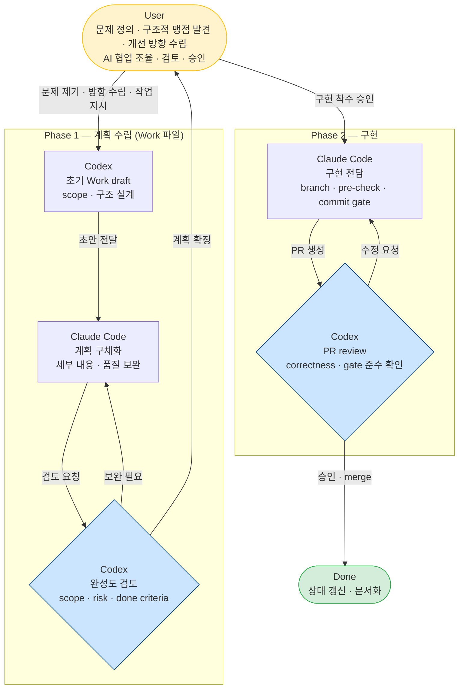
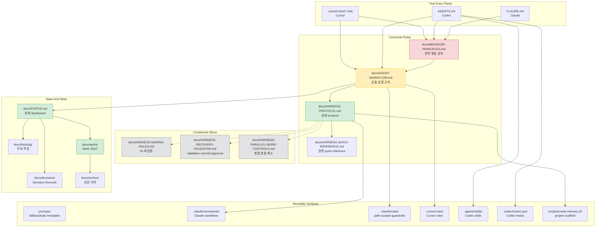
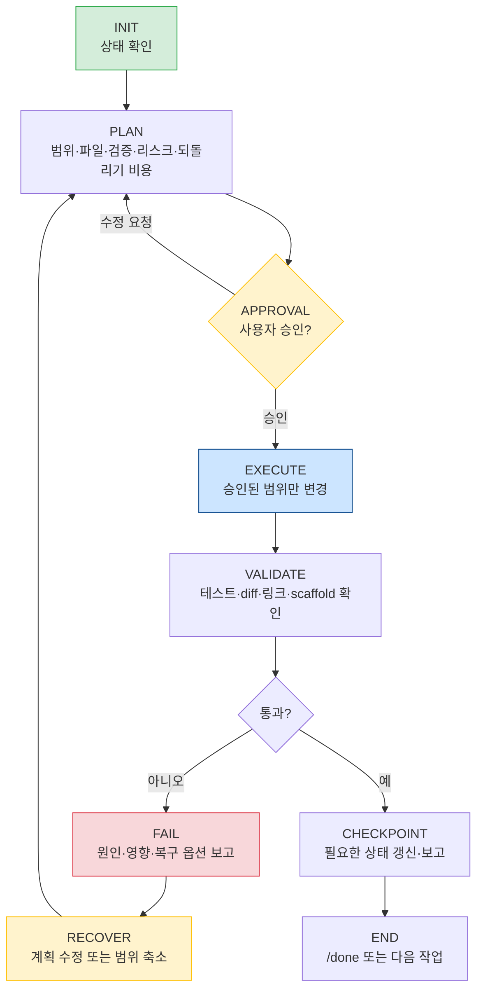
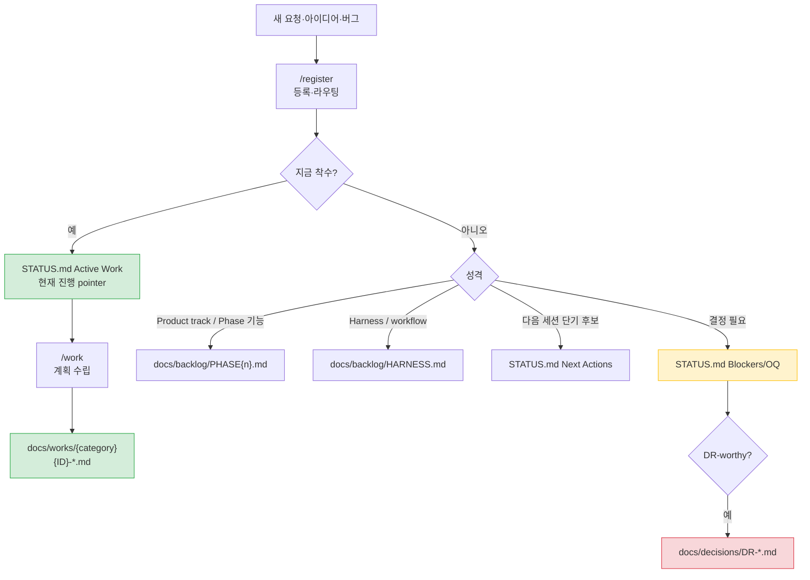
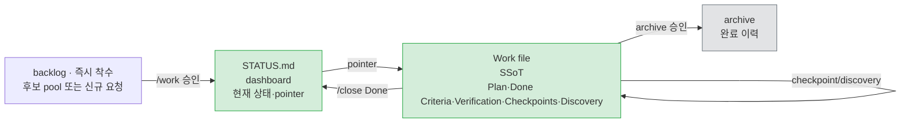
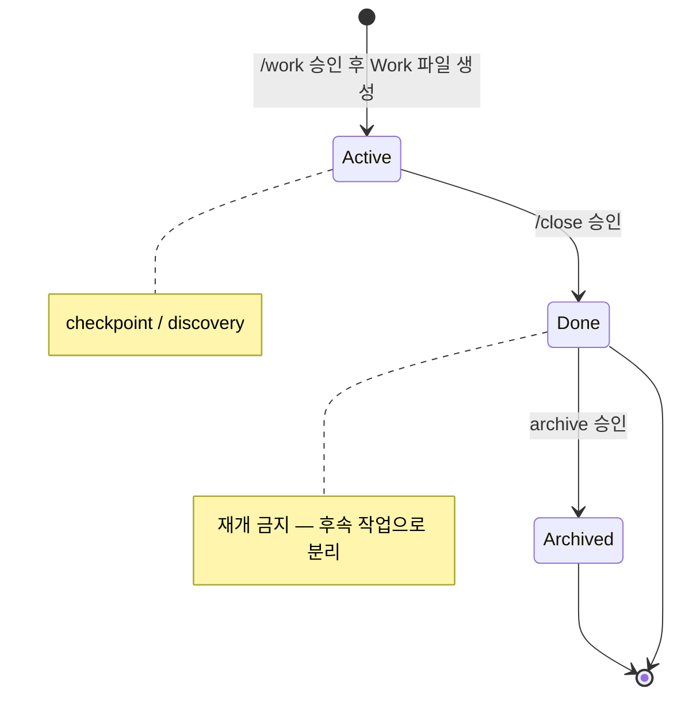
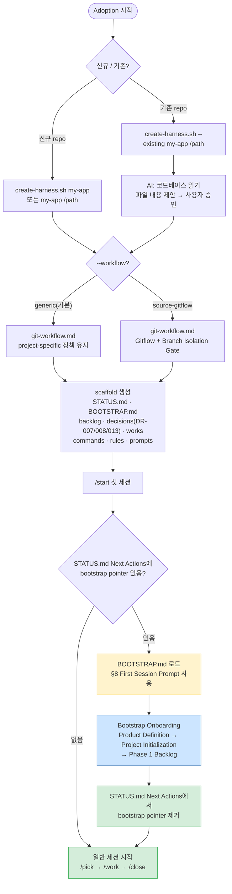

# ai-workflow-harness

> A manual-first, approval-gated AI workflow harness for Claude Code, Codex, and Cursor.  
> (계획·승인·검증·기록으로 이어지는 AI 개발 하네스)

AI 코딩 에이전트와 반복 세션을 운영할 때 발생하는 **범위 확장, 상태 불일치, 승인 없는 실행, 결정 기록 소실**을 workflow 엔진 없이 문서와 명시적 gate만으로 제어한다.

---

## Quick Start

> [!NOTE]
> **fork / clone 후 신규/기존 프로젝트에 적용하려면:**
> 1. [§10 New Project Adoption](#10-new-project-adoption) 확인 — scaffold 명령 실행
> 2. [`docs/SCAFFOLD-ONBOARDING-GUIDE.md`](docs/SCAFFOLD-ONBOARDING-GUIDE.md) 따라 첫 세션 진행
>
> 이 repository 자체를 직접 project-local workspace로 전환하지 않는다.

---

## Table of Contents

- [Quick Start](#quick-start)
- [Prologue](#prologue)
- [1. What This Harness Is](#1-what-this-harness-is)
- [2. Document Layers](#2-document-layers)
- [3. Session Lifecycle](#3-session-lifecycle)
- [4. Work Selection And Routing](#4-work-selection-and-routing)
- [5. Approval Matrix](#5-approval-matrix)
- [6. STATUS And Work File Rules](#6-status-and-work-file-rules)
- [7. Command Map](#7-command-map)
- [8. Trigger And Cascade](#8-trigger-and-cascade)
- [9. Git Flow](#9-git-flow)
- [10. New Project Adoption](#10-new-project-adoption)
- [11. Key Documents](#11-key-documents)
- [12. Repository Layout](#12-repository-layout)
- [13. License](#13-license)

---

## Prologue

### 여정 요약

Claude Code, Codex 등은 강력하지만 context를 잘못 관리하면 세션마다 동일한 설명을 반복하거나, 승인 없이 범위를 넘는 작업을 수행하거나, 결정 사항이 사라지는 문제가 생긴다.  
이 하네스는 그 문제를 직접 경험하고, 실제 프로젝트에 적용하면서 발견한 마찰을 하나씩 문서와 규칙으로 굳힌 결과물이다.

첫 commit 이후 수백 개의 commit을 거쳐 2026-05-24에 첫 안정화 기준선을 태그했다.

```text
ai-workflow-v1.0.0 — Lightweight Manual-First AI Workflow Harness v1
```

이 tag가 가리키는 의미:

- 전역 행동 원칙, 실행 규칙, 상세 protocol, 사용자 매뉴얼이 계층화되었다.
- Claude, Codex, Cursor, prompts, scaffold가 같은 핵심 계약을 참조한다.
- `STATUS.md`는 dashboard, Work 파일은 작업 단위 SSoT(Single Source of Truth — 단일 정보 원천)로 분리되어 관리된다.
- Approval Matrix로 scope, state update, commit gate가 하나의 기준으로 정리되었다.
- Multi Active Work 지원 — Work 파일 단위 SSoT로 컨텍스트를 분리해 여러 작업을 병렬 추적한다.

이후 변경은 v1.0을 더 키우기보다 실제 사용 중 발견된 반복 실패를 기준으로 작게 보정하는 방향으로 진행할 예정이다.

> **환경 지원:** Primary macOS / Expected compatible Linux·WSL·Git Bash / Planned Windows native.  
> scaffold script와 일부 validation 예시는 `bash`, Unix-style path, `python3`를 전제한다. Windows native 지원은 별도로 작업할 예정이다. (현재 미지원)

### 협업 구조

> [!TIP]
> - 이 하네스는 단일 AI 도구가 아닌 **사람 + 복수의 AI가 역할을 나눠 협업하는 구조**를 전제한다. 계획 수립과 구현을 페이즈로 분리하고, AI 간 교차 검토를 거쳐 완성도를 높이는 방식이다.
> - 이 repository(ai-workflow-harness) 자체도 그렇게 만들어지고 있다.

**AI와 함께 일하는 방식 (Working with AI)**

- Claude Code · Codex의 역할은 고정되지 않는다 — 작업 성격에 따라 유연하게 전환된다.



---

## 1. What This Harness Is

AI Workflow Harness는 AI 세션을 감싸는 운영 구조다.  
목표는 **작업 상태, 승인 지점, 검증 결과, 결정 근거를 repo에 남겨 다음 세션과 다른 Agent가 이어받을 수 있게 하는 것**이다.

| Problem | Without Harness | With Harness |
| --- | --- | --- |
| Context 반복 설명 | 매 세션 다시 설명 | `STATUS.md`와 Work 파일로 복구 |
| Scope drift | AI가 선의로 범위 확장 | Approval Matrix로 중단 |
| 상태 소실 | 대화 기록에 의존 | repo-visible dashboard와 Work SSoT |
| 결정 근거 소실 | commit 또는 기억에 의존 | DR(결정 기록)과 Recent Decisions로 보존 |
| 도구 전환 drift | Claude/Codex/Cursor가 다르게 행동 | 공통 원칙과 tool-specific 진입점 정렬 |

핵심 원칙:

- **Behavior Principles First** — 속도보다 신중함과 안정성.
- **Context Is Limited** — 필요한 파일만 읽는다.
- **Plan Before Implement** — 실행 전 범위, 파일, 검증, 리스크, 되돌리기 비용을 보고한다.
- **Approval Before Risk** — scope 확장, 상태 변경, commit은 gate를 통과한다.
- **Surgical Changes** — 요청된 최소 범위만 바꾼다.
- **State Is Repo-Visible** — 다음 Agent가 기억 없이 이어받을 수 있어야 한다.

워크플로우 엔진 없이 문서와 명시적 gate만으로 제어한다. AI 파이프라인 자동화보다 **AI와 협업하는 방식을 먼저 정립하는 단계**에 맞는 도구다.

---

## 2. Document Layers

Harness 문서는 역할별로 계층이 나뉜다.  
세션 시작 시 기본값으로 읽는 것은 [`BEHAVIOR-PRINCIPLES.md`](docs/BEHAVIOR-PRINCIPLES.md), [`AGENT-WORKFLOW.md`](docs/AGENT-WORKFLOW.md), [`STATUS.md`](docs/STATUS.md) current sections뿐이다.  
조건이 생길 때만 해당 문서를 추가 로드한다. 상세 routing 기준은 [`docs/AGENT-WORKFLOW.md`](docs/AGENT-WORKFLOW.md) 참조.



위에 포함되지 않은 User-facing docs([`WORKFLOW-MANUAL.md`](docs/WORKFLOW-MANUAL.md), [`docs/retrospectives/`](docs/retrospectives/), [`docs/troubleshooting/`](docs/troubleshooting/))는 평시 AI reading path에 포함하지 않고, 사용자가 매뉴얼 검토를 요청했거나 user-facing cascade가 필요할 때만 확인한다.

---

## 3. Session Lifecycle

모든 작업은 같은 state machine을 따른다.



1. `/start` 또는 intent recognition으로 현재 상태를 확인한다.
2. `/pick`, `/work`, `/resume`, `/debug` 중 맞는 흐름으로 진입한다.
3. Plan에는 Scope, Files, Verification, Risk, Reversal Cost를 포함한다.
4. 승인 후 실행한다.
5. 검증 실패 시 commit과 checkpoint를 만들지 않는다.
6. Work 완료는 `/close`, 세션 요약은 `/done`으로 분리한다.

---

## 4. Work Selection And Routing

[`STATUS.md`](docs/STATUS.md)는 dashboard이고, 모든 후보를 담는 backlog가 아니다.



| Item | Location |
| --- | --- |
| 지금 하는 일 | [`docs/STATUS.md`](docs/STATUS.md) Active Work |
| Product track 후보 | `docs/backlog/PHASE{n}.md` |
| workflow/harness 후보 | [`docs/backlog/HARNESS.md`](docs/backlog/HARNESS.md) |
| 큰 작업의 상세 계획 | `docs/works/{category}/{ID}-{topic}.md` |
| 결정 근거 | `docs/decisions/DR-*.md` |
| 완료 이력 | [`docs/archive/`](docs/archive/) |

---

## 5. Approval Matrix

> [!NOTE]
> 이 harness는 두 개의 작업 트랙을 함께 운영한다.
>
> - **Product track** — 적용 대상 프로젝트의 기능, 문서, 테스트, 인프라, Phase backlog.
> - **Harness track** — AI workflow, command/rule, prompt, scaffold, status/process hardening.
>
> `scripts/create-harness.sh`로 scaffold한 프로젝트는 두 트랙을 모두 가진다. 이 repository처럼 harness 자체를 개발하는 source repo는 Product track이 비어 있고 Harness track만 active 상태이다.

실행 전 승인, 상태 변경 승인, commit 전 승인을 하나의 기준으로 묶는다.

| 변경 유형 | 실행 전 | 상태 변경 | commit 전 |
| --- | --- | --- | --- |
| L1 Product track surface | 간단 plan 승인 후 실행. Work 파일 없이 Quick Mode 가능 | Work checkpoint/discovery는 승인 불필요, 실행 후 대상 Work ID와 변경 보고 | validation 결과, diff summary, 제안 commit message 보고 후 승인 |
| L2 harness/workflow surface 또는 설정 | 상세 plan 승인 후 실행. Work 파일 사용을 기본값으로 둔다 | Work Done과 STATUS Active Work 항목 변경은 대상 Work ID 명시 후 승인 | validation 결과, diff summary, 제안 commit message 보고 후 승인 |
| L3 아키텍처·인프라·DB·보안 구조 | 관련 계획 또는 [`docs/PLAN.md`](docs/PLAN.md) 확인, AS-IS/TO-BE와 rollback 포함 후 승인 | Phase/focus/criteria/Recent Decisions 변경은 STATUS 변경 제안 형식으로 먼저 승인 | validation 결과, diff summary, 제안 commit message, rollback 단위 보고 후 승인 |

- Quick Mode는 Product track surface의 작고 명확한 L1 작업에 한정한다.
- Harness/workflow surface(`entrypoint/workflow/protocol/command/rule/prompt/scaffold/status`)를 건드리면 기본 L2로 다룬다.
- 여러 작업이 동시에 Active 상태일 때는 상태 변경 제안 시 반드시 대상 Work ID를 함께 명시한다.

AI가 반드시 멈춰야 하는 경우:  
승인된 scope 밖 파일을 고쳐야 할 때 / STATUS Active Work 항목을 추가·제거해야 할 때 / Work를 Done 처리해야 할 때 / commit하려 할 때 / validation 실패 후 복구 방향을 바꿔야 할 때.

---

## 6. STATUS And Work File Rules

[`STATUS.md`](docs/STATUS.md)와 Work 파일의 역할은 다르다.



**STATUS.md** — 현재 중심으로 가볍게 유지한다.

| Section | Meaning | Rule |
| --- | --- | --- |
| Current State | 현재 phase와 주요 참조 항목 | 자주 바꾸지 않는다 |
| Active Work | 현재 진행 중인 Work 파일 연결 | 상세 내용 금지 |
| Blockers/OQ | 진행을 막는 질문·결정 | 해소되면 Closed 또는 제거 |
| Recent Decisions | 최근 결정 digest | 상세 기록은 DR(결정 기록)에 |
| Next Actions | 다음 세션 후보 | backlog가 아니다 |

**Work File Lifecycle**



`/close`와 `/done`은 다르다.

| Command | Purpose |
| --- | --- |
| `/close` | Work Done 처리 — `status: Done`, `actual_end` 기입, STATUS Active Work 항목 제거 제안 |
| `/done` | 세션 요약 — Work Done 처리 없음. 완료했다면 먼저 `/close` |

---

## 7. Command Map

Claude slash command는 Codex 역시 같은 의도로 수행한다.

| Command | Use When | Core Action |
| --- | --- | --- |
| `/start` | 세션 시작 | STATUS current sections 확인, 현재 상태와 후보 요약 |
| `/pick` | 다음 작업 선택 | product/harness backlog 비교 후 추천 |
| `/register` | 새 항목 등록 | 긴급도·성격에 따라 Product/Harness backlog, Blockers/Open Questions, Next Actions 중 적절한 위치로 등록 |
| `/work {ID\|title-or-slug}` | 특정 작업 시작 | Work 파일 확인, 필요 시 Work ID 확정, risk 판단, plan 승인 대기 |
| `/resume {ID}` | 중단 작업 재개 | 실제 파일 상태와 STATUS·Work 파일 간 불일치 확인 |
| `/debug` | 오류 분석 | 원인 근거와 최소 수정 계획 |
| `/doc` | 발표·보고·review package | brief, source, format, quality bar 확인 |
| `/record-decision` | 결정 기록 | DR 초안 작성 |
| `/close` | Work 완료 | Done 처리와 선택적 archive |
| `/done` | 세션 마무리 | 변경·검증·리스크·다음 prompt 요약 |
| `/health` | workflow 점검 | harness 구조 위생·정합성 점검. 문서 로드 경로 비대화(Workflow Context Weight 감지)와 workflow surface cascade drift 감지 |

Health 체크 권장 cadence:

| Health Mode | Use | 수행 내용 |
| --- | --- | --- |
| `/health` | 주 1~2회 또는 작업 블록 시작 전 | STATUS 정확성, tool surface 정합성, Work 파일 Done Criteria 존재 여부 등 핵심 영역 경량 점검 |
| `/health --full` | Phase 전환 전 또는 월 1회 | Quick 점검 전체 + command/rule 수준 중복 instruction 탐지, 문서 로드 경로 비대화(Workflow Context Weight) 감지, 최근 변경 surface 동기화 확인 |
| `/health --cascade` | workflow/process 문서 변경 후 | 변경 파일 유형에 따라 canonical → tool-specific → user-facing → scaffold 계층 drift 선택 감사; 반복 문구 중복·충돌·누락 감지 |
| `/health --full --cascade` | 대형 harness 변경 후 최종 점검 | 전체 영역 점검 + 모든 surface cascade 감사; 중복 instruction·충돌·누락 통합 수행 |

---

## 8. Trigger And Cascade

AI는 조건이 충족되어도 파일을 자동으로 수정하지 않는다. 변경이 필요하다고 판단하면 먼저 제안하고, 사용자 승인 후에만 수정한다. Trigger는 이 제안 시점을 정의하는 감지 조건이다.
상세 감지 조건과 연쇄 점검 대상은 [`docs/HARNESS-PROTOCOL.md`](docs/HARNESS-PROTOCOL.md) 참조.

핵심 cascade 규칙:

- canonical workflow가 바뀌면 tool-specific, user-facing, scaffold surface를 함께 확인한다.
- command/rule/prompt/entrypoint가 바뀌면 Claude/Codex/Cursor alignment를 확인한다.
- `scripts/create-harness.sh` 또는 canonical workflow가 바뀌면 dry-run과 temp scaffold를 검증한다. scaffold script가 없는 repository는 `Skipped / Not Applicable`로 보고한다.
- commit 또는 PR 전에는 STATUS Finalization(T15)과 Tracking Finalization(T16)으로 [`docs/STATUS.md`](docs/STATUS.md), backlog, Work, DR tracker의 최종 반영 여부를 판정한다.

---

## 9. Git Flow

이 source repository의 기본 branch 전략은 Gitflow다. 상세 절차, 적용 범위, scaffold product repo 예외는 [`docs/GIT-WORKFLOW.md`](docs/GIT-WORKFLOW.md)를 SSoT로 둔다.
scaffold product repo는 project-specific branch/release policy 또는 선택한 workflow mode에 따라 Git flow 적용 여부를 결정한다.

> [!NOTE]
> - **source repository**: 이 harness repo 자체(ai-workflow-harness) — `scripts/create-harness.sh`와 harness 문서가 관리되는 곳이며, Gitflow(feature→develop→main)가 적용된다.
> - **scaffold product repo**: `create-harness.sh`로 새 프로젝트에 harness를 적용해 만든 결과물 — branch 전략은 해당 프로젝트가 직접 결정하며 Gitflow를 강제하지 않는다.

```text
main
 └── develop
      └── feature/*
```

- 이 source repo에서는 feature 작업을 `develop` 기준으로 branch를 만든다. feature → develop 병합은 PR로만 한다.
- 이 source repo에서는 develop → main PR을 의미 있는 패치가 완료된 release-ready 상태일 때만 생성한다. PR 생성 전 [`docs/GIT-WORKFLOW.md`](docs/GIT-WORKFLOW.md) §3-1 Public Clean Baseline Gate를 수행하고 결과를 PR body에 남긴다.
- 이 source repo에서는 main PR merge 후 `main`을 pull하고 `develop`에 `origin/main`을 merge한 뒤 push하여 동기화한다.
- commit 전에는 validation 결과, diff summary, 제안 commit message를 보고하고 별도 승인을 받는다.

---

## 10. New Project Adoption

새 프로젝트 또는 기존 프로젝트에 적용할 때는 [`scripts/create-harness.sh`](scripts/create-harness.sh)를 사용한다.  
기본 profile은 framework를 가정하지 않는 `generic`이다 — 언어·프레임워크별 예시 rule/prompt 없이 harness 구조만 생성한다. Spring Boot 등 특정 스택 예시가 필요하면 `--profile spring-boot` 등을 명시한다.

> **권장 경로:** 이 repository를 clone한 뒤 직접 project-local workspace로 전환하지 않는다.
> 이 repository는 harness source로 유지하고, 실제 적용 대상은 아래 scaffold 명령으로 별도 target directory에 생성한다.
> scaffold 후 첫 세션은 [`docs/SCAFFOLD-ONBOARDING-GUIDE.md`](docs/SCAFFOLD-ONBOARDING-GUIDE.md)를 따라 진행한다.

> [!NOTE]
> - **harness source**: 이 repo(ai-workflow-harness) — harness 문서와 scaffold 스크립트가 관리되는 곳. 직접 개발 작업을 하지 않는다.
> - **project-local workspace**: `create-harness.sh`로 생성된 실제 개발 프로젝트 디렉토리 — AI workflow가 적용되는 대상.

```bash
# 신규 프로젝트
scripts/create-harness.sh my-app
scripts/create-harness.sh my-app /path/to/my-app

# 기존 프로젝트에 추가
scripts/create-harness.sh --existing my-app /path/to/existing-project

# Spring Boot example pack 포함
scripts/create-harness.sh --profile spring-boot my-app /path/to/my-app

# Gitflow 브랜치 정책 포함 (feature→develop→main, Branch Isolation Gate)
scripts/create-harness.sh --workflow source-gitflow my-app /path/to/my-app

# dry-run (파일 생성 없이 확인)
scripts/create-harness.sh --dry-run my-app
```

**`--profile`과 `--workflow` 역할 구분:**
- `--profile`: project template 선택 (언어·프레임워크 예시 rule/prompt 포함 여부)
- `--workflow`: workflow policy mode 선택. `generic`(기본)은 project-specific branch/release policy를 유지하고, `source-gitflow`는 `docs/GIT-WORKFLOW.md`와 feature→develop→main Branch Isolation Gate를 추가한다. 새 repo에서도 이 repo와 동일하게 feature→develop→main 운영 모델을 그대로 적용하고 싶을 때 선택한다.

`target-dir` 생략 시 `temp/<project-name>/`에 생성된다.



Bootstrap onboarding은 Product Definition과 [`docs/PLAN-SUMMARY.md`](docs/PLAN-SUMMARY.md) Implementation Baseline을 먼저 채운 뒤 Phase 1 backlog를 도출한다.
Implementation Baseline이 비어 있으면 AI가 기능 후보 작업을 착수 불가로 알리고 Project Initialization을 첫 후보로 제안한다.
기존 프로젝트에 적용할 때는 AI가 코드베이스를 먼저 분석하고 파일 내용을 제안한다 — 검토 후 승인하기 전까지 실제 파일은 변경되지 않는다.

### 이 Repository에서 작업

Claude Code 세션: [`CLAUDE.md`](CLAUDE.md)를 읽고 `/start`로 현재 상태를 확인한다.  
Codex 세션: [`AGENTS.md`](AGENTS.md)를 읽고 `/start` intent로 현재 상태를 확인한다.

> [!NOTE]
> - Claude Code는 `/start` 입력 시 `.claude/commands/start.md`를 직접 로드·실행하는 slash command 메커니즘이 있다.
> - Codex는 네이티브 slash command 실행이 없으므로 `/start`를 intent로 인식해 동일한 워크플로우를 처리한다 — 매핑 기준은 `.claude/rules/docs-workflow.md` Command Intent Recognition 섹션을 따른다.

```bash
# pre-commit hook 선택적 설치 (일반 사용이나 scaffold 적용에는 불필요)
sh tools/git-hooks/install.sh
```

---

## 11. Key Documents

### Language Policy

> [!IMPORTANT]
> [DR-007 Language Policy](docs/decisions/DR-007-language-policy.md) — 이 harness의 언어 정책.
> - **한국어**: 대부분의 문서, backlog, Work 파일, commit 메시지 본문
> - **영어**: Agent Core 문서(`CLAUDE.md`, `AGENTS.md`, `.claude/rules/`, `.agents/skills/`), commit type prefix, 식별자·경로·기술 용어

### Entry Points

| 문서 | 역할 |
| --- | --- |
| [CLAUDE.md](CLAUDE.md) | Claude Code 진입점 |
| [AGENTS.md](AGENTS.md) | Codex 진입점 |

### Workflow Core

| 문서 | 역할 |
| --- | --- |
| [docs/BEHAVIOR-PRINCIPLES.md](docs/BEHAVIOR-PRINCIPLES.md) | 전역 행동 원칙 — 모든 AI 도구 공통 |
| [docs/AGENT-WORKFLOW.md](docs/AGENT-WORKFLOW.md) | 공통 workflow, Approval Matrix, status 규칙 |
| [docs/HARNESS-PROTOCOL.md](docs/HARNESS-PROTOCOL.md) | 상세 protocol 레퍼런스 |
| [docs/HARNESS-QUICK-REFERENCE.md](docs/HARNESS-QUICK-REFERENCE.md) | 세션 실행 규칙 빠른 참조 |
| [docs/GIT-WORKFLOW.md](docs/GIT-WORKFLOW.md) | Git 브랜치 전략과 커밋 규칙 |

### Conditional Policy Slices

조건이 충족될 때만 로드하는 policy 문서다. 평시 세션에서는 읽지 않는다.

| 문서 | 로드 조건 |
| --- | --- |
| [docs/HARNESS-NAMING-RULES.md](docs/HARNESS-NAMING-RULES.md) | Work ID·DR ID·파일명 부여·검증 시 |
| [docs/HARNESS-RECOVERY-VALIDATION.md](docs/HARNESS-RECOVERY-VALIDATION.md) | validation failure·commit approval 판단 시 |
| [docs/HARNESS-PARALLEL-WORK-CONTROLS.md](docs/HARNESS-PARALLEL-WORK-CONTROLS.md) | 병렬 branch·agent 충돌 감지 시 |

### State & Tracking

| 문서 | 역할 |
| --- | --- |
| [docs/STATUS.md](docs/STATUS.md) | 현재 프로젝트 dashboard |
| [docs/PLAN.md](docs/PLAN.md) | 프로젝트 방향과 roadmap |
| [docs/PLAN-SUMMARY.md](docs/PLAN-SUMMARY.md) | 세션 컨텍스트 경량 요약 |
| [docs/works/](docs/works/) | Work 파일 및 인덱스 |
| [docs/backlog/HARNESS.md](docs/backlog/HARNESS.md) | Harness 개선 backlog |
| [docs/decisions/](docs/decisions/) | Decision Records |

### Reference & Maintenance

| 문서 | 역할 |
| --- | --- |
| [docs/WORKFLOW-MANUAL.md](docs/WORKFLOW-MANUAL.md) | 사용자용 workflow manual |
| [docs/HARNESS-STRUCTURE.md](docs/HARNESS-STRUCTURE.md) | harness 구조와 정보 흐름 시각화 |
| [docs/HARNESS-MAINTAINER-GUIDE.md](docs/HARNESS-MAINTAINER-GUIDE.md) | 유지보수·convention 가이드 |
| [docs/SCAFFOLD-BOOTSTRAP.md](docs/SCAFFOLD-BOOTSTRAP.md) | scaffold 직후 프로젝트 boot sequence 설계 기준 |
| [docs/SCAFFOLD-ONBOARDING-GUIDE.md](docs/SCAFFOLD-ONBOARDING-GUIDE.md) | scaffold 직후 첫 온보딩 가이드 (신규 적용자용) |
| [prompts/README.md](prompts/README.md) | Prompt 라이브러리 안내 |

---

## 12. Repository Layout

```text
.
├── AGENTS.md                              # Codex 진입점
├── CLAUDE.md                              # Claude Code 진입점
├── .agents/
│   └── skills/                            # Codex skill 파일
├── .claude/
│   ├── commands/                          # slash command 정의 (/start, /work, /close 등)
│   └── rules/                             # path-scoped rule mirror
├── .codex/
│   └── hooks.json                         # Codex hook 설정
├── .cursor/
│   └── rules/                             # Cursor rule mirror
├── docs/
│   ├── BEHAVIOR-PRINCIPLES.md             # 전역 행동 원칙
│   ├── AGENT-WORKFLOW.md                  # 공통 workflow·Approval Matrix
│   ├── HARNESS-PROTOCOL.md                # 상세 protocol 레퍼런스
│   ├── HARNESS-QUICK-REFERENCE.md         # 세션 실행 규칙 빠른 참조
│   ├── HARNESS-NAMING-RULES.md            # ID와 파일명 규칙
│   ├── HARNESS-RECOVERY-VALIDATION.md     # recovery·validation 기준
│   ├── HARNESS-PARALLEL-WORK-CONTROLS.md  # 병렬 작업 충돌 해소 기준
│   ├── HARNESS-STRUCTURE.md               # harness 구조 시각화
│   ├── HARNESS-MAINTAINER-GUIDE.md        # 유지보수·convention 가이드
│   ├── BOOTSTRAP.md                       # scaffold 직후 첫 온보딩 체크리스트
│   ├── SCAFFOLD-BOOTSTRAP.md              # scaffold boot sequence 설계 기준
│   ├── SCAFFOLD-ONBOARDING-GUIDE.md       # scaffold 직후 첫 온보딩 가이드
│   ├── GIT-WORKFLOW.md                    # Git 브랜치·커밋 전략
│   ├── STATUS.md                          # 현재 dashboard
│   ├── PLAN.md                            # 프로젝트 방향·roadmap
│   ├── PLAN-SUMMARY.md                    # 세션 컨텍스트 요약
│   ├── WORKFLOW-MANUAL.md                 # 사용자용 workflow manual
│   ├── backlog/                           # 후보 작업 목록
│   ├── decisions/                         # Decision Records
│   ├── retrospectives/                    # 회고 기록
│   └── works/                             # Work 파일 (작업 단위 SSoT)
├── prompts/                               # portable prompt 템플릿
├── scripts/
│   ├── create-harness.sh                  # scaffold script
│   └── templates/
│       ├── default/
│       │   └── .claude/rules/
│       │       └── git-workflow.md        # generic workflow용 git-workflow 템플릿
│       └── source-gitflow/
│           └── docs/
│               └── GIT-WORKFLOW.md        # source-gitflow workflow용 Git 전략 문서
└── tools/
    └── git-hooks/                         # pre-commit hook
```

---

## 13. License

[LICENSE](LICENSE) 참조.
