# ARCHITECTURE.md — base-msa-template

> 작성일: 2026-05-03
> 문서 버전: v1.3
> 최종 수정: 2026-05-03 (기본 패키지 io.kyungseo.msa 확정, §14 Mermaid 버그 수정)
> 기준: PLAN.md v1.5
> 목적: 시스템 전체 아키텍처 및 주요 흐름 시각화

---

## 1. 시스템 전체 구성도

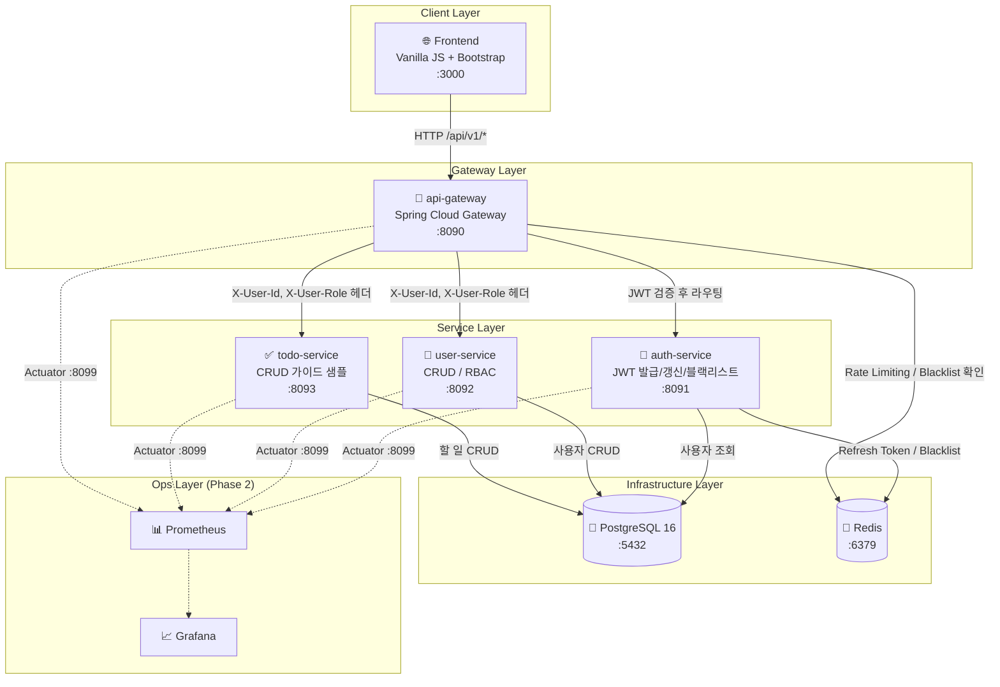

---

## 2. 네트워크 요청 흐름 (Request Flow)

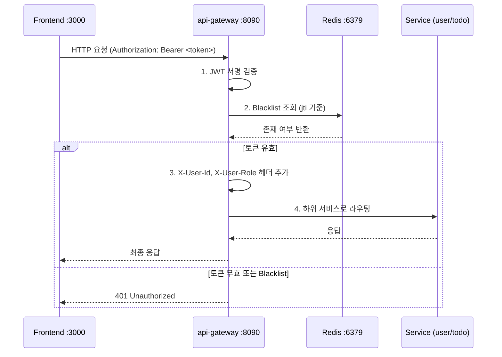

---

## 3. 인증 흐름 (Authentication Flow)

### 3-1. 로그인

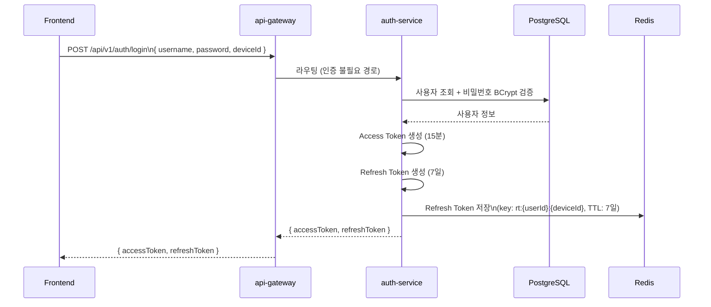

### 3-2. 토큰 갱신 (Rotation)

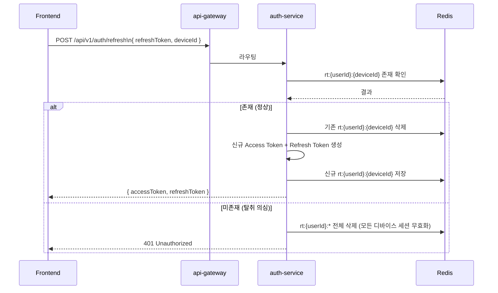

### 3-3. 로그아웃

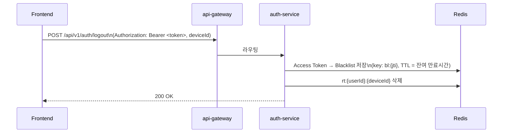

---

## 4. 모듈 의존성 구조

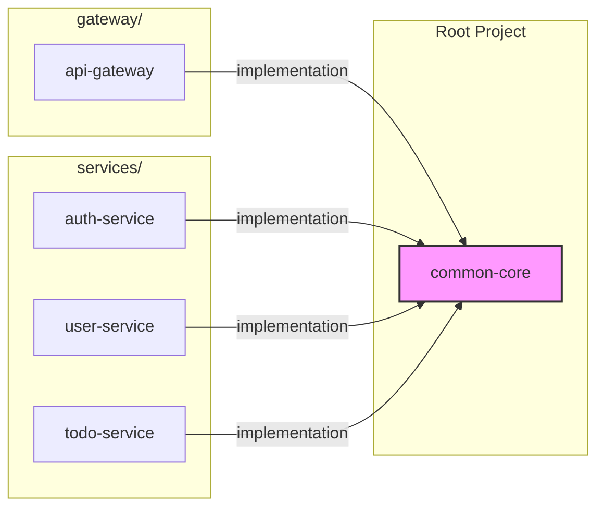

> 서비스 간 직접 의존성 없음. 모든 통신은 Runtime HTTP(RestClient)로만 이루어짐.

---

## 5. common-core 내부 구조

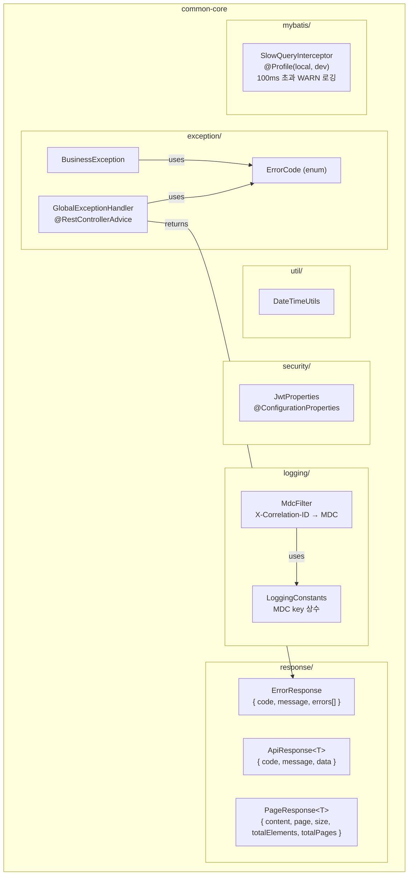

> **기본 패키지**: `io.kyungseo.msa.common`
> 전체 경로 예시: `io.kyungseo.msa.common.response.ApiResponse`
> 각 서비스 기본 패키지: `io.kyungseo.msa.{service-name}` (예: `io.kyungseo.msa.auth`, `io.kyungseo.msa.user`, `io.kyungseo.msa.todo`, `io.kyungseo.msa.gateway`)

---

## 6. api-gateway 내부 필터 체인

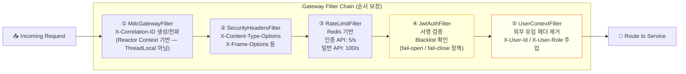

> 공개 경로(`/api/v1/auth/login`, `/api/v1/auth/refresh`, `/api/v1/users` POST)는
> ④ JwtAuthFilter를 건너뜀.
>
> **④ JwtAuthFilter — Redis Blacklist fail 정책**
> Redis 장애 시 동작은 환경변수 `BLACKLIST_FAIL_POLICY`로 제어한다.
> - `fail-close` (기본값): Blacklist 조회 실패 시 인증 차단 → 보안 우선
> - `fail-open`: Blacklist 조회 실패 시 통과 허용 → 가용성 우선
>
> **⑤ UserContextFilter — Header Spoofing 방어**
> 외부 클라이언트가 `X-User-Id`, `X-User-Role` 헤더를 직접 주입하는 공격을 차단한다.
> JWT 검증 후 서버가 직접 생성한 값으로 **덮어쓰기 전에 기존 헤더를 강제 제거**한다.

---

## 7. 각 서비스 내부 레이어 구조

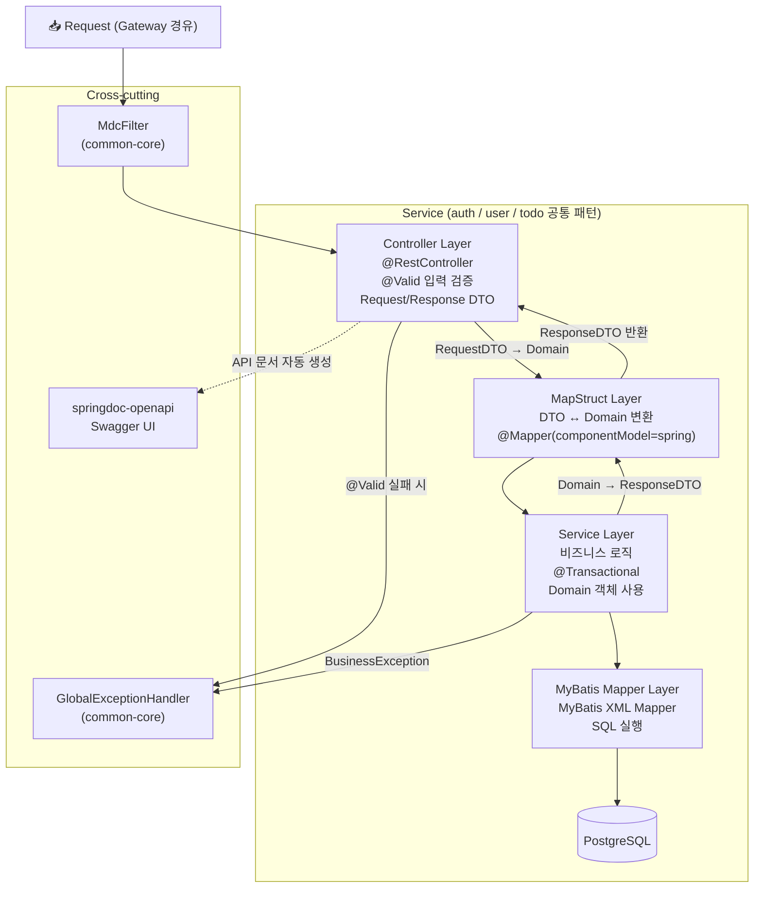

---

## 8. Redis 데이터 구조

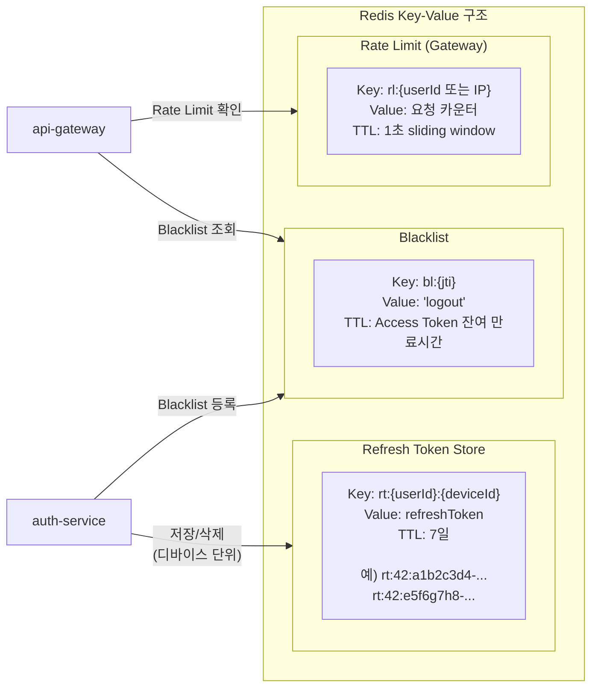

> **멀티 디바이스 세션 관리**
> - 단일 디바이스 로그아웃: `rt:{userId}:{deviceId}` 삭제
> - 전체 디바이스 세션 무효화 (탈취 감지): `rt:{userId}:*` 패턴 전체 삭제
>
> **SCAN 성능 trade-off (Phase 1 설계 결정)**
> `rt:{userId}:* SCAN + DEL` 패턴은 탈취 감지 시 전체 세션 무효화에 사용된다.
> 운영 환경 대규모 키 공간에서는 SCAN 성능 저하 및 Redis CPU 급증 위험이 있음.
> Phase 1(소규모 사용자)에서는 허용 가능한 수준이나, Phase 2에서는 `rt:sessions:{userId}` Set
> 구조로 전환하여 SCAN 없이 O(1)로 세션 목록 조회할 것을 권장한다. (→ PHASE2-BACKLOG.md 참조)

---

## 9. 데이터베이스 스키마 (ERD)

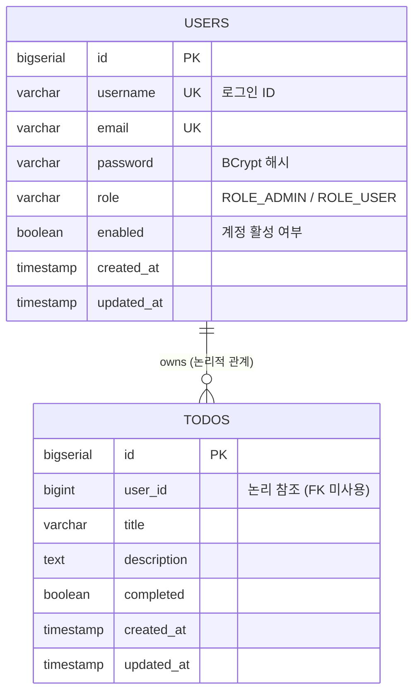

> **FK 미사용 원칙**: `todos.user_id`는 `users.id`에 대한 논리적 참조로만 유지한다.
> DB 레벨 FK 제약조건을 사용하지 않음으로써 Phase 2의 DB per Service 분리를 용이하게 한다.
> 참조 무결성(존재하지 않는 userId 방지)은 애플리케이션 레이어(todo-service)에서 보장한다.

---

## 10. 환경별 배포 구성

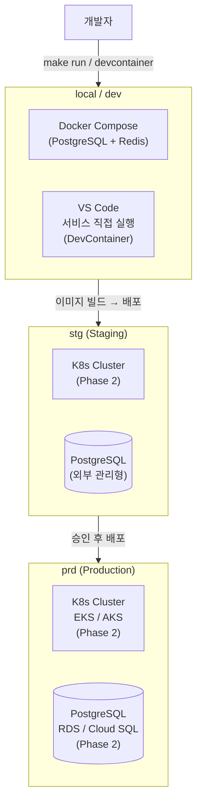

---

## 11. Logging & Tracing 흐름

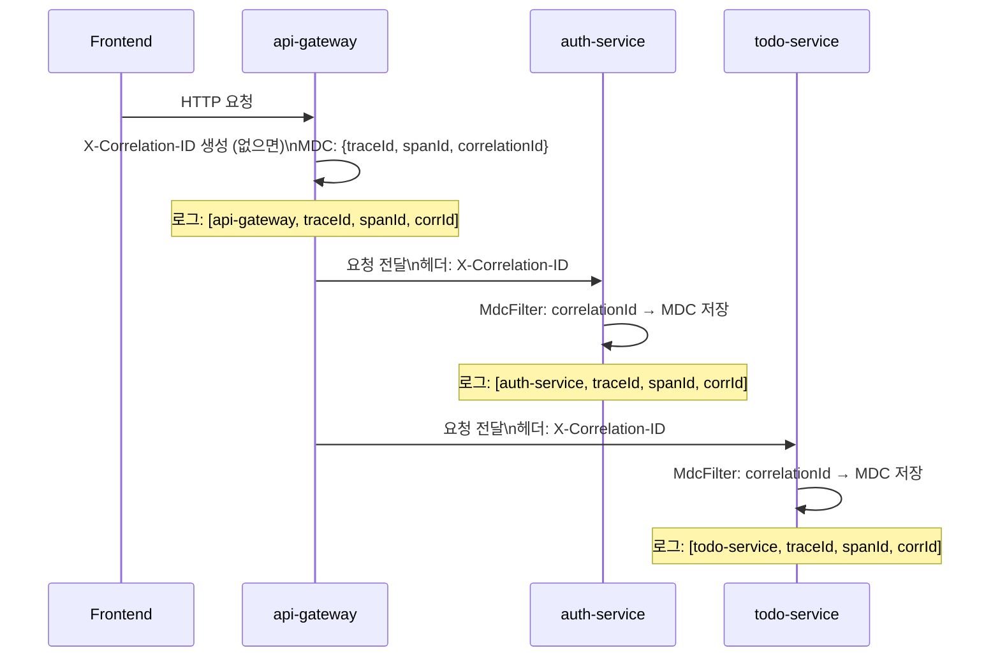

> **WebFlux MDC 전파 주의사항**
> api-gateway는 WebFlux(Project Reactor) 기반으로, Servlet `OncePerRequestFilter`의 ThreadLocal MDC
> 전파 방식이 동작하지 않는다. 하나의 요청이 여러 스레드에 걸쳐 실행될 수 있기 때문에 일반적인
> `MDC.put()` 방식으로는 MDC 값이 전파되지 않음.
>
> **Gateway MdcGatewayFilter 구현 방식 (권장: 방식 A)**
> - **방식 A (권장)**: `Hooks.onEachOperator`를 활용한 Context → MDC 자동 전파
>   - `reactor.util.context.Context`에 correlationId 저장 → 각 operator 실행 시 MDC 자동 주입
>   - Micrometer Tracing이 이미 Reactor Context 연동을 지원하므로 traceId/spanId도 함께 전파됨
> - **방식 B**: `ServerWebExchange` attribute에 저장 후 필요 시점에 MDC 수동 설정
>   - 구현은 간단하나 비동기 체인에서 MDC 누락 가능성 있음
>
> Phase 1 권장: 방식 A. 상세 구현은 `docs/TODO/TODO-BLOCK7.md §7-2` 참조.

---

## 12. 멀티모듈 Gradle 빌드 구조

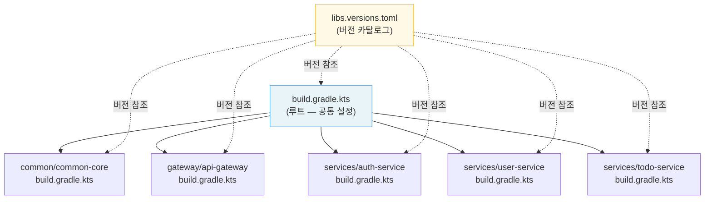

---

## 13. DevContainer 개발 환경 구성

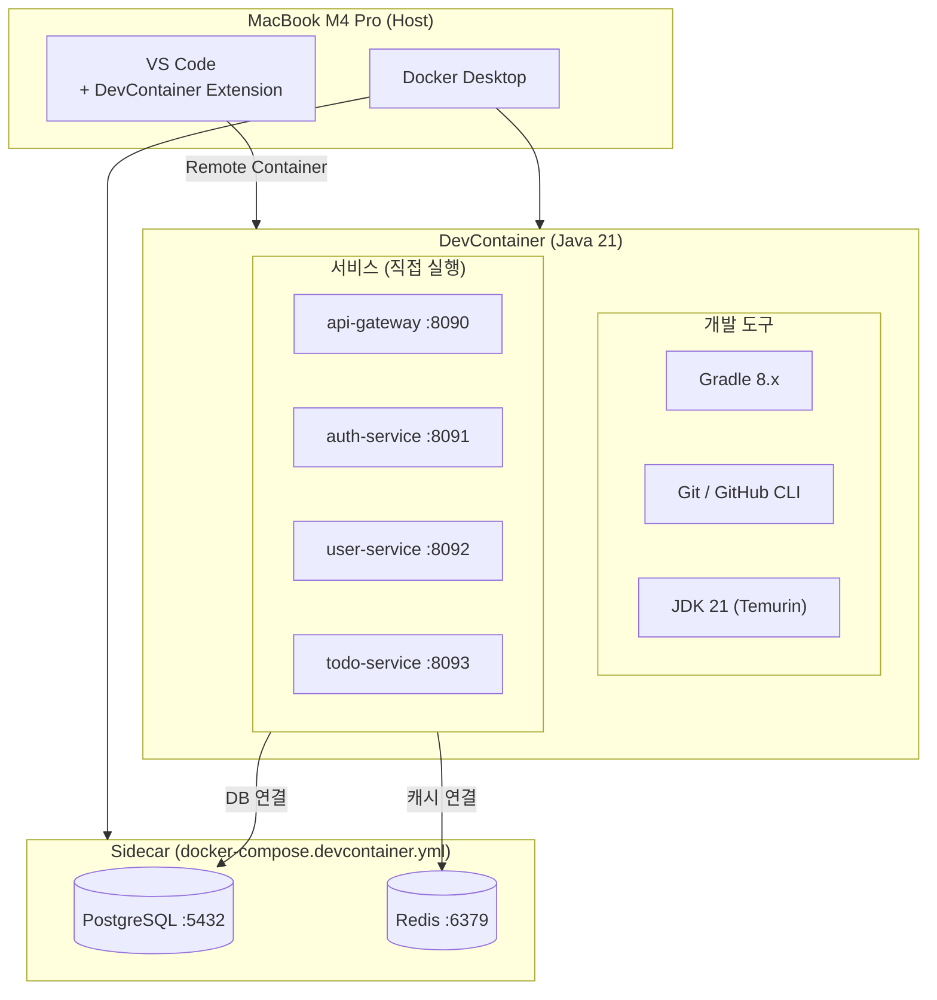

---

## 14. K8s 배포 구조 (Phase 2 목표)

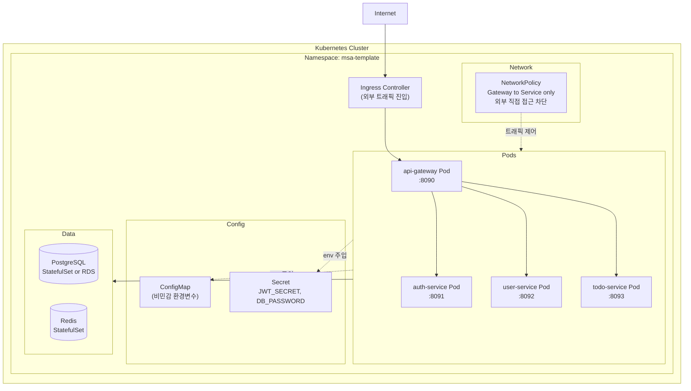

> **NetworkPolicy (Phase 2)**: 하위 서비스(auth/user/todo)는 Gateway Pod에서 오는 트래픽만 수신.
> 외부에서 직접 `:8091~8093` 포트로 접근하는 경우 차단하여 Header spoofing 위협 제거.

---

## 15. 보안 아키텍처 요약

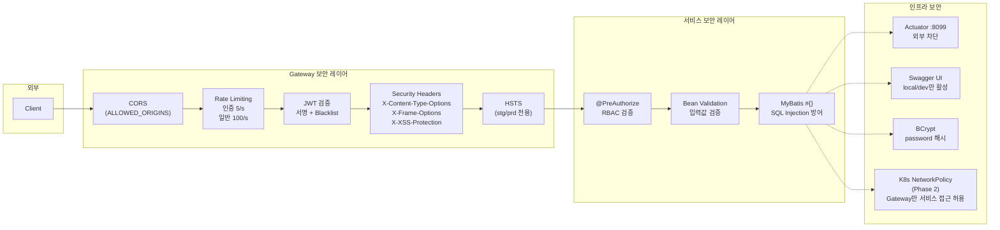

---

## 16. 인증 토큰 저장 구조 (Redis)

Phase 1에서 적용하는 멀티 디바이스 대응 토큰 키 구조를 명시한다.

```
┌─────────────────────────────────────────────────────────┐
│  Refresh Token Store                                    │
│                                                         │
│  rt:{userId}:{deviceId}  →  refreshTokenValue           │
│                                                         │
│  예시)                                                   │
│  rt:42:a1b2c3d4-1234-...  →  eyJhbGci...  (TTL: 7d)    │
│  rt:42:e5f6g7h8-5678-...  →  eyJhbGci...  (TTL: 7d)    │
│  rt:99:f9g0h1i2-9012-...  →  eyJhbGci...  (TTL: 7d)    │
│                                                         │
│  단일 디바이스 로그아웃:                                  │
│    DEL rt:42:a1b2c3d4-1234-...                          │
│                                                         │
│  전체 세션 무효화 (탈취 감지):                            │
│    SCAN + DEL rt:42:*                                   │
└─────────────────────────────────────────────────────────┘

┌─────────────────────────────────────────────────────────┐
│  Blacklist                                              │
│                                                         │
│  bl:{jti}  →  "logout"  (TTL: Access Token 잔여 만료)   │
└─────────────────────────────────────────────────────────┘
```

> **deviceId 생성 주체**: 클라이언트(Frontend)가 최초 로그인 시 UUID를 생성하여 localStorage에 보관.
> 서버는 전달받은 deviceId를 키 구성에 사용하며 별도 검증은 하지 않는다.
> Phase 1에서는 단일 deviceId로 동작하나, 키 구조는 처음부터 멀티 세션을 지원하도록 설계한다.

---

*다음 단계: `docs/STATUS.md` 확인 후 현재 BLOCK의 `docs/TODO/TODO-BLOCK{n}.md` 참고하여 구현 진행*
