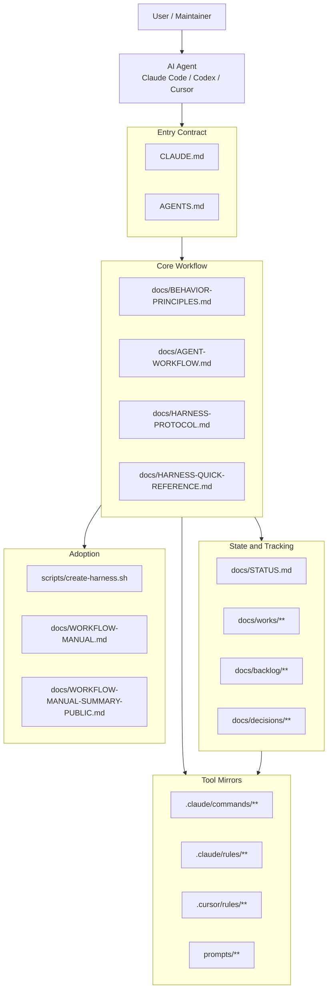
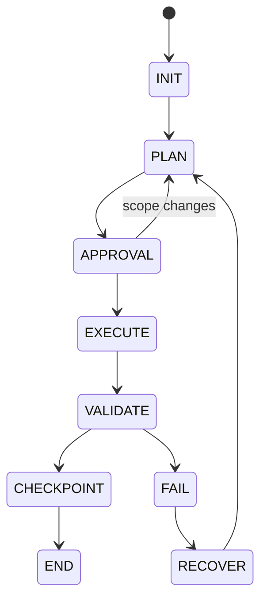
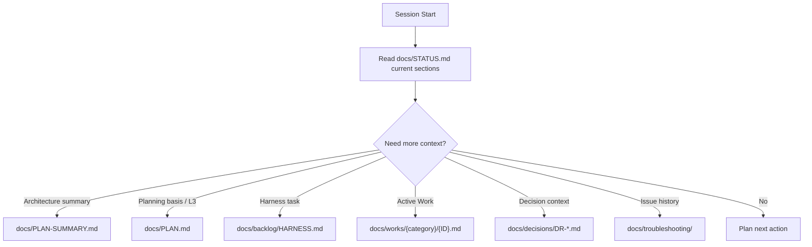
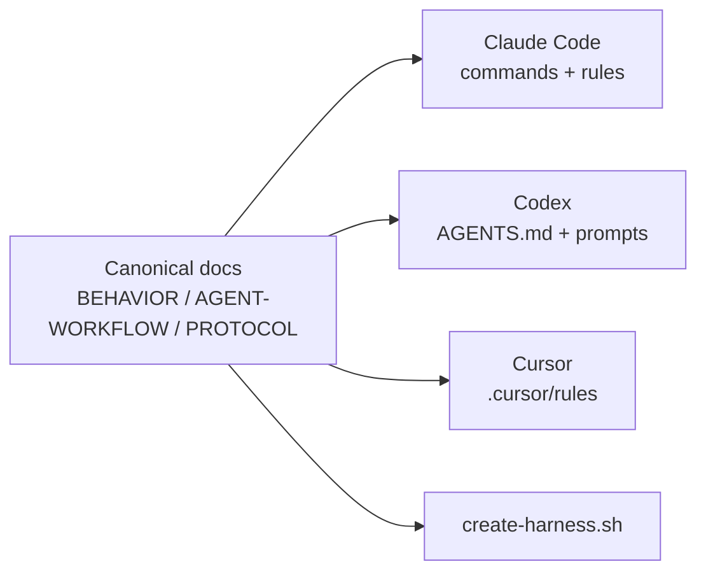
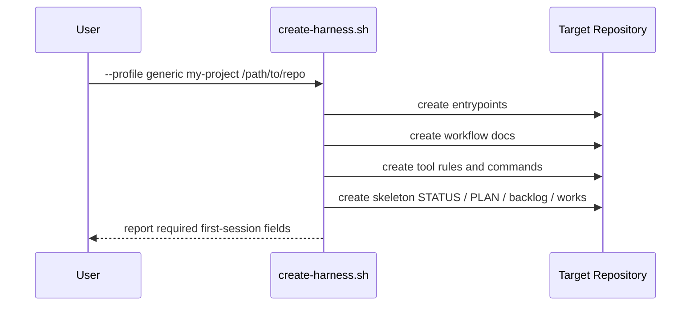

# ARCHITECTURE.md - AI Workflow Harness

> 기준: `docs/PLAN.md`, `docs/PLAN-SUMMARY.md`
> 목적: AI Workflow Harness의 현재 구조와 정보 흐름을 시각화한다.

---

## 1. System Overview

## 2. Session Flow

Core rule:

- `STATUS.md` is the dashboard.
- Work files are the task-level SSoT.
- Approval Matrix gates execution, state changes, and commits.
- Validation failure moves to FAIL/RECOVER before more work proceeds.

## 3. Context Routing

The routing rule is deliberately conditional. Agents should not bulk-load archive,
manual, or historical documents unless the current task needs them.

## 4. Document Roles

| File | Role |
| --- | --- |
| `docs/PLAN.md` | Long-term direction and roadmap |
| `docs/PLAN-SUMMARY.md` | Lightweight project and architecture context |
| `docs/STATUS.md` | Current dashboard and active work pointer |
| `docs/works/**` | Task-level plan, checkpoints, discovery, Done Criteria |
| `docs/backlog/HARNESS.md` | Candidate and deferred harness improvements |
| `docs/decisions/**` | Accepted decisions and trade-offs |
| `docs/retrospectives/**` | Review and learning artifacts |
| `docs/archive/**` | Historical snapshots and closed records |

## 5. Tool Surface Model

Canonical docs define behavior. Tool-specific files mirror only the portions those
tools actually need at runtime.

## 6. Scaffold Flow

The generic profile should not assume a programming language, framework, database,
or application runtime.

## 7. Current Migration Boundary

`ai-workflow-harness` still preserves historical records from `base-msa-template`.
Current live guidance should describe the harness project. Historical snapshots may
keep product-template context when clearly marked as historical.
