# ARCHITECTURE.md — base-msa-template

> 작성일: 2026-05-03
> 문서 버전: v1.4
> 최종 수정: 2026-05-07 (ErrorCode enum→interface 반영, MDC Phase 1/2 분리 반영)
> 기준: PLAN.md v1.6
> 목적: 시스템 전체 아키텍처 및 주요 흐름 시각화

---

## 1. 시스템 전체 구성도

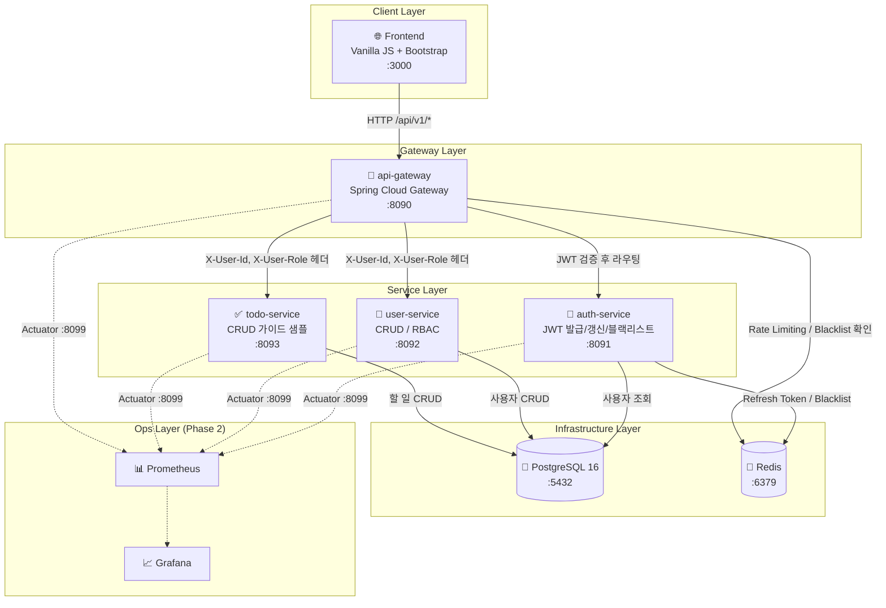
```mermaid
graph TB
    subgraph CLIENT["Client Layer"]
        FE["🌐 Frontend\nVanilla JS + Bootstrap\n:3000"]
    end

    subgraph GATEWAY["Gateway Layer"]
        GW["🔀 api-gateway\nSpring Cloud Gateway\n:8090"]
    end

    subgraph SERVICES["Service Layer"]
        AUTH["🔐 auth-service\nJWT 발급/갱신/블랙리스트\n:8091"]
        USER["👤 user-service\nCRUD / RBAC\n:8092"]
        TODO["✅ todo-service\nCRUD 가이드 샘플\n:8093"]
    end

    subgraph INFRA["Infrastructure Layer"]
        PG[("🐘 PostgreSQL 16\n:5432")]
        RD[("🔴 Redis\n:6379")]
    end

    subgraph OPS["Ops Layer (Phase 2)"]
        PROM["📊 Prometheus"]
        GRAF["📈 Grafana"]
    end

    FE -->|"HTTP /api/v1/*"| GW

    GW -->|"JWT 검증 후 라우팅"| AUTH
    GW -->|"X-User-Id, X-User-Role 헤더"| USER
    GW -->|"X-User-Id, X-User-Role 헤더"| TODO

    AUTH -->|"사용자 조회"| PG
    USER -->|"사용자 CRUD"| PG
    TODO -->|"할 일 CRUD"| PG

    AUTH -->|"Refresh Token / Blacklist"| RD
    GW -->|"Rate Limiting / Blacklist 확인"| RD

    AUTH -.->|"Actuator :8099"| PROM
    USER -.->|"Actuator :8099"| PROM
    TODO -.->|"Actuator :8099"| PROM
    GW -.->|"Actuator :8099"| PROM
    PROM -.-> GRAF
```

---

## 2. 네트워크 요청 흐름 (Request Flow)

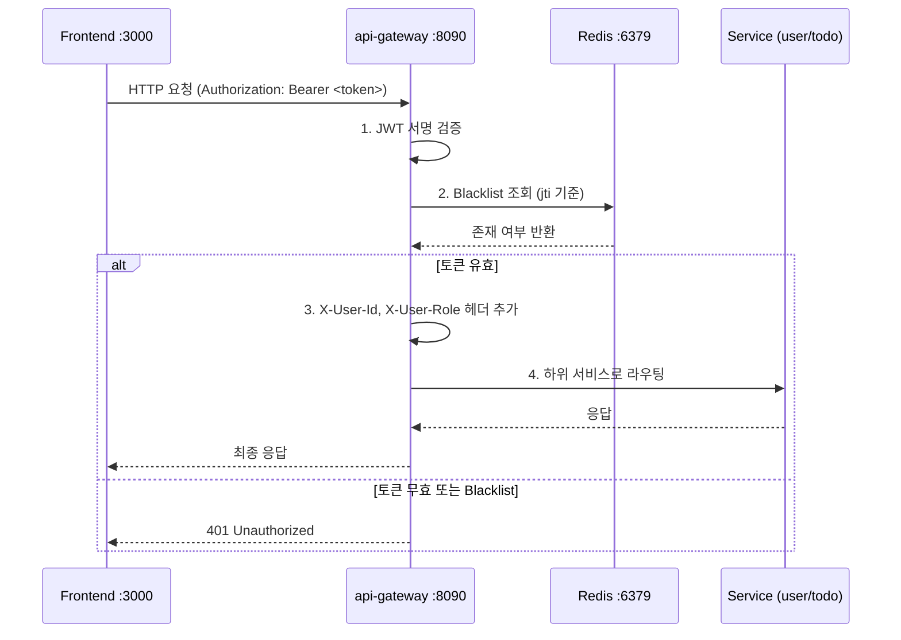
```mermaid
sequenceDiagram
    participant FE as Frontend :3000
    participant GW as api-gateway :8090
    participant RD as Redis :6379
    participant SVC as Service (user/todo)

    FE->>GW: HTTP 요청 (Authorization: Bearer <token>)

    GW->>GW: 1. JWT 서명 검증
    GW->>RD: 2. Blacklist 조회 (jti 기준)
    RD-->>GW: 존재 여부 반환

    alt 토큰 유효
        GW->>GW: 3. X-User-Id, X-User-Role 헤더 추가
        GW->>SVC: 4. 하위 서비스로 라우팅
        SVC-->>GW: 응답
        GW-->>FE: 최종 응답
    else 토큰 무효 또는 Blacklist
        GW-->>FE: 401 Unauthorized
    end
```

---

## 3. 인증 흐름 (Authentication Flow)

### 3-1. 로그인

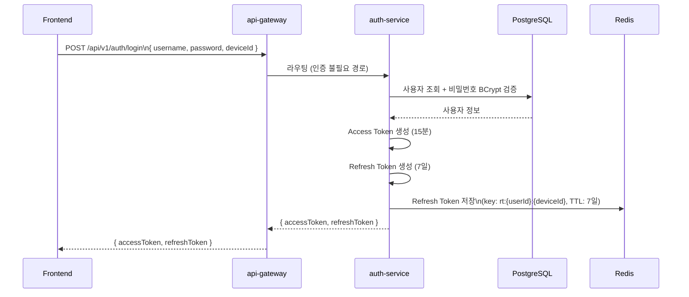
```mermaid
sequenceDiagram
    participant FE as Frontend
    participant GW as api-gateway
    participant AUTH as auth-service
    participant PG as PostgreSQL
    participant RD as Redis

    FE->>GW: POST /api/v1/auth/login\n{ username, password, deviceId }
    GW->>AUTH: 라우팅 (인증 불필요 경로)
    AUTH->>PG: 사용자 조회 + 비밀번호 BCrypt 검증
    PG-->>AUTH: 사용자 정보

    AUTH->>AUTH: Access Token 생성 (15분)
    AUTH->>AUTH: Refresh Token 생성 (7일)
    AUTH->>RD: Refresh Token 저장\n(key: rt:{userId}:{deviceId}, TTL: 7일)

    AUTH-->>GW: { accessToken, refreshToken }
    GW-->>FE: { accessToken, refreshToken }
```

### 3-2. 토큰 갱신 (Rotation)

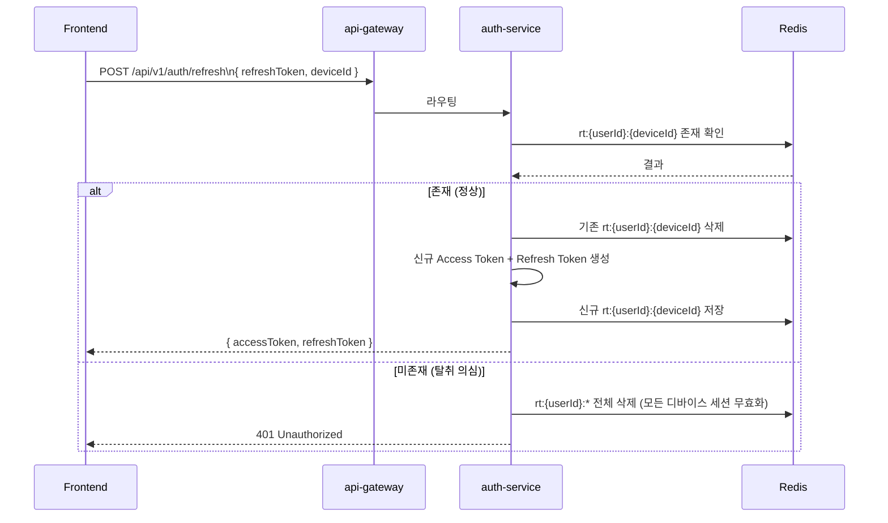
```mermaid
sequenceDiagram
    participant FE as Frontend
    participant GW as api-gateway
    participant AUTH as auth-service
    participant RD as Redis

    FE->>GW: POST /api/v1/auth/refresh\n{ refreshToken, deviceId }
    GW->>AUTH: 라우팅

    AUTH->>RD: rt:{userId}:{deviceId} 존재 확인
    RD-->>AUTH: 결과

    alt 존재 (정상)
        AUTH->>RD: 기존 rt:{userId}:{deviceId} 삭제
        AUTH->>AUTH: 신규 Access Token + Refresh Token 생성
        AUTH->>RD: 신규 rt:{userId}:{deviceId} 저장
        AUTH-->>FE: { accessToken, refreshToken }
    else 미존재 (탈취 의심)
        AUTH->>RD: rt:{userId}:* 전체 삭제 (모든 디바이스 세션 무효화)
        AUTH-->>FE: 401 Unauthorized
    end
```

### 3-3. 로그아웃

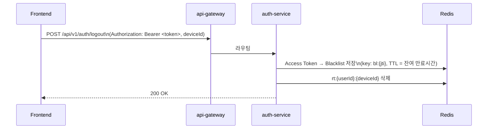
```mermaid
sequenceDiagram
    participant FE as Frontend
    participant GW as api-gateway
    participant AUTH as auth-service
    participant RD as Redis

    FE->>GW: POST /api/v1/auth/logout\n(Authorization: Bearer <token>, deviceId)
    GW->>AUTH: 라우팅

    AUTH->>RD: Access Token → Blacklist 저장\n(key: bl:{jti}, TTL = 잔여 만료시간)
    AUTH->>RD: rt:{userId}:{deviceId} 삭제

    AUTH-->>FE: 200 OK
```

---

## 4. 모듈 의존성 구조

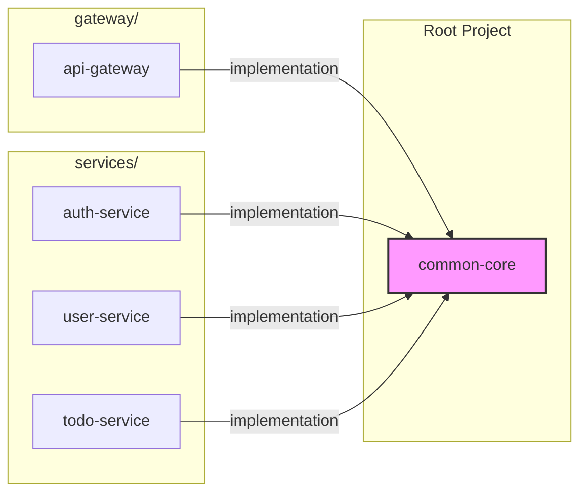
```mermaid
graph LR
    subgraph ROOT["Root Project"]
        CORE["common-core"]
    end

    subgraph GW_MOD["gateway/"]
        APIGW["api-gateway"]
    end

    subgraph SVC_MOD["services/"]
        ASVC["auth-service"]
        USVC["user-service"]
        TSVC["todo-service"]
    end

    APIGW -->|"implementation"| CORE
    ASVC  -->|"implementation"| CORE
    USVC  -->|"implementation"| CORE
    TSVC  -->|"implementation"| CORE

    style CORE fill:#f9f,stroke:#333,stroke-width:2px
```

> 서비스 간 직접 의존성 없음. 모든 통신은 Runtime HTTP(RestClient)로만 이루어짐.

---

## 5. common-core 내부 구조

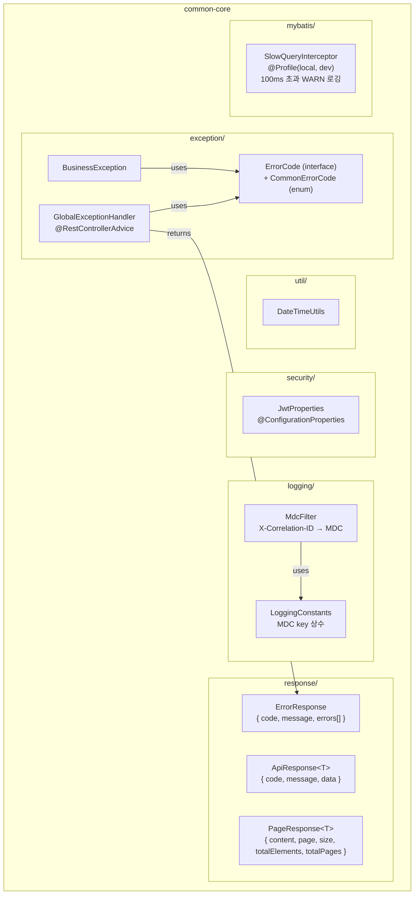
```mermaid
graph TD
    subgraph CORE["common-core"]
        subgraph RESP["response/"]
            AR["ApiResponse&lt;T&gt;\n{ code, message, data }"]
            ER["ErrorResponse\n{ code, message, errors[] }"]
            PR["PageResponse&lt;T&gt;\n{ content, page, size, totalElements, totalPages }"]
        end
        subgraph EXC["exception/"]
            BE["BusinessException"]
            EC["ErrorCode (interface)\n+ CommonErrorCode (enum)"]
            GEH["GlobalExceptionHandler\n@RestControllerAdvice"]
        end
        subgraph LOG["logging/"]
            MF["MdcFilter\nX-Correlation-ID → MDC"]
            LC["LoggingConstants\nMDC key 상수"]
        end
        subgraph SEC["security/"]
            JP["JwtProperties\n@ConfigurationProperties"]
        end
        subgraph UTL["util/"]
            DU["DateTimeUtils"]
        end
        subgraph MYBATIS["mybatis/"]
            SQI["SlowQueryInterceptor\n@Profile(local, dev)\n100ms 초과 WARN 로깅"]
        end
    end

    GEH -->|"uses"| EC
    GEH -->|"returns"| ER
    BE  -->|"uses"| EC
    MF  -->|"uses"| LC
```

> **기본 패키지**: `io.kyungseo.msa.common`
> 전체 경로 예시: `io.kyungseo.msa.common.response.ApiResponse`
> 각 서비스 기본 패키지: `io.kyungseo.msa.{service-name}` (예: `io.kyungseo.msa.auth`, `io.kyungseo.msa.user`, `io.kyungseo.msa.todo`, `io.kyungseo.msa.gateway`)

---

## 6. api-gateway 내부 필터 체인

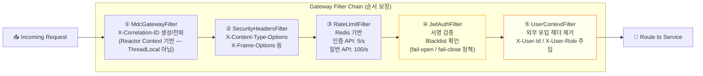
```mermaid
graph LR
    REQ["📥 Incoming Request"]

    subgraph FILTERS["Gateway Filter Chain (순서 보장)"]
        F1["① MdcGatewayFilter\nX-Correlation-ID 생성/전파\n(Reactor Context 기반 — ThreadLocal 아님)"]
        F2["② SecurityHeadersFilter\nX-Content-Type-Options\nX-Frame-Options 등"]
        F3["③ RateLimitFilter\nRedis 기반\n인증 API: 5/s\n일반 API: 100/s"]
        F4["④ JwtAuthFilter\n서명 검증\nBlacklist 확인\n(fail-open / fail-close 정책)"]
        F5["⑤ UserContextFilter\n외부 유입 헤더 제거\nX-User-Id / X-User-Role 주입"]
    end

    ROUTE["🔀 Route to Service"]

    REQ --> F1 --> F2 --> F3 --> F4 --> F5 --> ROUTE

    style F4 fill:#ffd,stroke:#f90
    style F5 fill:#ffe,stroke:#f60
```

> 공개 경로(`/api/v1/auth/login`, `/api/v1/auth/refresh`, `/api/v1/users` POST)는
> ④ JwtAuthFilter를 건너뜀.
>
> **④ JwtAuthFilter — Redis Blacklist fail 정책**
> Redis 장애 시 동작은 환경변수 `BLACKLIST_FAIL_POLICY`로 제어한다.
> - `fail-close` (기본값): Blacklist 조회 실패 시 인증 차단 → 보안 우선
> - `fail-open`: Blacklist 조회 실패 시 통과 허용 → 가용성 우선
>
> **⑤ UserContextFilter — Header Spoofing 방어**
> 외부 클라이언트가 `X-User-Id`, `X-User-Role` 헤더를 직접 주입하는 공격을 차단한다.
> JWT 검증 후 서버가 직접 생성한 값으로 **덮어쓰기 전에 기존 헤더를 강제 제거**한다.

---

## 7. 각 서비스 내부 레이어 구조

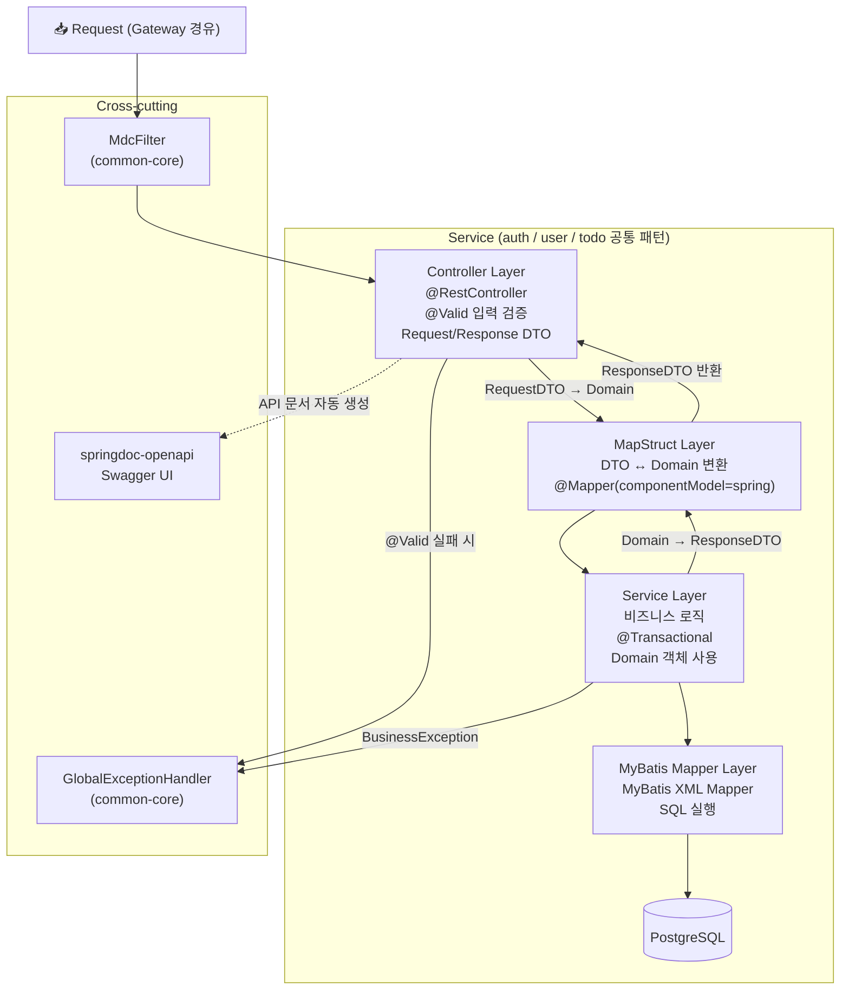
```mermaid
graph TD
    subgraph SVC["Service (auth / user / todo 공통 패턴)"]
        CTR["Controller Layer\n@RestController\n@Valid 입력 검증\nRequest/Response DTO"]
        MSTR["MapStruct Layer\nDTO ↔ Domain 변환\n@Mapper(componentModel=spring)"]
        SRV["Service Layer\n비즈니스 로직\n@Transactional\nDomain 객체 사용"]
        MAP["MyBatis Mapper Layer\nMyBatis XML Mapper\nSQL 실행"]
        DB[("PostgreSQL")]
    end

    subgraph CROSS["Cross-cutting"]
        GEH["GlobalExceptionHandler\n(common-core)"]
        MDC["MdcFilter\n(common-core)"]
        SWAGGER["springdoc-openapi\nSwagger UI"]
    end

    REQ["📥 Request (Gateway 경유)"] --> MDC
    MDC --> CTR
    CTR -->|"@Valid 실패 시"| GEH
    CTR -->|"RequestDTO → Domain"| MSTR
    MSTR --> SRV
    SRV -->|"BusinessException"| GEH
    SRV --> MAP
    MAP --> DB
    SRV -->|"Domain → ResponseDTO"| MSTR
    MSTR -->|"ResponseDTO 반환"| CTR
    CTR -.->|"API 문서 자동 생성"| SWAGGER
```

---

## 8. Redis 데이터 구조

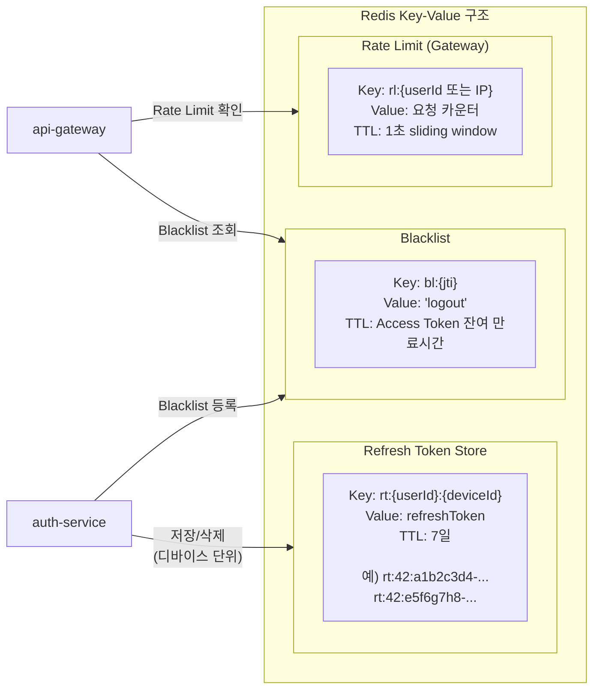
```mermaid
graph LR
    subgraph REDIS["Redis Key-Value 구조"]
        subgraph RT["Refresh Token Store"]
            RK["Key: rt:{userId}:{deviceId}\nValue: refreshToken\nTTL: 7일\n\n예) rt:42:a1b2c3d4-...\n    rt:42:e5f6g7h8-..."]
        end
        subgraph BL["Blacklist"]
            BK["Key: bl:{jti}\nValue: 'logout'\nTTL: Access Token 잔여 만료시간"]
        end
        subgraph RL["Rate Limit (Gateway)"]
            LK["Key: rl:{userId 또는 IP}\nValue: 요청 카운터\nTTL: 1초 sliding window"]
        end
    end

    AUTH["auth-service"] -->|"저장/삭제\n(디바이스 단위)"| RT
    AUTH -->|"Blacklist 등록"| BL
    GW["api-gateway"] -->|"Blacklist 조회"| BL
    GW -->|"Rate Limit 확인"| RL
```

> **멀티 디바이스 세션 관리**
> - 단일 디바이스 로그아웃: `rt:{userId}:{deviceId}` 삭제
> - 전체 디바이스 세션 무효화 (탈취 감지): `rt:{userId}:*` 패턴 전체 삭제
>
> **SCAN 성능 trade-off (Phase 1 설계 결정)**
> `rt:{userId}:* SCAN + DEL` 패턴은 탈취 감지 시 전체 세션 무효화에 사용된다.
> 운영 환경 대규모 키 공간에서는 SCAN 성능 저하 및 Redis CPU 급증 위험이 있음.
> Phase 1(소규모 사용자)에서는 허용 가능한 수준이나, Phase 2에서는 `rt:sessions:{userId}` Set
> 구조로 전환하여 SCAN 없이 O(1)로 세션 목록 조회할 것을 권장한다. (→ `docs/backlog/PHASE2.md`의 P2-003 참조)

---

## 9. 데이터베이스 스키마 (ERD)

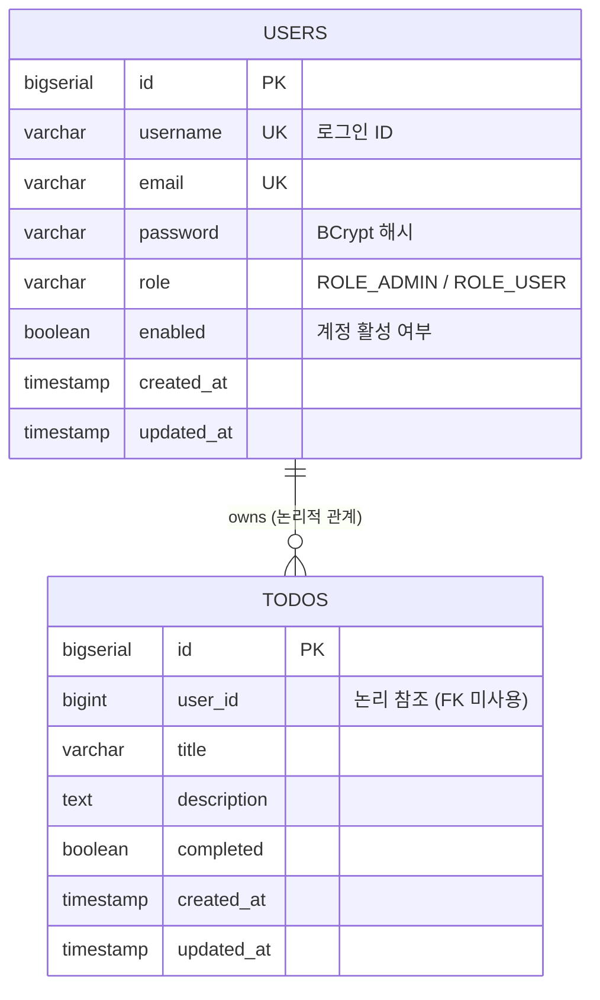
```mermaid
erDiagram
    USERS {
        bigserial   id          PK
        varchar     username    UK  "로그인 ID"
        varchar     email       UK
        varchar     password        "BCrypt 해시"
        varchar     role            "ROLE_ADMIN / ROLE_USER"
        boolean     enabled         "계정 활성 여부"
        timestamp   created_at
        timestamp   updated_at
    }

    TODOS {
        bigserial   id          PK
        bigint      user_id         "논리 참조 (FK 미사용)"
        varchar     title
        text        description
        boolean     completed
        timestamp   created_at
        timestamp   updated_at
    }

    USERS ||--o{ TODOS : "owns (논리적 관계)"
```

> **FK 미사용 원칙**: `todos.user_id`는 `users.id`에 대한 논리적 참조로만 유지한다.
> DB 레벨 FK 제약조건을 사용하지 않음으로써 Phase 2의 DB per Service 분리를 용이하게 한다.
> 참조 무결성(존재하지 않는 userId 방지)은 애플리케이션 레이어(todo-service)에서 보장한다.

---

## 10. 환경별 배포 구성

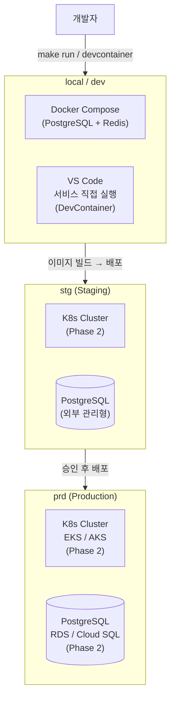
```mermaid
graph TB
    subgraph LOCAL["local / dev"]
        direction LR
        DC["Docker Compose\n(PostgreSQL + Redis)"]
        VS["VS Code\n서비스 직접 실행\n(DevContainer)"]
    end

    subgraph STG["stg (Staging)"]
        direction LR
        K8S_S["K8s Cluster\n(Phase 2)"]
        EXT_S[("PostgreSQL\n(외부 관리형)")]
    end

    subgraph PRD["prd (Production)"]
        direction LR
        K8S_P["K8s Cluster\nEKS / AKS\n(Phase 2)"]
        EXT_P[("PostgreSQL\nRDS / Cloud SQL\n(Phase 2)")]
    end

    DEV["개발자"] -->|"make run / devcontainer"| LOCAL
    LOCAL -->|"이미지 빌드 → 배포"| STG
    STG -->|"승인 후 배포"| PRD
```

---

## 11. Logging & Tracing 흐름

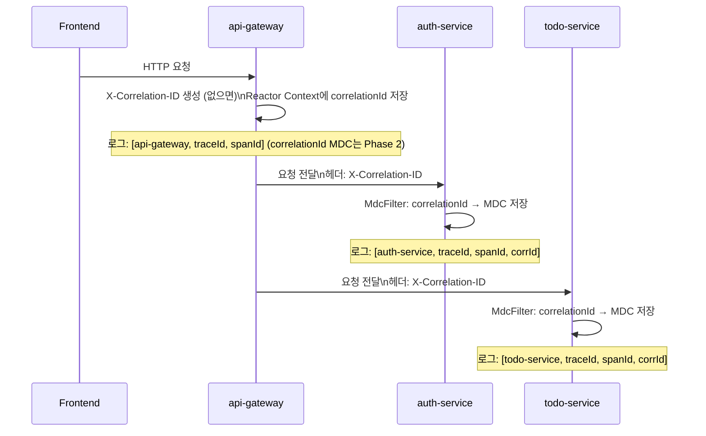
```mermaid
sequenceDiagram
    participant FE as Frontend
    participant GW as api-gateway
    participant AUTH as auth-service
    participant TODO as todo-service

    FE->>GW: HTTP 요청

    GW->>GW: X-Correlation-ID 생성 (없으면)\nReactor Context에 correlationId 저장
    note over GW: 로그: [api-gateway, traceId, spanId] (correlationId MDC는 Phase 2)

    GW->>AUTH: 요청 전달\n헤더: X-Correlation-ID
    AUTH->>AUTH: MdcFilter: correlationId → MDC 저장
    note over AUTH: 로그: [auth-service, traceId, spanId, corrId]

    GW->>TODO: 요청 전달\n헤더: X-Correlation-ID
    TODO->>TODO: MdcFilter: correlationId → MDC 저장
    note over TODO: 로그: [todo-service, traceId, spanId, corrId]
```

> **WebFlux MDC 전파 주의사항**
> api-gateway는 WebFlux(Project Reactor) 기반으로, Servlet `OncePerRequestFilter`의 ThreadLocal MDC
> 전파 방식이 동작하지 않는다. 하나의 요청이 여러 스레드에 걸쳐 실행될 수 있기 때문에 일반적인
> `MDC.put()` 방식으로는 MDC 값이 전파되지 않음.
>
> **Gateway MdcGatewayFilter 구현 방식**
>
> - **방식 A**: `Hooks.onEachOperator`를 활용한 Context → MDC 자동 전파 (Phase 2 적용 예정)
>   - `reactor.util.context.Context`에 correlationId 저장 → 각 operator 실행 시 MDC 자동 주입
>   - Micrometer Tracing이 이미 Reactor Context 연동을 지원하므로 traceId/spanId도 함께 전파됨
> - **방식 B (Phase 1 적용)**: `contextWrite`로 Reactor Context에만 저장
>   - ThreadLocal MDC 직접 설정(`MDC.put()`)은 비동기 체인에서 신뢰할 수 없어 사용하지 않음
>   - Gateway 자체 로그의 correlationId MDC 주입은 Phase 2에서 방식 A로 교체
>   - X-Correlation-ID 헤더 전파(하위 서비스 → 클라이언트)는 Phase 1에서도 정상 동작

### Phase 1 현재 동작 요약

| 서비스 | traceId/spanId | correlationId (MDC) |
|--------|---------------|---------------------|
| auth/user/todo-service | ✅ Micrometer Tracing | ✅ `MdcFilter`가 ThreadLocal에 주입 |
| api-gateway | ✅ Micrometer Tracing | ❌ Reactor Context에만 저장, MDC 미주입 |

X-Correlation-ID 헤더 자체는 Gateway가 생성해서 하위 서비스로 전파하며, 하위 서비스 로그에는 정상적으로 찍힌다. 빠진 부분은 **Gateway 자신의 로그에만** correlationId가 없다는 것이다.

### 실용적 영향

- 같은 요청을 추적할 때 **traceId만으로 이미 전 서비스를 커버**한다. Micrometer Tracing이 Gateway(WebFlux)와 하위 서비스(Servlet) 모두에서 traceId를 MDC에 주입하므로, traceId로 grep하면 Gateway 로그까지 포함해서 추적 가능하다.
- correlationId가 추가로 필요한 실제 케이스는 **외부 클라이언트(모바일 앱, 외부 시스템)가 X-Correlation-ID를 직접 생성해서 보내는 환경**이다. 그 값을 Gateway 자체 로그에서도 보고 싶을 때 Phase 2가 필요하다.

### 결론

Phase 1 수준에서는 traceId로 전체 추적이 가능하므로 defer가 합리적이다. Phase 2에서 `Hooks.onEachOperator`로 Reactor Context → MDC 자동 전파를 구현하면 Gateway 로그에도 correlationId가 찍힌다.

---

## 12. 멀티모듈 Gradle 빌드 구조

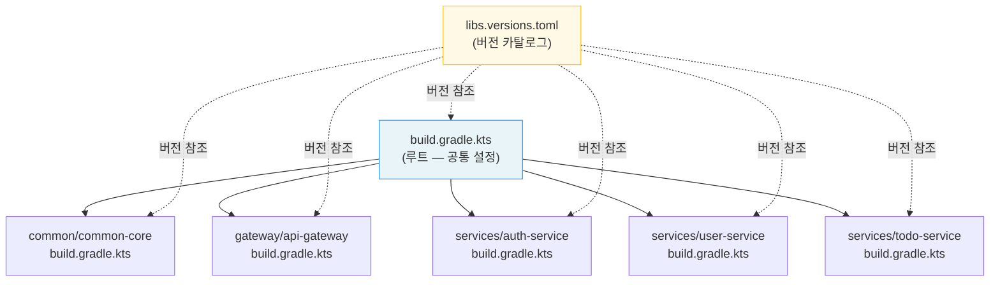
```mermaid
graph TD
    ROOT["build.gradle.kts\n(루트 — 공통 설정)"]
    VERSIONS["libs.versions.toml\n(버전 카탈로그)"]

    ROOT --> CORE["common/common-core\nbuild.gradle.kts"]
    ROOT --> GW["gateway/api-gateway\nbuild.gradle.kts"]
    ROOT --> AUTH["services/auth-service\nbuild.gradle.kts"]
    ROOT --> USER["services/user-service\nbuild.gradle.kts"]
    ROOT --> TODO["services/todo-service\nbuild.gradle.kts"]

    VERSIONS -.->|"버전 참조"| ROOT
    VERSIONS -.->|"버전 참조"| CORE
    VERSIONS -.->|"버전 참조"| GW
    VERSIONS -.->|"버전 참조"| AUTH
    VERSIONS -.->|"버전 참조"| USER
    VERSIONS -.->|"버전 참조"| TODO

    style ROOT fill:#e8f4f8,stroke:#2196F3
    style VERSIONS fill:#fff9e6,stroke:#FFC107
```

---

## 13. DevContainer 개발 환경 구성

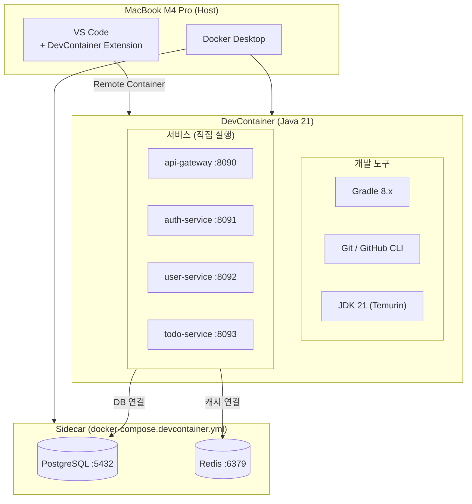
```mermaid
graph TB
    subgraph HOST["MacBook M4 Pro (Host)"]
        VSCODE["VS Code\n+ DevContainer Extension"]
        DOCKER["Docker Desktop"]
    end

    subgraph CONTAINER["DevContainer (Java 21)"]
        subgraph TOOLS["개발 도구"]
            GRADLE["Gradle 8.x"]
            GIT["Git / GitHub CLI"]
            JAVA["JDK 21 (Temurin)"]
        end
        subgraph APPS["서비스 (직접 실행)"]
            GW_D["api-gateway :8090"]
            AUTH_D["auth-service :8091"]
            USER_D["user-service :8092"]
            TODO_D["todo-service :8093"]
        end
    end

    subgraph SIDECARS["Sidecar (docker-compose.devcontainer.yml)"]
        PG_D[("PostgreSQL :5432")]
        RD_D[("Redis :6379")]
    end

    VSCODE -->|"Remote Container"| CONTAINER
    DOCKER --> CONTAINER
    DOCKER --> SIDECARS
    APPS -->|"DB 연결"| PG_D
    APPS -->|"캐시 연결"| RD_D
```

### `make run/rebuild` vs DevContainer — 목적 차이

**`make run/rebuild`** 는 완성된 컨테이너를 실행하는 것이다.

```
소스 → Gradle 멀티스테이지 빌드 → Docker 이미지 → 컨테이너 실행
```

- 코드 변경 → `make rebuild` → 이미지 재빌드 → 컨테이너 교체 사이클
- 서비스를 **블랙박스**로 올리는 방식 (운영 환경에 가까움)
- 브레이크포인트, 핫스왑 불가

**DevContainer** 는 JDK 21이 설치된 컨테이너 안에서 **소스를 직접 편집·실행**하는 것이다.

```
DevContainer (JDK 21 + Gradle)
  └─ VS Code에서 코드 편집
  └─ bootRun으로 서비스 직접 실행 (코드 변경 즉시 반영)

Sidecar (docker-compose.devcontainer.yml)
  └─ PostgreSQL + Redis만 기동
```

- 로컬에 JDK가 없어도 개발 가능 (JDK 설치·버전 충돌 없음)
- 코드 변경 → `bootRun` 재실행만으로 반영 (이미지 빌드 불필요)
- 디버거 연결, 브레이크포인트 가능
- CI 서버·클라우드 IDE에서도 동일 환경 재현 가능

### DevContainer가 실제로 필요한 케이스

| 케이스 | DevContainer 필요 여부 |
|--------|----------------------|
| 로컬 JDK 있음 + IntelliJ/VS Code로 개발 | 불필요 |
| 로컬 JDK 없음 또는 버전 충돌 | 필요 |
| 팀원 간 동일 개발 환경 강제 | 유용 |
| GitHub Codespaces · 클라우드 IDE 사용 | 필요 |

로컬 JDK가 설치되어 있고 `make run`으로 충분히 동작 확인이 된다면, DevContainer는 **팀 온보딩 편의를 위한 선택적 설정**이다. `.devcontainer/` 디렉토리를 삭제해도 기능에 영향 없다.

---

## 14. K8s 배포 구조 (Phase 2 목표)

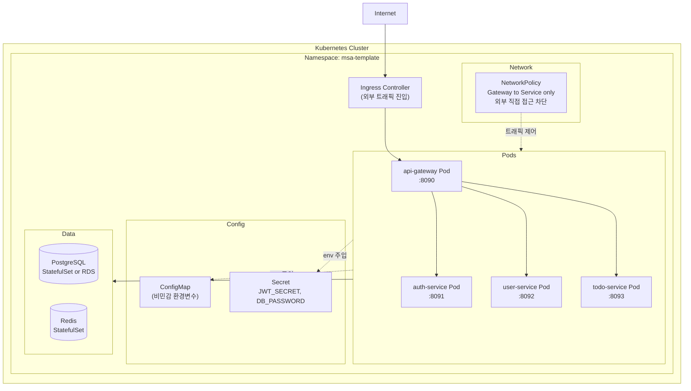
```mermaid
graph TB
    subgraph K8S["Kubernetes Cluster"]
        subgraph NS["Namespace: msa-template"]
            ING["Ingress Controller\n(외부 트래픽 진입)"]

            subgraph PODS["Pods"]
                GWP["api-gateway Pod\n:8090"]
                AUTHP["auth-service Pod\n:8091"]
                USERP["user-service Pod\n:8092"]
                TODOP["todo-service Pod\n:8093"]
            end

            subgraph CFG["Config"]
                CM["ConfigMap\n(비민감 환경변수)"]
                SEC["Secret\nJWT_SECRET, DB_PASSWORD"]
            end

            subgraph NET["Network"]
                NP["NetworkPolicy\nGateway to Service only\n외부 직접 접근 차단"]
            end

            subgraph DB_K8S["Data"]
                PG_K[("PostgreSQL\nStatefulSet or RDS")]
                RD_K[("Redis\nStatefulSet")]
            end
        end
    end

    INTERNET["Internet"] --> ING
    ING --> GWP
    GWP --> AUTHP
    GWP --> USERP
    GWP --> TODOP

    PODS -.->|"env 주입"| CM
    PODS -.->|"env 주입"| SEC
    NP -.->|"트래픽 제어"| PODS
    PODS --> DB_K8S
```

> **NetworkPolicy (Phase 2)**: 하위 서비스(auth/user/todo)는 Gateway Pod에서 오는 트래픽만 수신.
> 외부에서 직접 `:8091~8093` 포트로 접근하는 경우 차단하여 Header spoofing 위협 제거.

### Azure APIM 등 외부 API Gateway 도입 시

실전 Azure 환경에서는 Internet → APIM → Ingress Controller → api-gateway Pod 구조가 될 수 있다.

```
Internet
  ↓
Azure APIM          ← 외부 경계 (North-South)
  ↓
Ingress Controller  ← K8s 진입점
  ↓
api-gateway Pod     ← 애플리케이션 내부 경계 (East-West)
  ↓
Microservices
```

**APIM이 있어도 api-gateway Pod는 여전히 유효하다.** 담당하는 레이어가 다르기 때문이다.

| 역할 | APIM | api-gateway Pod |
|------|------|-----------------|
| 외부 클라이언트 인증 (Azure AD, OAuth2) | ✅ | — |
| 구독 키 관리, 개발자 포털 | ✅ | — |
| Redis Blacklist 조회 (로그아웃 토큰 차단) | ❌ (Redis 모름) | ✅ |
| X-User-Id / X-User-Role 헤더 주입 | ❌ (내부 도메인 로직) | ✅ |
| Header Spoofing 방어 | 부분적 | ✅ (2차 방어) |
| 내부 서비스 라우팅 | — | ✅ |

**Rate Limiting — 중복인가?**

성격이 달라 중복이 아니라 보완적 이중 방어에 해당한다.

| 구분 | APIM Rate Limit | api-gateway Rate Limit |
|------|-----------------|----------------------|
| 기준 단위 | API 구독 키, 클라이언트 ID | IP + 경로 |
| 목적 | 외부 API 소비자별 쿼터 관리 | 내부 서비스 과부하 방지 |
| 적용 경로 | 전체 API 제품 단위 | 엔드포인트별 (auth: 5/s, 일반: 100/s) |
| 보호 대상 | APIM 수준의 외부 남용 | 내부 서비스 DoS |

APIM을 도입하면 APIM이 1차(외부), api-gateway가 2차(내부) 방어가 된다. APIM rate limit이 충분히 촘촘하다면 api-gateway의 rate limiting을 단순화하거나 제거하는 것도 합리적인 선택이다. 이는 운영 복잡도와 보안 요구 수준 사이의 트레이드오프다.

---

## 15. 보안 아키텍처 요약

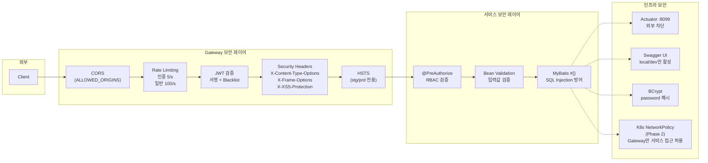
```mermaid
graph LR
    subgraph EXTERNAL["외부"]
        CLIENT["Client"]
    end

    subgraph GATEWAY_SEC["Gateway 보안 레이어"]
        CORS["CORS\n(ALLOWED_ORIGINS)"]
        RATE["Rate Limiting\n인증 5/s\n일반 100/s"]
        JWT_V["JWT 검증\n서명 + Blacklist"]
        HEADERS["Security Headers\nX-Content-Type-Options\nX-Frame-Options\nX-XSS-Protection"]
        HSTS["HSTS\n(stg/prd 전용)"]
    end

    subgraph SERVICE_SEC["서비스 보안 레이어"]
        RBAC["@PreAuthorize\nRBAC 검증"]
        VALID["Bean Validation\n입력값 검증"]
        MYBATIS["MyBatis #{}\nSQL Injection 방어"]
    end

    subgraph INFRA_SEC["인프라 보안"]
        ACTUATOR["Actuator :8099\n외부 차단"]
        SWAGGER_SEC["Swagger UI\nlocal/dev만 활성"]
        ENCRYPT["BCrypt\npassword 해시"]
        NETPOL["K8s NetworkPolicy\n(Phase 2)\nGateway만 서비스 접근 허용"]
    end

    CLIENT --> CORS --> RATE --> JWT_V --> HEADERS --> HSTS
    HSTS --> RBAC --> VALID --> MYBATIS
    MYBATIS -.-> ACTUATOR
    MYBATIS -.-> SWAGGER_SEC
    MYBATIS -.-> ENCRYPT
    MYBATIS -.-> NETPOL
```

### Gateway 보안 레이어 각 항목 설명

**① CORS (`ALLOWED_ORIGINS`)**

브라우저가 다른 출처(Origin)에서 API를 호출할 때 적용되는 정책이다. `ALLOWED_ORIGINS` 환경변수에 허용할 Origin을 명시하면, Gateway가 그 외의 출처에서 오는 Preflight 요청(OPTIONS)을 거부한다. 프론트엔드(`http://localhost:3000`)와 API(`http://localhost:8090`)의 포트가 다르므로 반드시 설정이 필요하다. CORS 설정은 Gateway에서만 하고 각 서비스에서는 중복 설정하지 않는다.

**② Rate Limiting (인증 5/s, 일반 100/s)**

동일 IP에서 단시간에 대량 요청이 들어올 때 차단하는 장치다. Redis sliding window 알고리즘을 사용한다. 인증 API(`/auth/login`, `/auth/refresh`, `/auth/logout`)는 Brute Force 공격 대비를 위해 5req/s로 엄격하게 제한하고, 일반 API는 100req/s로 관대하게 설정한다. 초과 시 `429 Too Many Requests`와 함께 `Retry-After` 헤더를 반환한다. 경로별 버킷을 독립 관리하므로 `/login`을 집중 공격해도 `/refresh`나 일반 API 버킷에 영향을 주지 않는다.

**③ JWT 검증 (서명 + Blacklist)**

2단계 검증을 수행한다. 1단계는 JWT 서명 및 만료 시간 검증이고, 2단계는 Redis Blacklist에서 해당 토큰의 `jti`(JWT ID)가 등록되어 있는지 확인한다. 서명 검증만으로는 로그아웃한 토큰을 막을 수 없기 때문에 Blacklist가 필요하다. 또한 `type` 클레임이 `"access"`인 토큰만 통과시켜 Refresh Token을 Access Token처럼 사용하는 Token Confusion 공격을 방어한다.

**④ Security Headers**

브라우저 레벨의 공격을 방어하는 HTTP 응답 헤더를 추가한다.

| 헤더 | 방어하는 공격 | 설정값 |
|------|-------------|--------|
| `X-Content-Type-Options` | MIME 스니핑 — 브라우저가 Content-Type을 무시하고 파일 형식을 추측하는 것 방지 | `nosniff` |
| `X-Frame-Options` | Clickjacking — 페이지를 iframe에 삽입해 사용자 클릭을 가로채는 공격 방지 | `DENY` |
| `X-XSS-Protection` | 구형 브라우저의 반사형 XSS 탐지 활성화 (최신 브라우저는 기본 내장) | `1; mode=block` |

**⑤ HSTS (stg/prd 전용)**

HTTPS를 강제하는 헤더다(`Strict-Transport-Security`). 브라우저가 이 헤더를 한 번 수신하면, 이후 해당 도메인에 대한 HTTP 요청을 자동으로 HTTPS로 업그레이드한다. 중간자 공격(MITM)과 SSL Stripping 공격을 방어한다. local/dev에서는 인증서가 없는 HTTP 환경이므로 비활성화하고, stg/prd에서만 적용한다.

---

## 16. 인증 토큰 저장 구조 (Redis)

Phase 1에서 적용하는 멀티 디바이스 대응 토큰 키 구조를 명시한다.

```
┌─────────────────────────────────────────────────────────┐
│  Refresh Token Store                                    │
│                                                         │
│  rt:{userId}:{deviceId}  →  refreshTokenValue           │
│                                                         │
│  예시)                                                   │
│  rt:42:a1b2c3d4-1234-...  →  eyJhbGci...  (TTL: 7d)    │
│  rt:42:e5f6g7h8-5678-...  →  eyJhbGci...  (TTL: 7d)    │
│  rt:99:f9g0h1i2-9012-...  →  eyJhbGci...  (TTL: 7d)    │
│                                                         │
│  단일 디바이스 로그아웃:                                  │
│    DEL rt:42:a1b2c3d4-1234-...                          │
│                                                         │
│  전체 세션 무효화 (탈취 감지):                            │
│    SCAN + DEL rt:42:*                                   │
└─────────────────────────────────────────────────────────┘

┌─────────────────────────────────────────────────────────┐
│  Blacklist                                              │
│                                                         │
│  bl:{jti}  →  "logout"  (TTL: Access Token 잔여 만료)   │
└─────────────────────────────────────────────────────────┘
```

> **deviceId 생성 주체**: 클라이언트(Frontend)가 최초 로그인 시 UUID를 생성하여 localStorage에 보관.
> 서버는 전달받은 deviceId를 키 구성에 사용하며 별도 검증은 하지 않는다.
> Phase 1에서는 단일 deviceId로 동작하나, 키 구조는 처음부터 멀티 세션을 지원하도록 설계한다.

---

## 17. 서비스 간 내부 통신 구조

### 17-1. Phase 1 현재 상태

Phase 1에서는 **서비스 간 직접 HTTP 호출 없음**. 모든 요청은 외부 클라이언트 → Gateway → 단일 서비스 경로로만 흐른다.

```
[외부 클라이언트] → [api-gateway] → [auth-service]
                                  → [user-service]
                                  → [todo-service]
```

각 서비스는 DB와 Redis에만 의존하며 서로를 직접 호출하지 않는다.

---

### 17-2. 서비스 간 호출이 필요한 경우 (Phase 2 예시)

비즈니스 요구가 복잡해지면 서비스 간 직접 호출이 필요해진다.

| 시나리오 | 호출 방향 | 목적 |
|----------|-----------|------|
| 주문 생성 시 사용자 확인 | order-service → user-service | 탈퇴·정지 계정 차단 |
| 할 일 완료 시 알림 발송 | todo-service → notification-service | 이벤트 전달 |
| 정산 시 사용자 정보 조회 | billing-service → user-service | 이름·이메일 조회 |

> **원칙**: 서비스 간 호출은 필요 최소 데이터만 조회. DB 직접 공유·JOIN 금지.

---

### 17-3. 내부 URL 규칙

서비스 간 호출은 **Gateway를 경유하지 않는다**. Gateway는 외부 클라이언트 전용 진입점이다.

#### Docker Compose 환경 (로컬/개발)

서비스명이 곧 DNS 호스트명이다 (`docker-compose.yml`의 `container_name` 또는 서비스 키).

```
http://msa-auth-service:8091
http://msa-user-service:8092
http://msa-todo-service:8093
```

#### Kubernetes 환경 (Phase 2)

```
http://auth-service.default.svc.cluster.local:8091    # 전체 FQDN
http://auth-service:8091                               # 동일 네임스페이스 내 단축형
```

#### 환경변수로 URL 관리 (하드코딩 금지)

```yaml
# application.yml
internal:
  user-service-url: ${USER_SERVICE_URL:http://msa-user-service:8092}
  auth-service-url: ${AUTH_SERVICE_URL:http://msa-auth-service:8091}
```

```java
@Value("${internal.user-service-url}")
private String userServiceUrl;
```

---

### 17-4. RestClient 구성 패턴

Spring Boot 3.2+ 기본 제공 `RestClient`를 사용한다 (`RestTemplate` 대체).

```java
@Configuration
public class InternalClientConfig {

    @Bean
    public RestClient userServiceClient(@Value("${internal.user-service-url}") String baseUrl) {
        return RestClient.builder()
                .baseUrl(baseUrl)
                .defaultHeader(HttpHeaders.CONTENT_TYPE, MediaType.APPLICATION_JSON_VALUE)
                .build();
    }
}
```

```java
@Service
@RequiredArgsConstructor
public class OrderService {

    private final RestClient userServiceClient;

    public UserResponse getUser(Long userId, String userIdHeader, String userRoleHeader) {
        return userServiceClient.get()
                .uri("/api/v1/users/{id}", userId)
                .header("X-User-Id", userIdHeader)
                .header("X-User-Role", userRoleHeader)
                .retrieve()
                .body(UserResponse.class);
    }
}
```

---

### 17-5. 사용자 컨텍스트 전파 규칙

Gateway가 JWT를 검증하고 `X-User-Id`, `X-User-Role` 헤더를 하위 서비스에 주입한다. 서비스 간 내부 호출 시에는 이 헤더를 **그대로 전달**해야 한다.

```
[클라이언트]
    → [Gateway] (JWT 검증 → X-User-Id: 42, X-User-Role: ROLE_USER 주입)
        → [order-service] (헤더 수신)
            → [user-service] (X-User-Id: 42, X-User-Role: ROLE_USER 그대로 전달)
```

**헤더 전파 구현 예시 (Filter 또는 Interceptor)**

```java
// 요청 수신 시 MDC + ThreadLocal에 저장
String userId   = request.getHeader("X-User-Id");
String userRole = request.getHeader("X-User-Role");

// 내부 호출 시 헤더에 재첨부
restClient.get()
    .uri(...)
    .header("X-User-Id",   userId)
    .header("X-User-Role", userRole)
    .retrieve()
    ...
```

> **주의**: `X-User-Id` / `X-User-Role`은 각 서비스의 `UserContextFilter`가 외부 입력 값을 제거하고 내부적으로만 주입한다. 서비스 간 호출도 동일하게 이 필터를 거치므로, 헤더 스푸핑은 내부망에서도 차단된다.

**내부 통신 구성도 (order-service 예시)**

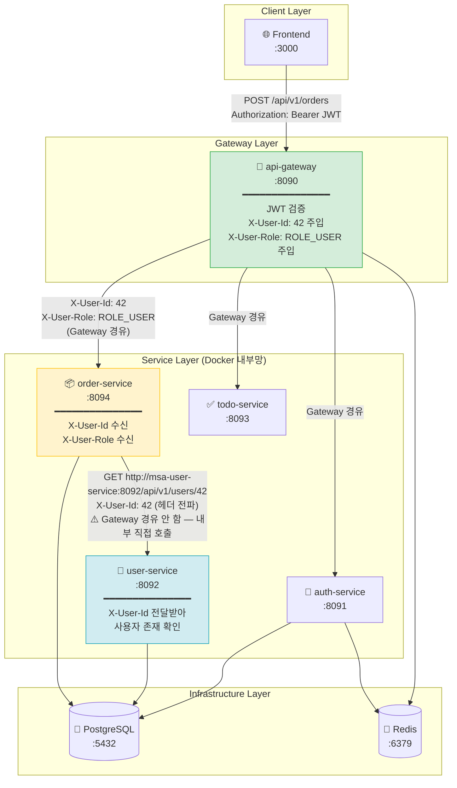
```mermaid
graph TB
    subgraph CLIENT["Client Layer"]
        FE["🌐 Frontend\n:3000"]
    end

    subgraph GATEWAY["Gateway Layer"]
        GW["🔀 api-gateway\n:8090\n━━━━━━━━━━━━━━━\nJWT 검증\nX-User-Id: 42 주입\nX-User-Role: ROLE_USER 주입"]
    end

    subgraph SERVICES["Service Layer (Docker 내부망)"]
        ORDER["📦 order-service\n:8094\n━━━━━━━━━━━━━━━\nX-User-Id 수신\nX-User-Role 수신"]
        USER["👤 user-service\n:8092\n━━━━━━━━━━━━━━━\nX-User-Id 전달받아\n사용자 존재 확인"]
        AUTH["🔐 auth-service\n:8091"]
        TODO["✅ todo-service\n:8093"]
    end

    subgraph INFRA["Infrastructure Layer"]
        PG[("🐘 PostgreSQL\n:5432")]
        RD[("🔴 Redis\n:6379")]
    end

    FE -->|"POST /api/v1/orders\nAuthorization: Bearer JWT"| GW

    GW -->|"X-User-Id: 42\nX-User-Role: ROLE_USER\n(Gateway 경유)"| ORDER
    GW -->|"Gateway 경유"| AUTH
    GW -->|"Gateway 경유"| TODO

    ORDER -->|"GET http://msa-user-service:8092/api/v1/users/42\nX-User-Id: 42 (헤더 전파)\n⚠️ Gateway 경유 안 함 — 내부 직접 호출"| USER

    ORDER --> PG
    USER --> PG
    AUTH --> PG
    AUTH --> RD
    GW --> RD

    style ORDER fill:#fff3cd,stroke:#ffc107
    style USER fill:#d1ecf1,stroke:#17a2b8
    style GW fill:#d4edda,stroke:#28a745
```

> 핵심: Gateway는 **외부 → 서비스** 구간만 담당한다. 서비스 간 내부 호출은 Docker 내부 DNS(`msa-user-service:8092`)로 직접 연결하며 Gateway를 거치지 않는다.

---

### 17-6. 신뢰 모델 (Trust Model)

#### Phase 1 — IP 기반 묵시적 신뢰

```
Docker Compose 내부 네트워크 = 신뢰 영역
→ 동일 네트워크의 서비스 호출은 별도 인증 없이 통과
→ X-User-Id / X-User-Role 헤더 조작 가능성: 외부 차단이 전제
```

| 항목 | Phase 1 | Phase 2 |
|------|---------|---------|
| 인증 방식 | 네트워크 격리 (묵시적 신뢰) | 서비스 전용 JWT 또는 mTLS |
| 헤더 위변조 방어 | `UserContextFilter` 외부 입력 제거 | 서비스 JWT 서명 검증 |
| 구현 복잡도 | 낮음 | 높음 |

#### Phase 2 — 서비스 JWT (Service Account Token)

```
order-service 가 user-service 호출 시:
  Authorization: Bearer <service-jwt>   # 서비스 전용 토큰 (사용자 토큰 아님)
  X-User-Id: 42                         # 원래 사용자 컨텍스트는 별도 헤더로 전달
```

---

### 17-7. 의존 방향 규칙

```
허용된 의존 방향:
  order-service  → user-service   ✅
  billing-service → user-service  ✅
  todo-service   → notification-service ✅

금지:
  user-service  → order-service   ❌  (상위 도메인이 하위를 알면 안 됨)
  auth-service  → todo-service    ❌  (auth는 leaf 노드)
  A → B → A                       ❌  (순환 참조 절대 금지)
```

**기준**: 도메인 의존성은 단방향. auth·user는 공통 기반 서비스이므로 다른 서비스에 의존하지 않는다.

---

### 17-8. 금지 사항 (Anti-Pattern)

| 금지 항목 | 이유 | 대안 |
|-----------|------|------|
| 다른 서비스 DB 직접 접근 | DB per Service 원칙 위반, 결합도 폭발 | API 호출로 데이터 조회 |
| Gateway URL로 내부 호출 | 불필요한 외부 네트워크 경유, 레이턴시 증가 | 서비스 내부 URL 직접 사용 |
| URL 하드코딩 | 환경(local/k8s) 이식성 파괴 | 환경변수 + `application.yml` 관리 |
| 순환 서비스 호출 | 데드락·장애 전파 위험 | 이벤트 기반 비동기 처리(Kafka 등) |
| 사용자 토큰 재사용 (서비스 간) | 권한 범위 혼용 위험 | 서비스 전용 토큰 또는 mTLS (Phase 2) |

---

### 17-9. Phase 2 — Circuit Breaker (Resilience4j)

내부 HTTP 호출 추가 시 장애 전파를 방어하기 위해 Circuit Breaker를 적용한다.

```java
@CircuitBreaker(name = "user-service", fallbackMethod = "fallbackUser")
public UserResponse getUser(Long userId, ...) {
    return userServiceClient.get()...retrieve().body(UserResponse.class);
}

public UserResponse fallbackUser(Long userId, Throwable t) {
    log.warn("user-service 호출 실패, fallback 반환: userId={}", userId);
    return UserResponse.unknown(userId);
}
```

```yaml
# application.yml
resilience4j.circuitbreaker:
  instances:
    user-service:
      slidingWindowSize: 10
      failureRateThreshold: 50
      waitDurationInOpenState: 10s
```

> Circuit Breaker 상태: **Closed** (정상) → **Open** (차단, 즉시 fallback 반환) → **Half-Open** (일부 통과하여 복구 확인)

**Circuit Breaker 상태 전이도**

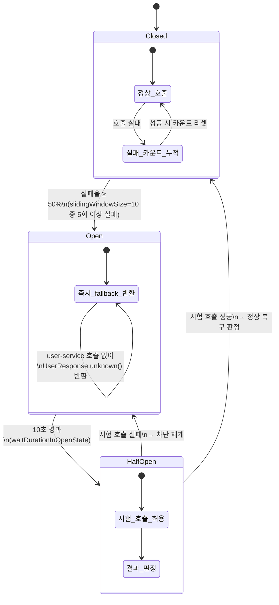
```mermaid
stateDiagram-v2
    [*] --> Closed

    Closed --> Open : 실패율 ≥ 50%\n(slidingWindowSize=10 중 5회 이상 실패)
    Open --> HalfOpen : 10초 경과\n(waitDurationInOpenState)
    HalfOpen --> Closed : 시험 호출 성공\n→ 정상 복구 판정
    HalfOpen --> Open : 시험 호출 실패\n→ 차단 재개

    state Closed {
        [*] --> 정상_호출
        정상_호출 --> 실패_카운트_누적 : 호출 실패
        실패_카운트_누적 --> 정상_호출 : 성공 시 카운트 리셋
    }

    state Open {
        [*] --> 즉시_fallback_반환
        즉시_fallback_반환 --> 즉시_fallback_반환 : user-service 호출 없이\nUserResponse.unknown() 반환
    }

    state HalfOpen {
        [*] --> 시험_호출_허용
        시험_호출_허용 --> 결과_판정
    }
```

**장애 전파 방어 흐름 (order-service 예시)**

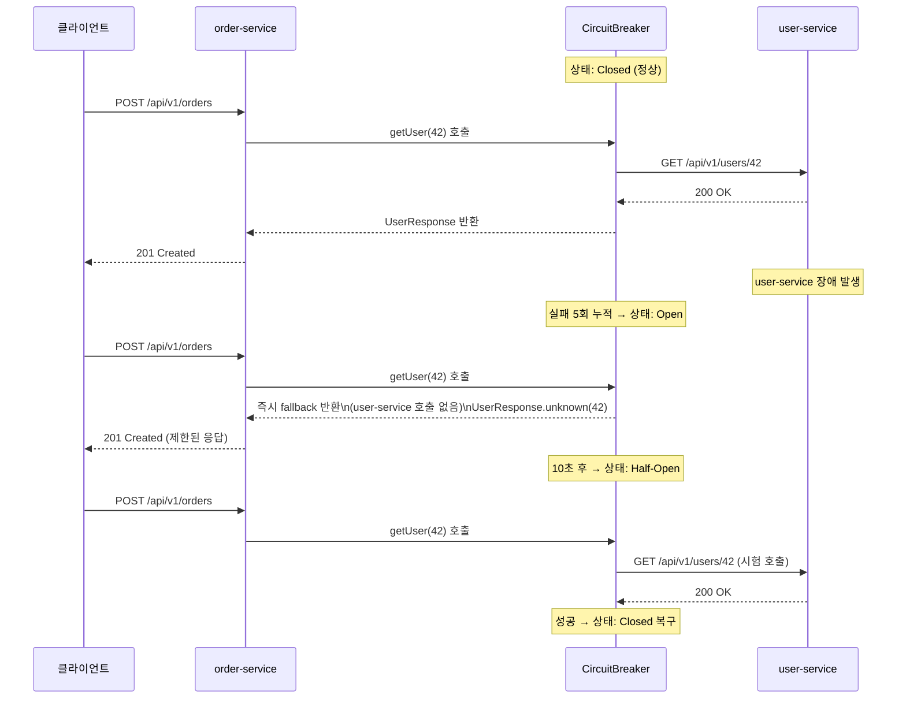
```mermaid
sequenceDiagram
    participant C as 클라이언트
    participant O as order-service
    participant CB as CircuitBreaker
    participant U as user-service

    Note over CB: 상태: Closed (정상)
    C->>O: POST /api/v1/orders
    O->>CB: getUser(42) 호출
    CB->>U: GET /api/v1/users/42
    U-->>CB: 200 OK
    CB-->>O: UserResponse 반환
    O-->>C: 201 Created

    Note over U: user-service 장애 발생
    Note over CB: 실패 5회 누적 → 상태: Open

    C->>O: POST /api/v1/orders
    O->>CB: getUser(42) 호출
    CB-->>O: 즉시 fallback 반환\n(user-service 호출 없음)\nUserResponse.unknown(42)
    O-->>C: 201 Created (제한된 응답)

    Note over CB: 10초 후 → 상태: Half-Open
    C->>O: POST /api/v1/orders
    O->>CB: getUser(42) 호출
    CB->>U: GET /api/v1/users/42 (시험 호출)
    U-->>CB: 200 OK
    Note over CB: 성공 → 상태: Closed 복구
```

---

*다음 단계: `docs/STATUS.md`에서 Active Work를 확인하고, 필요한 경우 `docs/backlog/PHASE2.md`에서 다음 작업을 선택한다.*
