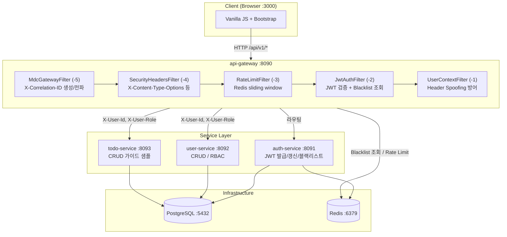
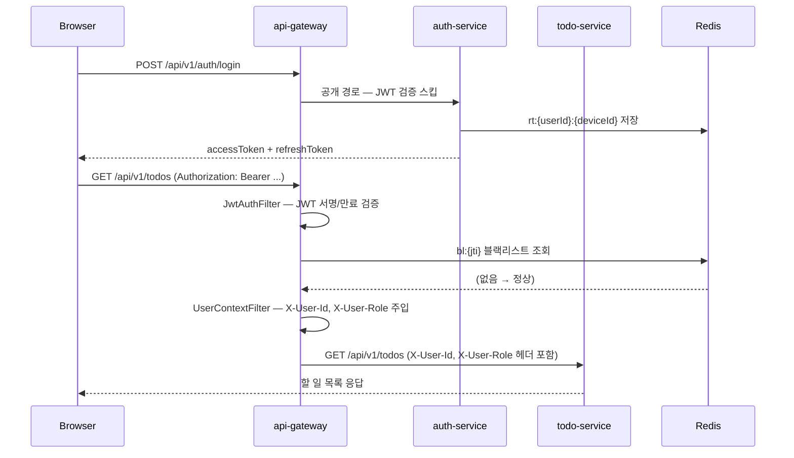
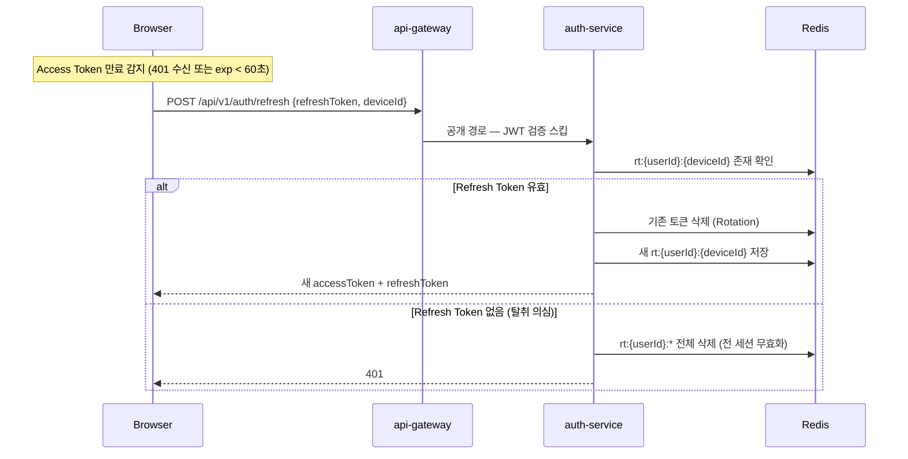

# DEVELOPER-GUIDE.md — 개발자 가이드

> 대상: 이 템플릿을 처음 접하는 개발자 또는 신규 서비스를 추가하려는 팀원.  
> 구성: Part 1 (아키텍처 요소 상세) + Part 2 (개발 절차 가이드)
> 전체 구조 다이어그램의 기준 문서는 [`ARCHITECTURE.md`](ARCHITECTURE.md)이며, 이 문서는 개발 절차와 작업 예시를 중심으로 설명한다.

---

# Part 1. 아키텍처 요소 상세

## 0. Overall 아키텍처

### 서비스 구성도



### 요청 흐름 (로그인 → Todo 조회)



### Token Rotation 흐름



---

## 1. common-core

모든 서비스가 공유하는 공통 모듈. `io.kyungseo.msa.common` 패키지 하위에 위치하며, 별도 `@ComponentScan` 없이 각 서비스의 `scanBasePackages`에 포함되어 자동 등록된다.

### 1-1. ErrorCode — interface 구조

에러 코드는 `enum`이 아닌 **interface**로 정의되어 있다. 서비스마다 독립적인 에러 코드를 추가할 수 있도록 하기 위함이다.

```java
// common-core: io.kyungseo.msa.common.exception.ErrorCode
public interface ErrorCode {
    String getCode();    // 예: "USER-0001"
    String getMessage(); // 예: "이미 사용 중인 이메일입니다."
    int getStatus();     // HTTP 상태 코드
}
```

```java
// common-core: io.kyungseo.msa.common.exception.CommonErrorCode
public enum CommonErrorCode implements ErrorCode {
    INVALID_INPUT("COMMON-0001", "잘못된 입력입니다.", 400),
    UNAUTHORIZED("COMMON-0002", "인증이 필요합니다.", 401),
    FORBIDDEN("COMMON-0003", "접근 권한이 없습니다.", 403),
    NOT_FOUND("COMMON-0004", "요청한 리소스를 찾을 수 없습니다.", 404),
    INTERNAL_SERVER_ERROR("COMMON-0005", "서버 내부 오류가 발생했습니다.", 500),
    SERVICE_UNAVAILABLE("COMMON-0006", "서비스를 일시적으로 사용할 수 없습니다.", 503);
    ...
}
```

```java
// 서비스별 에러 코드 예시: user-service
public enum UserErrorCode implements ErrorCode {
    DUPLICATE_EMAIL("USER-0001", "이미 사용 중인 이메일입니다.", 409),
    USER_NOT_FOUND("USER-0002", "사용자를 찾을 수 없습니다.", 404),
    WEAK_PASSWORD("USER-0003", "비밀번호가 정책을 만족하지 않습니다.", 400);
    ...
}
```

새 서비스를 추가할 때는 같은 패턴으로 `{Service}ErrorCode` enum을 만들어 `ErrorCode` interface를 구현한다.

### 1-2. BusinessException + GlobalExceptionHandler

비즈니스 예외는 `BusinessException(ErrorCode)` 하나로 통일한다.

```java
// 서비스 코드에서 던지는 방식
if (userMapper.existsByEmail(request.getEmail())) {
    throw new BusinessException(UserErrorCode.DUPLICATE_EMAIL);
}
```

`GlobalExceptionHandler`는 common-core에 하나만 존재하고, 모든 서비스가 이것을 공유한다. **서비스별 별도 ExceptionHandler 생성 금지.**

```java
// ⚠️ 중요: GlobalExceptionHandler가 등록되려면 scanBasePackages에 "io.kyungseo.msa.common" 포함 필수
@SpringBootApplication(scanBasePackages = {"io.kyungseo.msa.user", "io.kyungseo.msa.common"})
public class UserServiceApplication { ... }
```

이 설정이 없으면 GlobalExceptionHandler가 Spring 컨텍스트에 등록되지 않고, BusinessException이 500으로 떨어진다.

### 1-3. API 응답 포맷

모든 API는 `ApiResponse<T>`로 감싸서 응답한다:

```json
// 성공
{
  "success": true,
  "data": { ... }
}

// 실패
{
  "success": false,
  "error": {
    "code": "USER-0001",
    "message": "이미 사용 중인 이메일입니다."
  }
}
```

페이지네이션 응답은 `PageResponse<T>`:

```json
{
  "content": [...],
  "page": 0,
  "size": 20,
  "totalElements": 42,
  "totalPages": 3
}
```

### 1-4. MdcFilter — 요청 추적

서블릿 필터로 모든 요청에 `X-Correlation-ID`를 부여한다. 없으면 UUID를 생성하고, 있으면 그대로 전파한다. MDC에 등록하여 로그에 자동 포함된다.

```
[user-service,traceId-,spanId-,abc-123] 12:34:56.789 DEBUG  UserService - ...
                                ↑
                       X-Correlation-ID 값
```

Gateway에서는 `MdcGatewayFilter`가 동일한 역할을 WebFlux 방식으로 수행한다.

---

## 2. auth-service

### 2-1. JWT 구조

- **Access Token**: 15분(기본) 만료. API 호출 시 `Authorization: Bearer {token}`으로 전달.
- **Refresh Token**: 7일(기본) 만료. Token Rotation에 사용.
- **`type` 클레임**: access/refresh 혼용 방지(Token Confusion Attack 방어). Gateway의 `JwtAuthFilter`는 `type == "access"`인 토큰만 통과시킨다.

```java
// JwtTokenProvider: 토큰 생성 시 type 클레임 추가
Jwts.builder()
    .claim("type", "access")   // 또는 "refresh"
    .claim("role", user.getRole())
    ...
```

### 2-2. Token Rotation 흐름

```
[로그인]
  POST /api/v1/auth/login {username, password, deviceId}
  → access + refresh 발급
  → Redis: rt:{userId}:{deviceId} = refreshToken (TTL 7일)

[갱신]
  POST /api/v1/auth/refresh {refreshToken, deviceId}
  → 기존 refresh의 jti를 bl:{jti}로 블랙리스트 등록
  → 새 access + refresh 발급
  → Redis: rt:{userId}:{deviceId} = newRefreshToken

[로그아웃]
  POST /api/v1/auth/logout (Bearer accessToken)
  → access의 jti를 bl:{jti}로 블랙리스트 등록
  → Redis: rt:{userId}:{deviceId} 삭제

[탈취 의심 감지]
  이미 사용된 refresh로 /refresh 재시도 →
  → 해당 userId의 모든 세션 무효화 (rt:{userId}:* 전체 삭제)
```

### 2-3. Redis 키 구조

| 키 패턴 | 값 | 용도 |
|---------|-----|------|
| `rt:{userId}:{deviceId}` | refreshToken 문자열 | 유효한 Refresh Token 저장 |
| `bl:{jti}` | "blacklisted" | 블랙리스트 (access/refresh 공통) |

`deviceId`는 클라이언트가 최초 발급하는 UUID다. 멀티 디바이스 로그인 지원을 위해 사용한다 — 디바이스별로 독립적인 Refresh Token이 유지된다.

### 2-4. fail-close / fail-open 정책

Gateway가 Redis에서 블랙리스트를 조회할 때 Redis 장애가 발생하면:

- `fail-close` (기본): 조회 실패 → 401 반환 (보안 우선)
- `fail-open`: 조회 실패 → 요청 통과 (가용성 우선)

환경변수로 제어: `BLACKLIST_FAIL_POLICY=fail-close`

---

## 3. user-service

### 3-1. UserContextFilter — 헤더 기반 인증 전파

Gateway가 JWT를 검증한 뒤 `X-User-Id`와 `X-User-Role` 헤더를 하위 서비스에 전달한다. user-service의 `UserContextFilter`는 이 헤더를 읽어 Spring Security의 `SecurityContext`에 인증 정보를 설정한다.

```java
// UserContextFilter.java (서블릿 필터)
String userId = request.getHeader("X-User-Id");
String userRole = request.getHeader("X-User-Role");
// → SecurityContextHolder에 UsernamePasswordAuthenticationToken 설정
```

컨트롤러에서는 `SecurityContextHolder`로 직접 꺼내 사용한다:

```java
// UserController.java
Authentication auth = SecurityContextHolder.getContext().getAuthentication();
Long requesterId = Long.parseLong(auth.getName());
String requesterRole = auth.getAuthorities().iterator().next().getAuthority();
```

> `Authentication authentication` 파라미터 방식을 쓰지 않는 이유:  
> `@WebMvcTest` 슬라이스 테스트에서 `authentication()` PostProcessor가 `SecurityContextHolderFilter`를 포함하지 않아 동작하지 않는다.  
> `SecurityContextHolder`를 직접 설정하는 방식이 슬라이스 테스트와 호환된다.

### 3-2. MapStruct — DTO 변환

`User` 도메인 → `UserResponse` DTO 변환에 MapStruct를 사용한다. `password` 필드는 `UserResponse`에 없으므로 자동으로 제외된다.

```java
// dto/mapper/UserResponseMapper.java
@Mapper(componentModel = "spring")
public interface UserResponseMapper {
    UserResponse toResponse(User user);
}
```

```java
// 이름 충돌 주의: UserMapper.java (MyBatis)와 UserResponseMapper.java (MapStruct) 공존
// MyBatis mapper는 io.kyungseo.msa.user.mapper 패키지
// MapStruct mapper는 io.kyungseo.msa.user.dto.mapper 패키지 — 구분 필수
```

`build.gradle.kts`에서 annotationProcessor 순서가 중요하다:

```kotlin
// Lombok이 MapStruct보다 먼저 선언되어야 함
annotationProcessor(libs.lombok)
annotationProcessor(libs.mapstruct.processor)
```

---

## 4. todo-service

### 4-1. DB FK 미사용 설계

`todos.user_id`는 `users.id`를 논리적으로 참조하지만 DB 레벨 FK 제약은 없다. Phase 2에서 DB per Service로 전환하면 물리적 FK가 불가능하기 때문이다.

대신 `UserExistenceMapper`로 users 테이블을 직접 조회해 사용자 존재를 검증한다:

```java
// Todo 생성 시 사용자 존재 확인
if (!userExistenceMapper.existsById(userId)) {
    throw new BusinessException(TodoErrorCode.USER_NOT_FOUND);
}
```

### 4-2. Integration Test — per-request 인증

통합 테스트에서 `SecurityContextHolder.setAuthentication()` 후 다음 요청에서 이전 인증이 유지되는 문제가 있다 (`SecurityContextHolderFilter` 충돌). 해결책은 MockMvc의 `.with(authentication(...))` per-request 방식:

```java
// TodoIntegrationTest.java
mockMvc.perform(
    get("/api/v1/todos")
        .with(authentication(buildAuth(userId, "ROLE_USER")))  // 요청마다 지정
)
```

---

## 5. api-gateway

### 5-1. GlobalFilter 체인

Gateway는 5개의 GlobalFilter를 순서에 따라 실행한다:

| 순서 | 필터 | 역할 |
|------|------|------|
| -5 | `MdcGatewayFilter` | `X-Correlation-ID` 생성 또는 전파. Reactor Context에 저장 |
| -4 | `SecurityHeadersFilter` | `X-Content-Type-Options`, `X-Frame-Options` 추가. HSTS는 stg/prd만 |
| -3 | `RateLimitFilter` | Redis Lua sliding window. `/auth/**`: 5req/s, 일반: 100req/s. 초과 시 429 + `Retry-After` |
| -2 | `JwtAuthFilter` | JWT 서명/만료 검증 + Redis 블랙리스트 조회. 공개 경로(`/api/v1/auth/**`, `/api/v1/users` POST) 스킵 |
| -1 | `UserContextFilter` | Header Spoofing 방어: 클라이언트가 보낸 `X-User-Id`, `X-User-Role` 제거 후 JWT claims 값으로 대체 |

### 5-2. Rate Limiting — 버킷 분리

인증 엔드포인트와 일반 엔드포인트의 버킷이 독립적으로 관리된다. `/auth/login`, `/auth/refresh`, `/auth/logout`은 경로별로 각각 독립 버킷을 사용한다. 한 경로를 과도하게 호출해도 다른 인증 경로에 영향을 주지 않는다.

```
Redis key 구조:
  rate:{ip}:{path-bucket}
  예: rate:127.0.0.1:login
      rate:127.0.0.1:refresh
      rate:127.0.0.1:general
```

### 5-3. CORS 설정

`ALLOWED_ORIGINS` 환경변수로 제어한다:

```yaml
# gateway application.yml
spring:
  cloud:
    gateway:
      server:
        webflux:
          globalcors:
            corsConfigurations:
              '[/**]':
                allowedOrigins: ${ALLOWED_ORIGINS:http://localhost:3000}
```

운영 환경에서는 `.env`에서 `ALLOWED_ORIGINS=https://your-domain.com` 으로 지정한다.

---

## 6. frontend

### 6-1. 모듈 구조

```
frontend/web-app/
├── login.html         # 로그인 폼
├── index.html         # 사용자 정보 대시보드
├── todo.html          # Todo CRUD
└── js/
    ├── auth.js        # 인증 유틸 (login, logout, 토큰 저장/조회)
    ├── api.js         # HTTP 클라이언트 (fetchWithAuth, requireAuth, 401 자동 갱신)
    └── todo.js        # Todo 화면 로직
```

> `requireAuth()`는 `api.js`에 위치한다. 페이지 진입 시 토큰 만료 여부를 확인하고 선제 리프레시를 수행하는 로직이 포함되어 있어 `fetchWithAuth`와 같은 파일에서 관리한다.

### 6-2. fetchWithAuth — 401 자동 갱신

```javascript
// api.js
let _refreshPromise = null;  // 진행 중인 refresh Promise (없으면 null)

async function fetchWithAuth(url, options = {}) {
    // ... Bearer 헤더 추가 후 요청
    if (res.status === 401) {
        const refreshed = await _ensureRefresh();  // 동시 401이 와도 refresh는 1회만
        if (refreshed) {
            // 새 토큰으로 원래 요청 재시도
        } else {
            clearTokens();
            window.location.href = 'login.html';
        }
    }
}

// 핵심: 이미 refresh 중이면 같은 Promise를 반환 → 동시 호출이 모두 결과를 공유
function _ensureRefresh() {
    if (!_refreshPromise) {
        _refreshPromise = _tryRefresh().finally(() => { _refreshPromise = null; });
    }
    return _refreshPromise;
}
```

**`_refreshPromise` 방식의 동시성 보장:**  
여러 요청이 동시에 401을 받으면 첫 번째 호출만 `_tryRefresh()`를 실행하고 Promise를 저장한다. 나머지는 같은 Promise를 `await`하므로 refresh 요청은 네트워크에 **단 1회**만 발생한다. refresh 완료 후 모든 대기 중인 요청이 새 토큰으로 재시도한다.

**선제 리프레시 (`requireAuth`):**

```javascript
async function requireAuth() {
    const token = getAccessToken();
    if (!token) { window.location.href = 'login.html'; return; }
    // JWT payload의 exp를 디코딩해 만료 60초 이내면 미리 갱신
    if (_getSecondsUntilExpiry(token) < 60) {
        const refreshed = await _ensureRefresh();
        if (!refreshed) { clearTokens(); window.location.href = 'login.html'; }
    }
}
```

페이지 진입 시 `await requireAuth()`를 호출하면 만료 직전 토큰을 페이지 로드 시점에 갱신하므로 첫 API 호출에서 401이 발생하지 않는다.

### 6-3. 토큰 저장소 (Phase 1)

현재는 `localStorage`에 토큰을 저장한다. XSS 공격에 취약하다는 것을 인지하고 있으며, Phase 2에서 `HttpOnly Cookie` + `SameSite=Strict`로 전환할 계획이다. (`docs/backlog/PHASE2.md`의 P2-001 참조)

```javascript
// auth.js
const KEYS = {
    ACCESS:  'accessToken',
    REFRESH: 'refreshToken',
    DEVICE:  'deviceId',
    USER:    'currentUser',
};
```

---

# Part 2. 개발 절차 가이드

## 1. 로컬 개발 환경 설정

### 초기 설정 순서

```bash
# 1. 환경변수 설정
cp .env.example .env
# .env 편집: JWT_SECRET, DB_USERNAME, DB_PASSWORD 입력

# 2. Git hooks 설치 (최초 1회 — pre-commit Checkstyle + commit-msg 검증)
sh tools/git-hooks/install.sh

# 3. infra만 기동 (로컬 서비스 실행 시)
cd scripts
make run-local   # PostgreSQL + Redis만 기동

# 4. 서비스 로컬 실행 (IntelliJ 또는 터미널)
SPRING_PROFILES_ACTIVE=local ./gradlew :services:user-service:bootRun
```

### 코드 컨벤션 설정

`.editorconfig`는 IntelliJ / VS Code에서 자동 인식된다 (별도 설정 불필요).

**IntelliJ Checkstyle 플러그인 설정:**
1. `Settings → Plugins` → "Checkstyle-IDEA" 설치
2. `Settings → Tools → Checkstyle` → Configuration File에 `config/checkstyle/checkstyle.xml` 추가
3. 이후 편집기 내 실시간 위반 표시 활성화

**로컬 Checkstyle 실행:**
```bash
./gradlew checkstyleMain   # main 소스만 검사
./gradlew checkstyleTest   # test 소스까지 검사
./gradlew check            # Checkstyle + test 전부
```

CI는 `develop` push에서 Checkstyle을 실행하고, `main` push 또는 `main` 대상 PR에서 `lint → test` 순서로 실행된다 (`.github/workflows/ci.yml`).
lint 실패 시 Report: `build/reports/checkstyle/main.html` 또는 GitHub Actions 로그 확인.

상세 컨벤션 규칙: [`docs/CODING-CONVENTIONS.md`](CODING-CONVENTIONS.md)

### .env 주의사항

- Docker Compose 내부 통신 시 `DB_URL=jdbc:postgresql://msa-postgres:5432/msa_db` (컨테이너 서비스명)
- 로컬 직접 실행 시 `DB_URL=jdbc:postgresql://localhost:5432/msa_db`
- `.env`는 `.gitignore`에 포함 — **절대 커밋 금지**

---

## 2. 신규 서비스 추가 절차

### Step 1. 스캐폴딩

```bash
cd scripts
make create-service NAME=order-service
```

생성되는 구조:
```
services/order-service/
├── build.gradle.kts
└── src/
    ├── main/java/io/kyungseo/msa/orderservice/
    │   └── OrderServiceApplication.java
    └── main/resources/
        ├── application.yml
        ├── application-local.yml
        ├── application-dev.yml
        ├── application-stg.yml
        └── application-prd.yml
```

`settings.gradle.kts`에 `include("services:order-service")` 가 자동 추가된다.

### Step 2. application.yml 수정

```yaml
# services/order-service/src/main/resources/application.yml
spring:
  application:
    name: order-service   # ← REPLACE_WITH_SERVICE_NAME 변경
server:
  port: 8094              # ← REPLACE_WITH_PORT 변경 (포트 중복 확인)
```

### Step 3. Application.java — scanBasePackages 추가

```java
// ⚠️ GlobalExceptionHandler 등록을 위해 "io.kyungseo.msa.common" 반드시 포함
@SpringBootApplication(scanBasePackages = {
    "io.kyungseo.msa.orderservice",
    "io.kyungseo.msa.common"
})
public class OrderServiceApplication { ... }
```

### Step 4. docker-compose.yml 추가

```yaml
# infra/docker/docker-compose.yml에 추가
order-service:
  build:
    context: ../..
    dockerfile: services/order-service/Dockerfile
  container_name: msa-order-service
  ports:
    - "8094:8094"
  env_file: ../../.env
  environment:
    SPRING_PROFILES_ACTIVE: dev
    DB_URL: jdbc:postgresql://msa-postgres:5432/${DB_NAME:-msa_db}
    REDIS_HOST: msa-redis
  depends_on:
    postgres:
      condition: service_healthy
  networks:
    - msa-net
```

### Step 5. Gateway 라우팅 추가

```yaml
# gateway/api-gateway/src/main/resources/application-local.yml 및 application-dev.yml
spring:
  cloud:
    gateway:
      server:
        webflux:
          routes:
            - id: order-service
              uri: ${ORDER_SERVICE_URL:http://localhost:8094}
              predicates:
                - Path=/api/v1/orders/**
```

### Step 6. Dockerfile 추가

```bash
# 기존 Dockerfile 참고 (services/user-service/Dockerfile)
# build context는 루트(../.. 기준)이므로 COPY 경로 주의
```

### Step 7. 빌드 확인

```bash
./gradlew :services:order-service:build -x test
```

---

## 3. API 추가 절차

새 서비스 또는 기존 서비스에 API를 추가할 때의 표준 순서.

### Step 1. Domain 정의

```java
// domain/Order.java
@Getter
@Builder
public class Order {
    private Long id;
    private Long userId;
    private String status;
    private LocalDateTime createdAt;
}
```

### Step 2. ErrorCode 추가

```java
// exception/OrderErrorCode.java
public enum OrderErrorCode implements ErrorCode {
    ORDER_NOT_FOUND("ORDER-0001", "주문을 찾을 수 없습니다.", 404),
    UNAUTHORIZED_ORDER("ORDER-0002", "주문에 대한 권한이 없습니다.", 403);
    ...
}
```

### Step 3. MyBatis Mapper

```java
// mapper/OrderMapper.java
@Mapper
public interface OrderMapper {
    Optional<Order> findById(Long id);
    List<Order> findAllByUserId(@Param("userId") Long userId,
                                @Param("offset") int offset,
                                @Param("limit") int limit);
    void insert(Order order);
}
```

```xml
<!-- resources/mapper/OrderMapper.xml -->
<select id="findById" resultType="Order">
    SELECT * FROM orders WHERE id = #{id}
</select>
```

> **`#{}`만 사용**. `${}` 사용 시 SQL Injection 위험 — 화이트리스트 검증 없이 절대 사용 금지.

### Step 4. DTO + MapStruct

```java
// dto/OrderResponse.java — password 같은 민감 필드 제외
@Getter @Builder
public class OrderResponse {
    private Long id;
    private String status;
    ...
}

// dto/mapper/OrderResponseMapper.java
@Mapper(componentModel = "spring")
public interface OrderResponseMapper {
    OrderResponse toResponse(Order order);
}
```

### Step 5. Service

```java
@Service
@RequiredArgsConstructor
public class OrderService {
    private final OrderMapper orderMapper;
    private final OrderResponseMapper orderResponseMapper;

    @Transactional(readOnly = true)
    public OrderResponse getOrder(Long orderId, Long requesterId) {
        Order order = orderMapper.findById(orderId)
            .orElseThrow(() -> new BusinessException(OrderErrorCode.ORDER_NOT_FOUND));
        if (!order.getUserId().equals(requesterId)) {
            throw new BusinessException(CommonErrorCode.FORBIDDEN);
        }
        return orderResponseMapper.toResponse(order);
    }
}
```

### Step 6. Controller

```java
@RestController
@RequestMapping("/api/v1/orders")
@RequiredArgsConstructor
public class OrderController {

    private final OrderService orderService;

    @GetMapping("/{id}")
    public ResponseEntity<ApiResponse<OrderResponse>> getOrder(@PathVariable Long id) {
        // SecurityContextHolder에서 직접 추출 (파라미터 방식 대신)
        Authentication auth = SecurityContextHolder.getContext().getAuthentication();
        Long requesterId = Long.parseLong(auth.getName());
        return ResponseEntity.ok(ApiResponse.success(orderService.getOrder(id, requesterId)));
    }
}
```

### Step 7. .http 테스트 파일 추가

```http
### 주문 조회
GET http://localhost:8093/api/v1/orders/1
Authorization: Bearer {{accessToken}}
```

---

## 4. 테스트 작성 가이드

### 4-1. 단위 테스트 (@ExtendWith(MockitoExtension.class))

Service 레이어를 Mockito로 격리 테스트한다.

```java
@ExtendWith(MockitoExtension.class)
@MockitoSettings(strictness = Strictness.LENIENT)
class OrderServiceTest {

    @Mock private OrderMapper orderMapper;
    @Mock private OrderResponseMapper orderResponseMapper;
    @InjectMocks private OrderService orderService;

    @Test
    void getOrder_notFound() {
        given(orderMapper.findById(99L)).willReturn(Optional.empty());

        assertThatThrownBy(() -> orderService.getOrder(99L, 1L))
            .isInstanceOf(BusinessException.class)
            .extracting(e -> ((BusinessException) e).getErrorCode())
            .isEqualTo(OrderErrorCode.ORDER_NOT_FOUND);
    }
}
```

`LENIENT` 설정: `@BeforeEach`의 blanket stub을 특정 테스트에서 override할 때 `UnnecessaryStubbingException` 방지.

### 4-2. 슬라이스 테스트 (@WebMvcTest)

Controller 레이어만 테스트. `SecurityContextHolder`를 직접 설정해야 한다.

```java
@WebMvcTest(OrderController.class)
@Import({SecurityConfig.class})
@AutoConfigureMockMvc(addFilters = false)
class OrderControllerTest {

    @Autowired private MockMvc mockMvc;
    @MockBean private OrderService orderService;

    @Test
    void getOrder_success() throws Exception {
        // SecurityContextHolder 직접 설정 (authentication() PostProcessor 동작 안 함)
        UsernamePasswordAuthenticationToken auth =
            new UsernamePasswordAuthenticationToken("1", null,
                List.of(new SimpleGrantedAuthority("ROLE_USER")));
        SecurityContextHolder.getContext().setAuthentication(auth);

        given(orderService.getOrder(1L, 1L)).willReturn(sampleResponse);

        mockMvc.perform(get("/api/v1/orders/1"))
            .andExpect(status().isOk());
    }

    @AfterEach
    void tearDown() {
        SecurityContextHolder.clearContext();
    }
}
```

> **왜 `authentication()` PostProcessor가 동작하지 않나?**  
> `@WebMvcTest`는 `SecurityContextHolderFilter`를 포함하지 않는 슬라이스 컨텍스트를 사용한다.  
> `authentication()` PostProcessor는 `SecurityContextHolderFilter` 실행 전에 인증을 주입하는데,  
> 이 필터가 없으면 컨트롤러 실행 시점에 이미 SecurityContext가 비어 있다.  
> `SecurityContextHolder.getContext().setAuthentication(auth)`로 직접 설정하면 항상 동작한다.

### 4-3. 통합 테스트 (@SpringBootTest + Testcontainers)

P2-006(DR-010 Accepted)으로 Testcontainers 전환 완료. `make run-local` 없이 `./gradlew test`만으로 실행된다.

```java
@SpringBootTest
@AutoConfigureMockMvc
@ActiveProfiles("test")
@Testcontainers
class OrderIntegrationTest {

    @Container
    @ServiceConnection
    static PostgreSQLContainer<?> postgres = new PostgreSQLContainer<>("postgres:16");

    @Autowired private MockMvc mockMvc;

    @Test
    void createOrder_success() throws Exception {
        mockMvc.perform(
            post("/api/v1/orders")
                .with(authentication(buildAuth(1L, "ROLE_USER")))
                .contentType(MediaType.APPLICATION_JSON)
                .content("{\"itemId\":1}")
        ).andExpect(status().isCreated());
    }
}
```

`test/resources/application-test.yml`에는 datasource URL/username/password를 기재하지 않는다. `@ServiceConnection`이 컨테이너에서 자동 주입한다.

Redis가 필요한 서비스(auth-service)는 `GenericContainer` + `@DynamicPropertySource`를 추가한다:

```java
@Container
static GenericContainer<?> redis =
    new GenericContainer<>(DockerImageName.parse("redis:7")).withExposedPorts(6379);

@DynamicPropertySource
static void redisProperties(DynamicPropertyRegistry registry) {
    registry.add("spring.data.redis.host", redis::getHost);
    registry.add("spring.data.redis.port", () -> redis.getMappedPort(6379));
}
```

#### Docker Desktop 4.73.0+ 로컬 설정

Docker Desktop 4.73.0은 최소 API 버전을 1.40으로 상향했다. Testcontainers 내장 docker-java가 구버전을 기본값으로 사용하므로 아래 파일을 생성해야 한다.

**`~/.docker-java.properties`** (신규 생성)

```properties
api.version=1.41
```

**`~/.testcontainers.properties`** (없으면 신규 생성, 있으면 아래 항목 추가)

```properties
docker.host=unix:///var/run/docker.sock
docker.api.version=1.41
testcontainers.ryuk.disabled=true
```

설정 후 `./gradlew test`가 정상 실행된다.

원인 분석과 상세 절차는 [docs/troubleshooting/testcontainers-docker-desktop-4.73.md](troubleshooting/testcontainers-docker-desktop-4.73.md)를 참조한다.

---

## 5. 환경변수 레퍼런스

| 변수 | 필수 | 설명 | 누락 시 오류 패턴 |
|------|------|------|------------------|
| `JWT_SECRET` | ✅ | 256-bit 이상 랜덤 문자열 | `IllegalArgumentException: JWT secret is not configured` |
| `DB_URL` | ✅ | JDBC URL | `BeanCreationException: dataSource` |
| `DB_USERNAME` | ✅ | DB 사용자명 | `BeanCreationException: dataSource` |
| `DB_PASSWORD` | ✅ | DB 비밀번호 | `BeanCreationException: dataSource` |
| `REDIS_HOST` | — | 기본값 `localhost` | — |
| `REDIS_PORT` | — | 기본값 `6379` | — |
| `ALLOWED_ORIGINS` | — | 기본값 `http://localhost:3000` | — |
| `BLACKLIST_FAIL_POLICY` | — | 기본값 `fail-close` | — |
| `JWT_ACCESS_EXPIRY` | — | 기본값 `900` (초) | — |
| `JWT_REFRESH_EXPIRY` | — | 기본값 `604800` (초, 7일) | — |
| `DB_POOL_MAX` | — | 기본값 `10` | — |

환경변수가 누락된 채로 기동하면 `ApplicationContext` 초기화 단계에서 실패한다.  
기동 후 아래 명령으로 DB + Redis 연결 상태를 확인한다:

```bash
docker exec msa-auth-service wget -qO- http://localhost:8099/actuator/health
```

---

## 6. 포트 FAQ

### Q. 8099 Actuator에 외부에서 접근하려면?

모든 서비스는 내부적으로 8099에서 Actuator를 서빙하지만, `docker-compose.yml`에서 호스트 포트를 노출하지 않는다 (보안 원칙). 컨테이너 내부에서 직접 접근한다:

```bash
# 컨테이너 내부에서 Actuator health 확인
docker exec msa-auth-service wget -qO- http://localhost:8099/actuator/health

# 또는 docker compose exec 사용
docker compose -f infra/docker/docker-compose.yml exec auth-service \
  wget -qO- http://localhost:8099/actuator/health
```

로컬 개발 시 일시적으로 외부에서 접근이 필요하면 `docker-compose.yml`의 주석을 해제한다:

```yaml
auth-service:
  ports:
    - "8091:8091"
    # - "8099:8099"  # 로컬 확인 필요 시 주석 해제 후 재기동
```

### Q. 로컬에서 서비스를 직접 실행할 때 DB_URL을 바꿔야 하나?

Docker 내부 통신(`msa-postgres`)과 호스트 직접 접근(`localhost`)은 URL이 다르다:

```bash
# docker-compose.yml 내부 (컨테이너 간 통신)
DB_URL=jdbc:postgresql://msa-postgres:5432/msa_db

# 로컬 직접 실행 (호스트 → 컨테이너)
DB_URL=jdbc:postgresql://localhost:5432/msa_db
```

`.env`에서 `DB_URL`을 상황에 맞게 변경하거나, `application-local.yml`에서 override한다.

### Q. Swagger UI가 안 보인다

Swagger UI는 `local` 및 `dev` 프로파일에서만 활성화된다:

```yaml
# application-stg.yml, application-prd.yml
springdoc:
  api-docs:
    enabled: false
  swagger-ui:
    enabled: false
```

`SPRING_PROFILES_ACTIVE=local`로 설정하고 `http://localhost:{port}/swagger-ui.html`에 접속한다.

### Q. `GlobalExceptionHandler`가 동작하지 않고 500이 나온다

`Application.java`의 `scanBasePackages`에 `"io.kyungseo.msa.common"`이 빠진 경우다:

```java
// ❌ 잘못된 설정
@SpringBootApplication
public class OrderServiceApplication { ... }

// ✅ 올바른 설정
@SpringBootApplication(scanBasePackages = {
    "io.kyungseo.msa.orderservice",
    "io.kyungseo.msa.common"   // ← GlobalExceptionHandler 등록에 필수
})
public class OrderServiceApplication { ... }
```

### Q. 통합 테스트 실행 시 DB 연결 오류가 난다

`make run-local`로 PostgreSQL + Redis를 먼저 기동해야 한다:

```bash
cd scripts
make run-local   # postgres + redis 기동
./gradlew :services:order-service:test
```

---

## 7. 로그 확인 및 Trace 추적

### 7-1. 서비스 로그 보기

```bash
cd scripts

make logs                        # 전체 서비스 로그 (스트리밍)
make logs SERVICE=auth-service   # 특정 서비스만
make logs SERVICE=api-gateway

# Docker 직접 사용
docker compose -f infra/docker/docker-compose.yml logs -f --tail=100 todo-service
```

### 7-2. 로그 패턴 해석

local/dev 환경에서 출력되는 로그 형식:

```
12:34:56.789  INFO [auth-service,6a3f1b2c4d5e6f7a,1a2b3c4d,abc-123-def] i.k.m.a.s.AuthService - 로그인 성공
              ↑      ↑              ↑              ↑          ↑
           시각   서비스명       traceId         spanId   X-Correlation-ID
```

| 필드 | 출처 | 설명 |
|------|------|------|
| 서비스명 | `spring.application.name` | 어느 서비스에서 찍힌 로그인지 |
| traceId | Micrometer Tracing 자동 주입 | 하나의 요청 체인 전체를 묶는 ID |
| spanId | Micrometer Tracing 자동 주입 | 서비스 내 개별 작업 단위 |
| X-Correlation-ID | Gateway MdcGatewayFilter 생성 | 클라이언트 요청 단위 추적용 |

### 7-3. 요청 하나를 여러 서비스에서 추적하기

Gateway가 생성한 `X-Correlation-ID`는 하위 서비스로 전파된다. 같은 ID로 grep하면 요청이 어느 서비스를 거쳤는지 전체 흐름을 추적할 수 있다.

```bash
# 전체 로그를 파일로 저장
docker compose -f infra/docker/docker-compose.yml logs > /tmp/msa-logs.txt

# X-Correlation-ID로 요청 추적
grep "abc-123-def" /tmp/msa-logs.txt

# 결과 예시 (요청이 gateway → auth-service를 거친 흐름)
# msa-api-gateway   | ... [api-gateway,,, abc-123-def] JwtAuthFilter - JWT 검증 통과
# msa-auth-service  | ... [auth-service,,, abc-123-def] AuthService - 로그인 성공
```

### 7-4. 특정 서비스 Actuator health 확인

```bash
# 컨테이너 내부에서 DB + Redis 연결 상태 확인
docker exec msa-auth-service wget -qO- http://localhost:8099/actuator/health

# 응답 예시
# {"status":"UP","components":{"db":{"status":"UP"},"redis":{"status":"UP"}}}
```

---

## 8. Swagger UI 사용 가이드

### 8-1. 접속 URL

| 서비스 | URL | 프로파일 |
|--------|-----|----------|
| auth-service | http://localhost:8091/swagger-ui.html | local / dev |
| user-service | http://localhost:8092/swagger-ui.html | local / dev |
| todo-service | http://localhost:8093/swagger-ui.html | local / dev |

> stg/prd 환경에서는 `springdoc.swagger-ui.enabled: false`로 비활성화된다.

### 8-2. 화면 구성 이해

| UI 요소 | 설명 |
|---------|------|
| 제목 아래 `/v3/api-docs` | Swagger가 읽는 OpenAPI JSON 엔드포인트. 직접 열면 API 명세 원본 JSON을 볼 수 있다 |
| `Authorize` 버튼 | JWT Access Token을 입력하는 곳. 입력 후 모든 요청에 `Authorization: Bearer ...` 헤더가 자동 첨부된다 |
| 🔒 자물쇠 아이콘 | 해당 API가 인증 토큰을 요구함을 표시 |

### 8-3. 인증이 필요한 API 호출 순서

```
1. auth-service Swagger UI 접속
   → POST /api/v1/auth/login → "Try it out" → username/password/deviceId 입력 → Execute
   → 응답 body에서 accessToken 복사

2. 같은 창 또는 다른 서비스 Swagger UI에서
   → 우상단 "Authorize" 클릭
   → Value 입력란에 복사한 accessToken 붙여넣기 (Bearer 없이 토큰만)
   → "Authorize" 클릭 → "Close"

3. 이후 🔒 표시된 API의 "Try it out" → Execute 시 자동으로 Authorization 헤더 첨부
```

### 8-4. Postman / Insomnia에 API 명세 import

```bash
# OpenAPI JSON URL을 Postman에 직접 입력
http://localhost:8091/v3/api-docs   # auth-service
http://localhost:8092/v3/api-docs   # user-service
http://localhost:8093/v3/api-docs   # todo-service

# Postman: Import → Link → URL 입력
# Insomnia: Import → From URL
```

---

## 9. Token Refresh 테스트 방법

### 방법 1 — Access Token 만료 시간 단축 (가장 확실)

`.env`에서 만료 시간을 10초로 줄인다:

```bash
JWT_ACCESS_EXPIRY=10   # 기본값 900(15분) → 10초로 단축
```

```bash
cd scripts && make rebuild   # 이미지 재빌드 후 기동
```

로그인 → 10초 대기 → Todo 생성 시도. 정상 응답이 오면 reactive refresh 동작 확인.  
`JWT_ACCESS_EXPIRY=10`이면 페이지 진입 시 이미 만료 60초 이내이므로 선제 리프레시(`requireAuth`)도 함께 확인된다.

### 방법 2 — 브라우저 DevTools에서 토큰 조작

로그인 후 DevTools Console에서 Access Token만 유효하지 않은 값으로 교체한다 (Refresh Token은 유지):

```javascript
// Refresh Token은 유지하면서 Access Token만 만료된 값으로 교체
localStorage.setItem('accessToken', 'invalid.token.value');
```

페이지 새로고침 → Todo 목록이 정상 로드되면 reactive refresh 동작 확인.

### 방법 3 — 토큰 만료까지 남은 시간 확인

DevTools Console에서 직접 함수 호출:

```javascript
// 현재 Access Token의 만료까지 남은 초 확인
_getSecondsUntilExpiry(localStorage.getItem('accessToken'))
// → 예: 723 (약 12분 남음)
```

`JWT_ACCESS_EXPIRY=10`으로 줄이면 로그인 직후에도 10초 미만이 반환되어 선제 리프레시가 즉시 발동한다.

### 방법 4 — 동시 401 레이스 컨디션 확인

만료된 토큰 상태에서 DevTools Console에서 동시 요청 3개를 발사한다:

```javascript
// Access Token 만료 상태에서 실행
Promise.all([
  fetchWithAuth('http://localhost:8090/api/v1/todos'),
  fetchWithAuth('http://localhost:8090/api/v1/todos'),
  fetchWithAuth('http://localhost:8090/api/v1/todos'),
]);
```

Network 탭에서 `/api/v1/auth/refresh` 요청이 **정확히 1번**만 발생하면 `_refreshPromise` 방식이 정상 동작하는 것이다.  
(구버전 `_refreshing` boolean 방식이었다면 1번 요청 후 나머지 2개는 그대로 실패했을 것이다.)
