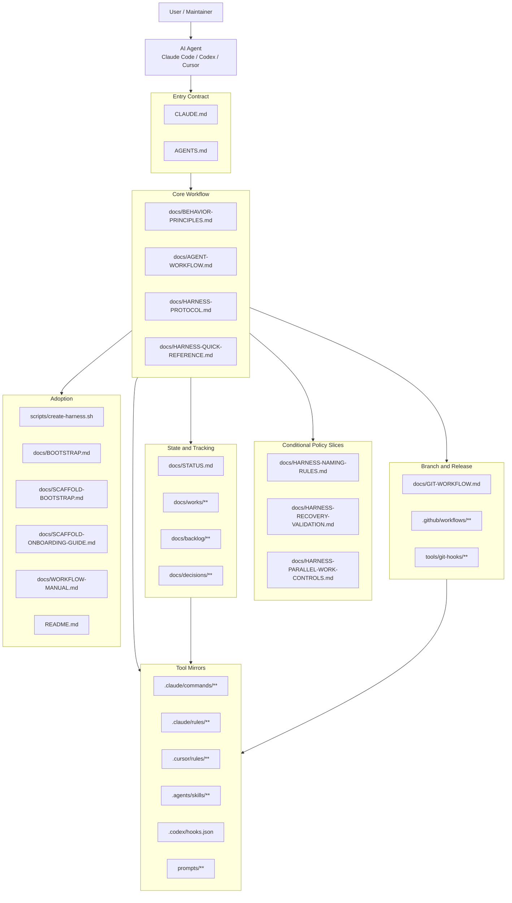
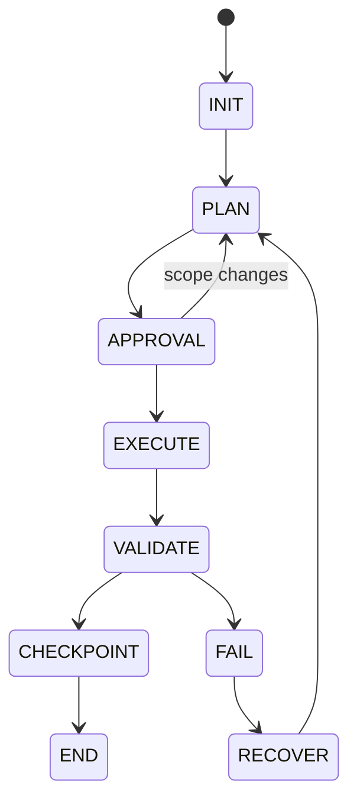
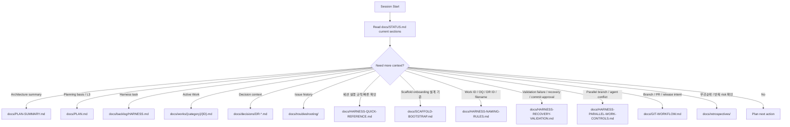
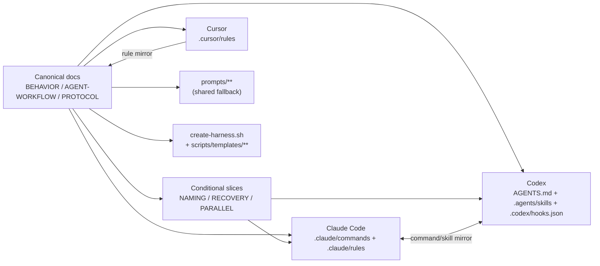
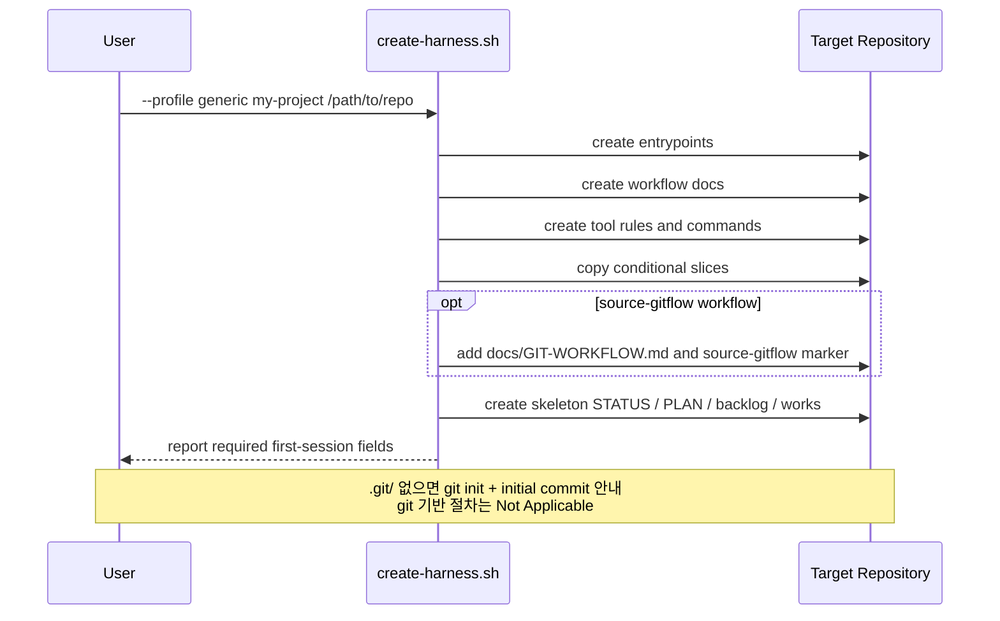
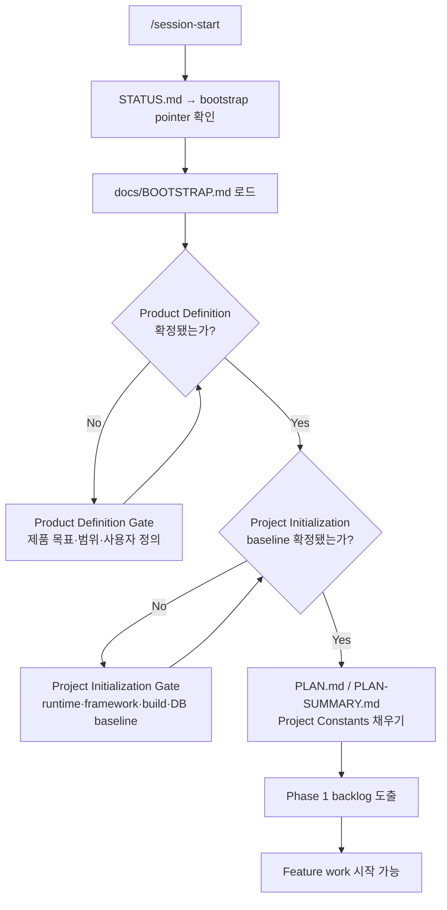
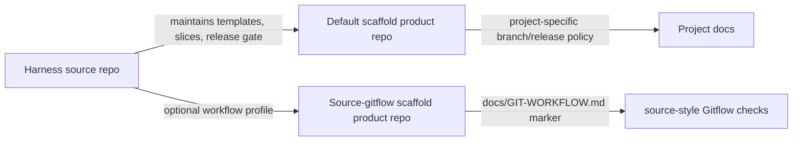
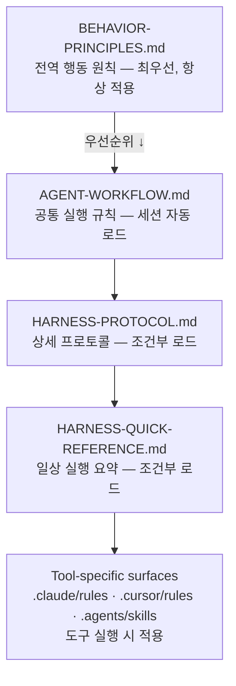
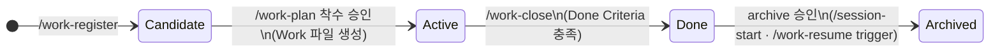

# HARNESS-ARCHITECTURE.md - AI Workflow Harness

> 기준: `docs/PLAN.md`, `docs/PLAN-SUMMARY.md`
> 목적: AI Workflow Harness의 현재 아키텍처와 정보 흐름을 시각화한다.

---

## 1. System Overview

## 2. Session Flow

핵심 규칙:

- `STATUS.md`는 dashboard다.
- Work 파일은 작업 단위 SSoT다.
- Approval Matrix는 실행, 상태 변경, commit을 승인 게이트로 제어한다.
- Validation 실패 시 FAIL/RECOVER로 전환한 뒤 다음 작업을 진행한다.

## 3. Context Routing

routing 규칙은 의도적으로 조건부로 설계되어 있다. 에이전트는 현재 작업에 필요하지 않은
archive, manual, 과거 문서를 일괄 로드하지 않는다.

## 4. Document Roles

| 파일 | 역할 |
| --- | --- |
| `docs/PLAN.md` | 장기 방향과 roadmap |
| `docs/PLAN-SUMMARY.md` | 경량 프로젝트 및 아키텍처 컨텍스트 |
| `docs/STATUS.md` | 현재 dashboard 및 Active Work pointer |
| `docs/works/**` | 작업 단위 plan, checkpoint, discovery, Done Criteria |
| `docs/backlog/HARNESS.md` | harness 개선 후보 및 보류 항목 |
| `docs/decisions/**` | 확정된 결정과 tradeoff |
| `docs/HARNESS-QUICK-REFERENCE.md` | 세션 실행 규칙 빠른 확인용 요약 (session start, cascade triggers, commit checklist, command taxonomy) |
| `docs/HARNESS-NAMING-RULES.md` | Work/OQ/DR ID, 파일명, branch slug 관련 조건부 naming 기준 |
| `docs/HARNESS-RECOVERY-VALIDATION.md` | failure, recovery, validation, commit approval 조건부 기준 |
| `docs/HARNESS-PARALLEL-WORK-CONTROLS.md` | 병렬 branch/agent 충돌, Work ID/DR 번호, STATUS/index 복구 기준 |
| `docs/GIT-WORKFLOW.md` | source repo Gitflow, release gate, commit format |
| `docs/BOOTSTRAP.md` | scaffolded product repo 첫 세션 입력 gate |
| `docs/SCAFFOLD-BOOTSTRAP.md` | scaffold onboarding 설계 기준 (source) |
| `docs/SCAFFOLD-ONBOARDING-GUIDE.md` | scaffold 사용자의 초기 adoption guide |
| `docs/HARNESS-MAINTAINER-GUIDE.md` | harness 유지보수 가이드 |
| `docs/WORKFLOW-MANUAL.md` | 사람이 읽는 workflow manual |
| `README.md` | public-facing quick start와 repo 소개 |
| `docs/retrospectives/**` | 리뷰 및 학습 산출물 |
| `docs/archive/**` | historical snapshot 및 완료 기록 |

## 5. Tool Surface Model

Canonical 문서가 동작을 정의한다. Tool-specific 파일은 해당 도구가 runtime에 실제로 필요한 부분만 mirror한다.
조건부 slice는 항상 로드되는 core 문서가 아니라, 해당 충돌·검증·naming 상황에서만 로드되는 policy surface다.

## 6. Scaffold Flow

### Script Execution

generic profile은 특정 프로그래밍 언어, framework, database, application runtime, source repo Gitflow를 가정하지 않는다.
source-gitflow workflow는 harness source repo와 동일한 feature -> develop -> main 운영 모델이 필요한 경우에만 선택한다.

### First Session Bootstrap Gate

Product Definition과 Project Initialization baseline이 비어 있으면 Phase 1 backlog를 도출하지 않는다.

## 7. Source Repo / Product Repo Boundary

source repo 규칙은 scaffold product repo에 무조건 적용되지 않는다. product repo는 기본적으로 project-specific branch/release policy를 따른다.
`source-gitflow` marker가 있는 scaffold에만 source-style branch isolation과 release gate를 적용한다.

## 8. Migration Boundary

harness를 기존 프로젝트에 overlay 적용한 경우, live 문서와 historical snapshot 간 경계를 명확히 한다.
현재 live 문서는 이 harness 기준으로 기술한다. Historical snapshot은 historical로 명확히 표시된 경우 이전 맥락을 유지할 수 있다.

## 9. Document Priority Hierarchy

충돌 시 상위 계층이 하위 계층을 override한다.
세션 시작 시 자동 로드되는 계층은 `BEHAVIOR-PRINCIPLES.md`와 `AGENT-WORKFLOW.md`다. 나머지는 조건부 로드다.

## 10. Work File Lifecycle

Work 파일은 `docs/works/{category}/`에서 생성·관리되고 완료 후 `docs/archive/docs/works/{category}/`로 이동한다.

| 상태 | 위치 | STATUS.md |
| --- | --- | --- |
| Candidate | `docs/backlog/**` | 없음 (ID 없음) |
| Active | `docs/works/{category}/` | Active Work pointer 있음 |
| Done | `docs/works/{category}/` | Active Work pointer 제거됨 |
| Archived | `docs/archive/docs/works/{category}/` | 없음 |
