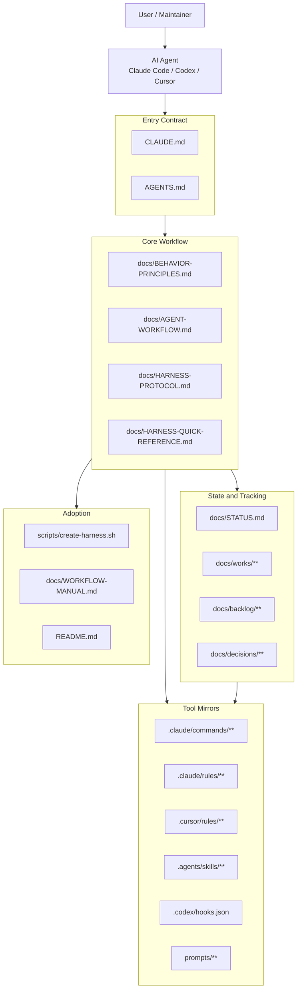
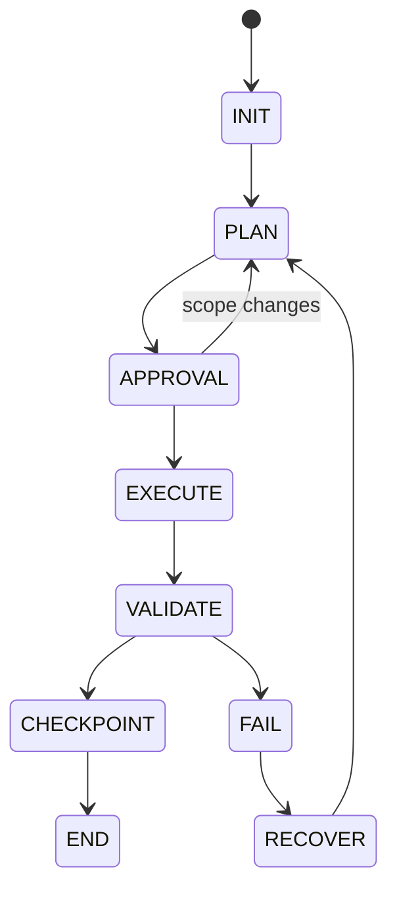
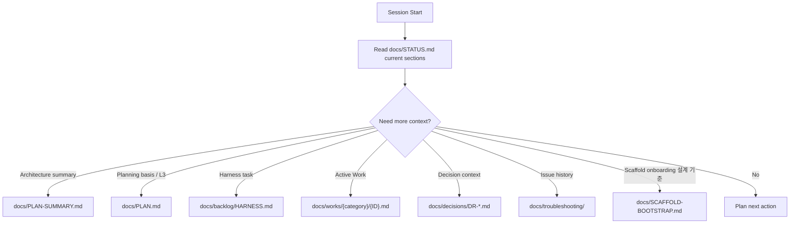
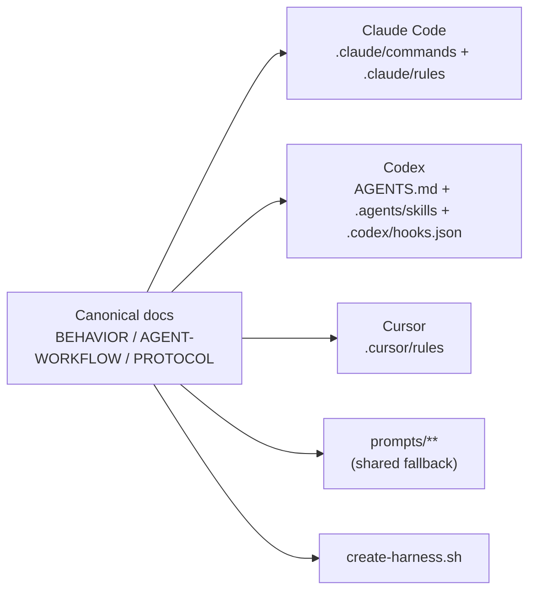
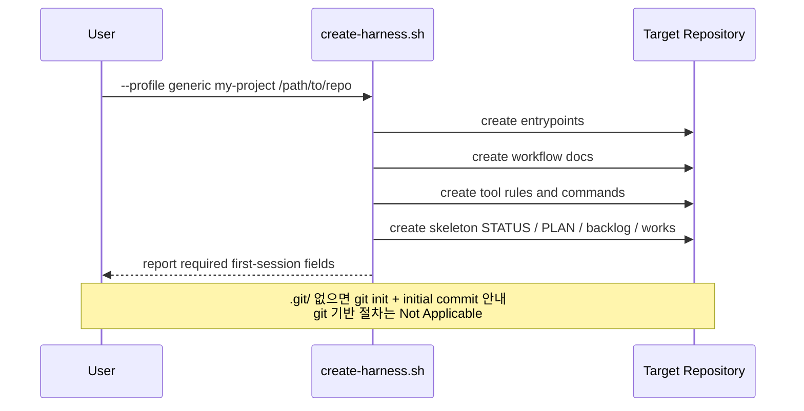
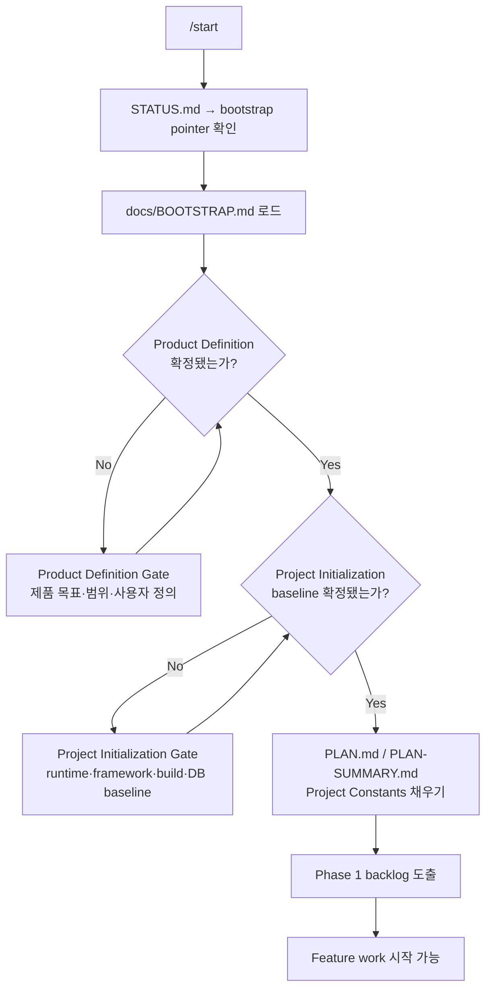

# HARNESS-STRUCTURE.md - AI Workflow Harness

> 기준: `docs/PLAN.md`, `docs/PLAN-SUMMARY.md`
> 목적: AI Workflow Harness의 현재 구조와 정보 흐름을 시각화한다.

---

## 1. System Overview

## 2. Session Flow

핵심 규칙:

- `STATUS.md`는 dashboard다.
- Work 파일은 작업 단위 SSoT다.
- Approval Matrix는 실행, 상태 변경, commit을 승인 게이트로 제어한다.
- Validation 실패 시 FAIL/RECOVER로 전환한 뒤 다음 작업을 진행한다.

## 3. Context Routing

routing 규칙은 의도적으로 조건부로 설계되어 있다. 에이전트는 현재 작업에 필요하지 않은
archive, manual, 과거 문서를 일괄 로드하지 않는다.

## 4. Document Roles

| 파일 | 역할 |
| --- | --- |
| `docs/PLAN.md` | 장기 방향과 roadmap |
| `docs/PLAN-SUMMARY.md` | 경량 프로젝트 및 아키텍처 컨텍스트 |
| `docs/STATUS.md` | 현재 dashboard 및 Active Work pointer |
| `docs/works/**` | 작업 단위 plan, checkpoint, discovery, Done Criteria |
| `docs/backlog/HARNESS.md` | harness 개선 후보 및 보류 항목 |
| `docs/decisions/**` | 확정된 결정과 tradeoff |
| `docs/SCAFFOLD-BOOTSTRAP.md` | scaffold onboarding 설계 기준 (source) |
| `docs/HARNESS-MAINTAINER-GUIDE.md` | harness 유지보수 가이드 |
| `docs/retrospectives/**` | 리뷰 및 학습 산출물 |
| `docs/archive/**` | historical snapshot 및 완료 기록 |

## 5. Tool Surface Model

Canonical 문서가 동작을 정의한다. Tool-specific 파일은 해당 도구가 runtime에 실제로 필요한 부분만 mirror한다.

## 6. Scaffold Flow

### Script Execution

generic profile은 특정 프로그래밍 언어, framework, database, application runtime을 가정하지 않는다.

### First Session Bootstrap Gate

Product Definition과 Project Initialization baseline이 비어 있으면 Phase 1 backlog를 도출하지 않는다.

## 7. Current Migration Boundary

`ai-workflow-harness`는 `base-msa-template`의 historical record를 보존하고 있다.
현재 live 문서는 harness project를 기준으로 기술해야 한다. Historical snapshot은
historical로 명확히 표시된 경우 product-template 맥락을 유지할 수 있다.
