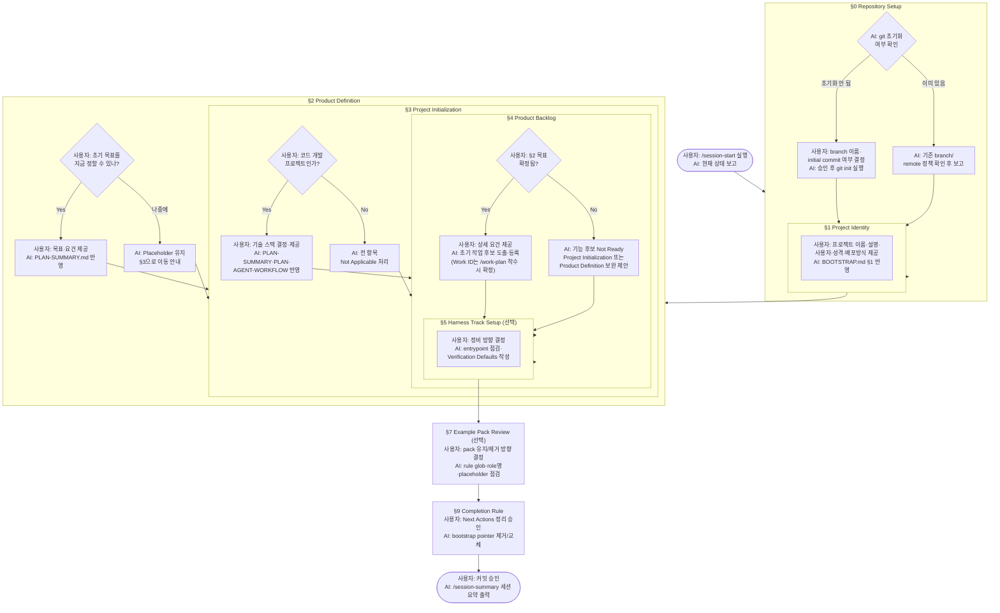

# Harness 온보딩 가이드

> 대상: 이 harness를 처음 사용하는 개발자
> 목표: scaffold 직후 첫 세션에서 프로젝트를 완전히 부팅하기
> 소요 시간: 30~60분 (프로젝트 규모와 결정 속도에 따라 다름)

---

## 목차

1. [개요](#1-개요)
2. [실제 생성되는 BOOTSTRAP.md 구조](#2-실제-생성되는-bootstrapmd-구조)
3. [첫 /session-start에서 보게 될 내용](#3-첫-session-start에서-보게-될-내용)
4. [도구별 첫 시작](#4-도구별-첫-시작)
5. [역할 분담](#5-역할-분담)
6. [사전 준비](#6-사전-준비)
7. [전체 흐름](#7-전체-흐름)
8. [§0 Repository Setup](#8-0-repository-setup)
9. [§1 Project Identity](#9-1-project-identity)
10. [§2 Product Definition](#10-2-product-definition)
11. [§3 Project Initialization](#11-3-project-initialization)
12. [§4 Product Backlog Derivation](#12-4-product-backlog-derivation)
13. [§5 Harness Track Setup](#13-5-harness-track-setup)
14. [온보딩 완료 체크리스트](#14-온보딩-완료-체크리스트)
15. [자주 묻는 질문](#15-자주-묻는-질문)
16. [빠른 참고 — 온보딩 명령 순서](#16-빠른-참고--온보딩-명령-순서)
17. [온보딩 후 첫 작업 착수](#17-온보딩-후-첫-작업-착수)

---

## 1. 개요

이 가이드는 `scripts/create-harness.sh`로 생성된 **target project**의 첫 온보딩을 다룬다.
`ai-workflow-harness` repository 자체를 clone한 경우에는 이 clone을 직접 project-local workspace로 전환하지 말고,
[README Apply The Harness To Your Project](../README.md#apply-the-harness-to-your-project)에 따라 별도 target directory에 scaffold를 생성한 뒤 그 프로젝트에서 온보딩을 진행한다.

Source repo(`ai-workflow-harness`)는 scaffold script, canonical workflow, migration note, maintainer 문서를 소유한다.
Target project는 생성된 `docs/BOOTSTRAP.md`, `docs/STATUS.md`, backlog, Work 파일을 채워 자기 프로젝트 상태를 소유한다.
`--workflow source-gitflow`를 명시하지 않는 한 source repo의 Gitflow/release gate가 target 기본값으로 강제되지 않는다.

이 harness는 AI 도구(Claude Code / Codex / Cursor)와 함께 프로젝트를 운영하기 위한 워크플로우 프레임워크다.
scaffold 직후에는 빈 껍데기 상태이므로, `docs/BOOTSTRAP.md`의 §0~§9를 순서대로 확인해야
AI가 프로젝트 맥락을 올바르게 파악하고 실제 작업에 착수할 수 있다.

**온보딩이 완료된 상태란:**
- AI가 "어떤 프로젝트인지", "어떤 기술을 쓰는지", "무엇을 먼저 해야 하는지"를 알고 있는 상태
- `docs/STATUS.md`에 실제 작업 후보가 등록되어 있는 상태
- `docs/STATUS.md` Next Actions의 scaffold bootstrap pointer가 제거되거나 다음 실제 작업으로 교체된 상태
- 다음 세션에서 `/session-start`를 실행하면 bootstrap 반복 없이 실제 작업 후보로 이어지는 상태

**중간에 잘못돼도 다시 시작할 수 있다.**
온보딩은 문서와 git 상태를 정리하는 과정이므로, 사용자가 승인하면 언제든 중단하거나 처음부터 다시 진행할 수 있다.
단, 되돌리는 방식은 현재 git 상태에 따라 다르다. AI에게 바로 파일을 지우라고 하지 말고, 먼저 현재 상태와 되돌릴 범위를 보고하게 한다.

```text
온보딩을 처음부터 다시 하고 싶어.
현재 git 상태, 변경된 onboarding 관련 파일, 커밋 여부를 먼저 확인해줘.
아직 파일을 수정하거나 되돌리지 말고, 다음 중 어떤 리셋 경로가 안전한지 제안해줘:
1. git 초기화 전/커밋 전 변경분 폐기 후 재온보딩
2. initial commit 이후 onboarding 변경 commit revert
3. scaffold를 새 디렉터리에 다시 생성한 뒤 필요한 내용만 이관
```

온보딩 완료 후 다시 부팅하고 싶을 때는 아래처럼 요청한다.

```text
온보딩을 완료했지만 방향을 바꾸고 싶어.
기존 결정과 backlog를 보존할 것, 되돌릴 것, 새로 정할 것을 분류해서 재온보딩 계획을 제안해줘.
docs/STATUS.md Next Actions에 bootstrap onboarding을 다시 올릴 필요가 있는지도 판단해줘.
아직 파일 수정은 하지 마.
```

---

## 2. 실제 생성되는 BOOTSTRAP.md 구조

scaffold 후 생성되는 `docs/BOOTSTRAP.md`는 아래 순서로 구성된다.
처음에는 이 전체 구조를 먼저 훑고, 실제 작성은 §0부터 순서대로 진행한다.

| Section | 목적 | 사용자가 결정할 것 | AI가 할 일 |
|---|---|---|---|
| §0 Repository Setup | git 사용 가능 상태 확인 | `git init` 여부, default branch, initial commit 여부 | 현재 git 상태 보고, 승인 후 명령 실행 또는 Not Applicable 처리 |
| §1 Project Identity | 프로젝트 신원 확정 | 이름, 한 줄 설명, 주요 사용자, production 성격, 배포 방식 | `BOOTSTRAP.md`, `PLAN-SUMMARY.md`, README 보정안 제안 |
| §2 Product Definition | 제품 목표와 성공 기준 확정 | 초기 목표, 첫 사용자 시나리오, 성공 기준 | `PLAN-SUMMARY.md` Project Summary와 `PLAN.md` 목표 반영 |
| §3 Project Initialization | 개발 baseline 확정 | Runtime, Framework, Build, package/module, DB, profiles, test strategy | Implementation Baseline, `PLAN.md`, Project Constants 반영 |
| §4 Product Backlog Derivation | Product track 후보 생성 | 요구사항, 우선순위, 착수 후보 | `PRODUCT.md` 후보와 Done Criteria/Verification 작성 |
| §5 Harness Track Setup | harness 자체 조정 분리 | entrypoint, rule, prompt 정비 방향 | `HARNESS.md` 후보 또는 state-change proposal 작성 |
| §6 Core Document Fill Order | 작성 순서 확인 | 어떤 문서를 먼저 채울지 승인 | 파일별 update 순서와 scope 제안 |
| §7 Example Pack Review | stack-specific pack 점검 | example pack 유지/정리 여부 | rule glob, prompt placeholder, role naming 점검 |
| §8 First Session Prompt | 첫 세션용 prompt 제공 | prompt에 넣을 프로젝트 정보 | 수정 전 계획 제안 |
| §9 Completion Rule | 온보딩 종료 조건 확인 | bootstrap pointer 제거/교체 승인 | `STATUS.md` Next Actions 정리 제안 |

핵심은 §0~§4로 Product track을 만들고, §5~§7로 harness 정비 항목을 분리한 뒤, §9에서 bootstrap pointer를 제거하거나 다음 실제 작업으로 교체하는 것이다.

---

## 3. 첫 /session-start에서 보게 될 내용

scaffold 직후 `docs/STATUS.md`에는 `Next Actions`가 이미 bootstrap onboarding을 가리킨다.
따라서 첫 `/session-start`는 clean idle로 끝나지 않고, `docs/BOOTSTRAP.md`를 후속으로 읽어야 한다고 안내하는 것이 정상이다.

예상되는 요약은 아래와 비슷하다.

```text
1. 결론

Active Work 없음. Blockers 없음.
Next Actions에 scaffold bootstrap onboarding이 있으므로 docs/BOOTSTRAP.md를 §0부터 채우는 것이 다음 단계입니다.

2. 현재 Active Work

없음.

3. Archive 대기 Work 파일

없음.

4. 다음으로 진행할 후보 작업

1. docs/BOOTSTRAP.md §0 Repository Setup
2. docs/BOOTSTRAP.md §1 Project Identity
3. docs/PLAN-SUMMARY.md Project Summary / Implementation Baseline
4. docs/backlog/PRODUCT.md 초기 후보 도출
5. docs/AGENT-WORKFLOW.md Project Constants와 Verification Defaults

5. 필요한 추가 문서

docs/BOOTSTRAP.md

6. 리스크와 확인 질문

git repository가 아직 초기화되지 않았을 수 있습니다.
먼저 git init 여부, default branch, initial commit 여부를 결정하세요.
```

이 출력 뒤에는 바로 구현으로 가지 말고, 생성된 `docs/BOOTSTRAP.md` §8의 canonical prompt를 그대로 복사해 사용한다.

```text
docs/BEHAVIOR-PRINCIPLES.md, docs/AGENT-WORKFLOW.md, docs/STATUS.md, docs/BOOTSTRAP.md를 읽어줘.

이 프로젝트를 scaffold 직후 부팅하려고 해.
다음 순서로 제안해줘:

1. 프로젝트 identity와 production 성격 확인 (§1)
2. Product Definition: 제품 목표, 주요 사용자, 성공 기준 (§2)
3. Project Initialization: PLAN-SUMMARY.md Implementation Baseline 결정 (§3, 코드 개발 프로젝트만)
4. Implementation Baseline이 비어 있으면 feature candidate 대신 Project Initialization을 첫 후보로 제안
5. Harness track 정비 항목, example pack 정비 필요 여부 (§5, §7)

파일 수정은 내 승인 전까지 하지 마.
```

---

## 4. 도구별 첫 시작

| 도구 | 시작 방법 | 첫 메시지 |
|---|---|---|
| Claude Code | project root에서 `claude` 실행 후 `/session-start` | `/session-start` |
| Codex 앱 | scaffold된 project root를 workspace로 열기 | `/session-start` intent: `AGENTS.md 기준으로 STATUS를 요약하고 bootstrap onboarding 흐름을 제안해줘.` |
| Codex CLI | project root에서 `codex` 실행 | `/session-start` 또는 같은 의미의 자연어 요청 |
| Cursor | project root를 열고 `prompts/cursor-session-start.md` 사용 | session-start prompt 붙여넣기 |

Codex 앱에서는 별도 `codex` 명령을 실행하지 않는다.
workspace root가 scaffold된 프로젝트 경로인지, 그 루트에 `AGENTS.md`와 `docs/STATUS.md`가 있는지만 확인하면 된다.

---

## 5. 역할 분담

온보딩 전반에서 **사용자**와 **AI**의 역할은 명확히 구분된다.

```
┌─────────────────────────────────┬─────────────────────────────────────┐
│           사용자 (You)           │              AI                     │
├─────────────────────────────────┼─────────────────────────────────────┤
│ 모든 결정을 내린다               │ 결정에 필요한 선택지를 제시한다      │
│ 정보를 제공한다                  │ 제공된 정보를 문서에 반영한다        │
│ AI의 계획·제안을 승인 또는 거부   │ 파일 수정 전 계획을 먼저 보고한다    │
│ 커밋 메시지를 최종 승인한다       │ 커밋 메시지를 제안하고 대기한다      │
│ 미결 사항(OQ)을 결정한다         │ OQ 등록을 제안하고 승인 후 반영한다  │
└─────────────────────────────────┴─────────────────────────────────────┘
```

> **핵심 원칙:** AI는 사용자의 승인 없이 파일을 수정하거나 커밋하지 않는다.

---

## 6. 사전 준비

온보딩을 시작하기 전에 아래 정보를 미리 정리해두면 세션이 훨씬 빠르게 진행된다.
모르거나 미정인 항목은 공란으로 두어도 된다. AI가 해당 섹션에서 다시 물어본다.

```
[ ] 프로젝트 이름과 한 줄 설명
[ ] 주요 사용자 (팀 내부 / 외부 고객 / 개발자 등)
[ ] 프로젝트 성격 (product / service / library / internal tool / research / content)
[ ] 배포 방식 (private / public / internal)
[ ] 초기에 달성하고 싶은 목표 (한 문장)
[ ] 기술 스택:
    - Language / Runtime (예: Java 21)
    - Framework         (예: Spring Boot 3.5)
    - Build tool        (예: Gradle)
    - Base package      (예: io.mycompany)
    - Module 구조       (단일 / 멀티 모듈)
    - 데이터 저장소     (예: MyBatis + PostgreSQL)
    - 환경 분리 방식    (예: local / dev / staging / prod)
    - 테스트 전략       (예: JUnit 5 + Mockito)
```

---

## 7. 전체 흐름

각 단계에서 사용자와 AI의 역할을 구분해서 표시했다.



---

## 8. §0 Repository Setup

**목적:** AI의 commit / PR / diff 기반 검증이 동작하려면 git이 필요하다.
**주체:** 사용자가 git 설정 방향을 결정하고, AI가 실행 계획과 커밋 대상을 제안한 뒤 승인받아 실행한다.

### 시나리오 A — git이 없는 신규 scaffold (가장 일반적)

사용자가 아래 세 가지를 결정해서 AI에게 알려주면 된다.

| 결정 항목 | 선택지 | 권장 |
|---|---|---|
| git init 실행 여부 | Yes / No | Yes |
| default branch 이름 | `main` / `master` | `main` |
| initial commit 생성 여부 | Yes / No | Yes |

**예시 대화:**

```
You: git init 해줘. branch는 main으로, initial commit도 바로 만들어줘.

AI : git init -b main을 실행하겠습니다.
     실행 후 커밋 대상 파일 목록과 아래 commit message를 제안합니다.
     ──────────────────────────────────────
     chore: harness scaffold 초기 커밋
     scaffold 생성 직후 초기 상태를 기록한다.
     ──────────────────────────────────────
     git init 실행과 initial commit을 각각 승인해 주세요.

You: git init 승인. 커밋 대상 확인 후 initial commit도 승인.
AI : [main (root-commit) abc1234] chore: harness scaffold 초기 커밋
```

> **Tip:** initial commit을 먼저 만들어두면 이후 변경분이 diff로 명확하게 보여 리뷰가 쉬워진다.

### 시나리오 B — git이 이미 있는 경우

AI가 먼저 현재 상태를 보고한 뒤 다음 단계로 안내한다.

```
AI : git이 이미 초기화되어 있습니다. 기존 상태를 확인합니다.
     - 현재 branch: main
     - remote: origin (https://github.com/org/repo)
     commit / PR 워크플로우 사용 가능합니다.
     §1 Project Identity로 이동합니다.
```

`--existing` overlay로 harness를 덮어씌운 경우, AI는 Gitflow를 강제하지 않고
사용자가 알려준 기존 branch 정책을 따른다.

### 시나리오 C — git 없이 진행하는 경우

commit / PR / `git diff` 기반 검증이 모두 **Not Applicable**로 처리된다.
AI는 문서 변경만으로 온보딩을 진행하며, git 설정은 나중에 언제든 추가할 수 있다.

---

## 9. §1 Project Identity

**목적:** 사용자가 프로젝트의 최소 신원 정보를 제공하면, AI가 `docs/BOOTSTRAP.md` §1 테이블에 반영한다.
**주체:** 사용자가 아래 항목을 결정해 AI에게 알려준다. AI는 물어보고 파일을 업데이트한다.

### 사용자가 제공할 항목

| 항목 | 설명 | 예시 |
|---|---|---|
| 한 줄 설명 | 프로젝트를 30자 이내로 설명 | `Spring Boot 기반 MSA 구축 프로젝트` |
| 주요 사용자 | 누가 이 프로젝트를 사용하나 | `프로젝트 팀`, `외부 고객`, `내부 개발자` |
| production 성격 | 프로젝트 유형 (아래 가이드 참조) | `product` |
| 배포 방식 | 어떻게 공개/배포되나 (아래 가이드 참조) | `private` |
| 핵심 성공 기준 | 완료 기준을 한 줄로 | `모든 핵심 API 구현 및 테스트 통과` |

### production 성격 선택 가이드

```
product        → 상용 서비스나 제품을 만드는 경우
service        → 특정 기능을 서비스로 운영하는 경우
library        → 다른 프로젝트가 가져다 쓰는 패키지/라이브러리
internal tool  → 팀 내부 자동화, 관리 도구
research       → 실험, 프로토타입, 개념 검증
content        → 문서, 블로그, 콘텐츠 사이트
               → ※ content/research는 §3 Project Initialization이 Not Applicable
```

### 배포 방식 선택 가이드

```
private   → 팀/조직 내부 전용, 비공개
public    → 오픈소스, 누구나 접근 가능
internal  → GitHub org 등 조직 내 공유
hosted    → SaaS 형태로 호스팅
package   → npm, Maven Central 등 패키지 레지스트리 배포
```

### 예시 대화

```
You: Spring Boot 기반 MSA 구축 프로젝트야.
     주요 사용자: 프로젝트 팀
     성격: product / 배포: private
     핵심 성공 기준: 모든 범위 구현

AI : 아래 내용으로 docs/BOOTSTRAP.md §1 테이블을 업데이트합니다.
     [테이블 미리보기 표시]
     진행할까요?

You: 응

AI : docs/BOOTSTRAP.md §1 업데이트 완료.
```

---

## 10. §2 Product Definition

**목적:** 사용자가 제품 초기 목표와 성공 기준을 확정하면, AI가 `docs/PLAN-SUMMARY.md`와 `docs/PLAN.md`에 반영한다.
**주체:** 목표 결정은 사용자. AI는 반영만 하고 목표 내용을 임의로 채우지 않는다.

> 이 단계가 비어 있으면 §4에서 기능 후보를 도출하지 않는다. Product Definition 보완 또는 Project Initialization을 먼저 제안한다.

### 사용자가 결정해야 할 항목

| 항목 | 설명 |
|---|---|
| 초기 목표 | 한 문장 — 초기 범위가 끝났을 때 무엇이 완성되는가 |
| 주요 사용자와 첫 시나리오 | 누가 처음 어떻게 쓰는가 |
| 핵심 성공 기준 | 검증 가능한 완료 조건 |

### 시나리오 A — 목표를 지금 정하는 경우 (권장)

사용자가 상세 요건을 AI에게 전달하면, AI가 §4 backlog까지 한 번에 도출한다.

**효과적인 입력 형식:**

```markdown
## 목표
- 즉시 활용 가능한 MSA 템플릿 구축

## 상세 요건
- Spring Security + JWT (Redis 연계, RBAC)
- MyBatis 기반 CRUD
- Gateway + user / auth / todo 서비스
- springdoc (Swagger) 문서화
- MDC 기반 로깅
- PostgreSQL
```

> **Tip:** 요건이 구체적일수록 AI가 도출하는 §4 backlog의 Done Criteria 품질이 높아진다.

**AI의 응답 패턴:**

```
AI : 요건을 분석해 아래 파일들을 업데이트합니다.
     - docs/PLAN-SUMMARY.md → Project Summary 업데이트
     - docs/PLAN.md         → 목표 섹션 작성
     - docs/BOOTSTRAP.md    → §2 체크박스 완료 처리
     계속 진행하면 §4 backlog 후보도 도출합니다.
```

### 시나리오 B — 목표를 나중에 채우는 경우

```
You: 초기 목표는 나중에 채울게. 일단 §3으로 넘어가자.

AI : 알겠습니다. §2 placeholder를 유지하고 §3 Project Initialization으로 이동합니다.
     기능 후보 도출은 목표 확정 후 /work-register로 추가할 수 있습니다.
```

---

## 11. §3 Project Initialization

**목적:** 사용자가 기술 스택을 결정해 AI에게 알려주면, AI가 관련 파일 4개를 동시에 업데이트한다.
**주체:** 기술 스택 결정은 사용자. AI는 결정 내용을 문서에 반영하고 Baseline이 비면 기능 후보를 "Not Ready"로 표시한다.

### 사용자가 결정할 항목 → AI가 문서에 반영

| 항목 | 설명 | 예시 |
|---|---|---|
| Runtime / Language | 언어와 버전 | `Java 21` |
| Framework / Library | 주요 프레임워크 | `Spring Boot 3.5` |
| Build tool | 빌드 시스템 | `Gradle` |
| Base package / Module | 최상위 패키지 경로 | `io.mycompany` |
| Module shape | 단일 vs 멀티 모듈 구조 | `단일 레포 멀티 모듈` |
| Data storage | DB / 캐시 | `MyBatis + PostgreSQL` |
| Profiles / Environments | 환경 분리 전략 | `local / dev / staging / prod` |
| Verification defaults | 테스트 전략 | `JUnit 5 + Mockito` |

### 가장 효율적인 입력 방식

한 번에 모든 항목을 답하면 AI가 4개 파일을 동시에 업데이트한다.

```
You: 21 / Spring Boot 3.5 / Gradle / io.mycompany
     단일 레포 멀티 모듈 / MyBatis + PostgreSQL
     조정 없음 / 기본

AI : 아래 파일 4개를 업데이트합니다.
     docs/PLAN-SUMMARY.md   → Implementation Baseline 표 (전 항목 Ready)
     docs/PLAN.md           → Stack Choices 표 + Readiness Checklist 완료
     docs/AGENT-WORKFLOW.md → Project Constants 업데이트
     docs/BOOTSTRAP.md      → §3 체크박스 완료 처리
     커밋 메시지를 제안합니다 → [승인 대기]
```

### 코드 개발이 없는 프로젝트 (content / research 등)

```
You: 이 프로젝트는 문서 사이트야. 코드 개발은 없어.

AI : §3 Project Initialization은 코드 개발 프로젝트에만 해당합니다.
     Implementation Baseline 전 항목을 Not Applicable로 처리하고 §4로 이동합니다.
     §4에서는 콘텐츠/문서 작업 후보를 등록합니다.
```

### DB 전략: 개발용 → 운영용 분리

처음부터 운영 DB를 구성하지 않아도 된다. 사용자가 단계별 전략을 결정하면 AI가 PLAN.md에 명시한다.

```
초기 개발  : H2 인메모리 (앱 기동 시 자동 초기화, 별도 설치 불필요)
로컬 통합  : Docker Compose로 PostgreSQL 기동
운영 환경  : 실제 PostgreSQL / RDS 등
```

Baseline에는 최종 목표(`PostgreSQL`)를 기록하고, 단계별 전략은 PLAN.md Stack Choices에 근거로 작성한다.

---

## 12. §4 Product Backlog Derivation

**목적:** 사용자가 요건을 제공하면 AI가 작업 후보를 도출해 `docs/backlog/PRODUCT.md`에 등록한다.
**주체:** 요건 제공과 후보 우선순위 결정은 사용자. 후보 작성(Done Criteria / Verification / Preconditions)은 AI.

### AI가 생성하는 항목 형식

```markdown
**[Project Initialization]** | Priority: P0 | Scope: 멀티 모듈 프로젝트 초기 구조 세팅
- Done Criteria: 루트 build.gradle 구성 완료, 각 모듈 빌드 성공
- Verification: ./gradlew build 전체 성공
- Preconditions: 없음
```

### 우선순위 기준 (사용자가 검토·조정)

```
P0  → 다른 모든 작업의 전제 조건 (Foundation) — 착수 순서 최우선
P1  → 핵심 기능 (Core)
P2  → 지원 인프라 (Supporting)
P3  → 확장 / 가이드 (Extended) — 나중에 진행해도 무방
```

### 의존 관계 구조 예시 (Spring Boot MSA 기준)

AI가 요건을 분석해 아래와 같은 의존 관계 구조로 backlog를 도출한다.

> **형식 참고**: 아래 `P1-NNN` 식별자는 legacy 형식 예시입니다. 실제 backlog 후보는 착수 전 Work ID 없이 제목/slug로 관리하고, Work ID는 `/work-plan` 착수 승인 시 확정합니다.

```
[P0] 멀티 모듈 구조 세팅               ← 모든 작업의 시작점
      └── [P0] H2 DB + DDL 설정
               ├── [P1] common-core 공통 모듈
               │         ├── [P1] Security + JWT + Redis
               │         │         ├── [P1] Gateway
               │         │         ├── [P1] auth 서비스
               │         │         ├── [P1] user 서비스
               │         │         └── [P1] todo 서비스
               │         └── [P2] env 기반 Config
               ├── [P2] Swagger (인증/인가 + API 그룹)
               ├── [P2] 서비스 간 연계 ← OQ-1 결정 후 착수
               ├── [P2] MDC 로깅
               └── [P2] API 테스트 파일

[P3] 프론트엔드 (가이드 샘플)
[P3] infra / scripts 구조
```

### 시나리오 A — §2 목표가 있는 경우

사용자가 상세 요건을 제공하면 AI가 전체 기능 후보를 도출한다.

```
You: [§2에서 작성한 목표·요건 전달]

AI : 요건을 분석해 backlog 후보를 도출합니다.
     각 항목에 Done Criteria, Verification, Preconditions를 작성합니다.
     OQ(미결 사항)가 있으면 STATUS.md 등록을 제안합니다 → [승인 대기]
     [결과물 미리보기] → 사용자 검토·승인 → 파일 반영
```

### 시나리오 B — §2 목표가 없는 경우

AI는 Product Definition 보완 항목을 먼저 제안한다.
코드 개발 baseline도 비어 있으면 `Project Initialization`을 첫 후보로 제안하고, 기능 후보는 사용자가 목표를 정한 뒤 `/work-register`로 추가한다.

```
AI : §2 목표가 확정되지 않아 기능 후보는 아직 Not Ready입니다.
     Implementation Baseline도 비어 있으므로 Project Initialization을 첫 후보로 제안합니다.
     기능 후보는 목표 확정 후 /work-register로 추가해주세요.
```

### Work 파일 생성 판단 기준

AI가 각 후보를 등록할 때 Work 파일 필요 여부를 함께 안내한다.
사용자가 최종 결정한다.

```
단순하고 명확한 작업     → backlog 항목만으로 충분
복잡하거나 여러 단계인 작업 → docs/works/product/FEAT-YYYYMMDD-NNN-topic.md 생성 권장
                           착수 시: /work-plan [title-or-slug]
```

Work 파일이 필요한 대표 케이스:
- Foundation 구조 설정 (Project Initialization)
- Security + 인증 구현
- 서비스 규모가 큰 경우
- 프론트엔드 (기술 스택 결정 포함)

---

## 13. §5 Harness Track Setup

**목적:** 사용자가 정비 방향을 결정하면 AI가 AI workflow 자체를 이 프로젝트에 맞게 정비한다.
**주체:** 정비 방향·범위 결정은 사용자. entrypoint 수정, Defaults 작성, 불필요 파일 제거는 AI.
선택 사항이지만 장기 운영 프로젝트라면 초기에 해두는 것이 좋다.

### 주요 점검 항목

| 항목 | 확인 주체 | 내용 |
|---|---|---|
| entrypoint 점검 | AI가 확인 후 사용자에게 보고 | `CLAUDE.md`, `AGENTS.md`가 프로젝트에 맞는지 |
| Verification Defaults | 사용자가 결정 → AI가 작성 | `docs/AGENT-WORKFLOW.md`에 검증 명령 기록 |
| example pack 정비 | 사용자가 방향 결정 → AI가 실행 | 불필요한 example rule/prompt 제거 또는 정리 |
| role 파일명 | AI가 검토 후 보고 → 사용자 승인 | 역할과 파일명 일치 여부 (backend 전용이 아니면 `role-backend` 지양) |

### Verification Defaults 예시 (사용자가 결정, AI가 문서에 반영)

```
Spring Boot 서비스 변경  : ./gradlew build && ./gradlew test
문서만 변경             : git diff --check, 링크 점검
설정 변경               : 앱 기동 후 /actuator/repo-health 확인
scaffold 변경           : bash -n scripts/create-harness.sh
```

---

## 14. 온보딩 완료 체크리스트

모든 항목이 체크되면 온보딩 완료 상태다.

```
[ ] §0 Repository Setup
    [ ] 사용자: git 설정 방향 결정
    [ ] 사용자: git init 실행 승인 또는 Not Applicable 결정
    [ ] 사용자: initial commit 여부 결정
    [ ] AI: diff summary + commit message 제안 후 승인받아 커밋 또는 보류

[ ] §1 Project Identity
    [ ] 사용자: 한 줄 설명, 사용자, 성격, 배포 방식, 성공 기준 제공
    [ ] AI: docs/BOOTSTRAP.md §1 테이블 반영

[ ] §2 Product Definition
    [ ] 사용자: 초기 목표 확정 (또는 나중에 결정)
    [ ] AI: docs/PLAN-SUMMARY.md Project Summary 업데이트

[ ] §3 Project Initialization
    [ ] 사용자: 기술 스택 8개 항목 결정
    [ ] AI: PLAN-SUMMARY.md / PLAN.md / AGENT-WORKFLOW.md / BOOTSTRAP.md 동시 반영

[ ] §4 Product Backlog
    [ ] 사용자: 상세 요건 제공 (또는 나중에 추가)
    [ ] AI: docs/backlog/PRODUCT.md 후보 등록 (Done Criteria, Verification, Preconditions 포함)
    [ ] AI: docs/STATUS.md Next Actions 업데이트, OQ 등록 제안 → 사용자 승인 후 반영

[ ] §5 Harness Track Setup
    [ ] 사용자: entrypoint/rule/prompt/example pack 정비 방향 결정
    [ ] AI: docs/backlog/HARNESS.md 후보 또는 보정 계획 제안

[ ] §7 Example Pack Review (선택 — example pack 포함 시 필수)
    [ ] 포함된 example pack이 실제 production 성격과 맞는지 확인
    [ ] rule glob이 실제 source path와 맞는지 확인
    [ ] role 파일명이 역할과 일치하는지 확인
    [ ] 불필요한 pack 제거 또는 docs/backlog/HARNESS.md에 등록

[ ] §9 Completion Rule
    [ ] AI: docs/STATUS.md Next Actions에서 scaffold bootstrap onboarding 항목 제거 또는 다음 실제 작업으로 교체 제안
    [ ] 사용자: STATUS.md 변경 승인

[ ] 커밋
    [ ] AI: diff summary + commit message 제안
    [ ] 사용자: 승인 후 커밋
```

---

## 15. 자주 묻는 질문

### Q. 섹션을 건너뛰어도 되나요?

§0~§3은 의존 관계가 있어 순서를 지키는 것이 좋다.
§2는 목표가 없어도 placeholder 상태로 §3으로 넘어갈 수 있다.
§5는 선택 사항으로 언제든 나중에 진행할 수 있다.

### Q. 도중에 결정을 바꿔도 되나요?

가능하다. 단, 사용자가 변경 내용과 이유를 AI에게 알려야
AI가 관련 파일들을 일관되게 업데이트한다.
기술 스택 변경(L3)은 반드시 AI에게 먼저 영향 범위 보고를 요청하고 사용자가 승인한다.

### Q. AI가 파일을 수정하기 전에 항상 물어보나요?

Approval Matrix 기준으로 다르다.

| 변경 유형 | AI의 동작 |
|---|---|
| 문서 내용 채우기 (L1) | 간단한 계획 보고 후 사용자 승인 → 실행 |
| STATUS.md Phase 목표 변경 (L3) | STATUS Update Proposal 제출 → 사용자 명시적 승인 후 실행 |
| 커밋 | 항상 diff summary + commit message 사용자 승인 후 실행 |

### Q. 미결 사항(Open Question)은 어떻게 관리하나요?

사용자가 결정하지 못한 항목이 생기면 AI가 `docs/STATUS.md` Blockers And Open Questions 등록을 제안하고, 사용자가 승인하면 반영한다.

```markdown
| ID                        | Status | Question               | Decision Needed   |
| FEAT-YYYYMMDD-NNN/OQ-1   | Open   | WebClient vs OpenFeign | 서비스 간 연계 착수 전 |
```

OQ ID는 Work 파일 내부에서 `OQ-1`, `OQ-2`처럼 Work-local로 부여한다. STATUS 등 외부에서 참조할 때는 `<WORK-ID>/OQ-1` 형식을 사용한다. Global sequential registry는 없다.

AI는 관련 backlog 항목의 Preconditions에 `OQ-N 결정 필요`를 명시한다.
사용자가 결정하면 해당 OQ를 Closed로 처리하고 관련 작업 착수를 안내한다.

### Q. 커밋은 섹션마다 해야 하나요?

사용자가 결정한다. 권장 패턴:

```
§0 완료              → 커밋 (initial commit)
§1 + §2 완료         → 커밋 (Project Identity + Product Definition)
§3 완료              → 커밋 (Implementation Baseline 확정)
§4 + §5 + §9 완료    → 커밋 (Backlog + Harness Setup + bootstrap pointer 제거)
```

변경 범위가 작으면 여러 섹션을 묶어서 커밋해도 된다.
AI는 항상 커밋 전에 diff summary와 commit message를 제안하고 사용자 승인을 기다린다.

---

## 16. 빠른 참고 — 온보딩 명령 순서

1. 사용하는 도구에서 scaffold된 project root를 연다.
2. `/session-start` 또는 `/session-start` intent로 현재 상태를 확인한다.
3. AI가 `docs/STATUS.md` Next Actions의 bootstrap onboarding을 보고하면, 생성된 `docs/BOOTSTRAP.md` §8 canonical prompt를 그대로 복사해 사용한다.

```text
docs/BEHAVIOR-PRINCIPLES.md, docs/AGENT-WORKFLOW.md, docs/STATUS.md, docs/BOOTSTRAP.md를 읽어줘.

이 프로젝트를 scaffold 직후 부팅하려고 해.
다음 순서로 제안해줘:

1. 프로젝트 identity와 production 성격 확인 (§1)
2. Product Definition: 제품 목표, 주요 사용자, 성공 기준 (§2)
3. Project Initialization: PLAN-SUMMARY.md Implementation Baseline 결정 (§3, 코드 개발 프로젝트만)
4. Implementation Baseline이 비어 있으면 feature candidate 대신 Project Initialization을 첫 후보로 제안
5. Harness track 정비 항목, example pack 정비 필요 여부 (§5, §7)

파일 수정은 내 승인 전까지 하지 마.
```

4. 각 섹션을 진행한다.
   - 사용자: 정보 제공 / 결정
   - AI: 파일 반영 계획 제안 / 승인 후 수정 / commit message 제안
   - 사용자: 승인 또는 조정 요청
5. 온보딩을 마치면 `docs/STATUS.md` Next Actions에서 bootstrap pointer를 제거하거나 다음 실제 작업으로 교체한다.
6. 세션 종료 시 `/session-summary` 또는 session summary intent로 검증 결과와 남은 리스크를 요약한다.

---

## 17. 온보딩 후 첫 작업 착수

```bash
# 다음 세션에서
/session-start          # AI가 STATUS.md 기반으로 현재 상태 보고

/work-plan [title-or-slug]    # 사용자가 착수할 작업 선택 (Work ID는 착수 승인 시 확정)
                # AI: Work 파일 생성 및 계획 제시 → 사용자 승인 → 실행
```

---

> 참고 문서:
> - `docs/BOOTSTRAP.md` — AI가 온보딩 시 사용하는 체크리스트 원본
> - `docs/HARNESS-QUICK-REFERENCE.md` — 세션 실행 규칙 요약
> - `skills/workflow/` — workflow command별 canonical 절차
> - `docs/WORKFLOW-MANUAL.md` — optional pack에 포함될 수 있는 전체 워크플로우 매뉴얼
> - `docs/AGENT-WORKFLOW.md` — 공통 운영 규칙 (Project Constants, Approval Matrix)
