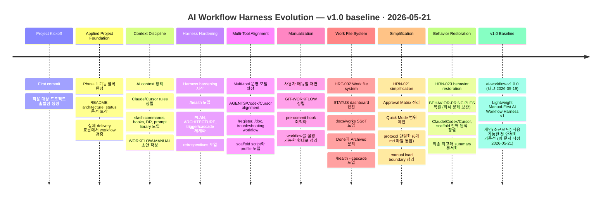
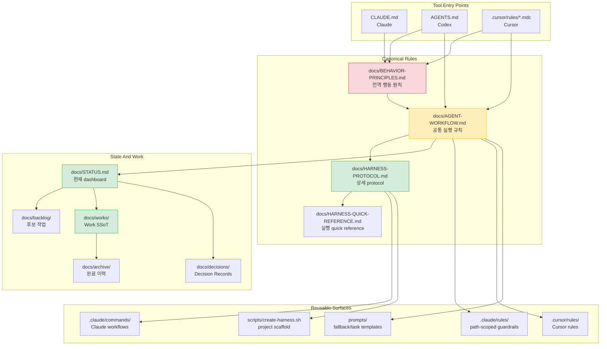
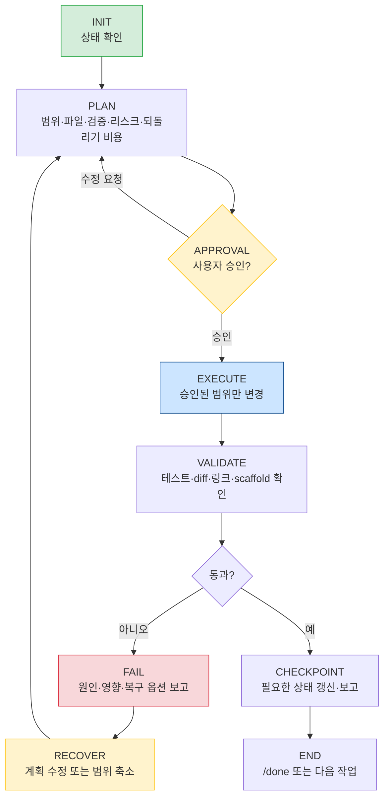
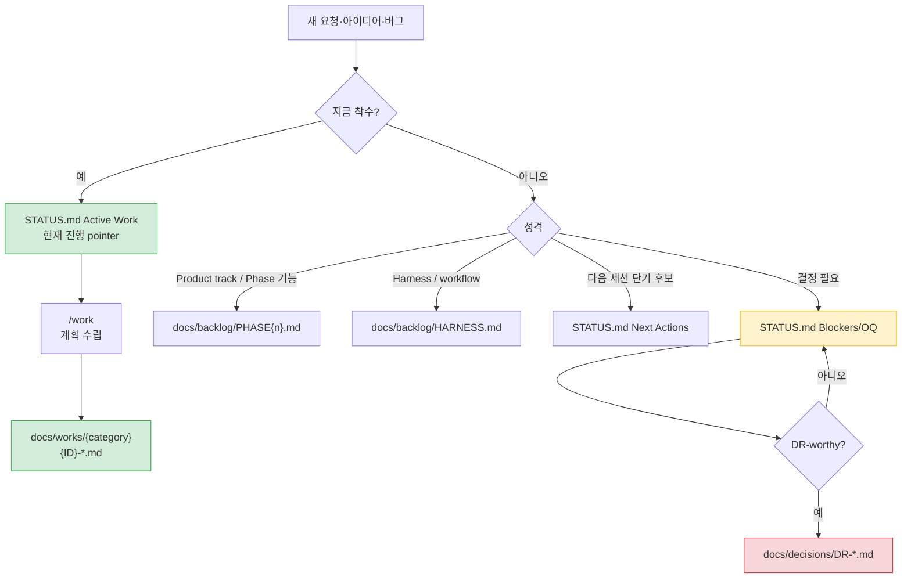
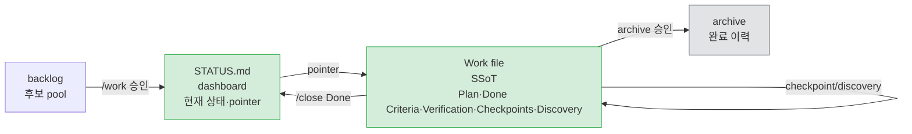
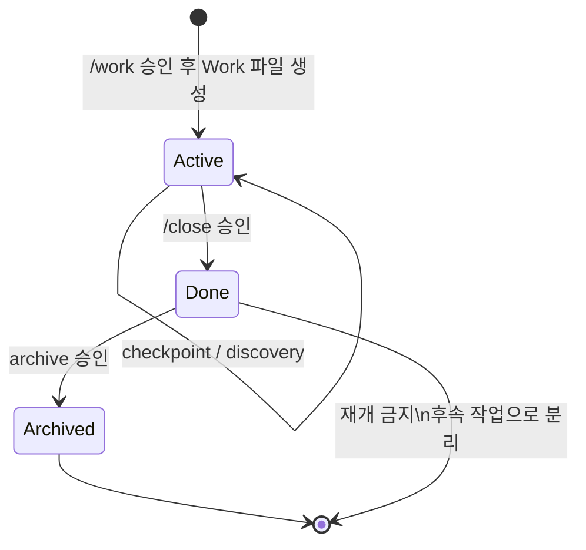
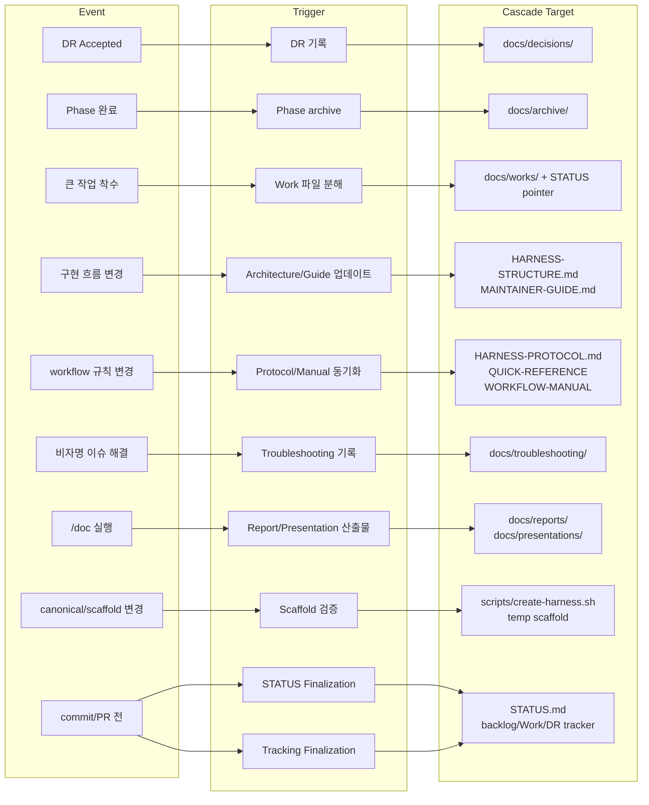

# AI Workflow Harness Summary

> **Lightweight Manual-First AI Workflow Harness v1**
> 
> 2026-05-21 · 박경서 <Kyungseo.Park@gmail.com> (Tag: `ai-workflow-v1.0.0` · Status: v1.0 baseline)

문서에 등장하는 `Harness`는 원래의 포괄적 의미보다는 AI-assisted workflow를 감싸는 lightweight operating harness를 뜻한다.
AI 세션을 감싸는 래퍼 역할을 하면서, STATUS로 상태를 추적하고 gate로 전체 흐름을 제어하는 것을 의미한다.

※ 이 문서는 public summary이며 실행 규칙의 원본이 아니다.
내용이 충돌하거나 더 구체적인 규칙이 필요하면 아래 문서를 우선한다.

1. `docs/BEHAVIOR-PRINCIPLES.md` — 전역 행동 원칙
2. `docs/AGENT-WORKFLOW.md` — 공통 실행 규칙
3. `docs/HARNESS-PROTOCOL.md` — 상세 protocol
4. `docs/WORKFLOW-MANUAL.md` — 사용자 매뉴얼

## Prologue. How This Workflow Was Built

> **Note** 이 문서는 Vibe Coding에 안착하기 위해 겪은 AI Workflow 구축에 대한 회고와 요약을 담는다.


### 동기

다음의 이유로 **목마른 사람이 우물을 팠다.**

- AI 트렌드를 반영하듯 YouTube에도 관련 콘텐츠가 넘쳐나지만 원론적인 이론에 단순한 예제만을 제시하는 경우가 대부분이다. 실사용 가능한 구체적 참조를 찾기가 쉽지 않았다.
- 물론 Prompt/Context/Harness Engineering과 관련하여 이미 수많은 스타로 빛나는 다수의 GitHub 저장소들도 존재하지만, 처음부터 갖다 쓰기보다는 우선 Vibe Coding을 통해 AI 도구들과 교감하고 흐름을 이해하는 선행 과정이 필요하다고 판단하였다.


### 목표

Claude Code, Codex는 강력하지만 context를 잘못 관리하면 세션마다 동일한 설명을 반복하거나, Claude가 승인 없이 범위를 넘는 작업을 수행하거나, 결정 사항이 사라지는 문제가 생긴다.

이러한 문제를 해결하기 위해 **Lightweight Manual-First AI Workflow**는 다음을 목표로 설계되었다.

- **Context 효율화**: 필요한 파일만 최소한으로 로드해서 token 낭비 방지
- **작업 추적성**: 모든 Active Work와 결정 사항을 문서에 유지
- **재현성**: 새 세션에서도 동일한 방식으로 작업을 이어갈 수 있음
- **안전성**: 위험한 작업은 항상 plan → 승인 → 구현 순서로 진행 (강제와 자율을 분리)

> **Note** `AI Workflow v1.0`은 다른 프로젝트에도 Scaffolding하여 재사용 가능하도록 초기부터 설계에 반영하였다. 
> 
> 또 하나의 특징으로는 단일 AI 도구를 대상으로 하지 않고 규칙, 맥락, 절차, 검증 등을 구조화해서 동일 프로젝트에 대해서 Claude와 Codex가 같은 방식으로 일하게 만든 것이다.

### 과정

Repo를 다음과 같이 **Two-Track**으로 구성하여 출발하였다.

- **AI Workflow** 구축: Harness 구축을 위한 메인 프로젝트
- **적용 대상 프로젝트** 구축: AI Workflow의 적용과 운영을 테스트하기 위한 부가 프로젝트

이 Workflow는 첫 commit 이후 한 번에 설계된 단순한 산출물이 아니다. 첫 commit 이후 현재까지 repository에는 **260여 개의 commit**이 쌓였다.

**여정 요약**



대다수의 변경은 단순한 문서 정리가 아니다. 
이 프로젝트는 Workflow를 설계하고 대상 Product에 실제로 적용하는 과정에서 발생하는 결함과 마찰을 발견하고 
그 마찰을 하나씩 repo-visible(가시적 해결)한 규칙과 문서 구조로 바꾸어 가며 성장한 것이다.
모든 commit은 **AI가 여러 세션에 걸쳐 안전하게 작업하기 위한 운영 체계**를 다듬는 데 쓰였다.

### 결과

많은 고민을 투영하고 수정하는 과정을 반복적으로 거치며, 이제 Claude Code와 Codex가 어느 정도 내가 의도한 방향으로 반응하고 있다.
애초에 가벼운 워크플로우를 목표로 하였기에 여기서 이 여정의 첫 안정화 기준선을 설정하면서 다음의 tag를 찍게 되었다.

```text
ai-workflow-v1.0.0 — Lightweight Manual-First AI Workflow Harness v1
```

이 tag가 가리키는 의미는 다음과 같이 요약할 수 있다.

- 전역 행동 원칙, 실행 규칙, 상세 protocol, 사용자 매뉴얼 등이 계층화되었다.
- Claude, Codex, Cursor, prompts, scaffold 등이 같은 핵심 계약을 참조한다.
- `STATUS.md`는 dashboard, `Work 파일`은 작업 단위 SSoT로 분리하여 관리된다.
- Approval Matrix로 scope, state update, commit gate 등이 하나의 기준으로 정리되었다.
- `/health --cascade`와 scaffold 검증으로 workflow 변경의 전파 범위를 점검할 수 있다.
- Multi Active Work 지원 — Work 파일 단위 SSoT로 컨텍스트를 분리하여 여러 작업을 병렬 추적할 수 있다.

> **Note** 기능을 확장하면서 복잡도는 다소 높아졌으나, 촘촘한 워크플로우를 확보하기 위한 필연적인 트레이드오프(Trade-off)로 판단하여 수용 가능한 수준으로 관리하였다.
> 
> 이 tag는 절대 "완벽한 workflow"를 의미하지 않는다. 하지만 product work와 workflow hardening을 병행하면서 얻은 크고 작은 지식의 압축본이기도 하다. 
> 아직 부족한 부분이 많지만 개인(또는 소규모 팀)이 실제 프로젝트에 적용을 시도해볼만한 **첫 번째 운영 가능 버전**을 의미한다.

### 계획

**AI Workflow 구축**의 여정은 여기서 멈추지 않고 지속 개선을 통해 버전 업데이트할 예정이다.
단, 이후 변경은 v1.0을 더 키우는 방향보다 실제 사용 중 발견된 반복 실패를 기준으로 작게 보정하여 최적화하는 방향으로 컨셉을 잡고 있다.

※ 장기적으로 v2.0까지 진행을 고려할 경우, 다음 사항들에 대한 우선 순위가 높다.

- Hook 강화를 통한 강제화(가드레일)/자동화
- 전문 역할을 가진 subagent 활용 체계 구축
- Harness config SSOT 도입 — 현재 여러 문서에 산재한 워크플로우 설정을 단일 config 파일로 통합
- Observability 확보 — token 소비, approval 빈도, scope drift 발생 횟수 등 운영 지표 측정 체계 구축

> **Note** 이 repository는 기존 적용 대상 프로젝트에서 분리되어 AI Workflow Harness 전용 project로 정리 중이다.
>
> 기존 Git history는 의도적으로 보존하며, public 전환 전 현재 tree의 identity와 공개 위험만 정리한다.

---

## 1. What This Harness Is

AI Workflow Harness는 AI 세션을 감싸는 운영 구조다.
목표는 AI가 빠르게 코드를 쓰는 것만이 아니라, **작업 상태, 승인 지점, 검증 결과, 결정 근거를 repo에 남겨 다음 세션과 다른 사용자·Agent가 이어받을 수 있게 하는 것**이다.

해결하려는 문제:

| Problem | Without Harness | With Harness |
| --- | --- | --- |
| Context 반복 설명 | 매 세션 다시 설명 | `STATUS.md`와 Work 파일로 복구 |
| Scope drift | AI가 선의로 범위 확장 | Approval Matrix로 중단 |
| 상태 소실 | 대화 기록에 의존 | repo-visible dashboard와 Work SSoT |
| 결정 근거 소실 | commit 또는 기억에 의존 | DR과 Recent Decisions로 보존 |
| 도구 전환 drift | Claude/Codex/Cursor가 다르게 행동 | 공통 원칙과 tool-specific 진입점 정렬 |

핵심 원칙:

- **Behavior Principles First** — 속도보다 신중함과 안정성.
- **Context Is Limited** — 필요한 파일만 읽는다.
- **Plan Before Implement** — 실행 전 범위, 파일, 검증, 리스크, 되돌리기 비용을 보고한다.
- **Approval Before Risk** — scope 확장, 상태 변경, commit은 gate를 통과한다.
- **Surgical Changes** — 요청된 최소 범위만 바꾼다.
- **State Is Repo-Visible** — 다음 Agent가 기억 없이 이어받을 수 있어야 한다.

---

## 2. Document Layers

Harness 문서는 역할별로 계층이 나뉜다.
평시에는 모든 문서를 읽지 않는다.



### User-Facing References

User-facing docs는 실행 surface가 아니라 설명, 회고, 이슈 복구를 위한 reference다.
평시 Agent reading path에는 포함하지 않고, 사용자가 매뉴얼 검토를 요청했거나 user-facing cascade가 필요할 때만 확인한다.

| Surface | Role | When To Check |
| --- | --- | --- |
| `docs/WORKFLOW-MANUAL.md` | 전체 사용자 매뉴얼 | 사용자-visible workflow 설명이 바뀔 때 |
| `docs/WORKFLOW-MANUAL-SUMMARY.md` | 핵심 요약본 | onboarding, release baseline, 핵심 설명이 바뀔 때 |
| `docs/retrospectives/` | 회고와 평가 이력 | workflow 개선 방향이나 반복 리스크를 검토할 때 |
| `docs/troubleshooting/` | 증상 → 원인 → 조치 기록 | 비자명 이슈를 해결했거나 과거 해결책을 찾을 때 |

### Load Rule

기본 세션 시작 시 읽는 것은 짧게(가볍게) 유지한다.

```text
BEHAVIOR-PRINCIPLES.md
AGENT-WORKFLOW.md
STATUS.md current sections
current Work file, only when relevant
```

조건이 없으면 `archive/`, 전체 `works/`, 전체 command/rule, 전체 manual을 읽지 않는다.

| Need | Load |
| --- | --- |
| 현재 상태 확인 | `docs/STATUS.md` current sections |
| Product track 후보 선택 | `docs/backlog/PHASE{n}.md` |
| harness/workflow 후보 선택 | `docs/backlog/HARNESS.md` |
| 진행 중인 큰 작업 재개 | 해당 `docs/works/{category}/{ID}-*.md` |
| 상세 workflow 판단 충돌 | `docs/HARNESS-PROTOCOL.md` 관련 섹션 |
| user-facing workflow 설명 변경 | `docs/WORKFLOW-MANUAL.md` 관련 섹션 |
| scaffold 영향 확인 | `scripts/create-harness.sh`와 temp scaffold |

---

## 3. Session Lifecycle

모든 작업은 같은 state machine을 따른다.



실행 흐름의 핵심:

1. `/start` 또는 intent recognition으로 현재 상태를 확인한다.
2. `/pick`, `/work`, `/resume`, `/debug` 중 맞는 흐름으로 진입한다.
3. Plan에는 Scope, Files, Verification, Risk, Reversal Cost를 포함한다.
4. 승인 후 실행한다.
5. 검증 실패 시 commit과 checkpoint를 만들지 않는다.
6. 완료 후 state update 필요 여부를 확인한다.
7. Work 완료는 `/close`, 세션 요약은 `/done`으로 분리한다.

---

## 4. Work Selection And Routing

새 작업은 먼저 위치를 정한다.
`STATUS.md`는 dashboard이고, 모든 후보를 담는 backlog가 아니다.



| Item | Location |
| --- | --- |
| 지금 하는 일 | `docs/STATUS.md` Active Work |
| Product track 후보 | `docs/backlog/PHASE{n}.md` |
| workflow/harness 후보 | `docs/backlog/HARNESS.md` |
| 큰 작업의 상세 계획 | `docs/works/{category}/{ID}-{topic}.md` |
| 결정 근거 | `docs/decisions/DR-*.md` |
| 완료 이력 | `docs/archive/` |

---

## 5. Approval Matrix

Approval Matrix는 실행 전 승인, 상태 변경 승인, commit 전 승인을 하나의 기준으로 묶는다.

| 변경 유형                         | 실행 전 | 상태 변경 | commit 전 |
|-------------------------------| --- | --- | --- |
| L1 Product track surface | 간단 plan 승인 후 실행. Work 파일 없이 Quick Mode 가능 | Work checkpoint/discovery는 승인 불필요, 실행 후 대상 Work ID와 변경 보고 | validation 결과, diff summary, 제안 commit message 보고 후 승인 |
| L2 harness/workflow surface 또는 설정 | 상세 plan 승인 후 실행. Work 파일 사용을 기본값으로 둔다 | Work Done과 STATUS Active pointer 변경은 대상 Work ID 명시 후 승인 | validation 결과, diff summary, 제안 commit message 보고 후 승인 |
| L3 아키텍처·인프라·DB·보안 구조          | 관련 계획 또는 `docs/PLAN.md` 확인, AS-IS/TO-BE와 rollback 포함 후 승인 | Phase/focus/criteria/Recent Decisions는 STATUS Update Proposal 승인 | validation 결과, diff summary, 제안 commit message, rollback 단위 보고 후 승인 |

Quick Mode는 Product track surface의 작고 명확한 L1 작업에 한정한다.
Harness/workflow surface(`entrypoint/workflow/protocol/command/rule/prompt/scaffold/status`)를 건드리면 기본 L2로 다룬다.

멀티 Active Work 환경에서는 모든 state-change proposal에 대상 Work ID를 명시한다. 각 Work는 독립 gate를 가진다.

AI가 반드시 멈춰야 하는 경우:

- 승인된 scope 밖 파일을 고쳐야 할 때
- `docs/STATUS.md` Active Work pointer를 추가·제거해야 할 때
- Work를 Done 처리해야 할 때
- commit하려 할 때
- validation 실패 후 복구 방향을 바꿔야 할 때

> **Note** Approval Matrix는 lifecycle 단계가 아니라, PLAN -> APPROVAL -> EXECUTE, state-change, commit gate 전반에 걸쳐 적용되는 cross-cutting control rule 이다.

---

## 6. STATUS And Work File Rules

`STATUS.md`와 Work 파일의 역할은 다르다.



### STATUS.md

현재 중심으로 상황판을 가볍게 유지한다.

| Section | Meaning | Rule |
| --- | --- | --- |
| Current State | 현재 phase와 주요 pointer | 자주 바꾸지 않는다 |
| Active Work | 현재 진행 중인 Work pointer | 상세 내용 금지 |
| Blockers/OQ | 진행을 막는 질문·결정 | 해소되면 Closed 또는 제거 |
| Recent Decisions | 최근 결정 digest | canonical 기록은 DR |
| Next Actions | 다음 세션 후보 | backlog가 아니다 |

### Work File Lifecycle



Backlog의 `Candidate`는 후보 pool이며 Work 파일 상태가 아니다.
착수 승인 후 생성되는 Work 파일은 `Active`에서 시작하고, 완료 후에는 `Done` 상태로 `docs/works/{category}/`에 남을 수 있다.
Archive 이동은 사용자 명시 승인 또는 `/start`·`/resume`에서 Done 항목 발견 후 승인된 경우에만 수행한다.

Work 파일 생성은 다음 조건 중 둘 이상이 맞거나 사용자가 요청할 때 제안한다.

- 3개 이상 독립 서브태스크
- 3개 이상 파일 또는 2개 이상 서비스·모듈
- 한 세션 내 완료 불확실
- L3 작업
- checkpoint 2개 이상 필요
- 다른 Agent에게 인계 가능성

`/close`와 `/done`은 다르다.

| Command | Purpose | Important Rule |
| --- | --- | --- |
| `/close` | Work Done 처리 | `status: Done`, `actual_end` 기입, Work 파일 Active→Done 업데이트, STATUS pointer 제거 제안 |
| `/done` | 세션 요약 | Work Done 처리 없음. 완료했다면 먼저 `/close` |

---

## 7. Command Map

Claude slash command는 Codex 역시 같은 의도로 수행한다. (Codex Command Mapping 정의)

| Command | Use When | Core Action |
| --- | --- | --- |
| `/start` | 세션 시작 | STATUS current sections 확인, 현재 상태와 후보 요약 |
| `/pick` | 다음 작업 선택 | product/harness backlog 비교 후 추천 |
| `/register` | 새 항목 등록 | urgent/product/harness/OQ/Next Actions 중 라우팅 |
| `/work {ID}` | 특정 작업 시작 | Work 파일 확인, risk 판단, plan 승인 대기 |
| `/resume {ID}` | 중단 작업 재개 | 실제 파일 상태 vs STATUS/Work drift 확인 |
| `/debug` | 오류 분석 | 원인 근거와 최소 수정 계획 |
| `/doc` | 발표·보고·review package | brief, source, format, quality bar 확인 |
| `/record-decision` | 결정 기록 | DR 초안 작성 |
| `/close` | Work 완료 | Done 처리와 선택적 archive |
| `/done` | 세션 마무리 | 변경·검증·리스크·다음 prompt 요약 |
| `/health` | workflow 점검 | 구조 위생, full 점검, cascade 감사 |

Health 체크 권장 cadence(주기):

| Health Mode | Use |
| --- | --- |
| `/health` | 주 1~2회 또는 작업 블록 시작 전 |
| `/health --full` | Phase 전환 전 또는 월 1회 |
| `/health --cascade` | workflow/process 문서 변경 후 |
| `/health --full --cascade` | 대형 harness 변경 후 최종 점검 |

---

## 8. Trigger And Cascade

Trigger는 AI가 자동 실행하는 명령이 아니라 **제안 조건**이다.
사용자 승인 전에는 파일을 바꾸지 않는다.

> T-번호는 `docs/HARNESS-PROTOCOL.md`의 trigger ID이며, deprecated된 trigger는 이 요약에서 생략된다.



가장 중요한 cascade 규칙:

- canonical workflow가 바뀌면 tool-specific, user-facing, scaffold surface를 함께 확인한다.
- command/rule/prompt/entrypoint가 바뀌면 Claude/Codex/Cursor alignment를 확인한다.
- `scripts/create-harness.sh` 또는 canonical workflow가 바뀌면 dry-run과 temp scaffold를 검증한다.
- commit 또는 PR 생성 전에는 STATUS Finalization(T15)과 Tracking Finalization(T16)으로 `docs/STATUS.md`, backlog, Work, DR tracker의 최종 반영 필요 여부를 판정한다.
- source 문서 오류를 `/doc` 산출물 작성 중 발견하면 즉시 섞어 고치지 말고 별도 작업으로 분리한다.

---

## 9. Git Flow

이 repository의 기본 branch 전략은 Gitflow다.
상세 절차와 예외는 `docs/GIT-WORKFLOW.md`를 SSoT로 둔다.

```text
main
 └── develop
      └── feature/*
```

핵심 규칙:

- feature 작업은 `develop` 기준으로 branch를 만든다. feature → develop 병합은 PR로만 한다
  (Regular merge 기본,WIP 커밋이 많아 히스토리가 지저분할 때만 Squash merge 허용).
- develop → main도 PR로 병합한다.
- main PR merge 후에는 `main`을 pull하고, `develop`에 `origin/main`을 merge한 뒤 push하여 develop을 동기화한다.
- commit 전에는 validation 결과, diff summary, 제안 commit message를 보고하고 별도 승인을 받는다.

---

## 10. New Project Adoption

새 프로젝트 또는 기존 프로젝트에 적용할 때는 `scripts/create-harness.sh`를 사용한다.
기본 profile은 framework를 가정하지 않는 `generic`이며, Spring Boot/MSA 보조 규칙이 필요할 때만 `--profile spring-boot`를 사용한다.

```bash
# 신규 프로젝트
scripts/create-harness.sh my-app
scripts/create-harness.sh --dry-run my-app

# 기존 프로젝트에 추가
scripts/create-harness.sh --existing my-app /path/to/existing-project
scripts/create-harness.sh --dry-run --existing my-app /path/to/existing-project

# Spring Boot/MSA 보조 규칙 포함
scripts/create-harness.sh --profile spring-boot my-app
scripts/create-harness.sh --existing --profile spring-boot my-app /path/to/existing-project
```

초기 세션에서 반드시 채워야 하는 파일:

| File | Fill With |
| --- | --- |
| `docs/STATUS.md` | 현재 phase, Active Work, OQ, Next Actions |
| `docs/PLAN-SUMMARY.md` | 기술 스택, 포트, 패키지·모듈 구조 |
| `docs/backlog/PHASE1.md` | 초기 product 작업 |
| `docs/backlog/HARNESS.md` | workflow/harness 후보 작업 |
| `docs/AGENT-WORKFLOW.md` | Project Constants, Verification Defaults |

기존 프로젝트에 적용할 때는 먼저 코드베이스를 읽고, 위 파일의 내용을 **제안**하게 한다.
승인 전 파일을 채우지 않는다.

---

## 11. Adoption Checklist

처음 적용하거나 팀에 공유할 때, 아래 항목을 점검하면 운영 리스크의 대부분을 사전에 차단할 수 있다.

- 모든 작업 항목이 `STATUS.md` 또는 backlog의 적절한 위치에 기록되어 있는가?
- 다음 Agent가 `STATUS.md`와 해당 Work 파일만으로 작업을 이어받을 수 있는가?
- 이번 변경의 Risk Level(L1·L2·L3)을 구분하고 그에 맞는 gate를 적용했는가?
- 실행 전 Scope, Files, Verification, Risk, Reversal Cost를 보고했는가?
- 승인된 scope를 벗어나면 즉시 멈추고 재승인을 받는가?
- Work 완료는 `/close`, 세션 마무리는 `/done`으로 구분하고 있는가?
- commit/PR 전에 STATUS·Tracking Finalization을 확인했는가?
- workflow 문서를 변경했다면 canonical·tool-specific·user-facing·scaffold surface를 cascade로 확인했는가?

---

*Source: `docs/WORKFLOW-MANUAL.md`*
