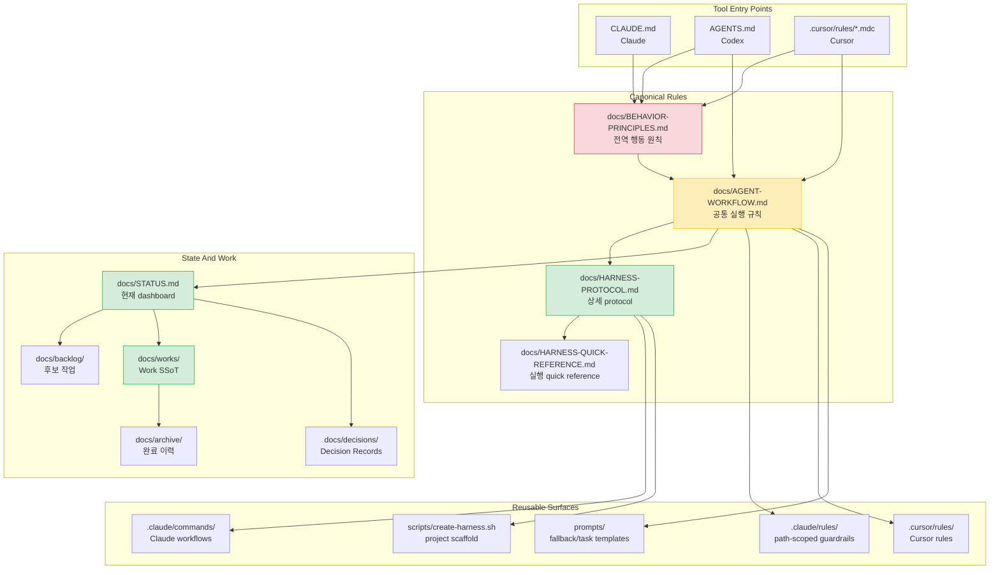
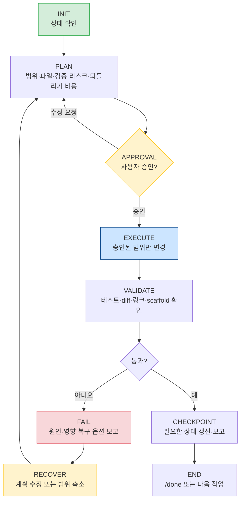
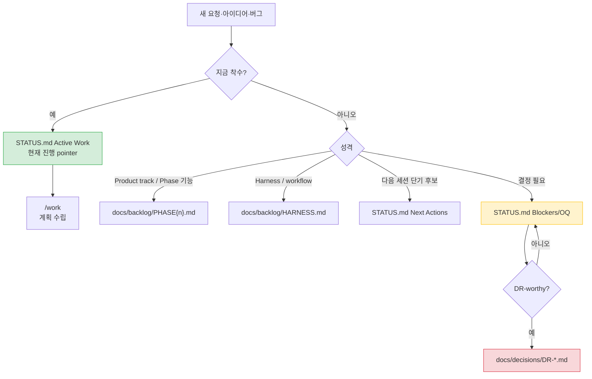
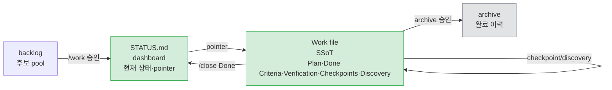
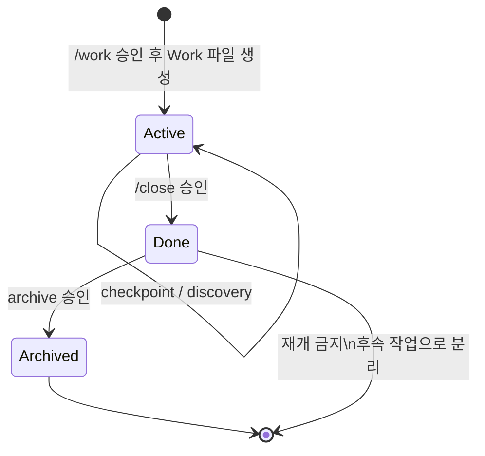
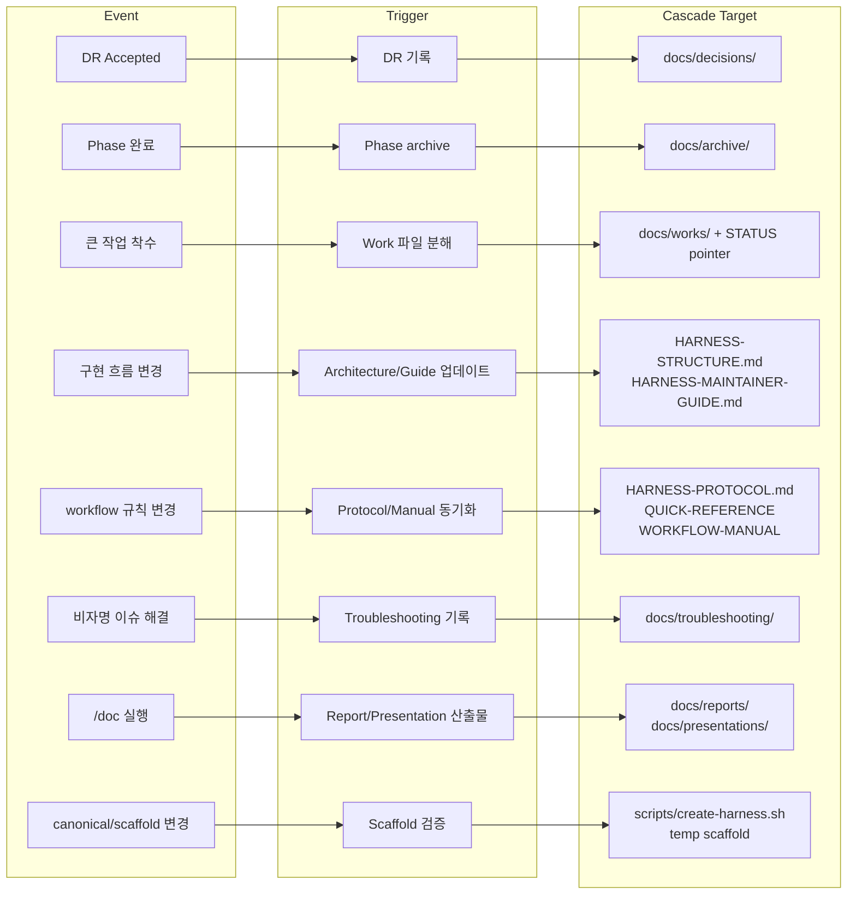
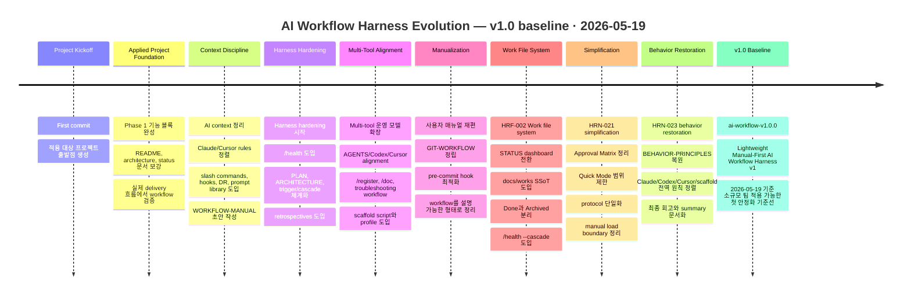
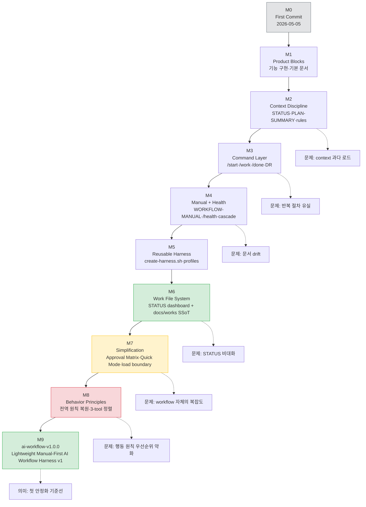

# AI Workflow Harness Summary

> **Lightweight Manual-First AI Workflow Harness v1**
> 2026-05-19 · 박경서 <Kyungseo.Park@gmail.com>
> Tag: `ai-workflow-v1.0.0` · Status: v1.0 baseline

`docs/WORKFLOW-MANUAL.md`의 핵심 요약본이다.
전체 매뉴얼은 사용자용 reference이고, 이 문서는 개인 / 소규모 팀을 기준으로 AI workflow v1.0을 빠르게 이해하고 적용·운영하기 위한 condensed guide다.

이 문서는 실행 규칙의 원본이 아니다.
규칙 우선순위는 다음을 따른다.

1. `docs/BEHAVIOR-PRINCIPLES.md` — 전역 행동 원칙
2. `docs/AGENT-WORKFLOW.md` — 공통 실행 규칙
3. `docs/HARNESS-PROTOCOL.md` — 상세 protocol
4. `docs/WORKFLOW-MANUAL.md` — 사용자 매뉴얼
5. 이 문서 — 핵심 요약본

---

## 1. What This Harness Is

AI Workflow Harness는 AI 세션을 감싸는 운영 구조다.
목표는 AI가 빠르게 코드를 쓰는 것만이 아니라, **작업 상태, 승인 지점, 검증 결과, 결정 근거를 repo에 남겨 다음 세션과 다른 사용자·Agent가 이어받을 수 있게 하는 것**이다.

해결하려는 문제:

| Problem | Without Harness | With Harness |
| --- | --- | --- |
| Context 반복 설명 | 매 세션 다시 설명 | `STATUS.md`와 Work 파일로 복구 |
| Scope drift | AI가 선의로 범위 확장 | Approval Matrix로 중단 |
| 상태 소실 | 대화 기록에 의존 | repo-visible dashboard와 Work SSoT |
| 결정 근거 소실 | commit 또는 기억에 의존 | DR과 Recent Decisions로 보존 |
| 도구 전환 drift | Claude/Codex/Cursor가 다르게 행동 | 공통 원칙과 tool-specific 진입점 정렬 |

핵심 원칙:

- **Behavior Principles First** — 속도보다 신중함과 안정성.
- **Context Is Limited** — 필요한 파일만 읽는다.
- **Plan Before Implement** — 실행 전 범위, 파일, 검증, 리스크, 되돌리기 비용을 보고한다.
- **Approval Before Risk** — scope 확장, 상태 변경, commit은 gate를 통과한다.
- **Surgical Changes** — 요청된 최소 범위만 바꾼다.
- **State Is Repo-Visible** — 다음 Agent가 기억 없이 이어받을 수 있어야 한다.

---

## 2. Document Layers

하네스 문서는 역할별로 계층이 나뉜다.
평시에는 모든 문서를 읽지 않는다.



### User-Facing References

User-facing docs는 실행 surface가 아니라 설명, 회고, 이슈 복구를 위한 reference다.
평시 Agent reading path에는 포함하지 않고, 사용자가 매뉴얼 검토를 요청했거나 user-facing cascade가 필요할 때만 확인한다.

| Surface | Role | When To Check |
| --- | --- | --- |
| `docs/WORKFLOW-MANUAL.md` | 전체 사용자 매뉴얼 | 사용자-visible workflow 설명이 바뀔 때 |
| `docs/WORKFLOW-MANUAL-SUMMARY.md` | 핵심 요약본 | onboarding, release baseline, 핵심 설명이 바뀔 때 |
| `docs/retrospectives/` | 회고와 평가 이력 | workflow 개선 방향이나 반복 리스크를 검토할 때 |
| `docs/troubleshooting/` | 증상 → 원인 → 조치 기록 | 비자명 이슈를 해결했거나 과거 해결책을 찾을 때 |

### Load Rule

기본 세션 시작 시 읽는 것은 짧다.

```text
BEHAVIOR-PRINCIPLES.md
AGENT-WORKFLOW.md
STATUS.md current sections
current Work file, only when relevant
```

조건이 없으면 `archive/`, 전체 `works/`, 전체 command/rule, 전체 manual을 읽지 않는다.

| Need | Load |
| --- | --- |
| 현재 상태 확인 | `docs/STATUS.md` current sections |
| Product track 후보 선택 | `docs/backlog/PHASE{n}.md` |
| harness/workflow 후보 선택 | `docs/backlog/HARNESS.md` |
| 진행 중인 큰 작업 재개 | 해당 `docs/works/{category}/{ID}-*.md` |
| 상세 workflow 판단 충돌 | `docs/HARNESS-PROTOCOL.md` 관련 섹션 |
| user-facing workflow 설명 변경 | `docs/WORKFLOW-MANUAL.md` 관련 섹션 |
| scaffold 영향 확인 | `scripts/create-harness.sh`와 temp scaffold |

---

## 3. Session Lifecycle

모든 작업은 같은 state machine을 따른다.



실행 흐름의 핵심:

1. `/start` 또는 intent recognition으로 현재 상태를 확인한다.
2. `/pick`, `/work`, `/resume`, `/debug` 중 맞는 흐름으로 진입한다.
3. Plan에는 Scope, Files, Verification, Risk, Reversal Cost를 포함한다.
4. 승인 후 실행한다.
5. 검증 실패 시 commit과 checkpoint를 만들지 않는다.
6. 완료 후 state update 필요 여부를 확인한다.
7. Work 완료는 `/close`, 세션 요약은 `/done`으로 분리한다.

---

## 4. Work Selection And Routing

새 작업은 먼저 위치를 정한다.
`STATUS.md`는 dashboard이고, 모든 후보를 담는 backlog가 아니다.

이 harness는 적용 대상 repository 안에서 두 트랙을 함께 운영한다.

| Track | Purpose | Primary Files |
| --- | --- | --- |
| Product track | 실제 제품/서비스/콘텐츠 work와 Phase backlog | `docs/backlog/PHASE{n}.md`, `docs/works/phase{n}/` |
| Harness track | AI workflow, command/rule, prompt, scaffold, process hardening | `docs/backlog/HARNESS.md`, `docs/works/harness/` |

이 repository를 harness 자체 개발용 source로 운영하는 경우 Product track이 비어 있을 수 있지만, scaffold된 프로젝트는 두 트랙을 모두 가진다.



| Item | Location |
| --- | --- |
| 지금 하는 일 | `docs/STATUS.md` Active Work |
| Product track 후보 | `docs/backlog/PHASE{n}.md` |
| workflow/harness 후보 | `docs/backlog/HARNESS.md` |
| 큰 작업의 상세 계획 | `docs/works/{category}/{ID}-{topic}.md` |
| 결정 근거 | `docs/decisions/DR-*.md` |
| 완료 이력 | `docs/archive/` |

---

## 5. Approval Matrix

Approval Matrix는 실행 전 승인, 상태 변경 승인, commit 전 승인을 하나의 기준으로 묶는다.

| 변경 유형 | 실행 전 | 상태 변경 | commit 전 |
| --- | --- | --- | --- |
| L1 Product track surface | 간단 plan 승인. Quick Mode 가능 | Work checkpoint/discovery는 승인 불필요, 실행 후 보고 | validation, diff summary, commit message 보고 후 승인 |
| L2 harness/workflow surface 또는 설정 | 상세 plan 승인. Work 파일 기본 | Work Done과 STATUS Active pointer 변경은 대상 Work ID 명시 후 승인 | validation, diff summary, commit message 보고 후 승인 |
| L3 아키텍처·인프라·DB·보안 구조 | AS-IS/TO-BE와 rollback 포함 후 승인 | Phase/focus/criteria/Recent Decisions는 STATUS Update Proposal 승인 | validation, diff summary, commit message, rollback 단위 보고 후 승인 |

반드시 멈춰야 하는 경우:

- 승인된 scope 밖 파일을 고쳐야 할 때
- `docs/STATUS.md` Active Work pointer를 추가·제거해야 할 때
- Work를 Done 처리해야 할 때
- commit하려 할 때
- validation 실패 후 복구 방향을 바꿔야 할 때

---

## 6. STATUS And Work File Rules

`STATUS.md`와 Work 파일의 역할은 다르다.



### STATUS.md

짧고 현재 중심으로 유지한다.

| Section | Meaning | Rule |
| --- | --- | --- |
| Current State | 현재 phase와 주요 pointer | 자주 바꾸지 않는다 |
| Active Work | 현재 진행 중인 Work pointer | 상세 내용 금지 |
| Blockers/OQ | 진행을 막는 질문·결정 | 해소되면 Closed 또는 제거 |
| Recent Decisions | 최근 결정 digest | canonical 기록은 DR |
| Next Actions | 다음 세션 후보 | backlog가 아니다 |

### Work File Lifecycle



Work 파일 생성은 다음 조건 중 둘 이상이 맞거나 사용자가 요청할 때 제안한다.

- 3개 이상 독립 서브태스크
- 3개 이상 파일 또는 2개 이상 서비스·모듈
- 한 세션 내 완료 불확실
- L3 작업
- checkpoint 2개 이상 필요
- 다른 Agent에게 인계 가능성

`/close`와 `/done`은 다르다.

| Command | Purpose | Important Rule |
| --- | --- | --- |
| `/close` | Work Done 처리 | `status: Done`, `actual_end`, README Active→Done, STATUS pointer 제거 제안 |
| `/done` | 세션 요약 | Work Done 처리 없음. 완료했다면 먼저 `/close` |

---

## 7. Command Map

Claude slash command는 Codex/Cursor에서도 같은 의도로 수동 수행한다.

| Command | Use When | Core Action |
| --- | --- | --- |
| `/start` | 세션 시작 | STATUS current sections 확인, 현재 상태와 후보 요약 |
| `/pick` | 다음 작업 선택 | product/harness backlog 비교 후 추천 |
| `/register` | 새 항목 등록 | urgent/product/harness/OQ/Next Actions 중 라우팅 |
| `/work {ID}` | 특정 작업 시작 | Work 파일 확인, risk 판단, plan 승인 대기 |
| `/resume {ID}` | 중단 작업 재개 | 실제 파일 상태 vs STATUS/Work drift 확인 |
| `/debug` | 오류 분석 | 원인 근거와 최소 수정 계획 |
| `/doc` | 발표·보고·review package | brief, source, format, quality bar 확인 |
| `/record-decision` | 결정 기록 | DR 초안 작성 |
| `/close` | Work 완료 | Done 처리와 선택적 archive |
| `/done` | 세션 마무리 | 변경·검증·리스크·다음 prompt 요약 |
| `/health` | workflow 점검 | 구조 위생, full 점검, cascade 감사 |

권장 cadence:

| Health Mode | Use |
| --- | --- |
| `/health` | 주 1~2회 또는 작업 블록 시작 전 |
| `/health --full` | Phase 전환 전 또는 월 1회 |
| `/health --cascade` | workflow/process 문서 변경 후 |
| `/health --full --cascade` | 대형 harness 변경 후 최종 점검 |

---

## 8. Trigger And Cascade

Trigger는 AI가 자동 실행하는 명령이 아니라 **제안 조건**이다.
사용자 승인 전에는 파일을 바꾸지 않는다.



가장 중요한 cascade 규칙:

- canonical workflow가 바뀌면 tool-specific, user-facing, scaffold surface를 함께 확인한다.
- command/rule/prompt/entrypoint가 바뀌면 Claude/Codex/Cursor alignment를 확인한다.
- `scripts/create-harness.sh` 또는 canonical workflow가 바뀌면 dry-run과 temp scaffold를 검증한다.
- source 문서 오류를 `/doc` 산출물 작성 중 발견하면 즉시 섞어 고치지 말고 별도 작업으로 분리한다.

---

## 9. New Project Adoption

새 프로젝트 또는 기존 프로젝트에 적용할 때는 `scripts/create-harness.sh`를 사용한다.

```bash
# 신규 프로젝트
scripts/create-harness.sh my-app
scripts/create-harness.sh --dry-run my-app

# 기존 프로젝트에 추가
scripts/create-harness.sh --existing my-app /path/to/existing-project
scripts/create-harness.sh --dry-run --existing my-app /path/to/existing-project

# Spring Boot/MSA 보조 규칙 포함
scripts/create-harness.sh --profile spring-boot my-app
scripts/create-harness.sh --existing --profile spring-boot my-app /path/to/existing-project
```

초기 세션에서 반드시 채워야 하는 파일:

| File | Fill With |
| --- | --- |
| `docs/STATUS.md` | 현재 phase, Active Work, OQ, Next Actions |
| `docs/PLAN-SUMMARY.md` | project summary, core architecture, validation defaults |
| `docs/backlog/PHASE1.md` | 초기 Product track 작업 |
| `docs/backlog/HARNESS.md` | workflow/harness 후보 작업 |
| `docs/AGENT-WORKFLOW.md` | Project Constants, Verification Defaults |

기존 프로젝트에 적용할 때는 먼저 코드베이스를 읽고, 위 파일의 내용을 **제안**하게 한다.
승인 전 파일을 채우지 않는다.

---

## 10. Operating Rules For Small Teams

소규모 팀에서 이 workflow가 잘 작동하려면 문서가 아니라 습관이 되어야 한다.

권장 운영:

- 30분 이내 onboarding으로 이 요약본과 `HARNESS-QUICK-REFERENCE.md`를 함께 읽는다.
- workflow steward를 1명 지정하거나 sprint마다 rotating owner를 둔다.
- Product track 작업은 Quick Mode로 빠르게 닫고, workflow 변경은 L2 cascade로 다룬다.
- 회고는 실행 규칙으로 즉시 승격하지 않는다.
- 새 규칙은 반복 실패 3회 이상 또는 high-impact incident가 있을 때만 검토한다.

팀이 매번 확인할 질문:

| Question | Good Answer |
| --- | --- |
| 지금 하는 일이 어디에 기록되는가? | STATUS Active Work 또는 backlog |
| 다음 Agent가 이어받을 수 있는가? | Work 파일 또는 STATUS에 pointer 존재 |
| 승인 없이 scope가 늘었는가? | 늘었다면 멈추고 재승인 |
| 검증 기준이 명확한가? | 테스트, diff, 링크, scaffold 중 하나 이상 |
| 완료와 세션 종료를 구분했는가? | Work 완료는 `/close`, 세션 종료는 `/done` |

---

## 11. Quick Checklist

작업 시작:

- [ ] `BEHAVIOR-PRINCIPLES.md`, `AGENT-WORKFLOW.md`, `STATUS.md` current sections 확인
- [ ] 작업 위치 결정: Active Work / backlog / OQ / Next Actions
- [ ] Scope, Files, Verification, Risk, Reversal Cost 보고
- [ ] 승인 후 실행

작업 중:

- [ ] 승인된 scope 밖으로 나가면 멈춤
- [ ] 실패하면 FAIL report 후 복구 방향 승인
- [ ] Work checkpoint/discovery는 실행 후 대상 Work ID와 함께 보고

작업 완료:

- [ ] validation 실행 또는 미실행 사유 보고
- [ ] state update 필요 여부 확인
- [ ] Work 완료라면 `/close`
- [ ] 세션 종료라면 `/done`
- [ ] commit 전 validation, diff summary, proposed commit message 보고 후 승인

workflow 변경:

- [ ] canonical 변경 여부 확인
- [ ] tool-specific 변경 필요 확인
- [ ] user-facing manual/summary 변경 필요 확인
- [ ] scaffold 영향 확인
- [ ] 필요한 경우 dry-run과 temp scaffold 검증

---

## 12. What Not To Do

- 매 세션마다 모든 문서를 읽지 않는다.
- `STATUS.md`를 상세 작업 로그로 만들지 않는다.
- Work 파일 없이 L2/L3 큰 작업을 장기 진행하지 않는다.
- `/done`으로 Work 완료 처리를 대신하지 않는다.
- workflow 변경 후 scaffold 영향을 추측으로 넘기지 않는다.
- 회고 문서를 즉시 실행 규칙으로 승격하지 않는다.
- 단순 Product track 작업에 `/health --cascade`를 끌고 오지 않는다.

---

## Appendix A. How This Workflow Was Built

이 workflow는 첫 commit 이후 한 번에 설계된 산출물이 아니다.
제품 코드를 만들다가 AI 세션 운영의 마찰을 발견했고, 그 마찰을 하나씩 repo-visible한 규칙과 문서 구조로 바꾸며 성장했다.

2026-05-05 첫 commit 이후 2026-05-19 현재까지 repository에는 **230개의 commit**이 쌓였다.
그중 상당수는 단순 문서 정리가 아니라 **AI가 여러 세션과 여러 도구를 넘나들며 안전하게 작업하기 위한 운영 체계**를 다듬는 데 쓰였다.

이 여정의 첫 안정화 기준선을 설정하면서 다음 tag를 찍는다.

```text
ai-workflow-v1.0.0 — Lightweight Manual-First AI Workflow Harness v1
```

이 tag는 "완벽한 workflow"가 아니라, 개인 또는 소규모 팀이 실제 프로젝트에 적용해볼 수 있는 **첫 번째 운영 가능 버전**을 의미한다.
이 여정은 여기서 멈추지 않고 지속적 개선을 통해 버전업할 예정이다.
단, 이후 변경은 v1.0을 더 키우는 방향보다, 실제 사용 중 발견된 반복 실패를 기준으로 작게 보정하는 방향이어야 한다.

### Journey In One Picture



### Narrative Summary

#### 1. Product First

처음 repository는 Spring Boot MSA template을 구현하는 product project였다.
초기 commit들은 기능 블록, Docker, Gradle, Swagger, refresh token, logging, architecture/status 문서 보강에 집중했다.

이 단계의 문제는 AI workflow 자체가 아니라 product delivery였다.
하지만 반복 작업이 늘어나면서 "세션마다 무엇을 읽어야 하는가", "현재 상태를 어디에 남기는가", "AI가 범위를 넓힐 때 어디서 멈추는가"가 점점 중요한 문제가 되었다.

#### 2. Context Discipline

첫 번째 큰 전환은 context 관리였다.
AI에게 모든 문서를 읽히는 방식은 느리고 부정확했다.
그래서 `STATUS.md`, `PLAN-SUMMARY.md`, prompt library, `.claude/rules/`, Cursor rules를 정비하면서 **필요한 문서만 조건부로 읽는 방식**이 생겼다.

이때부터 workflow의 핵심 질문은 "무엇을 더 읽을까?"가 아니라 **"읽지 않아도 되는 것은 무엇인가?"**로 바뀌었다.

#### 3. Command And Decision Layer

다음 단계에서는 반복되는 운영 행동을 command로 고정했다.
`/start`, `/pick`, `/work`, `/resume`, `/debug`, `/done`, `/health`, `/record-decision` 같은 흐름이 생기면서 AI 세션은 자유 대화가 아니라 재현 가능한 절차가 되었다.

DR도 이때 중요해졌다.
결정은 대화 속에 사라지지 않고 `docs/decisions/DR-*.md`로 남게 되었고, `Recent Decisions`는 영구 기록이 아니라 세션 복구용 digest로 역할이 좁혀졌다.

#### 4. Manual And Cascade

workflow가 커지자 사용자가 이해할 수 있는 manual이 필요해졌다.
`WORKFLOW-MANUAL.md`는 단순 명령 설명서가 아니라, directory structure, document hierarchy, context loading, trigger, cascade, 신규 프로젝트 적용법을 담는 종합 가이드가 되었다.

동시에 중요한 깨달음이 생겼다.
canonical 문서만 바꿔서는 workflow가 바뀌지 않는다.
Claude command, Codex entrypoint, Cursor rule, prompt, user manual, scaffold까지 함께 맞아야 실제로 작동한다.
이것이 cascade 사고의 출발점이다.

#### 5. Reusable Harness

`scripts/create-harness.sh`가 생기면서 이 구조는 현재 repository 전용 운영법을 넘어 재사용 가능한 harness가 되었다.
`generic` profile과 `spring-boot` profile이 분리되었고, 신규 프로젝트와 기존 프로젝트 overlay 흐름도 나뉘었다.

이 단계부터 목표가 "내가 잘 쓰는 규칙"에서 **소규모 팀이 다른 프로젝트에 복제할 수 있는 운영 모델**로 바뀌었다.

#### 6. Work File System

가장 큰 구조 변화는 HRF-002였다.
`STATUS.md`가 너무 많은 책임을 지고 있었고, 긴 작업의 계획·검증·checkpoint·discovery를 담기에는 무거워졌다.

그래서 `docs/works/{category}/{ID}-{topic}.md`가 작업 단위 SSoT로 도입되었다.
`STATUS.md`는 현재 pointer만 가진 dashboard가 되었고, Work 파일은 Plan, Done Criteria, Verification, Checkpoints, Discovery를 가진 실행 단위가 되었다.

이 변화로 세션 복구와 Agent handoff가 훨씬 명확해졌다.

#### 7. Simplification And Boundary Setting

복잡도가 커지자 다시 줄이는 작업이 필요했다.
HRN-021 simplification series는 workflow를 더 강하게 만드는 작업이 아니라, 너무 많은 gate와 용어를 줄이는 작업이었다.

핵심 변화:

- Approval Matrix로 scope/state/commit gate를 통합
- Quick Mode를 Product track surface L1에만 제한
- protocol을 단일 기준으로 정리
- manual은 평시 로드 대상이 아니라 user-facing reference로 경계 설정
- `/health --cascade`를 checklist 중심으로 정리
- Work Candidate 상태를 제거해 lifecycle 단순화

이 단계의 결론은 명확하다.
좋은 workflow는 규칙이 많은 workflow가 아니라, **필요한 순간에만 무거워지는 workflow**다.

#### 8. Behavior Principles Restoration

마지막 큰 보정은 HRN-023이었다.
초기 전역 원칙이 여러 도구와 문서로 흩어지면서 우선순위가 약해진 문제가 발견되었다.

`docs/BEHAVIOR-PRINCIPLES.md`가 복원되면서 코딩 전 사고, 단순함, 정밀한 변경, 목표 중심 실행, 응답 형식이 다시 최상위 원칙으로 올라왔다.
그리고 Claude, Codex, Cursor, scaffold 모두 이 원칙을 보도록 정렬했다.

이 작업은 workflow를 더 복잡하게 만들기 위한 것이 아니라, 이미 복잡해진 workflow의 판단 기준을 다시 단순하게 만들기 위한 작업이었다.

#### 9. v1.0 Baseline

`ai-workflow-v1.0.0`은 이 여정의 release marker다.
이 tag가 가리키는 의미는 다음과 같다.

- 전역 행동 원칙, 실행 규칙, 상세 protocol, 사용자 매뉴얼이 계층화되었다.
- Claude, Codex, Cursor, prompts, scaffold가 같은 핵심 계약을 참조한다.
- `STATUS.md`는 dashboard, Work 파일은 작업 단위 SSoT로 분리되었다.
- Approval Matrix로 scope, state update, commit gate가 하나의 기준으로 정리되었다.
- `/health --cascade`와 scaffold 검증으로 workflow 변경의 전파 범위를 점검할 수 있다.
- 복잡도는 높지만, 소규모 팀이 운영 가능한 첫 기준선으로 수렴했다.

### Milestone Map



### Effort Profile

이 workflow의 effort는 단순히 "문서를 많이 쓴 것"이 아니다.
다음 네 가지 비용을 실제로 지불했다.

| Effort Type | What Was Built | Why It Matters |
| --- | --- | --- |
| Design effort | 상태 머신, Approval Matrix, Work lifecycle, trigger/cascade | AI 작업을 매번 즉흥적으로 판단하지 않게 한다 |
| Documentation effort | manual, quick reference, protocol, retrospectives | 팀원이 같은 mental model을 공유한다 |
| Tool alignment effort | Claude, Codex, Cursor, prompts, scaffold 정렬 | 도구를 바꿔도 같은 규칙을 유지한다 |
| Validation effort | `/health`, dry-run, temp scaffold, diff checks | 문서가 실제 산출물에 반영되는지 확인한다 |

### What This Journey Proves

이 harness의 핵심 가치는 멋진 문서 구조가 아니다.
핵심 가치는 **AI-assisted development에서 반복적으로 터지는 실패를 repo-visible한 운영 습관으로 바꾼 것**이다.

특히 다음 문제들이 실제 여정 속에서 발견되고 구조화되었다.

- AI가 context를 과하게 읽거나 잘못 읽는 문제
- 세션 종료 후 상태를 복구하기 어려운 문제
- `/done`과 Work 완료 처리가 섞이는 문제
- `STATUS.md`가 dashboard와 작업 로그 역할을 동시에 떠안는 문제
- workflow 변경이 command/rule/prompt/scaffold로 전파되지 않는 문제
- 규칙이 늘어날수록 실제 준수율이 떨어지는 문제
- tool-specific entrypoint 사이에서 전역 원칙이 희석되는 문제

따라서 현재 구조는 평이한 시작점이 아니다.
짧은 기간 동안 product work와 workflow hardening을 병행하면서 얻은 운영 지식의 압축본이다.
개인 또는 소규모 팀에 적용할 때 잊지 말아야 할 사실은
이 harness를 도입한다는 것은 문서 몇 개를 복사하는 것이 아니라, **작업을 시작하고, 멈추고, 이어받고, 검증하고, 닫는 습관을 도입하는 것**이다.

`ai-workflow-v1.0.0`은 그 습관을 처음으로 이름 붙인 지점이다.
이제 v1.0을 찍었다.

---

*Source: `docs/WORKFLOW-MANUAL.md`*
