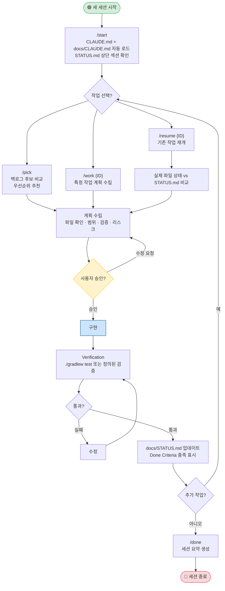
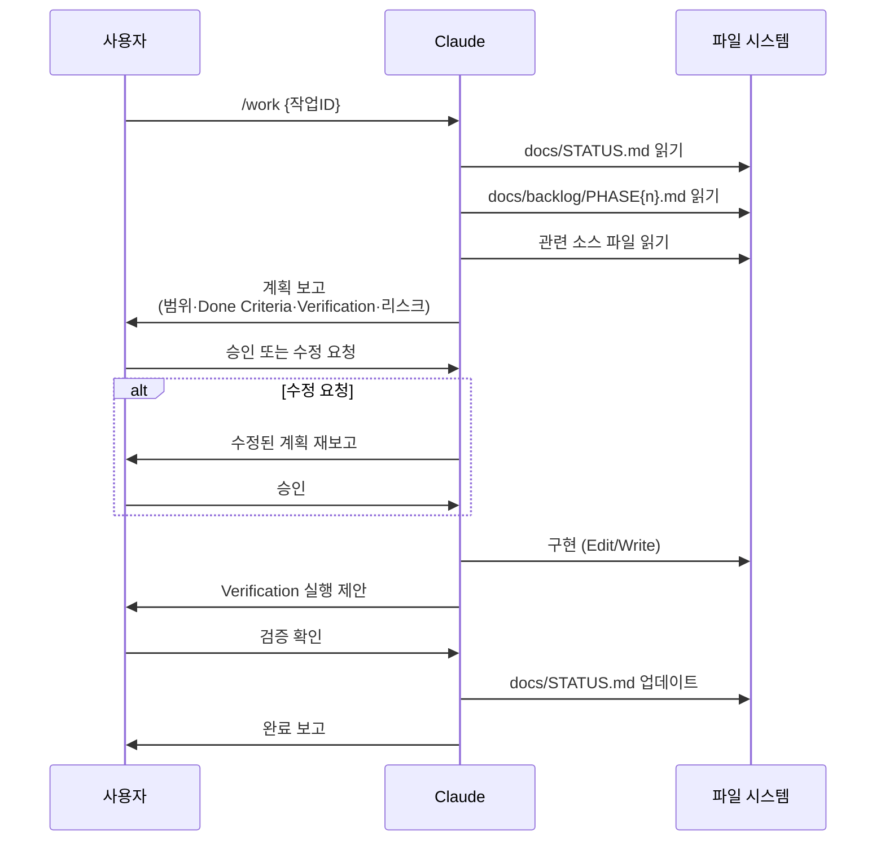
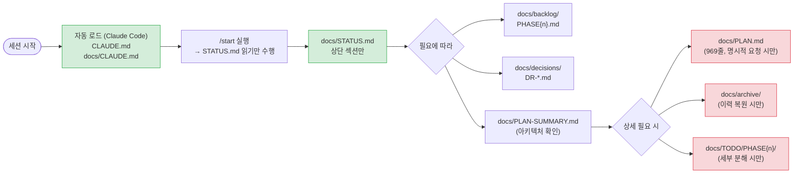
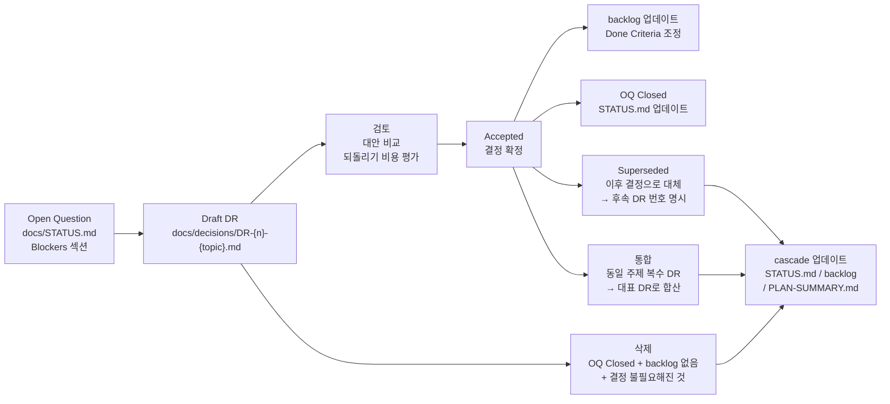

# Claude Code Workflow Manual

이 문서는 base-msa-template에서 구축된 Claude Code 워크플로우를 사람이 읽기 위한 종합 가이드다.
Claude에게 직접 전달되는 instruction은 `CLAUDE.md`와 `docs/CLAUDE.md`를 따른다.

> **적용 범위:** 이 구조는 다른 프로젝트에도 그대로 복사/재사용 가능하도록 설계되었다.

---

## 목차

1. [Overview](#1-overview)
2. [디렉토리 구조](#2-디렉토리-구조)
3. [컴포넌트 역할 레퍼런스](#3-컴포넌트-역할-레퍼런스)
4. [워크플로우 다이어그램](#4-워크플로우-다이어그램)
5. [Slash Commands 레퍼런스](#5-slash-commands-레퍼런스)
6. [Decision Record 운영](#6-decision-record-운영)
7. [프롬프트 라이브러리 활용](#7-프롬프트-라이브러리-활용)
8. [신규 프로젝트 초기화](#8-신규-프로젝트-초기화)
9. [언어 규칙 요약](#9-언어-규칙-요약)

---

## 1. Overview

### 이 워크플로우가 해결하는 문제

Claude Code는 강력하지만 context를 잘못 관리하면 세션마다 동일한 설명을 반복하거나, Claude가 승인 없이 범위를 넘는 작업을 수행하거나, 결정 사항이 사라지는 문제가 생긴다.

이 구조는 다음을 목표로 설계되었다.

- **Context 효율화**: 필요한 파일만 최소한으로 로드해서 token 낭비 방지
- **작업 추적성**: 모든 Active Work와 결정 사항을 문서에 유지
- **재현성**: 새 세션에서도 동일한 방식으로 작업을 이어갈 수 있음
- **안전성**: 위험한 작업은 항상 plan → 승인 → 구현 순서로 진행

### 핵심 원칙

| 원칙 | 내용 |
| --- | --- |
| Context is Limited | 모든 파일을 읽지 않는다. STATUS.md → 필요한 파일만 순서대로 로드 |
| Plan Before Implement | 구현 전에 plan과 verification을 먼저 보고하고 승인을 받는다 |
| Status Always Current | 작업 상태가 바뀌면 docs/STATUS.md를 갱신한다 |
| Surgical Changes | 요청된 최소 범위만 변경한다. 리팩토링은 별도 작업으로 분리 |

---

## 2. 디렉토리 구조

```mermaid
graph TD
    ROOT["📁 project-root"]

    ROOT --> CLAUDE_ROOT["📄 CLAUDE.md<br/><i>공통 운영 계약 (영어)</i>"]
    ROOT --> DOCS["📁 docs/"]
    ROOT --> DOT_CLAUDE["📁 .claude/"]
    ROOT --> PROMPTS["📁 prompts/"]
    ROOT --> CURSOR["📁 .cursor/ (선택)"]

    DOCS --> CLAUDE_DOCS["📄 CLAUDE.md<br/><i>프로젝트 운영 규칙 (한국어)</i>"]
    DOCS --> STATUS["📄 STATUS.md<br/><i>라이브 상태판</i>"]
    DOCS --> PLAN_S["📄 PLAN-SUMMARY.md<br/><i>기술 스택·아키텍처 요약</i>"]
    DOCS --> PLAN["📄 PLAN.md<br/><i>전체 기술 근거 (필요 시만)</i>"]
    DOCS --> BACKLOG["📁 backlog/<br/>PHASE{n}.md"]
    DOCS --> DECISIONS["📁 decisions/<br/>DR-*.md"]
    DOCS --> ARCHIVE["📁 archive/<br/>phase{n}-status.md"]
    DOCS --> TODO["📁 TODO/<br/>PHASE{n}/ (선택)"]

    DOT_CLAUDE --> SETTINGS["📄 settings.json<br/><i>권한·훅 설정</i>"]
    DOT_CLAUDE --> RULES["📁 rules/"]
    DOT_CLAUDE --> COMMANDS["📁 commands/"]

    RULES --> R1["docs-workflow.md"]
    RULES --> R2["git-workflow.md"]
    RULES --> R3["infra.md"]
    RULES --> R4["java-spring.md"]
    RULES --> R5["testing.md"]

    COMMANDS --> C1["/start"]
    COMMANDS --> C2["/pick"]
    COMMANDS --> C3["/work"]
    COMMANDS --> C4["/resume"]
    COMMANDS --> C5["/debug"]
    COMMANDS --> C6["/done"]
    COMMANDS --> C7["/record-decision"]

    PROMPTS --> P_SESSION["claude-session-start.md<br/>cursor-session-start.md"]
    PROMPTS --> P_TASKS["00~22 태스크 프롬프트"]

    style CLAUDE_ROOT fill:#ffeeba,stroke:#ffc107
    style STATUS fill:#d4edda,stroke:#28a745
    style PLAN_S fill:#cce5ff,stroke:#004085
    style SETTINGS fill:#f8d7da,stroke:#721c24
```



### 파일 분류 기준

**독자별 분류 (`docs/` 파일)**

| 독자 | 파일 |
| --- | --- |
| 개발자 | `ARCHITECTURE.md`, `DEVELOPER-GUIDE.md`, `CODING-CONVENTIONS.md`, `DOCKERFILE-GUIDE.md`, `WORKFLOW-MANUAL.md`, `PLAN.md` |
| AI 운영 (Claude) | `CLAUDE.md`, `STATUS.md`, `PLAN-SUMMARY.md`, `backlog/`, `decisions/`, `archive/`, `TODO/` |
| 개발자 + AI 겸용 | `PLAN-SUMMARY.md` |

**Claude 컨텍스트 로드 방식**

| 분류 | 파일 | Claude 로드 방식 |
| --- | --- | --- |
| 항상 자동 로드 | `CLAUDE.md`, `docs/CLAUDE.md` | 세션 시작 시 자동 |
| 세션마다 수동 로드 | `docs/STATUS.md` (상단만) | `/start` 시 명시적 로드 |
| 필요 시 로드 | `docs/PLAN-SUMMARY.md` | 아키텍처 확인 시 |
| 요청 시만 로드 | `docs/PLAN.md`, `docs/archive/`, `docs/TODO/` | 명시적 요청 시만 |

---

## 3. 컴포넌트 역할 레퍼런스

### `CLAUDE.md` (루트)

Claude Code가 세션 시작 시 자동으로 읽는 핵심 instruction 파일.
다른 프로젝트에서도 재사용 가능하게 유지한다. `@docs/CLAUDE.md`로 프로젝트 규칙을 import한다.

포함 내용: Core Workflow MUST/NEVER, Decision Rules, Response Shape, Context Budget

### `docs/CLAUDE.md`

프로젝트 특화 운영 규칙. Context Sources 우선순위, Session Startup 절차, Work Management Model, 언어 규칙, Verification Defaults, Project Constants를 정의한다.

### `docs/STATUS.md`

프로젝트의 **현재 상태 단일 출처(Single Source of Truth)**. 세션 간 상태를 유지하는 핵심 파일.

| 섹션 | 내용 |
| --- | --- |
| Current State | Phase, Active plan, Active backlog 포인터 |
| Active Work | ID, Priority, Status, Scope, Done Criteria, Verification |
| Checkpoints | Phase 단위 완료 조건과 검증 방법 |
| Blockers / Open Questions | 미결 결정 사항과 필요한 결정 |
| Recent Decisions | 날짜별 결정 사항 요약 |
| Next Actions | 번호 순 다음 작업 목록 |

> **규칙:** STATUS.md는 짧고 현재 중심으로 유지한다. 완료된 Phase 상세는 `docs/archive/`로 이동.

#### Archive 이동 기준과 절차

**트리거 — 다음 중 하나가 해당되면 Claude가 이동을 제안한다:**

- Phase의 모든 Checkpoint가 Done 상태로 전환되었을 때
- 새 Phase 시작 전 STATUS.md를 새 Phase 기준으로 재편할 때

**이동 대상:**

| 대상 | 상세 |
| --- | --- |
| Active Work 테이블 | 완료된 Phase 항목 전체 |
| Checkpoints 테이블 | 해당 Phase 전체 |
| Recent Decisions | 해당 Phase 기간 항목 |

**절차:**

1. Claude가 트리거 조건 감지 시 이동을 **제안**한다 — 승인 없이 진행하지 않는다
2. 사용자 승인 후 `docs/archive/phase{n}-status.md` 파일에 이동 내용을 작성한다
3. STATUS.md에서 이동한 섹션을 제거하고 현재 Phase 내용만 유지한다

### `docs/PLAN-SUMMARY.md`

기술 스택, 서비스 포트, 핵심 아키텍처 결정(Redis 키 구조, 에러 코드 패턴, Gateway 필터 체인 등)을 한 페이지로 정리한 경량 요약본. 기본적으로 아키텍처 확인이 필요할 때 이 파일을 먼저 참조하고, 전체 근거가 필요할 때만 `docs/PLAN.md`를 로드한다.

### `docs/backlog/PHASE{n}.md`

다음 Phase에서 수행할 후보 작업 목록. 우선순위(P0~P3), 선행 조건, Done Criteria, Verification을 포함한다. `/pick` 명령의 주 입력 소스.

### `docs/decisions/DR-*.md`

아키텍처·전략 결정을 기록하는 Decision Record. 결정 이유, 검토된 대안, 되돌리기 비용을 포함한다. 결정이 필요한 상황에서 Open Question → DR 작성 → 결정 반영 → Closed 순서로 진행한다.

**로드 조건:** 관련 DR이 있는 작업 시작 시, 아키텍처 결정이 구현에 직접 영향을 줄 때.

### `docs/archive/phase{n}-status.md`

완료된 Phase의 Active Work, Checkpoints, Decisions 이력을 보관하는 장기 보존 파일. STATUS.md를 현재 중심으로 유지하기 위해 완료 이력을 이쪽으로 분리한다.

**로드 조건:** 이전 Phase 구현 맥락 복원이 필요할 때, "Phase {n}에서 어떻게 했는지" 명시적으로 요청할 때. 기본적으로 로드하지 않는다.

### `docs/TODO/PHASE{n}/TODO-BLOCK{n}-{주제}.md`

단일 Phase 내 대형 작업을 더 작은 실행 단위로 분해할 때만 생성하는 선택적 파일. 기본값은 생성하지 않는다.

**생성 트리거 — 다음 중 하나 이상 해당 시 Claude가 생성을 제안한다:**

- 단일 backlog 항목이 3개 이상의 독립 서브태스크로 분해되어야 할 때
- 작업 범위가 3개 이상의 서비스·모듈을 가로질러 상세 조율이 필요할 때
- 사용자가 명시적으로 세부 분해를 요청할 때

**절차:**

1. Claude가 필요성을 제안하고 구조 초안을 제시한다 — 승인 없이 생성하지 않는다
2. 사용자 승인 후 `TODO-BLOCK{n}-{주제}.md` 형식으로 생성한다
3. 생성 후 STATUS.md 해당 Active Work 항목의 Notes에 파일 경로를 추가한다

**로드 조건:** 해당 Phase 세부 작업 분해 확인 시, 명시적 TODO block 참조 요청 시.

### `.claude/settings.json`

Claude Code 공식 설정 파일.

- `defaultMode: "plan"` — 모든 작업을 기본적으로 Plan 모드로 시작
- `permissions.deny` — 위험 명령 차단 (rm, sudo, kubectl, terraform 등)
- `hooks.PostToolUse` — Java 파일 수정 시 `./gradlew test` 실행 제안

### `.claude/rules/*.md`

Path-scoped 규칙 파일. 해당 경로의 파일을 편집할 때 자동 적용된다.

| 파일 | 적용 경로 | 핵심 규칙 |
| --- | --- | --- |
| `docs-workflow.md` | 문서 전반 | STATUS.md 짧게 유지, 중복 instruction 금지 |
| `git-workflow.md` | git 작업 | status → add → status → diff --cached 순서 강제 |
| `infra.md` | infra/, Dockerfile, docker-compose | 위험도 명시, dry-run 우선, secrets 미추가 |
| `java-spring.md` | services/, gateway/, common/ | Java 21, Spring Boot 3.5.x 컨벤션, MyBatis #{}, 주석 정책 (파일 헤더 없음, WHY-only, AvoidStarImport) |
| `testing.md` | **/src/test/** | 레이어별 어노테이션, AssertJ, BDD given/willReturn |

### `.claude/commands/*.md`

Slash 명령 구현 파일. Claude Code에서 `/명령명`으로 호출한다. (→ [섹션 5 참조](#5-slash-commands-레퍼런스))
현재 8개: `start`, `pick`, `work`, `resume`, `debug`, `done`, `record-decision`, `health`

### `prompts/`

Claude 및 Cursor에 복사해서 사용하는 재사용 프롬프트 라이브러리. (→ [섹션 7 참조](#7-프롬프트-라이브러리-활용))

---

## 4. 워크플로우 다이어그램

### 4-1. 전체 Session 생애주기



### 4-2. 작업 실행 흐름 (Plan → Approve → Implement)



### 4-3. Context 로드 우선순위



### 4-4. Context 로드 조건 기준표

다이어그램의 "필요에 따라" / "상세 필요 시" 분기의 구체적인 판단 기준이다.
**조건이 해당되지 않으면 로드하지 않는다.**

| 레벨 | 파일 | 로드하는 경우 | 로드하지 않는 경우 |
| --- | --- | --- | --- |
| 4 | `docs/PLAN-SUMMARY.md` | 기술 스택·포트·패키지 구조 확인; 새 서비스·레이어 추가 전 | 단순 버그 수정, 문서 업데이트 |
| 5 | `docs/backlog/*.md` | `/pick`, `/work` 실행; 작업 범위·우선순위 확인 | 이미 작업 ID가 정해진 상태로 진행 중 |
| 5 | `docs/decisions/*.md` | 관련 DR이 있는 작업 시작; 아키텍처 결정이 구현에 직접 영향을 줄 때 | DR과 무관한 구현·테스트 작업 |
| 6 | `docs/TODO/PHASE{n}/*.md` | 해당 Phase 세부 서브태스크 확인; 명시적 TODO block 참조 요청 | 일반 작업 진행 (backlog와 STATUS.md로 충분) |
| 7 | `docs/archive/*.md` | 이전 Phase 구현 맥락 복원; "Phase {n}에서 어떻게 했는지" 명시적 요청 | 현재 Phase 작업 (과거 이력 불필요) |
| 8 | `docs/PLAN.md` | PLAN-SUMMARY로 부족한 상세 근거; 아키텍처 변경 검토; Phase 계획 자체 수정 | 일반 구현·디버깅 (PLAN-SUMMARY로 충분) |

---

## 5. Slash Commands 레퍼런스

Claude Code에서 `/명령명`으로 호출. 파일 위치: `.claude/commands/*.md`

| 명령 | 언제 사용 | 주요 동작 |
| --- | --- | --- |
| `/start` | 세션 시작 시 | CLAUDE.md + STATUS.md 로드, 현재 상태 요약, 다음 작업 제안 |
| `/pick` | 다음 작업을 선택할 때 | backlog 후보 비교, 우선순위 추천, 관련 DR 표시, 구현 전 승인 대기 |
| `/work {ID}` | 특정 작업을 시작할 때 | 해당 backlog 항목 계획 수립, "진행할까요?" 후 대기, DR-worthy 결정 목록 제안 |
| `/resume {ID}` | 중단된 작업을 재개할 때 | 파일 상태 vs STATUS.md 비교 후 계속 진행 |
| `/debug` | 버그 분석/수정 시 | 코드·로그·테스트 근거로 원인 파악, 최소 변경 계획 |
| `/done` | 세션 종료 시 | 완료 작업, 변경 파일, 검증 결과, 리스크, 다음 세션 primer 요약, DR 검토 |
| `/record-decision` | 기술 결정을 DR로 기록할 때 | 현재 대화의 확정 결정을 DR 초안으로 작성, 승인 후 파일 생성 |
| `/health` | 워크플로우·문서 점검 시 | 구조 정합성, 문서 현행화, 백로그/DR 위생 전체 점검 후 보고. `--full`로 Claude Code 기능 정렬·PE 개선 포인트 포함 |

### 사용 패턴 예시

```
# 일반 세션
/start                    → 현재 상태 파악
/pick                     → 다음 작업 선택
/work PRE-A2              → PRE-A2 계획 수립
(승인 후 구현)
/done                     → 세션 요약

# 작업 재개
/start                    → 상태 확인
/resume PRE-A3            → 이전 진행 상황 이어서

# 버그 대응
/debug                    → 원인 분석 및 수정 계획

# 워크플로우·문서 정합성 점검
/health                   → 구조·위생 Quick 점검 (주 1~2회, 작업 블록 시작 전)
/health --full            → 전체 심화 점검 (Phase 전환 전 또는 월 1회)
```

### `/health` 권장 사용 주기 (Claude Pro 기준)

| 모드 | 권장 주기 | 적합한 시점 |
| --- | --- | --- |
| `/health` | 주 1~2회 | 작업 블록 시작 전, 매 세션마다 실행하지 않는다 |
| `/health --full` | 월 1회 또는 Phase 전환 전 | 대규모 작업 착수 전, Phase 완료 시점 |

---

## 6. Decision Record 운영

### 언제 DR을 작성하는가

- 아키텍처에 영향을 주는 기술 선택 (ex. K8s 도구: Helm vs Kustomize)
- 보안·운영 방식 변경 (ex. token 저장소 전략)
- 되돌리기 비용이 Medium 이상인 결정
- Open Question이 backlog 진행을 블로킹할 때

### DR 생애주기



### DR 파일 구조

```markdown
---
id: DR-{n}
status: Draft | Accepted | Superseded
---

## Question
결정이 필요한 질문 한 문장

## Decision
최종 결정 (Accepted 이후 작성)

## Options Considered
| Option | Pros | Cons |
| --- | --- | --- |

## Rationale
선택 이유

## Reversal Cost
Low | Medium | High — 이유

## Linked Backlog Items
P2-{n}, P2-{m}
```

파일명 규칙: `DR-{3자리 번호}-{짧은-주제}.md` (ex. `DR-001-token-storage.md`)

---

## 7. 프롬프트 라이브러리 활용

### 구조

```
prompts/
├── README.md                    ← 프롬프트 선택 가이드 (먼저 읽기)
├── claude-session-start.md      ← Claude Code 세션 부트스트랩
├── cursor-session-start.md      ← Cursor 세션 부트스트랩
├── 00-generic-task.prompt.md    ← 범용 태스크
├── 01~20-*.prompt.md            ← 상황별 재사용 프롬프트
├── 21-create-layer.prompt.md    ← Spring Boot 레이어 생성
├── 22-minimal-diff.prompt.md    ← 최소 변경 원칙
└── bak/                         ← 백업 (참조용)
```

### 빠른 선택 가이드

| 상황 | 추천 프롬프트 |
| --- | --- |
| 새 기능 추가 | `03-add-single-feature` |
| 버그 재현·수정 | `17-reproduce-and-fix` |
| 테스트 작성 | `06-write-tests-first` |
| 리팩토링 | `07-refactor-code` |
| 보안 검토 | `04-security-review` |
| 성능 개선 | `12-performance-fix` |
| Spring 레이어 생성 | `21-create-layer` |
| 최소 변경 작업 | `22-minimal-diff` |
| 세션 요약 | `20-summarize-work` |

### 사용법

1. `prompts/README.md`에서 적합한 프롬프트를 찾는다
2. 해당 `.prompt.md` 파일을 열어 플레이스홀더(`[...]`)를 채운다
3. Claude Code 프롬프트 입력창에 붙여넣는다

> Slash Command vs 프롬프트: Slash Command는 반복적인 워크플로우 작업(start/done/debug)에, 프롬프트 라이브러리는 특정 구현 태스크(레이어 생성, 테스트 작성 등)에 사용한다.

---

## 8. 신규 프로젝트 초기화

이 구조를 새 프로젝트에 적용할 때의 단계별 체크리스트다.

### 전제 조건

- Claude Code CLI 설치 완료
- Git 저장소 초기화 완료
- 프로젝트 목표, 기술 스택, 초기 범위(Phase 1 범위) 확정

### 체크리스트

#### Step 1 — 핵심 Instruction 파일

- [ ] **`CLAUDE.md`** (루트, 영어) 생성
  - Core Workflow MUST/NEVER
  - Decision Rules
  - Response Shape (결론 → 변경/계획 → 검증 → 리스크)
  - Context Budget (`docs/STATUS.md`, `docs/PLAN-SUMMARY.md` 포인터)
  - `@docs/CLAUDE.md` import 라인 추가

- [ ] **`docs/CLAUDE.md`** (한국어) 생성
  - Context Sources 우선순위 목록
  - Session Startup 절차
  - Work Management Model
  - Project Constants (Runtime, Framework, Base Package 등)
  - Verification Defaults
  - Language Rules

#### Step 2 — 상태 및 계획 문서

- [ ] **`docs/STATUS.md`** 생성
  - Current State 테이블 (Phase, Active plan, Active backlog 포인터)
  - Active Work 테이블 (스켈레톤, Phase 1 초기 작업 기입)
  - Checkpoints 섹션
  - Blockers / Open Questions 섹션
  - Next Actions 섹션

- [ ] **`docs/PLAN-SUMMARY.md`** 생성
  - 기술 스택 (Runtime, Framework, DB, 주요 라이브러리)
  - 서비스 포트 매핑
  - 핵심 아키텍처 결정 (패키지 구조, 에러 코드 패턴 등)

- [ ] **`docs/PLAN.md`** 생성
  - 전체 기술 근거와 아키텍처 상세
  - 초기에는 간략히 작성 후 점진적으로 보완

#### Step 3 — 작업 관리 문서

- [ ] **`docs/backlog/PHASE1.md`** 생성
  - ID, Priority, Scope, Done Criteria, Verification 포함한 후보 작업 목록

- [ ] **`docs/decisions/`** 폴더 생성
  - `DECISION-TEMPLATE.md` 복사
  - 착수 전 결정이 필요한 항목은 Open Question으로 STATUS.md에 먼저 등록

- [ ] **`docs/archive/`** 폴더 생성 (비워두기)

#### Step 4 — Claude Code 설정

- [ ] **`.claude/settings.json`** 작성
  ```json
  {
    "permissions": {
      "defaultMode": "plan",
      "deny": [
        "Bash(rm*)", "Bash(sudo*)", "Bash(kubectl*)",
        "Bash(terraform*)", "Read(.env)", "Read(secrets/**)"
      ]
    },
    "hooks": {
      "PostToolUse": [/* 프로젝트 특화 hook */]
    }
  }
  ```

- [ ] **`.claude/rules/`** 파일 복사 및 프로젝트에 맞게 조정
  - `docs-workflow.md` — 문서 유지 원칙
  - `git-workflow.md` — 커밋 전 절차 (변경 불필요)
  - `infra.md` — 인프라 안전 규칙
  - `java-spring.md` → 사용 언어/프레임워크에 맞게 수정
  - `testing.md` → 프로젝트 테스트 전략에 맞게 수정

- [ ] **`.claude/commands/`** 파일 8개 복사 및 프로젝트 Phase명 조정
  - `start.md`, `pick.md`, `work.md`, `resume.md`, `debug.md`, `done.md`, `record-decision.md`, `health.md`
  - `PHASE2` 등 하드코딩된 Phase명을 프로젝트에 맞게 수정

#### Step 5 — 프롬프트 라이브러리

- [ ] **`prompts/`** 디렉토리 복사
  - `claude-session-start.md`, `cursor-session-start.md` 복사 후 프로젝트명 수정
  - 태스크 프롬프트는 필요한 것만 선택적으로 유지
  - `README.md` 업데이트

#### Step 6 — Cursor 연동 (선택)

- [ ] **`.cursor/rules/`** 파일 생성
  - `java-spring.mdc`, `testing.mdc`, `git-commit.mdc`를 `.claude/rules/`와 정렬
- [ ] **`.cursorignore`** 업데이트 (빌드 산출물, 민감 파일 제외)

#### Step 7 — 초기 세션 검증

```bash
# Claude Code 시작 후
/start
# → CLAUDE.md, docs/CLAUDE.md 로드 확인
# → STATUS.md Phase 1 Active Work 표시 확인
# → 다음 작업 추천 확인
```

### 신규 프로젝트 초기화 프롬프트

새 프로젝트에서 Claude에게 이 구조를 설계하도록 요청할 때:

```
이 저장소의 Claude 운영 구조를 참고해서 새 프로젝트용 AI 작업 문서 구조를 설계해줘.

새 프로젝트 정보:
- 목표: [한 문장]
- 기술 스택: [언어, 프레임워크, DB, 배포 환경]
- 제약 조건: [성능, 보안, 호환성, 일정 등]
- 우선순위: [가장 중요한 것]
- 초기 범위: [Phase 1에서 만들 것]

다음 파일 구조를 기준으로 초안을 제안해줘.

- CLAUDE.md (루트, 영어)
- docs/CLAUDE.md (한국어, Context Sources·Session Startup·언어 규칙 포함)
- docs/STATUS.md (Current State·Active Work·Checkpoints 스켈레톤)
- docs/PLAN-SUMMARY.md (기술 스택·포트·핵심 아키텍처)
- docs/PLAN.md (전체 기술 근거, 초기에는 간략히)
- docs/backlog/PHASE1.md (우선순위별 후보 작업)
- docs/decisions/ (DECISION-TEMPLATE.md 포함)
- docs/archive/ (빈 폴더)
- .claude/settings.json (defaultMode=plan, 금지 명령 목록)
- .claude/rules/ (docs-workflow, git-workflow, infra, [언어]-[프레임워크], testing)
- .claude/commands/ (start, pick, work, resume, debug, done)
- prompts/ (필요한 태스크 프롬프트 라이브러리)

구현이나 파일 생성은 내가 승인한 뒤 진행해줘.
```

---

## 9. 언어 규칙 요약

| 파일 유형 | 언어 | 이유 |
| --- | --- | --- |
| `CLAUDE.md` (루트) | 영어 | Claude instruction: token 효율, 준수율 향상 |
| `.claude/rules/*.md` | 영어 | Claude가 직접 처리하는 규칙 파일 |
| `.claude/settings.json` hook 메시지 (instruction 부분) | 영어 | 도구 파싱 대상 |
| `docs/*.md`, `docs/backlog/`, `docs/decisions/` | 한국어 (기술 용어는 영어) | 사람이 읽는 문서 |
| `.claude/commands/*.md` | 한국어 (기술 용어는 영어) | 사용자가 직접 읽고 수정 |
| `prompts/*.md` | 한국어 (기술 용어는 영어) | 사용자가 직접 읽고 복사 |
| Java 코드 주석 | 영어 | 코드와 함께 영어로 일관성 유지 |

> **기술 용어 번역 금지:** `@Transactional`, `N+1`, `Circuit Breaker`, `HttpOnly Cookie`, `Plan Mode` 등은 영어 원문을 유지한다.

---

*Last updated: 2026-05-11*
*이 문서는 `docs/CLAUDE.md`와 `CLAUDE.md`를 대체하지 않는다. Claude에 대한 instruction은 해당 파일을 따른다.*
