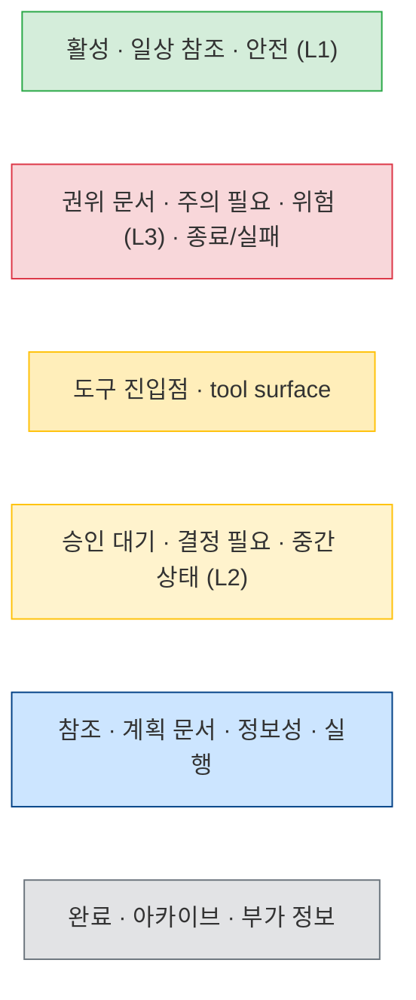
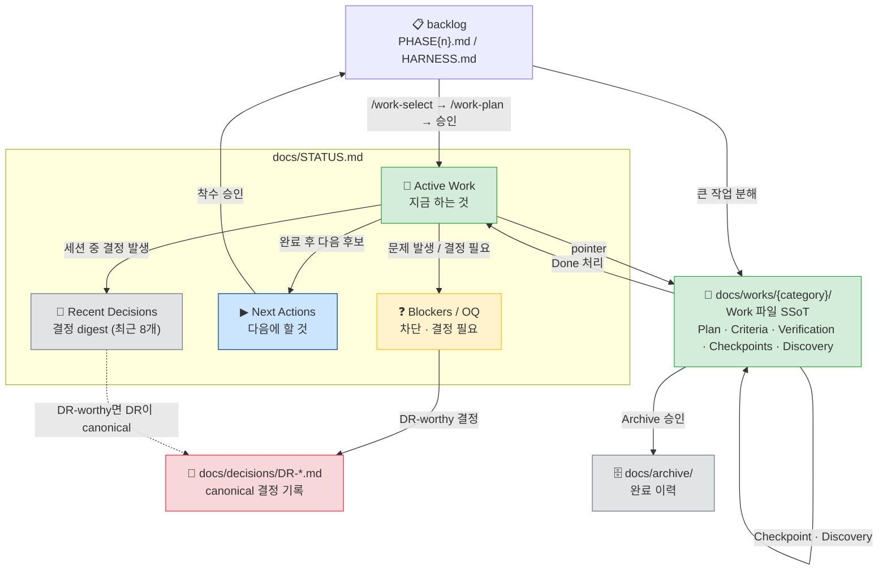
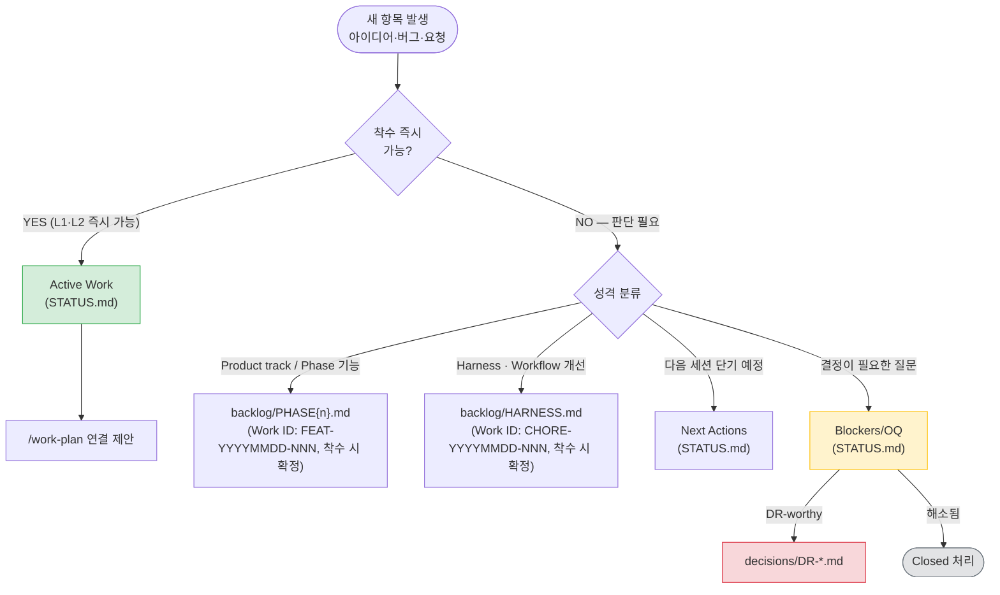
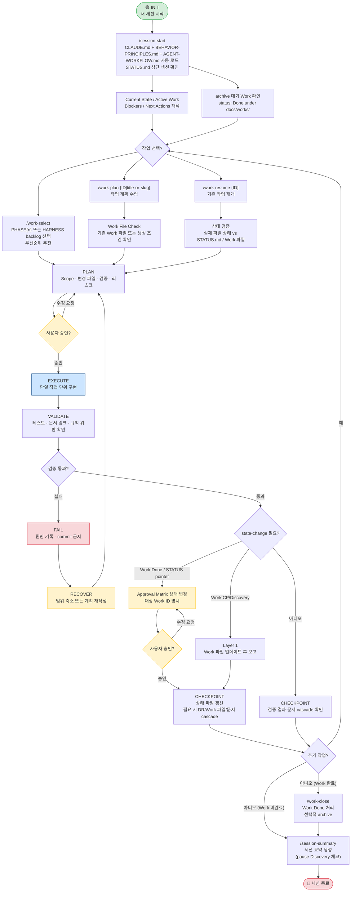
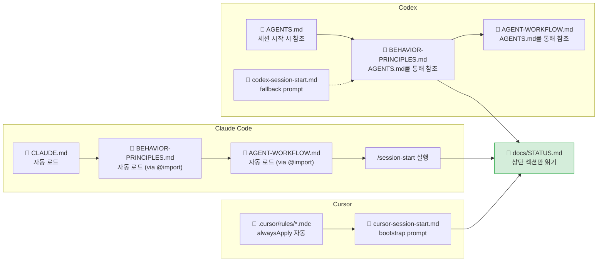
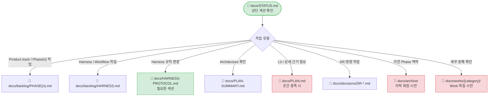
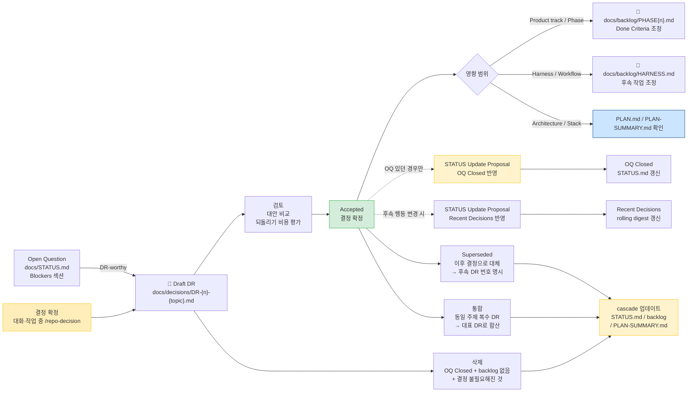

# Lightweight Manual-First AI Workflow Harness v1 — Workflow Manual

> **Note** 원래 소프트웨어에서 '하네스'란 테스트 환경을 감싸고 상태 관리와 흐름 제어를 담당하는 뼈대(Scaffolding)를 의미한다. 본 프로젝트가 구축하는 AI 워크플로우 역시 이와 구조적으로 같다. AI 세션을 감싸는 래퍼 역할을 하면서, STATUS로 상태를 추적하고 gate로 전체 흐름을 제어하는 'AI 워크플로우 하네스' 역할을 수행한다. 타이틀의 'Lightweight Manual-First AI Workflow Harness'는 본 프로젝트 내부에 적용된 이 시스템을 지칭한다.

Claude에게 직접 전달되는 instruction은 `CLAUDE.md`, `docs/BEHAVIOR-PRINCIPLES.md`, `docs/AGENT-WORKFLOW.md`를 따른다. 하네스 실행 규칙의 활성 기준은 `docs/HARNESS-PROTOCOL.md`이다.
이 문서는 그 규칙을 사용자가 이해하고 운영할 수 있도록 설명하는 **Lightweight Manual-First AI Workflow Harness 종합 가이드(사용자 매뉴얼)** 이다.
핵심만 빠르게 확인하려면 `README.md`를 먼저 본다.

**안내**

- **적용 범위:** 이 구조는 다른 프로젝트에도 그대로 복사/재사용 가능하도록 설계되었다.
- **일상 실행:** 세션 중 빠른 실행 규칙은 `docs/HARNESS-QUICK-REFERENCE.md`를 먼저 본다.
- **상세 프로토콜:** 상태 머신, 컨텍스트 로딩, 문서 lifecycle, recovery 규칙은 `docs/HARNESS-PROTOCOL.md`를 기준으로 한다.

> **전제:** 본 매뉴얼의 내용은 'Claude'를 기준(예시)으로 기술한다. Codex 또는 Cursor 사용 시 해당 도구의 진입점과 설정을 참조하도록 한다.

---

## Table of Contents

1. [Overview](#1-overview)
2. [Directory Structure](#2-directory-structure)
3. [Component Role Reference](#3-component-role-reference) · [Work Item Routing](#work-item-routing-flow)
4. [Workflow Diagrams](#4-workflow-diagrams) · [4-3-A Tool Entry](#4-3-a-tool-entry-point-comparison) · [4-3-B Context Load](#4-3-b-context-load-decision)
5. [Slash Commands Reference](#5-slash-commands-reference) · [Risk Level](#risk-level-classification-l1--l2--l3)
6. [Decision Record Operations](#6-decision-record-operations)
7. [Trigger Reference](#7-trigger-reference)

**Appendix**

- [A. Prompt Library Usage](#appendix-a-prompt-library-usage)
- [B. New Project Initialization](#appendix-b-new-project-initialization)
- [C. Language Rules Summary](#appendix-c-language-rules-summary)

---

## 1. Overview

### Problems This Workflow Solves

Claude Code는 강력하지만 context를 잘못 관리하면 세션마다 동일한 설명을 반복하거나, Claude가 승인 없이 범위를 넘는 작업을 수행하거나, 결정 사항이 사라지는 문제가 생긴다.

이 구조는 다음을 목표로 설계되었다.

- **Context 효율화**: 필요한 파일만 최소한으로 로드해서 token 낭비 방지
- **작업 추적성**: 모든 Active Work와 결정 사항을 문서에 유지
- **재현성**: 새 세션에서도 동일한 방식으로 작업을 이어갈 수 있음
- **안전성**: 위험한 작업은 항상 plan → 승인 → 구현 순서로 진행

### Core Principles

| 원칙 | 내용 |
| --- | --- |
| Context is Limited | 모든 파일을 읽지 않는다. STATUS.md → 필요한 파일만 순서대로 로드 |
| Behavior Principles First | 모든 작업에서 `docs/BEHAVIOR-PRINCIPLES.md`의 전역 행동 원칙을 우선 적용 |
| Plan Before Implement | 구현 전에 plan과 verification을 먼저 보고하고 승인을 받는다 |
| Status Always Current | 작업 상태가 바뀌면 Approval Matrix의 상태 변경 규칙 → 승인 → 필요한 상태 파일 갱신 순서를 따른다 |
| Surgical Changes | 요청된 최소 범위만 변경한다. 리팩토링은 별도 작업으로 분리 |

### Reading Path

| 목적 | 먼저 볼 곳 |
| --- | --- |
| 새 프로젝트 또는 기존 프로젝트에 하네스 도입 | [Appendix B. New Project Initialization](#appendix-b-new-project-initialization) |
| 일상 세션 운영 흐름 이해 | [§4 Workflow Diagrams](#4-workflow-diagrams) → [§5 Slash Commands Reference](#5-slash-commands-reference) |
| 문서 cascade와 산출물 생성 조건 확인 | [§7 Trigger Reference](#7-trigger-reference) |

### Key Notation

이 문서 전체에서 반복 사용되는 약어와 표기다. 처음 읽는 경우 이 표를 먼저 확인한다.

| 표기 | 의미 | 상세 |
| --- | --- | --- |
| L1 / L2 / L3 | 작업 위험도 등급 — L1(안전) → L2(일반) → L3(구조 변경) | [§5 Risk Level](#risk-level-classification-l1--l2--l3) |
| Trigger | 특정 변경을 감지하면 Claude가 관련 문서·표면 점검을 제안하는 시점 | [§7 Trigger Reference](#7-trigger-reference) (정식 정의는 `docs/HARNESS-PROTOCOL.md`) |

### Diagram Color Key

다이어그램 노드의 배경색은 아래 6가지 의미를 일관되게 사용한다.



---

## 2. Directory Structure

전체 디렉토리 트리와 파일별 역할은 source repo README의 Repository Layout·Document Layers 섹션이 SSoT다. 여기서는 트리를 다시 그리지 않고, 큰 그림만 짚는다.

- **진입점** `CLAUDE.md` / `AGENTS.md` / `.cursor/rules/*.mdc` — 도구별 시작점.
- **문서 계층** `docs/` — 공통 운영 규칙(`BEHAVIOR-PRINCIPLES`, `AGENT-WORKFLOW`, `HARNESS-PROTOCOL`, `HARNESS-QUICK-REFERENCE`), 상태·작업(`STATUS.md`, `backlog/`, `works/`, `decisions/`, `archive/`), 아키텍처(`PLAN`, `PLAN-SUMMARY`, optional `HARNESS-ARCHITECTURE`/`HARNESS-MAINTAINER-GUIDE`).
- **canonical workflow** `skills/workflow/{name}.md` — command별 절차의 SSoT.
- **tool adapter** `.claude/commands/`, `.agents/skills/workflow-*`, `.cursor/rules/workflow.mdc` — canonical을 호출하는 도구별 표면.
- **프롬프트** `prompts/` — 재사용 task/fallback 템플릿.

### File Classification

**독자별 분류**

| 독자 | 주요 파일 |
| --- | --- |
| 개발자 | `WORKFLOW-MANUAL.md`, `HARNESS-ARCHITECTURE.md`, `HARNESS-MAINTAINER-GUIDE.md` |
| AI 운영 공통 | `docs/BEHAVIOR-PRINCIPLES.md`, `docs/AGENT-WORKFLOW.md` (Claude Code: `CLAUDE.md` → 자동 import / Codex: `AGENTS.md` → 위임 / Cursor: `.cursor/rules/*.mdc`) |
| AI 운영 전용 | `STATUS.md`, `HARNESS-PROTOCOL.md`, `HARNESS-QUICK-REFERENCE.md`, `PLAN-SUMMARY.md`, `backlog/`, `decisions/`, `works/`, `archive/` |
| 개발자 + AI 겸용 | `PLAN-SUMMARY.md`, `GIT-WORKFLOW.md` (source repo / source-gitflow scaffold only), `PLAN.md` |
| 발표·보고 산출물 | `docs/presentations/`, `docs/reports/` |
| 역사·평가 | `docs/archive/`, `docs/retrospectives/`, reference-only plan |

> 파일별 로드 조건(언제·어떤 조건에서 읽는가)은 [§4-3-B Context Load Decision](#4-3-b-context-load-decision)을 참조한다.

---

## 3. Component Role Reference

### Operating Tracks

AI Workflow Harness는 적용 대상 repository 안에서 두 트랙을 함께 운영한다.

| Track | Purpose | Primary Files |
| --- | --- | --- |
| Product track | 실제 제품/서비스/콘텐츠의 기능, 테스트, 문서, 인프라 work | `docs/backlog/PHASE{n}.md`, `docs/works/phase{n}/` |
| Harness track | AI workflow, command/rule, prompt, scaffold, status/process hardening | `docs/backlog/HARNESS.md`, `docs/works/harness/` |

이 repository를 harness 자체 개발용 source로 운영하는 경우 Product track이 비어 있을 수 있다.
반면 scaffold된 신규/기존 프로젝트는 Product track과 Harness track을 함께 갖는 것을 기본값으로 한다.

### 3-0. Reading the Document Hierarchy

문서가 어떤 계층으로 연결되는지(진입점 → 공통 운영 규칙 → canonical workflow → tool adapter → 상태·작업)는 source repo README의 **Document Layers** 다이어그램이 SSoT다. 여기서는 중복 재서술하지 않는다.
파일별 역할 카탈로그도 source repo README의 **Key Documents**가 SSoT다.

이 섹션은 그 위에서, 초보 사용자가 실제로 헷갈리는 **상태 파일(STATUS.md)과 Work 파일을 어떻게 읽고 쓰는가**만 teaching한다. 개별 파일의 한 줄 역할은 README를 참조한다.

### `docs/STATUS.md`

프로젝트의 **현재 상태 dashboard**. 세션 간 현재 Phase, Active Work pointer, Blockers, Next Actions를 유지하는 핵심 파일.
작업 단위의 Top Summary, Context Manifest, Scope/Plan, Done Criteria, Verification, Checkpoints, Next Actions, Discovery는 Work 파일이 SSoT다.

| 섹션 | 내용 |
| --- | --- |
| Current State | Phase, focus, product backlog, harness backlog 포인터 |
| Active Work | 현재 진행 중인 Work 파일 pointer |
| Blockers / Open Questions | 미결 결정 사항과 필요한 결정 |
| Recent Decisions | 날짜별 결정 사항 요약 |
| Next Actions | 번호 순 다음 작업 목록 |

> **규칙:** STATUS.md는 짧고 현재 중심으로 유지한다. 완료된 Phase 상세는 `docs/archive/`로 이동.

#### 섹션별 개념과 상관관계

각 섹션의 역할과 시제를 구분해서 사용해야 STATUS.md가 짧고 정확하게 유지된다.

| 섹션 | 한 줄 정의 | 시제 | 적정 규모 |
| --- | --- | --- | --- |
| Active Work | 지금 진행 중인 Work 파일 pointer | 현재 | 1~3개 |
| Blockers / OQ | 진행을 막는 것 또는 결정이 필요한 것 | 현재 (미해결) | 해소되면 Closed |
| Next Actions | 다음에 할 일 목록 | 미래 | 5개 이내 |
| Recent Decisions | 최근 결정의 digest | 과거 | rolling window 최근 8개 |



**섹션별 사용 원칙**

- **Active Work** — 동시에 1~3개가 적정. 많아지면 집중력 분산의 신호. 상세 내용은 Work 파일에 두고 STATUS.md에는 pointer만 유지한다.
- **Work 파일 Checkpoints** — L2/L3 큰 작업에만 붙인다. "이 단계까지 완료되면 중간에 멈춰도 안전한가"를 기준으로 정의. 소규모 작업에는 불필요.
- **Blockers / OQ** — Blocker는 외부 의존성으로 지금 당장 진행을 막는 것, OQ는 결정하지 않으면 방향이 갈리는 질문. OQ가 결정되면 `Closed` 처리, 중요하면 DR로 격상.
- **Next Actions** — 백로그가 아니다. "다음 세션에서 가장 먼저 볼 것" 수준의 짧은 목록. 5개를 넘으면 백로그로 내려보낼 신호.
- **Recent Decisions** — 세션 컨텍스트 복원용 digest. 영구 기록이 목적이 아니다. DR-worthy 결정은 `docs/decisions/DR-*.md`가 canonical이고 여기는 요약만. rolling window 8개 초과 시 가장 오래된 것부터 drop.

**헷갈리기 쉬운 상황별 매핑**

| 상황 | 기록 위치 |
| --- | --- |
| 새 기능 아이디어 발생 | **backlog** (Active Work 아님) |
| 착수 승인된 작업 | **Active Work** |
| 작업 중 발견한 차단 요소 | **Blockers** |
| 방향 결정이 필요한 질문 | **OQ** → 결정 후 **Recent Decisions** → 중요하면 **DR** |
| 다음 세션에 이어할 것 (단기) | **Next Actions** |
| 다음 Phase 후보 작업 (중장기) | **backlog** |
| 완료된 작업의 이력 | **archive** (STATUS.md에 남기지 않음) |

#### Work Item Routing Flow

새 항목 발생 시 어디에 등록할지 결정하는 흐름이다. `/work-register` 명령이 내부적으로 이 로직을 따른다.



> **STATUS 안전 업데이트·실패 복구·Archive 절차**는 canonical이 SSoT다. 수정 전 재-read와 Approval Matrix 상태 변경 규칙은 [`docs/AGENT-WORKFLOW.md`](AGENT-WORKFLOW.md) STATUS Rules, 코드-우선 실패 복구는 `/work-resume`(`skills/workflow/work-resume.md`), Archive 트리거·절차는 [`docs/decisions/DR-014-archive-policy.md`](decisions/DR-014-archive-policy.md)를 따른다. 이 매뉴얼은 절차를 재서술하지 않는다.

> 위 STATUS.md, PLAN-SUMMARY.md, HARNESS-ARCHITECTURE.md, HARNESS-MAINTAINER-GUIDE.md, HARNESS-PROTOCOL.md, HARNESS-QUICK-REFERENCE.md, backlog, decisions, archive, retrospectives 등 **개별 파일의 역할**은 source repo README의 Key Documents가 SSoT다.

### Reading and Writing Work Files

Work 파일(`docs/works/{category}/{ID}-{topic}.md`)은 **큰 작업 하나의 SSoT**다. Top Summary, Context Manifest, Scope/Plan, Done Criteria, Verification, Checkpoints, Next Actions, Discovery를 한 파일에 담는다. STATUS.md는 dashboard(pointer), Work 파일은 그 작업의 상세다. 일반 작업은 backlog와 STATUS.md만으로 충분하고, Work 파일은 backlog를 대체하지 않는다.

**언제 Work 파일을 만드나 (둘 이상 또는 사용자 요청 시 Claude가 생성을 제안):** 단일 backlog 항목이 3개 이상 서브태스크로 분해될 때 / 3개 이상 파일·2개 이상 모듈을 가로지를 때 / 한 세션 완료가 불확실할 때 / L3 작업일 때 / checkpoint가 2개 이상 필요할 때 / 다른 Agent·도구로 인계 가능성이 있을 때.

Product track의 작고 명확한 L1은 Work 파일 없이 Quick Mode로 끝낼 수 있다. entrypoint/workflow/protocol/command/rule/prompt/scaffold/status 파일을 건드리면 harness/workflow surface 변경으로 보고 기본 L2로 다룬다.

**라이프사이클:** `Active`(`/work-plan` 착수 승인 시 생성) → `Done`(`/work-close`) → `Archived`(archive 승인). 착수·완료·archive의 단계별 절차와 frontmatter/본문 **템플릿, Approval Matrix 상태 변경 규칙은 재서술하지 않는다.**

- Work 파일 형식/템플릿: [`docs/decisions/DR-013-work-file-spec.md`](decisions/DR-013-work-file-spec.md)
- 착수/완료/archive 절차: `/work-plan`, `/work-close`, `/work-resume` (`skills/workflow/*.md`) + [`docs/HARNESS-PROTOCOL.md`](HARNESS-PROTOCOL.md) Work File Rules
- 상태 변경 승인 기준: [`docs/AGENT-WORKFLOW.md`](AGENT-WORKFLOW.md) Approval Matrix

### Tool Surface (`.claude/`, `.agents/`, `.cursor/`, `prompts/`)

workflow 절차의 SSoT는 `skills/workflow/{name}.md`(canonical)이고, 도구별 표면은 그 절차를 호출하는 adapter다. 구조와 파일 목록은 source repo README의 Document Layers·Repository Layout를 참조한다.

- `.claude/settings.json` — Claude Code 설정(`defaultMode: plan`, `permissions.deny` 위험 명령 차단, `hooks.Stop` 세션 종료 전 `/session-summary` reminder). `/exit` 직접 입력 시 hook이 발동하지 않으므로 `/session-summary` 후 종료를 권장한다.
- `.claude/rules/*.md` — path-scoped 규칙(편집 경로에 자동 적용): `docs-workflow`, `git-workflow`, `infra`, optional `java-spring`/`testing`.
- `.claude/commands/{name}.md` / `.agents/skills/workflow-{name}/SKILL.md` / `.cursor/rules/workflow.mdc` — Claude/Codex/Cursor adapter. 11개 command 목록과 용도는 [§5 Slash Commands Reference](#5-slash-commands-reference) 참조.
- `prompts/` — 재사용 프롬프트 라이브러리. Command를 쓸 수 없거나 다른 도구로 넘길 때 fallback/task template로 사용한다. (→ [Appendix A](#appendix-a-prompt-library-usage))

---

## 4. Workflow Diagrams

### 4-1. Full Session Lifecycle



Active Work와 Next Actions가 없고 archive 대기 Work도 없으면 `/session-start`는 repository를 clean idle 상태로 보고한다.
이 상태에서는 과거 milestone checklist를 다음 작업 후보로 추론하지 않으며, 새 작업 선택은 `/work-select`, 새 항목 등록은 `/work-register`로 시작한다.

### 4-2. Task Execution Flow (Plan → Approve → Implement)


### 4-3-A. Tool Entry Point Comparison

세션 시작 시 도구별로 어떤 파일이 어떻게 로드되는지 비교한다.



### 4-3-B. Context Load Decision

STATUS.md 확인 이후 작업 유형에 따라 어떤 문서를 추가로 로드할지 결정하는 흐름이다.
**조건이 해당되지 않으면 로드하지 않는다.**



**로드 판단 기준 요약**

| 파일 | 로드하는 경우 | 로드하지 않는 경우 |
| --- | --- | --- |
| `HARNESS-QUICK-REFERENCE.md` | workflow/harness 작업 시작; 세션 실행 규칙 확인 | product 구현만 진행 |
| `HARNESS-PROTOCOL.md` | harness 규칙 변경; command/rule 변경; 프로토콜 충돌 검토 | 단순 product 구현 |
| `PLAN-SUMMARY.md` | 기술 스택·포트·패키지 구조 확인; 새 서비스·레이어 추가 전 | 단순 버그 수정·문서 업데이트 |
| `backlog/PHASE{n}.md` | product 또는 Phase{n} 준비 작업 선택 | harness 작업 |
| `backlog/HARNESS.md` | harness·command/rule·workflow hardening 작업 선택 | product 작업 |
| `decisions/*.md` | 관련 DR이 있는 작업 시작; 아키텍처 결정이 구현에 직접 영향을 줄 때 | DR과 무관한 구현·테스트 작업 |
| `works/{category}/*.md` | 해당 Phase Work 파일 확인; 세부 분해 또는 Checkpoint 참조 요청 | 일반 작업 (backlog와 STATUS.md로 충분) |
| `archive/*.md` | 이전 Phase 구현 맥락 복원; 명시적 과거 이력 요청 | 현재 Phase 작업 |
| `PLAN.md` | PLAN-SUMMARY로 부족한 상세 근거; 아키텍처 변경; **신규 서비스·모듈; Cross-service interaction; Infra·배포 변경; DB schema 변경** | 일반 구현·디버깅 |

---

## 5. Slash Commands Reference

Claude Code에서 `/명령명`으로 호출한다. 상세 절차는 `skills/workflow/{name}.md`가 canonical SSoT이며, `.claude/commands/*.md`, `.agents/skills/workflow-*/SKILL.md`, `.cursor/rules/workflow.mdc`는 tool-specific adapter다.

| 범주 | 명령 | 언제 사용 | 주요 동작 |
| --- | --- | --- | --- |
| Session lifecycle | `/session-start` | 세션 시작 시 | CLAUDE.md + STATUS.md 로드, 현재 상태 요약, 다음 작업 제안 |
| Session lifecycle | `/work-select` | 다음 작업을 선택할 때 | backlog 후보 비교, 우선순위 추천, 관련 DR 표시, 구현 전 승인 대기 |
| Session lifecycle | `/session-summary` | 세션 종료 시 | 완료 작업, 변경 파일, 검증 결과, 리스크, Active Work Discovery 미기록 확인, state-change proposal 필요 여부, STATUS/Tracking Finalization 결과, 다음 세션 primer 요약, DR 검토. Work Done 처리 없음 — Work를 끝내려면 `/work-close` 먼저 실행 |
| Work lifecycle | `/work-plan {ID|title-or-slug}` | 특정 작업을 시작할 때 | Work File Check → 필요 시 Work ID 확정 → PLAN.md 강제 로드 조건 체크 → 위험도 판단(L1/L2/L3) → 계획 수립 → "진행할까요?" 후 대기 → DR-worthy 결정 목록 제안 |
| Work lifecycle | `/work-resume {ID}` | 중단된 작업을 재개할 때 | 파일 상태 vs STATUS.md / Work 파일 비교 → Done이면 재개 금지 및 archive/후속 작업 제안 → 남은 계획 제안 |
| Work lifecycle | `/work-close` | Work를 완료할 때 (세션 계속) | Done Criteria 확인, status/actual_end 기입, README Active→Done, STATUS pointer 제거 제안, 선택적 archive. 세션 종료나 commit/PR 전 STATUS Finalization 대체 아님 |
| Utility / Analysis | `/work-register [설명]` | 새 작업 항목을 등록할 때 | 긴급도·성격 판단 → STATUS Active Work / Next Actions / PHASE{n}.md / HARNESS.md 중 라우팅 → state-change proposal(필요 시) → 긴급 항목이면 /work-plan 연결 제안 |
| Utility / Analysis | `/work-debug` | 버그 분석/수정 시 | 코드·로그·테스트 근거로 원인 파악, 최소 변경 계획 |
| Utility / Analysis | `/work-doc [brief]` | 발표·보고·리뷰 패키지·외부 공유용 문서 산출물을 만들 때 | 목적·audience·format·source brief 확정 → outline 승인 → presentation/document 도구 또는 fallback으로 산출물 생성 → 품질 검증 |
| Utility / Analysis | `/repo-decision` | 기술 결정을 DR로 기록할 때 | 현재 대화의 확정 결정을 DR 초안으로 작성, 승인 후 파일 생성, Accepted DR마다 Recent Decisions 반영 필요 여부 판정 |
| Utility / Analysis | `/repo-health` | 워크플로우·문서 점검 시 | 구조 정합성, 문서 현행화, 백로그/DR 위생 전체 점검 후 7섹션 Output Contract(Summary/Findings/Surface Coverage/Skipped/Context Budget/Verification/Follow-Ups)로 보고. `--full`은 전체 심화 점검 + Area H(Workflow Context Weight — 일상 workflow가 heavy docs를 불필요하게 로드하는지 감지), `--cascade`는 문서·워크플로우 변경의 연쇄 영향을 required surface, grep, simulation checklist로 감사 |

### Approval Matrix

실행 전 승인·상태 변경·commit 전 승인을 하나의 기준으로 묶는 게 Approval Matrix다. L1(작고 명확) → 간단 plan, L2(harness/workflow surface·설정) → 상세 plan + Work 파일 기본, L3(구조 변경) → AS-IS/TO-BE·rollback 포함. **L1/L2/L3별 실행 전·상태 변경·commit 전 승인 규칙의 전체 표는 [`docs/AGENT-WORKFLOW.md`](AGENT-WORKFLOW.md) Approval Matrix가 SSoT다.** 이 매뉴얼은 표를 재호스팅하지 않는다.

---

### Risk Level Classification (L1 / L2 / L3)

`/work-plan`가 계획 수립 전 위험도를 판단한다: **L1**(버그·테스트·문서 소폭 — 간소 plan), **L2**(기능 구현·설정·hook — 상세 plan), **L3**(아키텍처·인증·인프라·DB schema — `docs/PLAN.md` 강제 로드 + 엄격 승인). 정의와 처리 기준의 SSoT는 [`docs/AGENT-WORKFLOW.md`](AGENT-WORKFLOW.md) Risk Levels다.

### Usage Pattern Examples

```
# 일반 세션 (Work 완료)
/session-start                    → 현재 상태 파악
/work-select                     → 다음 작업 선택
/work-plan PRE-A2              → PRE-A2 계획 수립
(승인 후 구현)
/work-close                    → Work Done 처리 (세션 계속)
/session-summary                     → 세션 요약 및 종료

# 일반 세션 (Work 미완료, pause)
/session-start                    → 현재 상태 파악
/work-plan PRE-A2              → PRE-A2 계획 수립
(승인 후 구현 — 미완료)
/session-summary                     → Discovery 체크 후 세션 요약

# 작업 재개
/session-start                    → 상태 확인
/work-resume PRE-A3            → 이전 진행 상황 이어서

# 새 작업 등록
/work-register                 → 긴급도·성격 판단 후 적절한 위치에 등록
/work-register 긴급 보안 패치  → Active Work 등록 + /work-plan 연결 제안

# 버그 대응
/work-debug                    → 원인 분석 및 수정 계획

# 발표/보고 자료
/work-doc "하네스 리팩터링 결과를 외부 리뷰어용 8장 발표자료로 정리"

# 워크플로우·문서 정합성 점검
/repo-health                   → 구조·위생 Quick 점검 (주 1~2회, 작업 블록 시작 전)
/repo-health --full            → 전체 심화 점검 (Phase 전환 전 또는 월 1회)
/repo-health --cascade         → 문서·workflow 변경 후 canonical/tool/user/scaffold cascade 점검
/repo-health --full --cascade  → 대형 harness 변경 또는 Phase 전환 전 최종 정밀 점검
```

### `/repo-health` Recommended Cadence (Claude Pro)

| 모드 | 권장 주기 | 적합한 시점 |
| --- | --- | --- |
| `/repo-health` | 주 1~2회 | 작업 블록 시작 전, 매 세션마다 실행하지 않는다 |
| `/repo-health --full` | 월 1회 또는 Phase 전환 전 | 대규모 작업 착수 전, Phase 완료 시점 |
| `/repo-health --cascade` | workflow/process 문서 변경 후 | canonical 문서, command/rule/prompt, manual, scaffold 사이 drift를 checklist 기반으로 확인 |
| `/repo-health --full --cascade` | 대형 harness 변경 후 또는 Phase 전환 직전 | 전체 구조와 cascade/trigger 완전성 동시 감사 |

---

## 6. Decision Record Operations

### When to Write a DR

- 아키텍처에 영향을 주는 기술 선택 (ex. K8s 도구: Helm vs Kustomize)
- 보안·운영 방식 변경 (ex. token 저장소 전략)
- 되돌리기 비용이 Medium 이상인 결정
- Open Question이 backlog 진행을 블로킹할 때

**다음 카테고리는 DR 필수 (위 기준에 자동 해당):**
- 외부 시스템 연동 방식 (ex. 메시지 큐, 외부 인증 서버)
- 인증·보안 방식 변경 (ex. token storage 전환, 인증 흐름 변경)
- 데이터 모델(스키마) 변경 (ex. 테이블 추가·삭제, 컬럼 타입 변경)
- 인프라 구조 변경 (ex. K8s 배포 도구, DB per Service 전환)

### DR Lifecycle



### Authoring a DR

DR 작성은 `/repo-decision`으로 한다 — 현재 대화의 확정 결정을 DR 초안으로 만들고, 승인 후 파일을 생성한다. DR 파일의 구조(Question/Decision/Options/Rationale/Reversal Cost/Linked Items)와 파일명 규칙은 재서술하지 않는다.

- 파일 구조 템플릿: [`docs/decisions/DECISION-TEMPLATE.md`](decisions/DECISION-TEMPLATE.md)
- 파일명 규칙(`DR-{3자리}-{주제}.md`): [`docs/decisions/DR-008-docs-filename-standard.md`](decisions/DR-008-docs-filename-standard.md)

---

## 7. Trigger Reference

harness에서 "트리거"란 **Claude가 어떤 변경을 감지하면 관련 문서·표면을 함께 점검·갱신하자고 먼저 제안하는 시점**이다. 핵심 원칙 하나만 기억하면 된다: **모든 트리거는 자동 실행되지 않는다. Claude는 조건을 감지하면 제안하고, 사용자 승인 후에만 실행한다.**

사용자 관점에서 "어떤 변경이 어떤 점검을 부르는가"는 대략 다음과 같다.

| 이런 변경을 하면 | Claude가 이런 점검·갱신을 제안한다 |
| --- | --- |
| 기술/구조 결정을 확정 | DR 기록(`docs/decisions/`), 필요 시 PLAN 갱신 |
| 큰 작업 착수 | Work 파일 분해 생성, STATUS Active Work pointer |
| Phase 완료 | archive 이동, STATUS/PLAN 재편 |
| workflow 규칙·command·rule·prompt 변경 | canonical workflow ↔ tool adapter ↔ user-facing docs ↔ scaffold cascade 점검 |
| `scripts/create-harness.sh`·canonical workflow 변경 | scaffold dry-run/temp 생성 검증 |
| 비자명 이슈 해결 | troubleshooting 기록 |
| commit·PR 직전 | STATUS Finalization + Tracking Finalization 점검 |

> **트리거의 정식 정의·발동 조건·cascade 대상(T1~T16 전체)의 SSoT는 [`docs/HARNESS-PROTOCOL.md`](HARNESS-PROTOCOL.md)다.** 이 매뉴얼은 사용자 이해를 위한 요약만 두고, 개별 트리거 카탈로그를 재서술하지 않는다.

---

## Appendix A. Prompt Library Usage

### Structure

```
prompts/
├── README.md                    ← 프롬프트 선택 가이드 (먼저 읽기)
├── claude-session-start.md      ← Claude fallback 세션 부트스트랩
├── codex-session-start.md       ← Codex fallback 세션 부트스트랩
├── cursor-session-start.md      ← Cursor 세션 부트스트랩
├── 00-generic-task.prompt.md    ← 범용 태스크
├── 01~20-*.prompt.md            ← 상황별 재사용 프롬프트
├── 21-create-layer.prompt.md    ← profile별 선택 프롬프트 예시
└── 22-minimal-diff.prompt.md    ← 최소 변경 원칙
```

### Quick Selection Guide

| 상황 | 추천 프롬프트 |
| --- | --- |
| 새 기능 추가 | `03-add-single-feature` |
| 버그 재현·수정 | `17-reproduce-and-fix` |
| 테스트 작성 | `06-write-tests-first` |
| 리팩토링 | `07-refactor-code` |
| 보안 검토 | `04-security-review` |
| 성능 개선 | `12-performance-fix` |
| Spring 레이어 생성 | `21-create-layer` |
| 최소 변경 작업 | `22-minimal-diff` |
| 세션 요약 | `20-summarize-work` |

### Usage

1. `prompts/README.md`에서 적합한 프롬프트를 찾는다
2. 해당 `.prompt.md` 파일을 열어 플레이스홀더(`[...]`)를 채운다
3. Claude Code 프롬프트 입력창에 붙여넣는다

> Slash Command vs 프롬프트: Slash Command는 반복적인 repo-local workflow(session-start/work-close/session-summary/work-debug)에, 프롬프트 라이브러리는 다른 AI 도구로도 옮길 수 있는 task brief(레이어 생성, 테스트 작성 등)에 사용한다. 경계가 애매한 항목은 `prompts/README.md`의 HRN-004 분류 기준을 따른다.

---

## Appendix B. New Project Initialization

이 구조를 새 프로젝트 또는 기존 프로젝트에 적용하는 방법을 다룬다.
핵심은 `CLAUDE.md`와 `docs/AGENT-WORKFLOW.md`는 작게 유지하고, 실제 하네스 운영 규칙은 `docs/HARNESS-PROTOCOL.md`로 분리하는 것이다.

### Apply via Scaffold (Recommended)

`scripts/create-harness.sh`로 신규/기존 프로젝트에 하네스를 생성하는 방법 — 옵션(`--profile`, `--workflow`, `--with-optional`, `--existing`, `--dry-run`, `--check`), 생성 파일 목록, source/target 경계는 source repo README의 New Project Adoption 섹션이 SSoT다. 여기서 명령을 다시 나열하지 않는다.

scaffold 직후 첫 세션은 `/session-start`로 시작해 `docs/STATUS.md` Next Actions를 확인하고, 그 항목이 bootstrap/onboarding을 가리키면 target에 함께 생성되는 `docs/BOOTSTRAP.md`를 §0부터 채운다. 첫 세션 onboarding의 단계별 안내는 그 `docs/BOOTSTRAP.md`를 따른다.

### Migrating an Existing Harness Repo to Canonical/Adapter/No-Alias

기존에 이 하네스를 적용했던 repo가 새 구조(canonical `skills/workflow/` + tool adapter + no-alias command 이름)로 전환하는 경우:

- 새 command 이름은 [`docs/HARNESS-QUICK-REFERENCE.md`](HARNESS-QUICK-REFERENCE.md#command-taxonomy) Command Taxonomy(source repo에서는 README Command Map도)에서 확인한다. 구 이름(`/start`, `/work`, `/close` 등)은 더 이상 실행 가능한 command가 아니며, 새 이름(`/session-start`, `/work-plan`, `/work-close` …)으로 대체됐다.
- 실제 전환 단계(파일 교체, selective migration, `--check` 해석)는 **source repo가 제공하는 migration note**를 참조한다. 이 매뉴얼은 절차를 재서술하지 않으며, migration note는 source 전용 문서라 여기서 직접 링크하지 않는다.
- upgrade/migration 절차의 상세는 이 매뉴얼의 범위 밖이다.

### Manual Initialization Checklist

스크립트를 사용하지 않고 수동으로 구성할 때 참고한다.

#### 전제 조건

- Claude Code CLI 설치 완료
- Git 저장소 초기화 완료
- 프로젝트 목표, 기술 스택, 초기 범위(Phase 1 범위) 확정
- product 작업과 harness 작업을 분리해 관리할지 결정

#### Step 1 — 핵심 Instruction 파일

- [ ] **`CLAUDE.md`** (루트, 영어) 생성
  - Core Workflow MUST/NEVER
  - Decision Rules
  - Response Shape (결론 → 변경/계획 → 검증 → 리스크)
  - Context Budget (`docs/STATUS.md`, `docs/PLAN-SUMMARY.md` 포인터)
  - `@docs/BEHAVIOR-PRINCIPLES.md`, `@docs/AGENT-WORKFLOW.md` import 라인 추가

- [ ] **`docs/BEHAVIOR-PRINCIPLES.md`** 생성
  - 모든 AI 도구에 적용되는 전역 행동 원칙
  - 코딩 전 사고, 단순함, 정밀한 변경, 목표 중심 실행, 응답 형식

- [ ] **`docs/AGENT-WORKFLOW.md`** (한국어) 생성
  - 자동 로드되는 최소 운영 규칙만 포함
  - Session Startup 절차 (`STATUS.md` 상단 확인)
  - Context Routing (`PHASE{n}.md` vs `HARNESS.md`)
  - Project Constants (Runtime, Framework, Base Package 등)
  - Verification Defaults
  - Language Rules
  - 상세 규칙은 `docs/HARNESS-PROTOCOL.md`로 링크

#### Step 2 — Harness protocol 문서

- [ ] **`docs/HARNESS-PROTOCOL.md`** 생성
  - 상태 머신: `INIT -> PLAN -> APPROVAL -> EXECUTE -> VALIDATE -> CHECKPOINT -> END`
  - 실패 흐름: `FAIL -> RECOVER -> PLAN`
  - 문서 지도, 아이템 위치 결정표, trigger/cascade 요약

- [ ] **`docs/HARNESS-QUICK-REFERENCE.md`** 생성
  - 세션 시작, 작업 선택, risk gate, validation, naming 규칙 요약

- [ ] **`docs/WORKFLOW-MANUAL.md`** 생성 여부 결정
  - 사람이 보는 사용자 매뉴얼이 필요할 때만 생성
  - Agent 실행 규칙 원본으로 사용하지 않는다

#### Step 3 — 상태 및 계획 문서

- [ ] **`docs/PLAN-SUMMARY.md`** 생성
  - 기술 스택 (Runtime, Framework, DB, 주요 라이브러리)
  - 서비스 포트 매핑
  - 핵심 아키텍처 결정 (패키지 구조, 에러 코드 패턴 등)

- [ ] **`docs/PLAN.md`** 생성
  - 전체 기술 근거와 아키텍처 상세
  - 초기에는 간략히 작성 후 점진적으로 보완

- [ ] **`docs/STATUS.md`** 생성
  - Current State 테이블 (Phase, active plan, product backlog, harness backlog 포인터)
  - Active Work pointer 테이블
  - Blockers / Open Questions 섹션
  - Recent Decisions 섹션
  - Next Actions 섹션

#### Step 4 — 작업 관리 문서

- [ ] **`docs/backlog/PHASE1.md`** 생성
  - product 또는 프로젝트 산출물 후보 작업 목록
  - ID, Priority, Scope, Done Criteria, Verification 포함

- [ ] **`docs/backlog/HARNESS.md`** 생성
  - AI workflow, command/rule, 문서 구조, hook/automation 후보 작업 목록
  - 작업 착수 시 `CHORE-YYYYMMDD-NNN` 형식의 Work ID 사용. backlog 후보는 제목/slug로만 관리 (ID는 착수 시 확정)

- [ ] **`docs/decisions/`** 폴더 생성
  - `DECISION-TEMPLATE.md` 복사
  - 착수 전 결정이 필요한 항목은 Open Question으로 STATUS.md에 먼저 등록

- [ ] **`docs/archive/`** 폴더 생성 (비워두기)

- [ ] **`docs/works/phase1/`** Work 파일 생성 여부 결정
  - 기본값은 생성하지 않는다
  - 대형 작업 분해 조건이 충족될 때만 생성한다 (DR-013 참조)
  - 생성 시 category README와 STATUS Active Work pointer 필요 여부도 함께 확인한다

#### Step 5 — Claude Code 설정

- [ ] **`.claude/settings.json`** 작성
  ```jsonc
  {
    "permissions": {
      "defaultMode": "plan",
      "deny": [
        "Read(./.env)", "Read(./.env.*)", "Read(./secrets/**)",
        "Bash(sudo *)", "Bash(rm -rf*)", "Bash(rm -r *)",
        "Bash(kubectl *)", "Bash(terraform *)"
      ]
    },
    "hooks": {
      "PostToolUse": [/* 프로젝트 특화 hook */],
      "Stop": [
        {
          "hooks": [
            {
              "type": "command",
              "command": "python3 -c \"print('[hook] 세션 종료 전 확인: Work가 완료됐다면 /work-close를 먼저 실행하고, 그다음 /session-summary로 validation, STATUS/Tracking Finalization, Approval Matrix에 따른 상태 변경 필요 여부, DR-worthy 결정, commit 상태를 보고하세요.')\""
            }
          ]
        }
      ]
    }
  }
  ```

- [ ] **`.claude/rules/`** 파일 복사 및 프로젝트에 맞게 조정
  - `docs-workflow.md` — 문서 유지 원칙
  - `git-workflow.md` — 커밋 전 절차 (변경 불필요)
  - `infra.md` — 인프라 안전 규칙
  - `java-spring.md` → 사용 언어/프레임워크에 맞게 수정
  - `testing.md` → 프로젝트 테스트 전략에 맞게 수정

- [ ] **canonical `skills/workflow/` 1벌 + tool adapter** 복사 및 프로젝트 Phase명·backlog 경로 조정
  - canonical 11개: `skills/workflow/{name}.md` — `session-start`, `work-select`, `work-register`, `work-plan`, `work-resume`, `work-debug`, `work-doc`, `work-close`, `session-summary`, `repo-decision`, `repo-health`
  - adapter: `.claude/commands/{name}.md`(Claude), `.agents/skills/workflow-{name}/SKILL.md`(Codex), `.cursor/rules/workflow.mdc`(Cursor)
  - 새 프로젝트 시작점이 Phase 1이면 `PHASE1.md`를 product backlog로 사용
  - harness 작업은 `docs/backlog/HARNESS.md`를 사용하도록 유지
  - 복사한 command/rule 안의 프로젝트명, Phase명, verification command를 점검

#### Step 6 — 프롬프트 라이브러리

- [ ] **`prompts/`** 디렉토리 복사
  - `claude-session-start.md`, `codex-session-start.md`, `cursor-session-start.md` 복사 후 프로젝트명 수정
  - 태스크 프롬프트는 필요한 것만 선택적으로 유지
  - `README.md` 업데이트
  - 반복 실행 절차와 중복되는 항목은 `.claude/commands/`로 옮길지 별도 검토

#### Step 7 — Cursor 연동 (선택)

- [ ] **`.cursor/rules/`** 파일 생성
  - `workflow.mdc` (alwaysApply) — command intent recognition, work item routing
  - `execution.mdc` (alwaysApply) — build, test, verification commands
  - `coding.mdc`, `output-format.mdc`, `testing.mdc`, `git-commit.mdc`, `debugging.mdc`
  - 언어·프레임워크별 rule은 프로젝트에 맞게 수정
- [ ] **`.cursorignore`** 업데이트 (빌드 산출물, 민감 파일 제외)

#### Step 8 — 초기 세션 검증

```bash
# Claude Code 시작 후
/session-start
# → CLAUDE.md, docs/BEHAVIOR-PRINCIPLES.md, docs/AGENT-WORKFLOW.md 로드 확인
# → STATUS.md Current State / Active Work / Next Actions 확인

/work-select
# → product backlog와 harness backlog가 분리되어 추천되는지 확인

/work-plan {초기 작업 ID}
# → PLAN -> APPROVAL -> EXECUTE 흐름으로 진입하는지 확인

/repo-health
# → command/rule/protocol/backlog/문서 링크 상호 일치 여부 확인
# → 이상 없으면 개발 시작
```

### Claude-Assisted Initialization Prompt

기존 또는 신규 프로젝트에서 Claude에게 docs/ 구조 설계를 요청할 때:

```
이 저장소의 Claude 운영 구조를 참고해서 새 프로젝트용 AI 작업 문서 구조를 설계해줘.

새 프로젝트 정보:
- 목표: [한 문장]
- 기술 스택: [언어, 프레임워크, DB, 배포 환경]
- 제약 조건: [성능, 보안, 호환성, 일정 등]
- 우선순위: [가장 중요한 것]
- 초기 범위: [Phase 1에서 만들 것]

다음 파일 구조를 기준으로 초안을 제안해줘.

- CLAUDE.md (루트, 영어)
- docs/AGENT-WORKFLOW.md (한국어, 공통 운영 규칙)
- docs/STATUS.md (Current State·Active Work pointer·OQ·Next Actions 스켈레톤)
- docs/HARNESS-PROTOCOL.md (상태 머신·문서 지도·trigger/cascade 상세 protocol)
- docs/HARNESS-QUICK-REFERENCE.md (세션 실행 규칙 요약)
- docs/PLAN-SUMMARY.md (기술 스택·포트·핵심 아키텍처)
- docs/PLAN.md (전체 기술 근거, 초기에는 간략히)
- docs/backlog/PHASE1.md (Product track 후보 작업)
- docs/backlog/HARNESS.md (harness·command·rule·automation 후보 작업)
- docs/decisions/ (DECISION-TEMPLATE.md 포함)
- docs/archive/ (빈 폴더)
- docs/WORKFLOW-MANUAL.md (선택, 사용자 매뉴얼)
- .claude/settings.json (defaultMode=plan, 금지 명령 목록)
- .claude/rules/ (docs-workflow, git-workflow, infra, [언어]-[프레임워크], testing)
- .claude/commands/ (session-start, work-select, work-register, work-plan, work-resume, work-debug, work-doc, work-close, session-summary, repo-decision, repo-health)
- skills/workflow/ (command별 canonical workflow 절차)
- .cursor/rules/ (선택, Cursor를 사용할 경우)
- prompts/ (필요한 태스크 프롬프트 라이브러리)

구현이나 파일 생성은 내가 승인한 뒤 진행해줘.
```

---

## Appendix C. Language Rules Summary

| 파일 유형 | 언어 | 이유 |
| --- | --- | --- |
| `CLAUDE.md` (루트) | 영어 | Claude instruction: token 효율, 준수율 향상 |
| `.claude/rules/*.md` | 영어 | Claude가 직접 처리하는 규칙 파일 |
| `.cursor/rules/*.mdc` | 영어 | Cursor가 직접 처리하는 규칙 파일 |
| `.claude/settings.json` 설정 key와 command 구조 | 영어 | 도구 설정과 shell command |
| `.claude/settings.json` hook 출력 메시지 | 한국어 (기술 용어는 영어) | 사용자와 세션에 보이는 안내 |
| `docs/*.md`, `docs/backlog/`, `docs/decisions/` | 한국어 (기술 용어는 영어) | 사람이 읽는 문서 |
| `.claude/commands/*.md` | 한국어 (기술 용어는 영어) | 사용자가 직접 읽고 수정 |
| `prompts/*.md` | 한국어 (기술 용어는 영어) | 사용자가 직접 읽고 복사 |
| Java 인라인 주석 | 한국어 이유 + 영어 기술 용어 | WHY는 한국어, 기술 용어는 영어로 유지 |

> **기술 용어 번역 금지:** `@Transactional`, `N+1`, `Circuit Breaker`, `HttpOnly Cookie`, `Plan Mode` 등은 영어 원문을 유지한다.

### Bilingual Rules

"한국어 주 언어" 파일(docs/, commands/, prompts/ 등)에서 한영 혼용 시 다음 4가지 규칙을 준수한다.
(DR-007 Amended 2026-05-16 공식화 — 상세: `docs/decisions/DR-007-language-policy.md`)

| Rule | 원칙 | 예시 |
| --- | --- | --- |
| **Section & Title** | 섹션명·타이틀은 영문 Title Case로 표기, 한국어 번역 사용 금지 | Active Work, Next Steps, Rationale |
| **Technical Identity** | 기술 스택명·Framework·Architecture 패턴은 영어 원문 유지 | Kubernetes, Microservices, CI/CD, Spring Boot |
| **Jargon & Metrics** | 실무 관용어·성능 지표는 영문 표기 | Pain Point, Latency, Throughput, Backlog |
| **Grammar Continuity** | 영문 명사 뒤 한글 조사·어미는 자연스럽게 결합 | "Kafka를 활용하여", "CI/CD Pipeline을 통해" |


---

*Last updated: 2026-05-17*
*이 문서는 사용자 매뉴얼이다. Claude instruction은 `CLAUDE.md`와 `docs/AGENT-WORKFLOW.md`, 하네스 실행 프로토콜은 `docs/HARNESS-PROTOCOL.md`를 따른다. AI는 평시 실행 규칙 확인을 위해 이 문서를 로드하지 않고, user-facing workflow 변경 또는 cascade 감사가 필요할 때 관련 섹션만 확인한다.*
