# Lightweight Manual-First AI Workflow Harness v1 — Workflow Manual

> **Note** 원래 소프트웨어에서 '하네스'란 테스트 환경을 감싸고 상태 관리와 흐름 제어를 담당하는 뼈대(Scaffolding)를 의미한다. 본 프로젝트가 구축하는 AI 워크플로우 역시 이와 구조적으로 같다. AI 세션을 감싸는 래퍼 역할을 하면서, STATUS로 상태를 추적하고 gate로 전체 흐름을 제어하는 'AI 워크플로우 하네스' 역할을 수행한다. 타이틀의 'Lightweight Manual-First AI Workflow Harness'는 본 프로젝트 내부에 적용된 이 시스템을 지칭한다.

Claude에게 직접 전달되는 instruction은 `CLAUDE.md`, `docs/BEHAVIOR-PRINCIPLES.md`, `docs/AGENT-WORKFLOW.md`를 따른다. 하네스 실행 규칙의 활성 기준은 `docs/HARNESS-PROTOCOL.md`이다.
이 문서는 그 규칙을 사용자가 이해하고 운영할 수 있도록 설명하는 **Lightweight Manual-First AI Workflow Harness 종합 가이드(사용자 매뉴얼)** 이다.
핵심만 빠르게 확인하려면 `README.md`를 먼저 본다.

**안내**

- **적용 범위:** 이 구조는 다른 프로젝트에도 그대로 복사/재사용 가능하도록 설계되었다.
- **일상 실행:** 세션 중 빠른 실행 규칙은 `docs/HARNESS-QUICK-REFERENCE.md`를 먼저 본다.
- **상세 프로토콜:** 상태 머신, 컨텍스트 로딩, 문서 lifecycle, recovery 규칙은 `docs/HARNESS-PROTOCOL.md`를 기준으로 한다.

> **전제:** 본 매뉴얼의 내용은 'Claude'를 기준(예시)으로 기술한다. Codex 또는 Cursor 사용 시 해당 도구의 진입점과 설정을 참조하도록 한다.

---

## Table of Contents

1. [Overview](#1-overview)
2. [Directory Structure](#2-directory-structure) · [2-0 Overview](#2-0-overview) · [2-1 docs/](#2-1-docs-상세) · [2-2 .claude/](#2-2-claude-상세)
3. [Component Role Reference](#3-component-role-reference) · [3-0 Document Hierarchy](#3-0-document-hierarchy) · [Work File Lifecycle](#work-file-lifecycle) · [Work Item Routing](#work-item-routing-flow)
4. [Workflow Diagrams](#4-workflow-diagrams) · [4-3-A Tool Entry](#4-3-a-tool-entry-point-comparison) · [4-3-B Context Load](#4-3-b-context-load-decision)
5. [Slash Commands Reference](#5-slash-commands-reference) · [Risk Gate](#risk-gate-decision)
6. [Decision Record Operations](#6-decision-record-operations)
7. [Trigger Reference](#7-trigger-reference) · [Cascade Overview](#trigger-cascade-overview)

**Appendix**

- [A. Prompt Library Usage](#appendix-a-prompt-library-usage)
- [B. New Project Initialization](#appendix-b-new-project-initialization)
- [C. Language Rules Summary](#appendix-c-language-rules-summary)

---

## 1. Overview

### Problems This Workflow Solves

Claude Code는 강력하지만 context를 잘못 관리하면 세션마다 동일한 설명을 반복하거나, Claude가 승인 없이 범위를 넘는 작업을 수행하거나, 결정 사항이 사라지는 문제가 생긴다.

이 구조는 다음을 목표로 설계되었다.

- **Context 효율화**: 필요한 파일만 최소한으로 로드해서 token 낭비 방지
- **작업 추적성**: 모든 Active Work와 결정 사항을 문서에 유지
- **재현성**: 새 세션에서도 동일한 방식으로 작업을 이어갈 수 있음
- **안전성**: 위험한 작업은 항상 plan → 승인 → 구현 순서로 진행

### Core Principles

| 원칙 | 내용 |
| --- | --- |
| Context is Limited | 모든 파일을 읽지 않는다. STATUS.md → 필요한 파일만 순서대로 로드 |
| Behavior Principles First | 모든 작업에서 `docs/BEHAVIOR-PRINCIPLES.md`의 전역 행동 원칙을 우선 적용 |
| Plan Before Implement | 구현 전에 plan과 verification을 먼저 보고하고 승인을 받는다 |
| Status Always Current | 작업 상태가 바뀌면 Approval Matrix의 상태 변경 규칙 → 승인 → 필요한 상태 파일 갱신 순서를 따른다 |
| Surgical Changes | 요청된 최소 범위만 변경한다. 리팩토링은 별도 작업으로 분리 |

### Reading Path

| 목적 | 먼저 볼 곳 |
| --- | --- |
| 새 프로젝트 또는 기존 프로젝트에 하네스 도입 | [Appendix B. New Project Initialization](#appendix-b-new-project-initialization) |
| 일상 세션 운영 흐름 이해 | [§4 Workflow Diagrams](#4-workflow-diagrams) → [§5 Slash Commands Reference](#5-slash-commands-reference) |
| 문서 cascade와 산출물 생성 조건 확인 | [§7 Trigger Reference](#7-trigger-reference) |

### Key Notation

이 문서 전체에서 반복 사용되는 약어와 표기다. 처음 읽는 경우 이 표를 먼저 확인한다.

| 표기 | 의미 | 상세 |
| --- | --- | --- |
| L1 / L2 / L3 | 작업 위험도 등급 — L1(안전) → L2(일반) → L3(구조 변경) | [§5 Risk Gate](#risk-gate-decision) |
| T1 ~ T9 | 문서 cascade 트리거 번호 — 특정 조건 발생 시 Claude가 제안하는 문서 연쇄 업데이트 | [§7 Trigger Reference](#7-trigger-reference) |

### Diagram Color Key

다이어그램 노드의 배경색은 아래 6가지 의미를 일관되게 사용한다.

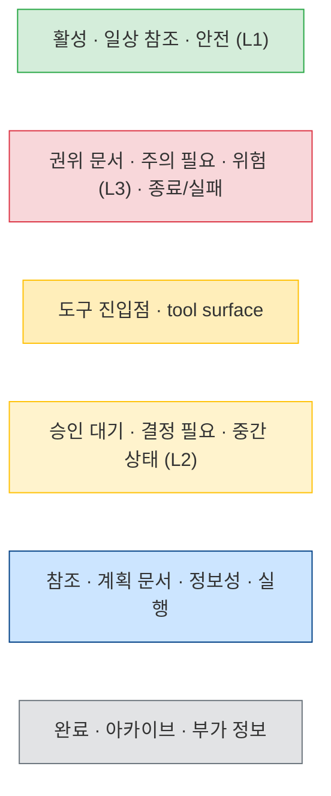

---

## 2. Directory Structure

### 2-0. Overview

최상위 구성 요소만 보여주는 전체 구조 개요다. 각 폴더의 상세 구성은 아래 2-1·2-2 다이어그램을 참조한다.

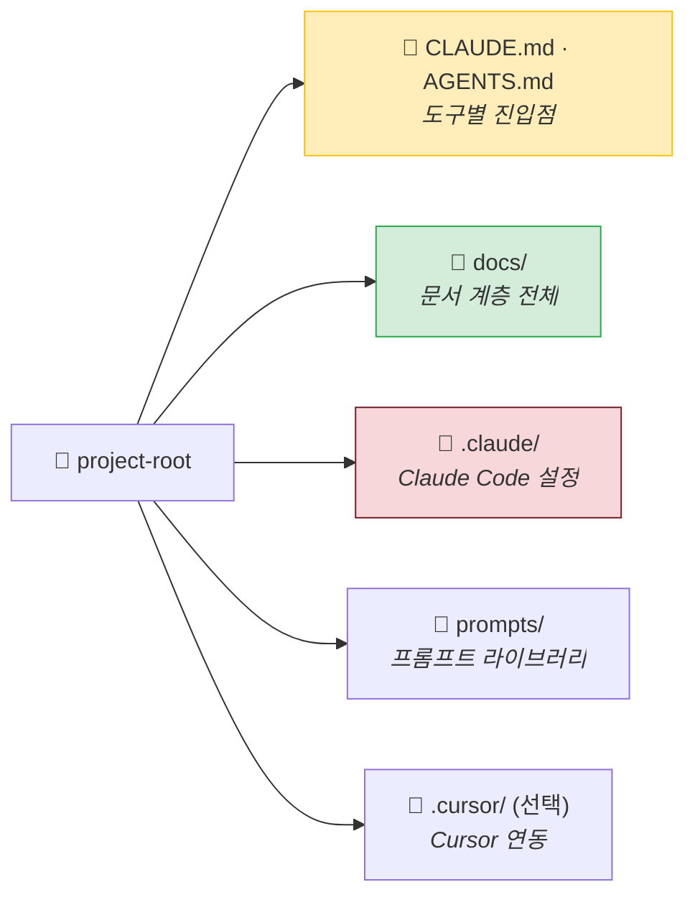

### 2-1. docs/ 상세

```mermaid
graph TD
    DOCS["📁 docs/"]

    DOCS --> GRP_HARNESS["🔧 하네스 프로토콜"]
    DOCS --> GRP_STATE["📊 상태·작업 관리"]
    DOCS --> GRP_ARCH["📐 아키텍처 문서"]
    DOCS --> GRP_HIST["🗄 이력·회고·이슈"]

    GRP_HARNESS --> AW["📄 AGENT-WORKFLOW.md<br/><i>공통 운영 규칙</i>"]
    GRP_HARNESS --> BP["📄 BEHAVIOR-PRINCIPLES.md<br/><i>전역 행동 원칙</i>"]
    GRP_HARNESS --> HP["📄 HARNESS-PROTOCOL.md<br/><i>하네스 기준</i>"]
    GRP_HARNESS --> HQ["📄 HARNESS-QUICK-REFERENCE.md<br/><i>실행 퀵 레퍼런스</i>"]
    GRP_HARNESS --> WM["📄 WORKFLOW-MANUAL.md<br/><i>사용자 매뉴얼</i>"]

    GRP_STATE --> ST["📄 STATUS.md<br/><i>라이브 상태판 (dashboard)</i>"]
    GRP_STATE --> BL["📁 backlog/<br/><i>PHASE{n}.md · HARNESS.md</i>"]
    GRP_STATE --> DR["📁 decisions/<br/><i>DR-*.md</i>"]
    GRP_STATE --> ARC["📁 archive/<br/><i>완료 Phase 이력</i>"]
    GRP_STATE --> WORKS["📁 works/<br/><i>{category}/{ID}-{topic}.md</i>"]

    GRP_ARCH --> PS["📄 PLAN-SUMMARY.md<br/><i>요약 · 세션 참조용</i>"]
    GRP_ARCH --> PL["📄 PLAN.md<br/><i>WHY — 결정 근거</i>"]
    GRP_ARCH --> AR["📄 HARNESS-ARCHITECTURE.md<br/><i>WHAT — 현재 구조</i>"]
    GRP_ARCH --> DG["📄 HARNESS-MAINTAINER-GUIDE.md<br/><i>HOW — 유지보수 가이드</i>"]

    GRP_HIST --> RETRO["📁 retrospectives/<br/><i>시점별 회고·평가</i>"]
    GRP_HIST --> TROUBLE["📁 troubleshooting/<br/><i>증상→원인→조치</i>"]

    style ST fill:#d4edda,stroke:#28a745
    style HP fill:#d4edda,stroke:#28a745
    style HQ fill:#d4edda,stroke:#28a745
    style PS fill:#cce5ff,stroke:#004085
    style PL fill:#cce5ff,stroke:#004085
```

### 2-2. .claude/ 상세

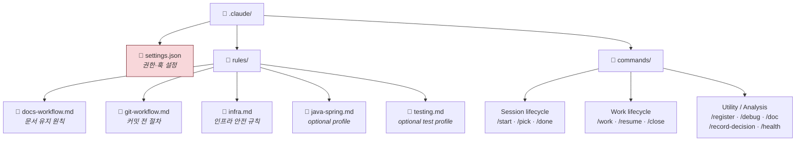

### File Classification

**독자별 분류**

| 독자 | 주요 파일 |
| --- | --- |
| 개발자 | `WORKFLOW-MANUAL.md`, `HARNESS-ARCHITECTURE.md`, `HARNESS-MAINTAINER-GUIDE.md` |
| AI 운영 공통 | `docs/BEHAVIOR-PRINCIPLES.md`, `docs/AGENT-WORKFLOW.md` (Claude Code: `CLAUDE.md` → 자동 import / Codex: `AGENTS.md` → 위임 / Cursor: `.cursor/rules/*.mdc`) |
| AI 운영 전용 | `STATUS.md`, `HARNESS-PROTOCOL.md`, `HARNESS-QUICK-REFERENCE.md`, `PLAN-SUMMARY.md`, `backlog/`, `decisions/`, `works/`, `archive/` |
| 개발자 + AI 겸용 | `PLAN-SUMMARY.md`, `GIT-WORKFLOW.md` (source repo / source-gitflow scaffold only), `PLAN.md` |
| 발표·보고 산출물 | `docs/presentations/`, `docs/reports/` |
| 역사·평가 | `docs/archive/`, `docs/retrospectives/`, reference-only plan |
| User-facing cascade 확인 | `WORKFLOW-MANUAL.md` — 평시 AI 실행 규칙 로드 대상이 아니며, 사용자-visible workflow 변경 또는 cascade 감사 시 관련 섹션만 확인 |

> 파일별 로드 조건(언제·어떤 조건에서 읽는가)은 [§4-3-B Context Load Decision](#4-3-b-context-load-decision)을 참조한다.

---

## 3. Component Role Reference

### Operating Tracks

AI Workflow Harness는 적용 대상 repository 안에서 두 트랙을 함께 운영한다.

| Track | Purpose | Primary Files |
| --- | --- | --- |
| Product track | 실제 제품/서비스/콘텐츠의 기능, 테스트, 문서, 인프라 work | `docs/backlog/PHASE{n}.md`, `docs/works/phase{n}/` |
| Harness track | AI workflow, command/rule, prompt, scaffold, status/process hardening | `docs/backlog/HARNESS.md`, `docs/works/harness/` |

이 repository를 harness 자체 개발용 source로 운영하는 경우 Product track이 비어 있을 수 있다.
반면 scaffold된 신규/기존 프로젝트는 Product track과 Harness track을 함께 갖는 것을 기본값으로 한다.

### 3-0. Document Hierarchy

§2의 위치 구조를 넘어, **파일들이 어떤 계층으로 연결되는지**를 보여주는 참조 관계도다.
cascade 흐름(어떤 변경이 어떤 문서를 연쇄 업데이트하는가)은 [§7 Trigger Cascade Overview](#trigger-cascade-overview)를 참조한다.

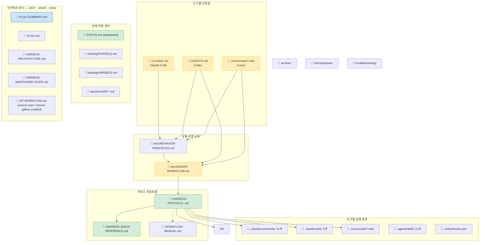

> 각 파일의 역할 설명은 아래 개별 섹션을 참조한다.

### `CLAUDE.md` (Root)

Claude Code가 세션 시작 시 자동으로 읽는 핵심 instruction 파일.
다른 프로젝트에서도 재사용 가능하게 유지한다. `@docs/BEHAVIOR-PRINCIPLES.md`와 `@docs/AGENT-WORKFLOW.md`로 전역 원칙과 프로젝트 규칙을 import한다.

포함 내용: Core Workflow MUST/NEVER, Decision Rules, Response Shape, Context Budget

### `docs/BEHAVIOR-PRINCIPLES.md`

모든 AI 도구에 적용되는 전역 행동 원칙. 코딩 전 사고, 단순함, 정밀한 변경, 목표 중심 실행, 응답 형식의 우선 기준을 정의한다.

### `docs/AGENT-WORKFLOW.md`

공통 프로젝트 운영 규칙. 세션 시작, context routing, risk gate, STATUS 규칙, verification defaults, Project Constants만 짧게 정의한다.
상세 하네스 규칙은 `docs/HARNESS-PROTOCOL.md`로 연결한다.

### `docs/STATUS.md`

프로젝트의 **현재 상태 dashboard**. 세션 간 현재 Phase, Active Work pointer, Blockers, Next Actions를 유지하는 핵심 파일.
작업 단위의 Plan, Done Criteria, Verification, Checkpoints, Discovery는 Work 파일이 SSoT다.

| 섹션 | 내용 |
| --- | --- |
| Current State | Phase, focus, product backlog, harness backlog 포인터 |
| Active Work | 현재 진행 중인 Work 파일 pointer |
| Blockers / Open Questions | 미결 결정 사항과 필요한 결정 |
| Recent Decisions | 날짜별 결정 사항 요약 |
| Next Actions | 번호 순 다음 작업 목록 |

> **규칙:** STATUS.md는 짧고 현재 중심으로 유지한다. 완료된 Phase 상세는 `docs/archive/`로 이동.

#### 섹션별 개념과 상관관계

각 섹션의 역할과 시제를 구분해서 사용해야 STATUS.md가 짧고 정확하게 유지된다.

| 섹션 | 한 줄 정의 | 시제 | 적정 규모 |
| --- | --- | --- | --- |
| Active Work | 지금 진행 중인 Work 파일 pointer | 현재 | 1~3개 |
| Blockers / OQ | 진행을 막는 것 또는 결정이 필요한 것 | 현재 (미해결) | 해소되면 Closed |
| Next Actions | 다음에 할 일 목록 | 미래 | 5개 이내 |
| Recent Decisions | 최근 결정의 digest | 과거 | rolling window 최근 8개 |

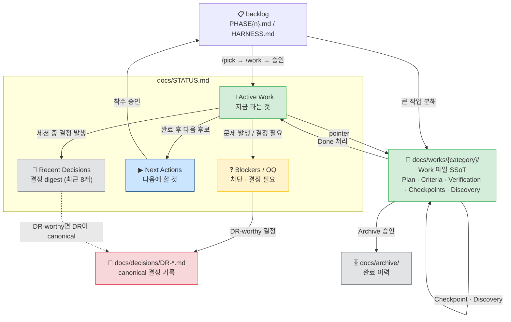

**섹션별 사용 원칙**

- **Active Work** — 동시에 1~3개가 적정. 많아지면 집중력 분산의 신호. 상세 내용은 Work 파일에 두고 STATUS.md에는 pointer만 유지한다.
- **Work 파일 Checkpoints** — L2/L3 큰 작업에만 붙인다. "이 단계까지 완료되면 중간에 멈춰도 안전한가"를 기준으로 정의. 소규모 작업에는 불필요.
- **Blockers / OQ** — Blocker는 외부 의존성으로 지금 당장 진행을 막는 것, OQ는 결정하지 않으면 방향이 갈리는 질문. OQ가 결정되면 `Closed` 처리, 중요하면 DR로 격상.
- **Next Actions** — 백로그가 아니다. "다음 세션에서 가장 먼저 볼 것" 수준의 짧은 목록. 5개를 넘으면 백로그로 내려보낼 신호.
- **Recent Decisions** — 세션 컨텍스트 복원용 digest. 영구 기록이 목적이 아니다. DR-worthy 결정은 `docs/decisions/DR-*.md`가 canonical이고 여기는 요약만. rolling window 8개 초과 시 가장 오래된 것부터 drop.

**헷갈리기 쉬운 상황별 매핑**

| 상황 | 기록 위치 |
| --- | --- |
| 새 기능 아이디어 발생 | **backlog** (Active Work 아님) |
| 착수 승인된 작업 | **Active Work** |
| 작업 중 발견한 차단 요소 | **Blockers** |
| 방향 결정이 필요한 질문 | **OQ** → 결정 후 **Recent Decisions** → 중요하면 **DR** |
| 다음 세션에 이어할 것 (단기) | **Next Actions** |
| 다음 Phase 후보 작업 (중장기) | **backlog** |
| 완료된 작업의 이력 | **archive** (STATUS.md에 남기지 않음) |

#### Work Item Routing Flow

새 항목 발생 시 어디에 등록할지 결정하는 흐름이다. `/register` 명령이 내부적으로 이 로직을 따른다.

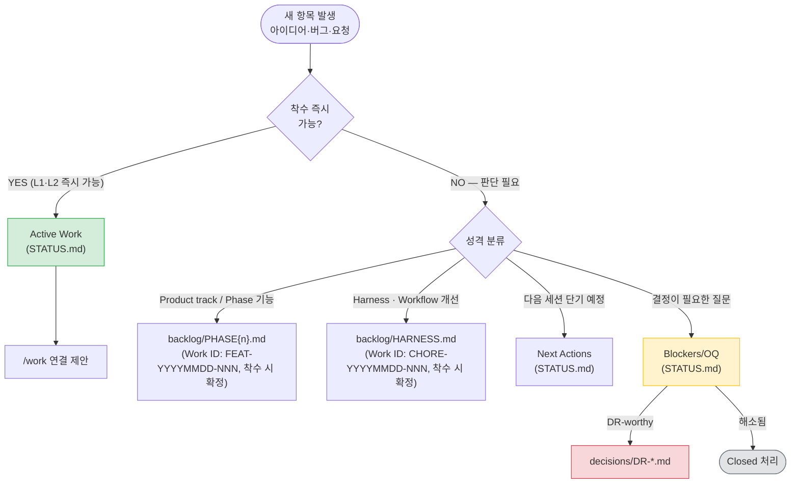

#### Archive 이동 기준과 절차

**트리거 — 다음 중 하나가 해당되면 Claude가 이동을 제안한다:**

- Phase의 모든 Checkpoint가 Done 상태로 전환되었을 때
- 새 Phase 시작 전 STATUS.md를 새 Phase 기준으로 재편할 때

**이동 대상:**

| 대상 | 상세 |
| --- | --- |
| Active Work 테이블 | 완료된 Phase 항목 전체 |
| Work 파일 | 해당 Phase의 Done/Archived Work 파일 |
| Recent Decisions | 해당 Phase 기간 항목 |

**절차:**

1. Claude가 트리거 조건 감지 시 이동을 **제안**한다 — 승인 없이 진행하지 않는다
2. 사용자 승인 후 `docs/archive/phase{n}-status.md` 파일에 이동 내용을 작성한다
3. STATUS.md에서 이동한 섹션을 제거하고 현재 Phase 내용만 유지한다
4. PLAN.md 현재 내용을 `docs/archive/phase{n}-plan.md`로 스냅샷 저장한다
5. PLAN.md를 신규 Phase 기준으로 재편 제안한다

> PLAN.md 아카이빙은 독립 트리거가 아닌 이 절차(4~5번)에 통합된다. Phase 전환 시 승인이 한 번으로 통합된다.

#### STATUS.md 안전 업데이트 규칙

STATUS.md는 세션 중 여러 단계에서 수정되므로 항상 다음 규칙을 따른다.

**수정 전:**
- 반드시 최신 내용을 재-read한다 — 세션 중 다른 변경이 반영되었을 수 있다
- Approval Matrix의 상태 변경 규칙에 맞는 제안을 먼저 보고하고 사용자 승인을 받는다
- 이미 승인된 plan에 구체적인 STATUS.md 변경 범위가 포함되어 있으면 그 승인으로 갈음할 수 있다

**수정 시:**
- 전체 overwrite 금지 — 관련 항목(행)만 수정한다
- 변경 범위 밖 내용은 그대로 유지한다

#### 실패 복구 규칙

STATUS.md가 실제 코드·파일 상태와 불일치할 경우:

- **코드를 진실로 삼는다** — STATUS.md가 아닌 실제 파일 상태가 기준이다
- 불일치 내용을 보고하고 STATUS.md 수정을 제안한다. 직접 수정은 승인 후 진행한다
- 실패한 작업은 `Failed`로 기록하고, 재시도는 신규 작업 항목으로 분리한다

> `/resume {ID}` 실행 시 이 규칙이 자동으로 적용된다. → [§5 /resume 참조](#5-slash-commands-reference)

### `docs/PLAN-SUMMARY.md`

프로젝트 요약, 핵심 구조, 검증 기본값, active references를 한 페이지로 정리한 경량 요약본. 기본적으로 아키텍처 확인이 필요할 때 이 파일을 먼저 참조하고, 전체 근거가 필요할 때만 `docs/PLAN.md`를 로드한다.

### `docs/HARNESS-ARCHITECTURE.md`

시스템 전체 구조를 Mermaid 다이어그램 중심으로 기술하는 구조 문서. entrypoint, state flow, context routing, tool surface, scaffold flow 등 **다이어그램이 중심**인 내용을 담는다. PLAN.md가 WHY(결정 근거)를 담는다면, HARNESS-ARCHITECTURE.md는 WHAT(현재 구조)을 담는다.

**업데이트 시점:** T6(harness 구조·흐름 변경 시).

**로드 조건:** 관련 섹션 수정 작업 시에만 로드. 기본적으로 로드하지 않는다.

### `docs/HARNESS-MAINTAINER-GUIDE.md`

이 repository를 정비하거나 다른 repository에 적용하려는 maintainer를 위한 실무 가이드. HARNESS-ARCHITECTURE.md가 "무엇인가(WHAT)"를 다룬다면 HARNESS-MAINTAINER-GUIDE.md는 "어떻게 하는가(HOW)"를 다룬다.

**업데이트 시점:** 새 도구 도입, scaffold 절차 변경, convention 정책 변경 시. T6 절차에서 역확인 대상이다.

**로드 조건:** 새 도구 도입 또는 convention 정책 변경 작업 시에만 로드. 기본적으로 로드하지 않는다.

### `docs/HARNESS-PROTOCOL.md`

하네스 운영 규칙의 활성 기준 문서. 상태 머신, 실행 gate, 실패 조건, 문서 lifecycle, recovery 기준을 포함한다. Agent가 따라야 하는 실행 프로토콜은 이 문서를 기준으로 판단한다.

로드 조건: [§4-3-B 참조](#4-3-b-context-load-decision)

### `docs/HARNESS-QUICK-REFERENCE.md`

세션 중 빠르게 확인하는 실행 카드. `/start`, `/work`, `/close`, `/done` 흐름에서 필요한 최소 규칙, risk level, validation, naming 규칙을 담는다. 상세 판단이 필요하면 `docs/HARNESS-PROTOCOL.md`로 올라간다.

### `docs/backlog/PHASE{n}.md`

적용 대상 프로젝트의 Product track 후보 작업 목록. 우선순위(P0~P3), 선행 조건, Done Criteria, Verification을 포함한다. `/pick` 명령에서 product/phase 작업을 고를 때의 입력 소스다.

### `docs/backlog/HARNESS.md`

AI workflow, command/rule, 문서 구조, hook/automation 후보를 관리하는 harness 전용 backlog. Product track backlog와 분리해 Phase{n} 기능 계획이 하네스 개선 작업에 묻히지 않도록 한다.

Done/Superseded 항목은 backlog에서 제거된다. 완료 이력은 Work 파일(`docs/works/harness/README.md` Archived 테이블) 또는 `git log --grep="{ID}"`에서 확인한다.

### `docs/decisions/DR-*.md`

아키텍처·전략 결정을 기록하는 Decision Record. 결정 이유, 검토된 대안, 되돌리기 비용을 포함한다. 결정이 필요한 상황에서 Open Question → DR 작성 → 결정 반영 → Closed 순서로 진행한다.

### `docs/archive/phase{n}-status.md`

완료된 Phase의 Active Work, Checkpoints, Decisions 이력을 보관하는 장기 보존 파일. STATUS.md를 현재 중심으로 유지하기 위해 완료 이력을 이쪽으로 분리한다.

### `docs/retrospectives/`

워크플로우·harness의 시점별 평가와 회고를 보관하는 폴더. Phase 전환 주기 또는 정기적인 시점(분기)에 평가 문서를 생성하고 시계열로 누적한다. `docs/archive/`가 구현 이력을 보존한다면, `docs/retrospectives/`는 **개발 방식 자체의 이력**을 보존한다.

**파일 명명 규칙:** `harness-evaluation-YYYYMMDD.md` 또는 `retrospective-YYYYMMDD.md`

### `docs/works/{category}/{ID}-{topic}.md`

Active Work로 올라온 큰 작업 하나의 Work 파일. Plan, Done Criteria, Verification, Checkpoints, Discovery를 포함한다.
일반 작업은 backlog와 STATUS.md만으로 충분해야 한다. Work 파일은 backlog를 대체하지 않는다.
Work 파일 스펙: `docs/decisions/DR-013-work-file-spec.md`

**생성 트리거 — 다음 중 둘 이상 또는 사용자 명시 요청 시 Claude가 생성을 제안한다:**

- 단일 backlog 항목이 3개 이상의 독립 서브태스크로 분해되어야 할 때
- 작업 범위가 3개 이상의 파일 또는 2개 이상의 서비스·모듈을 가로질러 상세 조율이 필요할 때
- 한 세션 안에 완료가 불확실할 때
- L3 작업일 때
- checkpoint가 2개 이상 필요할 때
- 다른 Agent 또는 도구로 인계될 가능성이 있을 때
- 사용자가 명시적으로 세부 분해를 요청할 때

Product track surface의 L1 Quick Mode에 해당하면 Work 파일 없이 완료할 수 있다.
entrypoint/workflow/protocol/command/rule/prompt/scaffold/status 파일을 건드리면 harness/workflow surface 변경으로 보고 기본 L2로 다룬다.

**착수 절차 (Backlog Candidate → Active Work):**

1. `/work {ID|title-or-slug}` 실행 — Claude가 확정 Work ID 또는 제목/slug로 backlog/Work 파일을 찾고, Work ID가 없으면 착수 승인 시 확정한다
2. Work 파일이 없고 생성 조건을 충족하면 Work 파일 생성을 계획에 포함 — 승인 없이 생성하지 않는다
3. 사용자 승인 후 실행:
   - `docs/works/{category}/{ID}-{lowercase-topic}.md` 생성
   - `docs/works/{category}/README.md` Active 테이블에 행 추가
   - State update: 대상 Work ID를 명시하고 Active Work에 Work 파일 경로 포인터 추가 제안

착수 전 분해나 메모는 backlog 항목 또는 계획 제안에 남긴다.
Work 파일은 착수 승인 후 `Active` 상태로 생성한다.

**완료 절차 (Done) — `/close`:**

Work를 완료하면 `/close`를 실행한다. 세션은 종료되지 않고 계속된다.
`/close`는 Work Done 처리이며 commit/PR 전 STATUS Finalization Gate나 Tracking Finalization Gate를 대체하지 않는다.
Review-sensitive Work는 사용자 최종 리뷰를 Done Criteria에 선택 포함한다. `/close`는 모든 Work에 사용자 리뷰를 강제하지 않지만, Done Criteria에 명시된 리뷰 조건은 Done 처리 전 반드시 확인한다.

1. Done Criteria 전부 체크됐는지 확인
2. Work 파일 frontmatter: `status: Done`, `actual_end: YYYY-MM-DD` 기입
3. `docs/works/{category}/README.md`: Active → Done (archive pending) 테이블로 이동
4. State update: Active Work 포인터 제거 제안 (Layer 2, 승인 후 처리)
5. Archive 여부 선택: 지금 바로 archive하거나 `/start`·`/resume`까지 보류

**세션 종료 — `/done`:**

`/done`은 Work Done 처리를 포함하지 않는다. Work를 완료했다면 `/close`를 먼저 실행한다.
`/done`은 세션 요약만 출력하며, Active Work가 있으면 Discovery 미기록 여부를 확인하고 기록할 내용을 제안한다.

**Archive 절차 (Done → Archived):**

Archive는 사용자가 명시적으로 승인했거나 `/start`·`/resume`에서 Done 항목 발견 후 승인한 경우에만 수행한다.

1. archive 대상 Work 파일 frontmatter: `status: Archived` 기입
2. 필요하면 Discovery에 archive 이유와 일자 기록
3. git repository가 있으면 `git mv docs/works/{category}/{file}.md docs/archive/docs/works/{category}/`
   git repository가 없으면 plain `mv` 또는 archive 보류를 제안
4. `docs/works/{category}/README.md`: Done → Archived 테이블로 이동
5. STATUS Active Work에 대상 pointer가 남아 있으면 drift로 보고하고 수정 제안

**로드 조건:** `/resume` 또는 Active Work의 세부 Checkpoint 확인 시.

**Work 파일 템플릿:**

```yaml
---
id: {ID}
priority: {P0|P1|P2|P3}
status: {Active|Done|Archived}
risk: {Low|Medium|High}
scope: {한 줄 범위 설명}
appetite: {1d|3d|1w|2w}
planned_start: YYYY-MM-DD
planned_end: YYYY-MM-DD
actual_end:
related_dr: []
related_commits: []  # best-effort related commit references
related_troubleshooting: []
---

## Plan
접근 방법. Alternatives 포함 — 왜 이 방법인지.

## Done Criteria
- [ ] 사전 정의된 완료 기준

## Verification
완료 기준 충족 확인 절차 또는 명령어.

## Checkpoints
| CP | Description | Status |
|----|-------------|--------|
| 1  | ...         | Todo   |

## Discovery
계획과 달라진 것, 새로 발견한 것, 다음 작업을 위한 인사이트.
```

상세 스펙: `docs/decisions/DR-013-work-file-spec.md`
공통 운영 규칙: `docs/HARNESS-PROTOCOL.md` Work File Rules 섹션
`related_commits`는 무결성 장치가 아니라 탐색 보조 링크다. mixed commit은 여러 Work에 같은 commit id가 들어갈 수 있으며, 필요하면 Discovery나 closeout summary에 mixed commit이라고 남긴다.

**Approval Matrix 상태 변경 규칙:**

| 변경 대상 | 변경 유형 | Gate |
| --- | --- | --- |
| Work 파일 | Checkpoint 상태 업데이트, Discovery 추가 | 승인 불필요. 실행 후 대상 Work ID와 변경 내용 보고 |
| Work 파일 | Done Criteria 전체 충족 확인, `status: Done`, `actual_end` 기입 | 대상 Work ID를 명시하고 사용자 확인 후 처리 |
| STATUS.md | Active Work pointer 추가/제거 | 대상 Work ID를 명시한 1줄 제안 후 승인 |
| STATUS.md | Phase completion criteria, Current phase/focus, Recent Decisions | `STATUS Update Proposal` 승인 후 처리 |

### `.claude/settings.json`

Claude Code 공식 설정 파일.

- `defaultMode: "plan"` — 모든 작업을 기본적으로 Plan 모드로 시작
- `permissions.deny` — 위험 명령 차단 (rm, sudo, kubectl, terraform 등)
- `hooks.Stop` — 세션 종료 전 `/done` 절차 점검 reminder (단, `/exit` 직접 입력 시에는 Claude 응답 생명주기를 거치지 않아 발동하지 않음 — `/done` 실행 후 종료 권장)

### `.claude/rules/*.md`

Path-scoped 규칙 파일. 해당 경로의 파일을 편집할 때 자동 적용된다.

| 파일 | 적용 경로 | 핵심 규칙 |
| --- | --- | --- |
| `docs-workflow.md` | 문서 전반 | STATUS.md 짧게 유지, 중복 instruction 금지 |
| `git-workflow.md` | git 작업 | status → add → status → diff --cached 순서 강제 |
| `infra.md` | infra/, Dockerfile, docker-compose | 위험도 명시, dry-run 우선, secrets 미추가 |
| `java-spring.md` | optional adopted project paths | `--profile spring-boot`에서만 포함되는 Java/Spring 보조 규칙 |
| `testing.md` | optional adopted project test paths | adopted project test convention 예시 |

### `.claude/commands/*.md`

Slash 명령 구현 파일. Claude Code에서 `/명령명`으로 호출한다. (→ [섹션 5 참조](#5-slash-commands-레퍼런스))
현재 11개: `start`, `pick`, `register`, `work`, `resume`, `debug`, `doc`, `close`, `done`, `record-decision`, `health`

### `prompts/`

Claude, Codex, Cursor에 복사해서 사용하는 재사용 프롬프트 라이브러리. Command를 쓸 수 없거나 다른 도구로 작업을 넘길 때 fallback 또는 task template로 사용한다. (→ [Appendix A 참조](#appendix-a-prompt-library-usage))

---

## 4. Workflow Diagrams

### 4-1. Full Session Lifecycle

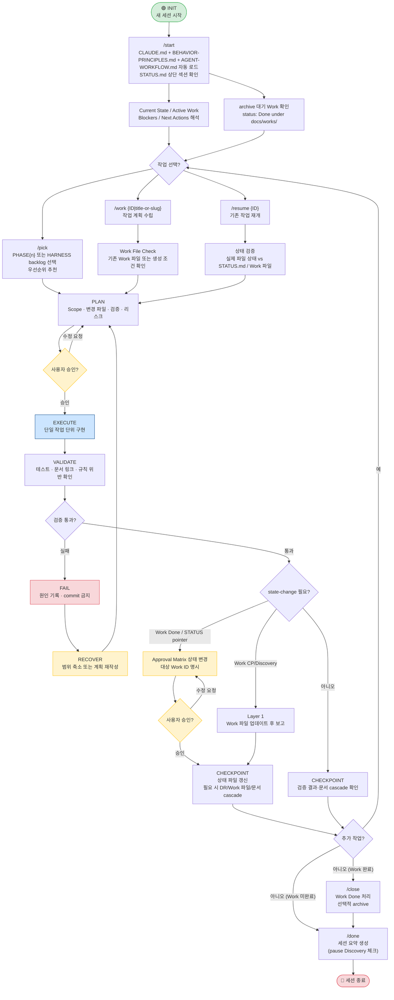

Active Work와 Next Actions가 없고 archive 대기 Work도 없으면 `/start`는 repository를 clean idle 상태로 보고한다.
이 상태에서는 과거 milestone checklist를 다음 작업 후보로 추론하지 않으며, 새 작업 선택은 `/pick`, 새 항목 등록은 `/register`로 시작한다.

### 4-2. Task Execution Flow (Plan → Approve → Implement)

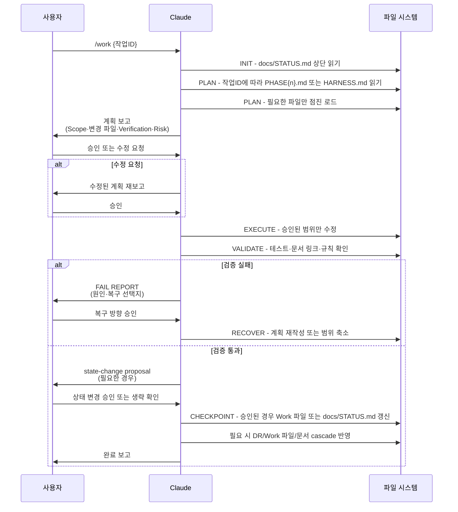

### 4-3-A. Tool Entry Point Comparison

세션 시작 시 도구별로 어떤 파일이 어떻게 로드되는지 비교한다.

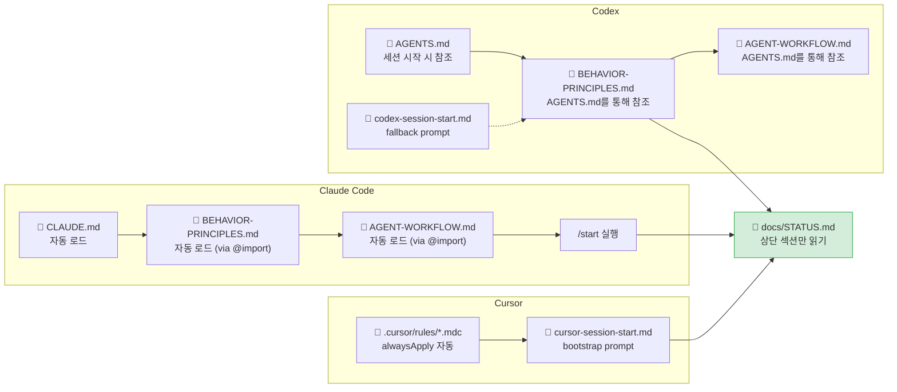

### 4-3-B. Context Load Decision

STATUS.md 확인 이후 작업 유형에 따라 어떤 문서를 추가로 로드할지 결정하는 흐름이다.
**조건이 해당되지 않으면 로드하지 않는다.**


**로드 판단 기준 요약**

| 파일 | 로드하는 경우 | 로드하지 않는 경우 |
| --- | --- | --- |
| `HARNESS-QUICK-REFERENCE.md` | workflow/harness 작업 시작; 세션 실행 규칙 확인 | product 구현만 진행 |
| `HARNESS-PROTOCOL.md` | harness 규칙 변경; command/rule 변경; 프로토콜 충돌 검토 | 단순 product 구현 |
| `PLAN-SUMMARY.md` | 기술 스택·포트·패키지 구조 확인; 새 서비스·레이어 추가 전 | 단순 버그 수정·문서 업데이트 |
| `backlog/PHASE{n}.md` | product 또는 Phase{n} 준비 작업 선택 | harness 작업 |
| `backlog/HARNESS.md` | harness·command/rule·workflow hardening 작업 선택 | product 작업 |
| `decisions/*.md` | 관련 DR이 있는 작업 시작; 아키텍처 결정이 구현에 직접 영향을 줄 때 | DR과 무관한 구현·테스트 작업 |
| `works/{category}/*.md` | 해당 Phase Work 파일 확인; 세부 분해 또는 Checkpoint 참조 요청 | 일반 작업 (backlog와 STATUS.md로 충분) |
| `archive/*.md` | 이전 Phase 구현 맥락 복원; 명시적 과거 이력 요청 | 현재 Phase 작업 |
| `PLAN.md` | PLAN-SUMMARY로 부족한 상세 근거; 아키텍처 변경; **신규 서비스·모듈; Cross-service interaction; Infra·배포 변경; DB schema 변경** | 일반 구현·디버깅 |

---

## 5. Slash Commands Reference

Claude Code에서 `/명령명`으로 호출. 파일 위치: `.claude/commands/*.md`

| 범주 | 명령 | 언제 사용 | 주요 동작 |
| --- | --- | --- | --- |
| Session lifecycle | `/start` | 세션 시작 시 | CLAUDE.md + STATUS.md 로드, 현재 상태 요약, 다음 작업 제안 |
| Session lifecycle | `/pick` | 다음 작업을 선택할 때 | backlog 후보 비교, 우선순위 추천, 관련 DR 표시, 구현 전 승인 대기 |
| Session lifecycle | `/done` | 세션 종료 시 | 완료 작업, 변경 파일, 검증 결과, 리스크, Active Work Discovery 미기록 확인, state-change proposal 필요 여부, STATUS/Tracking Finalization 결과, 다음 세션 primer 요약, DR 검토. Work Done 처리 없음 — Work를 끝내려면 `/close` 먼저 실행 |
| Work lifecycle | `/work {ID|title-or-slug}` | 특정 작업을 시작할 때 | Work File Check → 필요 시 Work ID 확정 → PLAN.md 강제 로드 조건 체크 → 위험도 판단(L1/L2/L3) → 계획 수립 → "진행할까요?" 후 대기 → DR-worthy 결정 목록 제안 |
| Work lifecycle | `/resume {ID}` | 중단된 작업을 재개할 때 | 파일 상태 vs STATUS.md / Work 파일 비교 → Done이면 재개 금지 및 archive/후속 작업 제안 → 남은 계획 제안 |
| Work lifecycle | `/close` | Work를 완료할 때 (세션 계속) | Done Criteria 확인, status/actual_end 기입, README Active→Done, STATUS pointer 제거 제안, 선택적 archive. 세션 종료나 commit/PR 전 STATUS Finalization 대체 아님 |
| Utility / Analysis | `/register [설명]` | 새 작업 항목을 등록할 때 | 긴급도·성격 판단 → STATUS Active Work / Next Actions / PHASE{n}.md / HARNESS.md 중 라우팅 → state-change proposal(필요 시) → 긴급 항목이면 /work 연결 제안 |
| Utility / Analysis | `/debug` | 버그 분석/수정 시 | 코드·로그·테스트 근거로 원인 파악, 최소 변경 계획 |
| Utility / Analysis | `/doc [brief]` | 발표·보고·리뷰 패키지·외부 공유용 문서 산출물을 만들 때 | 목적·audience·format·source brief 확정 → outline 승인 → presentation/document 도구 또는 fallback으로 산출물 생성 → 품질 검증 |
| Utility / Analysis | `/record-decision` | 기술 결정을 DR로 기록할 때 | 현재 대화의 확정 결정을 DR 초안으로 작성, 승인 후 파일 생성, Accepted DR마다 Recent Decisions 반영 필요 여부 판정 |
| Utility / Analysis | `/health` | 워크플로우·문서 점검 시 | 구조 정합성, 문서 현행화, 백로그/DR 위생 전체 점검 후 7섹션 Output Contract(Summary/Findings/Surface Coverage/Skipped/Context Budget/Verification/Follow-Ups)로 보고. `--full`은 전체 심화 점검 + Area H(Workflow Context Weight — 일상 workflow가 heavy docs를 불필요하게 로드하는지 감지), `--cascade`는 문서·워크플로우 변경의 연쇄 영향을 required surface, grep, simulation checklist로 감사 |

### Approval Matrix

실행 전 승인, 상태 변경, commit 전 승인을 한 표로 판단한다.

| 변경 유형 | 실행 전 | 상태 변경 | commit 전 |
| --- | --- | --- | --- |
| L1 Product track surface | 간단 plan 승인 후 실행. Quick Mode 가능 | Work checkpoint/discovery는 실행 후 보고 | validation 결과·diff summary·commit message 보고 후 승인 |
| L2 harness/workflow surface 또는 설정 변경 | 상세 plan 승인 후 실행. Work 파일 기본 | Work Done과 STATUS Active pointer 변경은 대상 Work ID를 명시하고 승인 후 처리 | validation 결과·diff summary·commit message 보고 후 승인 |
| L3 구조 변경 | AS-IS/TO-BE, rollback 포함 후 승인 | Phase/focus/criteria/Recent Decisions는 `STATUS Update Proposal` 승인 후 처리 | validation 결과·diff summary·commit message·rollback 단위 보고 후 승인 |

> 상세 규칙: `docs/AGENT-WORKFLOW.md` "Approval Matrix" 섹션

---

### Risk Level Classification (L1 / L2 / L3)

`/work`가 계획 수립 전에 자동으로 판단하는 위험도 기준이다.

| 레벨 | 유형 | 처리 방식 |
| --- | --- | --- |
| **L1** (안전) | 버그 수정, 테스트 코드, 문서 소폭 수정 | 계획 간소화, 승인 후 진행 |
| **L2** (일반) | 일반 기능 구현, 설정 변경 | 계획 상세화, 승인 후 진행 |
| **L3** (구조 변경) | 아키텍처·인증·인프라·DB schema 변경 | `docs/PLAN.md` 강제 로드, 엄격 승인 |

> L3에 해당하는 대표 사례: 신규 서비스·모듈 생성, Cross-service interaction 구현, Infra·배포 방식 변경, DB schema 변경. 이 경우 `docs/PLAN.md` 로드가 강제된다.

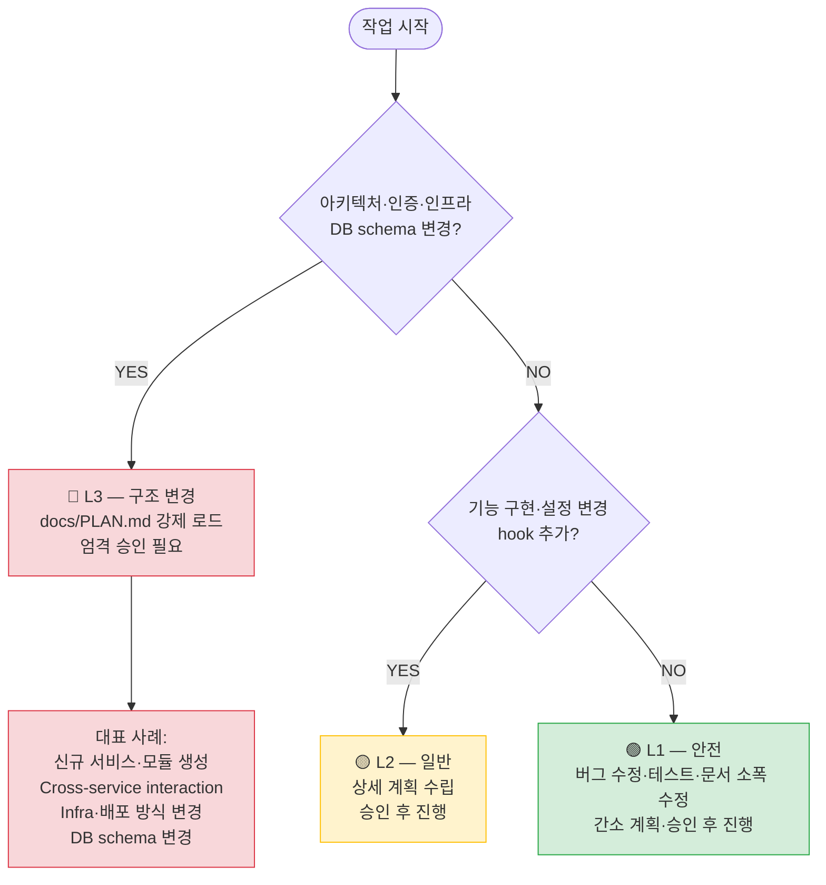

### Usage Pattern Examples

```
# 일반 세션 (Work 완료)
/start                    → 현재 상태 파악
/pick                     → 다음 작업 선택
/work PRE-A2              → PRE-A2 계획 수립
(승인 후 구현)
/close                    → Work Done 처리 (세션 계속)
/done                     → 세션 요약 및 종료

# 일반 세션 (Work 미완료, pause)
/start                    → 현재 상태 파악
/work PRE-A2              → PRE-A2 계획 수립
(승인 후 구현 — 미완료)
/done                     → Discovery 체크 후 세션 요약

# 작업 재개
/start                    → 상태 확인
/resume PRE-A3            → 이전 진행 상황 이어서

# 새 작업 등록
/register                 → 긴급도·성격 판단 후 적절한 위치에 등록
/register 긴급 보안 패치  → Active Work 등록 + /work 연결 제안

# 버그 대응
/debug                    → 원인 분석 및 수정 계획

# 발표/보고 자료
/doc "하네스 리팩터링 결과를 외부 리뷰어용 8장 발표자료로 정리"

# 워크플로우·문서 정합성 점검
/health                   → 구조·위생 Quick 점검 (주 1~2회, 작업 블록 시작 전)
/health --full            → 전체 심화 점검 (Phase 전환 전 또는 월 1회)
/health --cascade         → 문서·workflow 변경 후 canonical/tool/user/scaffold cascade 점검
/health --full --cascade  → 대형 harness 변경 또는 Phase 전환 전 최종 정밀 점검
```

### `/health` Recommended Cadence (Claude Pro)

| 모드 | 권장 주기 | 적합한 시점 |
| --- | --- | --- |
| `/health` | 주 1~2회 | 작업 블록 시작 전, 매 세션마다 실행하지 않는다 |
| `/health --full` | 월 1회 또는 Phase 전환 전 | 대규모 작업 착수 전, Phase 완료 시점 |
| `/health --cascade` | workflow/process 문서 변경 후 | canonical 문서, command/rule/prompt, manual, scaffold 사이 drift를 checklist 기반으로 확인 |
| `/health --full --cascade` | 대형 harness 변경 후 또는 Phase 전환 직전 | 전체 구조와 cascade/trigger 완전성 동시 감사 |

---

## 6. Decision Record Operations

### When to Write a DR

- 아키텍처에 영향을 주는 기술 선택 (ex. K8s 도구: Helm vs Kustomize)
- 보안·운영 방식 변경 (ex. token 저장소 전략)
- 되돌리기 비용이 Medium 이상인 결정
- Open Question이 backlog 진행을 블로킹할 때

**다음 카테고리는 DR 필수 (위 기준에 자동 해당):**
- 외부 시스템 연동 방식 (ex. 메시지 큐, 외부 인증 서버)
- 인증·보안 방식 변경 (ex. token storage 전환, 인증 흐름 변경)
- 데이터 모델(스키마) 변경 (ex. 테이블 추가·삭제, 컬럼 타입 변경)
- 인프라 구조 변경 (ex. K8s 배포 도구, DB per Service 전환)

### DR Lifecycle

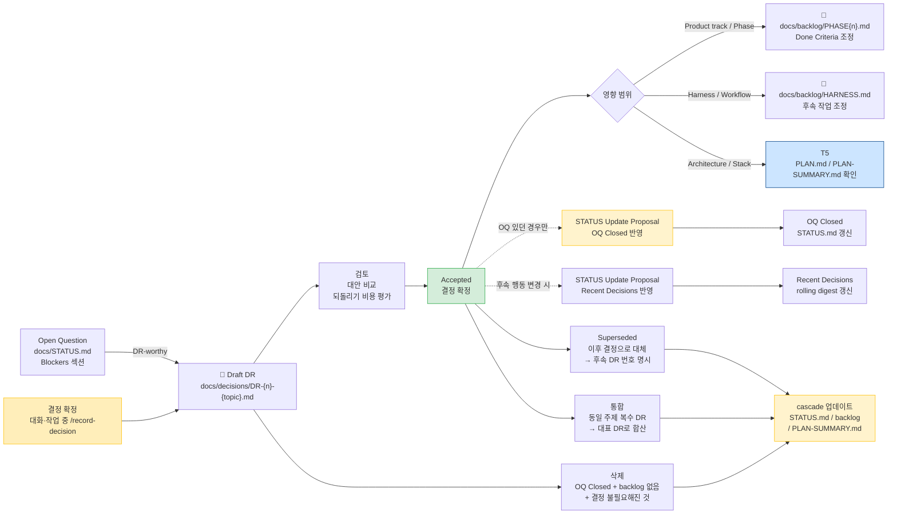

### DR File Structure

```markdown
---
id: DR-{n}
status: Draft | Accepted | Superseded
---

## Question
결정이 필요한 질문 한 문장

## Decision
최종 결정 (Accepted 이후 작성)

## Options Considered
| Option | Pros | Cons |
| --- | --- | --- |

## Rationale
선택 이유

## Reversal Cost
Low | Medium | High — 이유

## Linked Backlog Items
P2-{n}, P2-{m}
```

파일명 규칙: `DR-{3자리 번호}-{짧은-주제}.md` (ex. `DR-001-token-storage.md`)

---

## 7. Trigger Reference

Claude가 능동적으로 제안하는 모든 트리거를 한 곳에서 파악하기 위한 레퍼런스다.
각 트리거의 발동 조건, 결과, cascade 대상, 루프 안전성 주의사항을 포함한다.

### Trigger Cascade Overview

발동 조건 → Trigger → 주요 cascade 대상의 전체 흐름을 한눈에 보여주는 개요다.

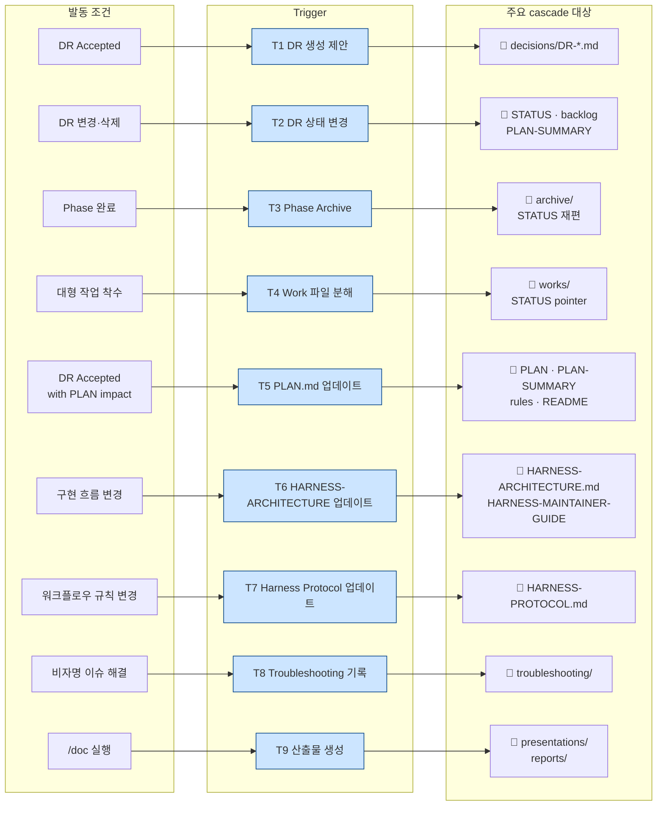

> **모든 트리거는 승인 없이 자동 실행되지 않는다.** Claude는 조건 감지 시 제안하고, 사용자 승인 후에만 실행한다.
> T1~T9의 발동 조건·cascade 상세는 아래 개별 섹션을 참조한다. T10~T14는 요약 항목이며 상세 기준은 `docs/HARNESS-PROTOCOL.md`를 따른다.

---

### Trigger Index

| ID | 이름 | 발동 조건 | 주체 | cascade 핵심 대상 |
|----|------|-----------|------|-------------------|
| T1 | DR 생성 | 계획 승인 직후 / OQ Closed 전환 / `/done` 실행 | Claude 능동 제안 | `docs/STATUS.md` Blockers/OQ |
| T2 | DR Superseded·삭제·통합 | DR 상태 변경 처리 시 | 사용자 요청 + Claude 절차 | STATUS.md, backlog, PLAN-SUMMARY.md, 연관 DR |
| T3 | Phase Archive | Phase 모든 CP Done / 새 Phase 시작 전 | Claude 능동 제안 | archive/, STATUS.md 재편, PLAN.md 재편 |
| T4 | Work 파일 분해 생성 | 2개 이상 조건 충족: 3+ 서브태스크, 3+ 파일, 2+ 서비스·모듈, L3, 다중 checkpoint, 세션 초과, 인계 가능성 / 사용자 명시 요청 | Claude 능동 제안 | `docs/works/{category}/`, STATUS Active Work pointer |
| T5 | PLAN.md 업데이트 | 아키텍처·스택·테스트·CI 영향 DR Accepted / 기술 스택 변경 | Claude 능동 제안 | PLAN-SUMMARY.md, rules, README.md, HARNESS-ARCHITECTURE.md 등 (§별 상이) |
| T6 | HARNESS-ARCHITECTURE.md 업데이트 | harness 구조·흐름 변경 / 새 tool surface 추가·제거 / scaffold flow 변경 | Claude 능동 제안 | `docs/HARNESS-ARCHITECTURE.md` 해당 섹션, PLAN.md 및 HARNESS-MAINTAINER-GUIDE.md 참조 섹션 역확인 |
| T7 | Harness protocol 업데이트 | docs/AGENT-WORKFLOW.md 워크플로우 규칙 변경 / `.claude/commands/*.md` 변경 / trigger set 변경 | Claude 능동 제안 | `HARNESS-PROTOCOL.md`, 필요 시 `WORKFLOW-MANUAL.md` |
| T8 | Troubleshooting 기록 | 비자명 이슈 해결 (환경 문제, 비직관적 원인, 도구 버전 비호환) | Claude 능동 제안 | `docs/troubleshooting/`, 필요 시 `docs/HARNESS-MAINTAINER-GUIDE.md` 링크 추가 |
| T9 | 발표/보고 산출물 생성 | `/doc` 실행 또는 발표·보고·review package 생성 요청 | Claude 능동 제안 | `docs/presentations/`, `docs/reports/`, source traceability, STATUS/backlog 참조 필요 여부 |
| T10 | Work archive 제안 | `status: Done` Work 파일이 `docs/works/{category}/`에 남아 있을 때 | Claude 능동 제안 | archive 승인 여부 제안, 승인 전 `git mv` 금지. no-git 상태에서는 plain `mv` 또는 archive 보류 제안 |
| T11 | Tool surface 정렬 | command/rule/prompt/entrypoint 변경 | Claude 능동 제안 | Claude(`.claude/commands/`, `.claude/rules/`)/Codex(`.agents/skills/`, `.codex/hooks.json`)/Cursor(`.cursor/rules/`)/prompts/scaffold 정합성 확인 |
| T12 | Scaffold 검증 | `scripts/create-harness.sh` 또는 canonical workflow 변경 | Claude 능동 제안 | `scripts/create-harness.sh`가 있으면 dry-run, temp scaffold 생성, stale phrase 검색. scaffold 적용 repository처럼 script가 없으면 Skipped / Not Applicable |
| T13 | Product track Quick Mode 확인 | Product track surface의 L1 작은 변경 | Claude 판단 | no Work/no STATUS 기본 |
| T14 | Harness/workflow surface 변경 | entrypoint/workflow/protocol/command/rule/prompt/scaffold/status 변경 | Claude 능동 제안 | 기본 L2로 scope/cascade 확인 |
| T15 | STATUS Finalization | commit 또는 PR 생성 전 | Claude/Codex/Cursor commit gate | `docs/STATUS.md` 최종본 반영 필요 여부, 필요 시 Approval Matrix proposal |
| T16 | Tracking Finalization | commit 또는 PR 생성 전 | Claude/Codex/Cursor commit gate | backlog/Work/DR tracker 최종 상태 반영 필요 여부, 필요 시 tracker 파일 갱신 |

---

### T1 — DR Creation

**발동 조건 (다음 중 하나):**
- 계획 승인 직후 — 해당 계획의 DR-worthy 결정 목록화 후 일괄 제안
- `docs/STATUS.md` Open Question이 Closed로 전환될 때
- `/done` 실행 시 세션 중 확정된 결정 검토 단계

**결과:** `docs/decisions/DR-XXX.md` 초안 파일 생성 제안 (승인 후 실행)

**cascade:**
- `docs/STATUS.md` Blockers/OQ — 연관 OQ에 DR 번호 기입
- (DR Accepted 후) → T5 발동 가능 (아키텍처 영향 시)

**루프 안전:** T1 → T5 → STATUS.md 확인 → OQ 재검토 방향으로 이어질 수 있으나,
새로 생성된 DR은 Draft 상태이므로 T5를 재발동시키지 않는다. 루프 없음.

---

### T2 — DR Superseded / Deletion / Merge

**발동 조건:** DR을 삭제·통합·Superseded 처리할 때

| 유형 | 판단 기준 |
|------|-----------|
| 삭제 후보 | Draft 장기 유지 + 연결 backlog 없음 + 관련 OQ Closed |
| 통합 후보 | 동일·유사 주제 복수 DR 분산 |
| Superseded 후보 | 이후 결정으로 실질적 대체, status가 여전히 Accepted |

**결과:** DR 파일 상태 변경 (승인 후 실행)

**cascade:**

| 파일 | 업데이트 내용 |
|------|--------------|
| `docs/STATUS.md` Recent Decisions | 해당 항목 제거 또는 수정 |
| `docs/STATUS.md` Blockers/OQ | 연관 OQ Closed 처리 |
| `docs/backlog/PHASE{n}.md` | DR 번호 참조 항목 수정 |
| `docs/PLAN-SUMMARY.md` | 의사결정 기록 참조 범위 수정 |
| 연관 DR 파일 | Superseded 시 후속 DR 번호 명시 |

**루프 안전:** T2 cascade에 PLAN-SUMMARY.md가 포함되고, T5 cascade에도 PLAN-SUMMARY.md가 포함된다.
같은 세션에서 T2가 먼저 PLAN-SUMMARY.md를 수정한 경우, T5의 PLAN-SUMMARY.md 항목은 재편집 없이 확인만 한다.

**발견 시점:** `/health` E영역 DR 위생 점검 시 후보 식별 → cascade 대상 목록 함께 제시

---

### T3 — Phase Archive

**발동 조건 (다음 중 하나):**
- Phase의 모든 Checkpoint가 Done 상태로 전환되었을 때
- 새 Phase 시작 전 STATUS.md를 새 Phase 기준으로 재편할 때

**결과 (승인 후 순서대로 실행):**
1. `docs/archive/phase{n}-status.md` — STATUS.md 완료 이력 저장
2. STATUS.md에서 완료된 섹션 제거, 현재 Phase 내용만 유지
3. `docs/archive/phase{n}-plan.md` — PLAN.md 현재 내용 스냅샷 저장
4. PLAN.md를 신규 Phase 기준으로 재편 제안

> **PLAN.md 아카이빙은 이 트리거에 통합된다.** 독립된 별도 트리거 없음.
> Phase 전환 시 승인이 한 번으로 통합된다.

**루프 안전:** T3 완료 후 신규 Phase 시작 → T5 발동 가능 (새 Phase의 첫 DR Accepted 시).
T3 자체가 T5를 즉시 발동시키지는 않는다. 루프 없음.

---

### T4 — Work File Decomposition

**발동 조건 (다음 중 둘 이상 또는 사용자 명시 요청):**
- 단일 backlog 항목이 3개 이상의 독립 서브태스크로 분해되어야 할 때
- 작업 범위가 3개 이상의 파일 또는 2개 이상의 서비스·모듈을 가로질러 상세 조율이 필요할 때
- 한 세션 안에 완료가 불확실할 때
- L3 작업일 때
- checkpoint가 2개 이상 필요할 때
- 다른 Agent 또는 도구로 인계될 가능성이 있을 때
- 사용자가 명시적으로 세부 분해를 요청할 때

**결과 (승인 후 실행):**
- `docs/works/{category}/{ID}-{lowercase-topic}.md` Work 파일 생성
- `docs/works/{category}/README.md` Active 섹션에 항목 추가
- 착수 승인 시 STATUS.md Active Work에 Work 파일 pointer 추가 제안

**cascade:** Work 파일과 category index를 갱신한다. 착수 상태가 되면 STATUS Active Work pointer를 Approval Matrix의 상태 변경 규칙에 따라 제안한다.

**루프 안전:** T4는 Work 파일 생성과 pointer 제안까지만 수행한다. 생성된 Work 파일의 내용은 별도 작업 실행으로 다룬다.

---

### T5 — PLAN.md Update

**발동 조건 (다음 중 하나):**
- DR Accepted 중 §2 기술 스택·§14 테스트 전략·§15 K8s·§16 Secure Coding에 영향을 주는 것
- 기술 스택 추가·교체·제거

**결과:**
- 영향받는 §(섹션)만 수정 — 전체 재작성 금지
- 문서 헤더 버전/날짜 갱신

**cascade (변경 섹션별):**

| 변경 섹션 | 확인 대상 |
|-----------|-----------|
| §2 기술 스택 | `docs/PLAN-SUMMARY.md`, `.cursor/rules/execution.mdc`, `README.md` 기술 스택 테이블 |
| §4 디렉토리 구조 | `docs/HARNESS-MAINTAINER-GUIDE.md`, `docs/HARNESS-ARCHITECTURE.md §2`, `README.md` 프로젝트 구조 섹션 |
| §8 인증/인가 | `docs/HARNESS-ARCHITECTURE.md` 관련 섹션 |
| §10 Logging | `docs/HARNESS-ARCHITECTURE.md` 관련 섹션 |
| §14 테스트 전략 | `.claude/rules/testing.md`, `.cursor/rules/testing.mdc` |
| §15 K8s | `docs/HARNESS-ARCHITECTURE.md` 관련 섹션 |
| §16 Secure Coding | `docs/HARNESS-MAINTAINER-GUIDE.md`, `docs/HARNESS-ARCHITECTURE.md` 관련 섹션 |
| §19 Phase 계획 | `docs/backlog/PHASE{n}.md`, `docs/backlog/HARNESS.md`, `docs/STATUS.md` Next Actions |

> T5 cascade에서 HARNESS-ARCHITECTURE.md가 확인 대상인 섹션은 T6와 중복 처리하지 않는다. 확인만 한다.

**중요:** PLAN.md 문서 현행화 작업 자체는 DR 기록 불필요 — 기존 DR 결정의 결과를 문서에 반영하는 것이므로 `/done` 시 DR 제안 대상에서 제외한다.

**루프 안전:**
- T5 완료 후 PLAN-SUMMARY.md 수정 → PLAN-SUMMARY.md 변경 자체는 T5를 재발동시키지 않는다
- T5 cascade로 HARNESS-ARCHITECTURE.md를 수정해도 T6를 재발동시키지 않는다
- T5 발동원(DR Accepted)과 T5 결과(문서 현행화)는 서로 다른 레이어이므로 순환 없음

---

### T6 — HARNESS-ARCHITECTURE.md · HARNESS-MAINTAINER-GUIDE.md Direct Update

**발동 조건 (다음 중 하나):**
- harness 구조·흐름 변경 (entrypoint, state machine, context routing 다이어그램 영향)
- 새 tool surface 추가 또는 제거 (tool surface model 다이어그램 영향)
- scaffold flow 변경 (scaffold sequence 다이어그램 영향)

> T5 cascade로 커버되지 않는 **구현 변경 주도** 업데이트가 대상.
> T5가 먼저 발동되어 HARNESS-ARCHITECTURE.md를 확인·수정한 경우 T6는 발동하지 않는다.

**결과 (승인 후 실행):**
- `docs/HARNESS-ARCHITECTURE.md` 해당 섹션 수정 (Mermaid 다이어그램 포함)
- `docs/HARNESS-MAINTAINER-GUIDE.md` 관련 섹션 역확인 (변경 필요 시 함께 수정)

**절차:**
1. 영향받는 섹션만 수정 (Mermaid 다이어그램 포함) — 전체 재작성 금지
2. PLAN.md 및 HARNESS-MAINTAINER-GUIDE.md 참조 섹션 역확인

**루프 안전:** T6 결과(HARNESS-ARCHITECTURE.md 수정)는 T5 또는 T1을 재발동시키지 않는다.

---

### T7 — Harness Protocol Update

**발동 조건 (다음 중 하나):**
- `docs/AGENT-WORKFLOW.md` 워크플로우 규칙 변경 (컨텍스트 로드 조건, DR 기준, STATUS 규칙, 실패 복구 규칙 등)
- `.claude/commands/*.md` 내용 변경
- trigger set 추가·변경

**cascade (섹션별):**

| 변경 원인 | 확인 대상 섹션 |
|-----------|----------------|
| 컨텍스트 로드 조건 변경 | `docs/HARNESS-PROTOCOL.md`, 필요 시 이 문서 §4-3-B |
| 슬래시 커맨드 변경 | `docs/HARNESS-PROTOCOL.md`, `docs/HARNESS-QUICK-REFERENCE.md`, 필요 시 이 문서 §5 |
| DR 기준 변경 | `docs/HARNESS-PROTOCOL.md`, 필요 시 이 문서 §6 |
| 트리거 추가·변경 | `docs/HARNESS-PROTOCOL.md`, 필요 시 이 문서 §7 |

**사용자 매뉴얼 동기화 기준:** `WORKFLOW-MANUAL.md`는 사용자에게 보이는 흐름, 명령 설명, 문서 위치, 트리거 레퍼런스가 달라질 때만 함께 갱신한다. Agent 실행 규칙만 바뀐 경우에는 protocol 문서만 갱신한다.

**루프 안전:** T7 결과(protocol 또는 WORKFLOW-MANUAL.md 수정)는 다른 트리거를 재발동시키지 않는다.

---

### T8 — Troubleshooting Log

**발동 조건 (다음 중 하나):**
- 환경 설정 문제가 해결되었을 때 (도구 버전 비호환, OS·Docker 설정 등)
- 비직관적 원인의 오류가 해결되었을 때 (로그에 나타나지 않는 근본 원인 등)
- 재현이 어려운 이슈가 해결되었을 때

> DR이 필요한 *결정*이 아니라, 증상 → 원인 → 조치 흐름으로 설명되는 *해결 내역*이 대상.

**결과 (승인 후 실행):**
- `docs/troubleshooting/{lowercase-hyphenated}.md` 신규 생성 또는 업데이트
- `docs/troubleshooting/README.md` 인덱스 항목 추가
- 필요 시 `docs/HARNESS-MAINTAINER-GUIDE.md` 관련 섹션에 링크 추가

**cascade:**
- 결정이 포함된 경우 T1(DR 생성) 병행 제안 — DR과 troubleshooting은 독립적으로 공존 가능

**루프 안전:** T8 결과(troubleshooting 파일 생성)는 다른 트리거를 재발동시키지 않는다.

---

### T9 — Presentation/Report Artifact Creation

**발동 조건 (다음 중 하나):**
- `/doc` 명령 실행
- 발표자료, 보고서, review package, decision brief 생성 요청
- 기존 STATUS/backlog/DR/retrospective를 기반으로 외부 공유용 산출물을 만들 때

**결과 (승인 후 실행):**
- `docs/presentations/` 또는 `docs/reports/` 하위 산출물 생성
- 산출물 brief: purpose, audience, format, source, length, quality bar
- source traceability와 output path 기록

**cascade:**
- 산출물이 현재 상태 추적에 필요하면 Approval Matrix의 상태 변경 규칙에 맞는 제안
- 산출물 작성 중 source 문서 오류를 발견하면 즉시 수정하지 않고 별도 작업 또는 state-change proposal로 분리

**루프 안전:** T9 결과물은 source 문서를 직접 수정하지 않는다. source 변경이 필요하면 별도 작업으로 분리한다.

---

## Appendix A. Prompt Library Usage

### Structure

```
prompts/
├── README.md                    ← 프롬프트 선택 가이드 (먼저 읽기)
├── claude-session-start.md      ← Claude fallback 세션 부트스트랩
├── codex-session-start.md       ← Codex fallback 세션 부트스트랩
├── cursor-session-start.md      ← Cursor 세션 부트스트랩
├── 00-generic-task.prompt.md    ← 범용 태스크
├── 01~20-*.prompt.md            ← 상황별 재사용 프롬프트
├── 21-create-layer.prompt.md    ← profile별 선택 프롬프트 예시
└── 22-minimal-diff.prompt.md    ← 최소 변경 원칙
```

### Quick Selection Guide

| 상황 | 추천 프롬프트 |
| --- | --- |
| 새 기능 추가 | `03-add-single-feature` |
| 버그 재현·수정 | `17-reproduce-and-fix` |
| 테스트 작성 | `06-write-tests-first` |
| 리팩토링 | `07-refactor-code` |
| 보안 검토 | `04-security-review` |
| 성능 개선 | `12-performance-fix` |
| Spring 레이어 생성 | `21-create-layer` |
| 최소 변경 작업 | `22-minimal-diff` |
| 세션 요약 | `20-summarize-work` |

### Usage

1. `prompts/README.md`에서 적합한 프롬프트를 찾는다
2. 해당 `.prompt.md` 파일을 열어 플레이스홀더(`[...]`)를 채운다
3. Claude Code 프롬프트 입력창에 붙여넣는다

> Slash Command vs 프롬프트: Slash Command는 반복적인 repo-local workflow(start/close/done/debug)에, 프롬프트 라이브러리는 다른 AI 도구로도 옮길 수 있는 task brief(레이어 생성, 테스트 작성 등)에 사용한다. 경계가 애매한 항목은 `prompts/README.md`의 HRN-004 분류 기준을 따른다.

---

## Appendix B. New Project Initialization

이 구조를 새 프로젝트 또는 기존 프로젝트에 적용하는 두 가지 케이스를 다룬다.
핵심은 `CLAUDE.md`와 `docs/AGENT-WORKFLOW.md`는 작게 유지하고, 실제 하네스 운영 규칙은 `docs/HARNESS-PROTOCOL.md`로 분리하는 것이다.

### Quick Start — Scaffolding Script

`scripts/create-harness.sh`로 하네스 파일 구조를 자동 생성한다. 두 개의 독립 옵션으로 출력을 조정한다:

- `--profile`: project template 선택. 기본값 `generic`은 언어·프레임워크를 가정하지 않으며, Java/Spring example pack이 필요할 때만 `--profile spring-boot`를 추가한다.
- `--workflow`: workflow policy mode 선택. 기본값 `generic`은 project-specific branch/release policy를 유지하고, `--workflow source-gitflow`는 `docs/GIT-WORKFLOW.md`(Gitflow 브랜치 정책, Branch Isolation Gate 포함)를 추가 생성한다. 새 repo에서도 feature→develop→main 운영 모델을 그대로 적용하고 싶을 때 선택한다.

Codex는 `AGENTS.md`를 기본 진입점으로 쓰고 첫 요청은 `/start` intent로 시작하며, `codex-session-start.md`는 수동 bootstrap이 필요한 환경의 fallback이다.
Source repository의 scaffold 부팅 설계 기준은 `docs/SCAFFOLD-BOOTSTRAP.md`이고, 생성된 프로젝트에는 project-local checklist인 `docs/BOOTSTRAP.md`가 만들어진다.

#### 케이스 A — 신규 프로젝트

아무것도 없는 상태에서 시작한다. 스크립트가 모든 하네스 파일과 빈 skeleton 문서를 생성한다.

```bash
# 기본: temp/my-app/ 하위에 생성
scripts/create-harness.sh my-app

# 경로 직접 지정
scripts/create-harness.sh my-app /path/to/my-app

# 생성 파일 목록 미리 확인 (실제 생성 안 함)
scripts/create-harness.sh --dry-run my-app

# Java/Spring example pack까지 포함
scripts/create-harness.sh --profile spring-boot my-app

# Gitflow 브랜치 정책 포함 (docs/GIT-WORKFLOW.md + Branch Isolation Gate)
scripts/create-harness.sh --workflow source-gitflow my-app /path/to/my-app
```

생성 후 필수 입력 파일:

```
docs/BOOTSTRAP.md      ← 프로젝트 identity와 production 성격 기반 setup checklist
docs/STATUS.md         ← 프로젝트 목표와 Phase 1 설명
docs/PLAN-SUMMARY.md   ← Project Summary와 Implementation Baseline
docs/PLAN.md           ← Project Initialization Plan
docs/backlog/PHASE1.md ← baseline 완료 후 도출한 초기 작업 항목 (Work ID는 /work 착수 시 확정)
```

#### 케이스 B — 기존 프로젝트

이미 코드가 있는 프로젝트에 하네스를 추가한다. `--existing` 플래그를 사용하면 **기존 파일을 덮어쓰지 않고** 하네스 파일만 추가한다.

```bash
# 기존 프로젝트 루트에 하네스 추가
scripts/create-harness.sh --existing my-app /path/to/existing-project

# 추가될 파일 목록 미리 확인
scripts/create-harness.sh --dry-run --existing my-app /path/to/existing-project

# 기존 Java/Spring 프로젝트에 example pack까지 추가
scripts/create-harness.sh --existing --profile spring-boot my-app /path/to/existing-project
```

기존 파일이 없으면 생성, 있으면 건너뜀. `--existing` 모드에서는 target path가 필수이며, `--dry-run`은 실제 target 기준으로 `create`/`skip` 계획을 출력한다. 실행 후 `docs/BOOTSTRAP.md`, `docs/STATUS.md`, `docs/PLAN-SUMMARY.md`, `docs/backlog/PHASE1.md`, `docs/AGENT-WORKFLOW.md`의 Project Constants를 기존 프로젝트 상태에 맞게 채운다.

#### 스크립트 포함 파일

| 파일 / 디렉토리 | 방식 | 비고 |
| --- | --- | --- |
| `CLAUDE.md`, `AGENTS.md` | 복사 | scaffold source project name → 프로젝트명 치환 |
| `.claudeignore`, `.cursorignore`, `.gitignore` | 복사 | 범용 — 언어 무관 |
| `README.md` | 생성 | 하네스 skeleton (프로젝트 설명 placeholder 포함) |
| `docs/BOOTSTRAP.md` | 생성 | scaffold 직후 Repository Setup, Product Definition, Project Initialization, backlog, example pack boot checklist |
| `docs/BEHAVIOR-PRINCIPLES.md` | 복사 | 전역 행동 원칙 |
| `docs/AGENT-WORKFLOW.md` | 생성 | Project Constants와 Verification Defaults placeholder 포함 |
| `docs/HARNESS-PROTOCOL.md`, `HARNESS-QUICK-REFERENCE.md`, `WORKFLOW-MANUAL.md` | 복사 | core workflow docs |
| `docs/HARNESS-NAMING-RULES.md`, `HARNESS-RECOVERY-VALIDATION.md`, `HARNESS-PARALLEL-WORK-CONTROLS.md` | 복사 | 조건부 policy slice |
| `docs/HARNESS-ARCHITECTURE.md`, `HARNESS-MAINTAINER-GUIDE.md` | 복사 | 구조·유지보수 reference |
| `docs/STATUS.md`, `PLAN.md`, `PLAN-SUMMARY.md` | 생성 | 빈 skeleton |
| `docs/backlog/PHASE1.md`, `HARNESS.md` | 생성 | 빈 skeleton |
| `docs/decisions/DECISION-TEMPLATE.md` | 복사 | DR 템플릿만 (기존 DR은 제외) |
| `docs/decisions/DR-007-language-policy.md`, `DR-008-docs-filename-standard.md`, `DR-013-work-file-spec.md` | 복사 | 하네스 foundational DR. 생성 문서의 language/file/work spec 참조 무결성 보존용 |
| `docs/reports/.gitkeep`, `docs/presentations/.gitkeep` | 생성 | `/doc` 산출물 기본 위치 |
| `docs/troubleshooting/README.md` | 생성 | troubleshooting 작성 규칙 skeleton |
| `.claude/settings.json` | 생성 | permission deny와 Stop hook reminder를 포함한 범용 버전 |
| `.claude/rules/*.md`, `.claude/commands/*.md` | 복사 | 기본 profile은 generic rules만 포함 |
| `.agents/skills/workflow-*/SKILL.md` | 복사 | Codex workflow skills |
| `.codex/hooks.json` | 복사 | Codex Stop hook reminder |
| `.cursor/rules/*.mdc` | 복사 | 기본 profile은 generic rules, `behavior-principles.mdc`, `safety-critical.mdc`, `role-harness-maintainer.mdc` 포함 |
| `prompts/*.md` | 복사 | 기본 profile은 generic prompt만 포함 |
| `docs/GIT-WORKFLOW.md` | 생성 | **`--workflow source-gitflow` 전용.** `policy_type: source-gitflow` marker 포함. Branch Isolation Gate 활성화 및 Gitflow 브랜치 정책 정의 |

`--workflow source-gitflow` 추가 포함:

- `docs/GIT-WORKFLOW.md` — Gitflow 브랜치 전략, Branch Isolation Rule, Release Cycle 정의 (`policy_type: source-gitflow` marker로 `/work`, `/close` Branch Isolation Gate 활성화)

`--profile spring-boot` 추가 포함:

- `.claude/rules/java-spring.md`
- `.cursor/rules/java-spring.mdc`
- Java/Spring example prompts (`02-scaffold-service`, `04-security-review`, `08-split-service`, `10-add-validation`, `11-add-resilience`, `12-performance-fix`, `13-add-metrics`, `14-write-migration`, `18-add-cache`, `21-create-layer`)

스크립트가 복사하지 않는 것: 현재 Phase 데이터(`PHASE{n}.md`), 프로젝트 특화 DR(`DR-*.md`), 과거 이력(`docs/archive/`), 프로젝트 특화 troubleshooting 사례.

---

### First Session Guide

#### 케이스 A — 신규 프로젝트 첫 세션

스캐폴딩 직후 `docs/BOOTSTRAP.md`, `docs/STATUS.md`, `docs/PLAN-SUMMARY.md`, `docs/PLAN.md`, `docs/backlog/PHASE1.md`를 채워야 한다. 첫 `/start`는 `docs/STATUS.md` Next Actions만 확인하고, 그 항목이 scaffold bootstrap/onboarding을 가리킬 때 `docs/BOOTSTRAP.md`를 후속으로 읽도록 제안한다. 첫 세션에서는 Project identity, Product Definition, Project Initialization baseline을 먼저 정리하고, `docs/PLAN-SUMMARY.md` Implementation Baseline이 완료된 뒤 Product track backlog를 도출한다. AI workflow 자체의 개선 항목과 example pack 정비는 `docs/backlog/HARNESS.md`로 분리한다. Bootstrap onboarding을 진행할 때는 `docs/BOOTSTRAP.md` §8 prompt를 사용한다. 완료 후에는 `docs/STATUS.md` Next Actions에서 scaffold bootstrap/onboarding 항목을 제거하거나 다음 실제 작업으로 교체한다.

```text
docs/BEHAVIOR-PRINCIPLES.md, docs/AGENT-WORKFLOW.md, docs/STATUS.md, docs/BOOTSTRAP.md를 읽어줘.

새 프로젝트 정보:
- 목표: [한 문장]
- production 성격: [product / service / library / content / research / internal tool 등]
- 기술 스택: [언어, 프레임워크, DB, 배포 환경]
- Phase 1 초기 범위: [첫 단계에서 만들 것]
- 제약 조건: [성능, 보안, 일정 등 있다면]

이 정보를 바탕으로 Project identity, Product Definition, Project Initialization, Harness track 정비 항목, example pack 정비 항목을 분리해서 아래 파일을 채울 내용을 Approval Matrix의 상태 변경 규칙에 맞게 제안해줘.
- docs/BOOTSTRAP.md: identity, production 성격, setup checklist
- docs/STATUS.md: Phase 목표, 첫 Active Work 항목
- docs/PLAN-SUMMARY.md: Project Summary와 Implementation Baseline 초안
- docs/PLAN.md: Project Initialization Plan 초안
- docs/backlog/PHASE1.md: Implementation Baseline 완료 후 도출할 초기 작업 후보 (Work ID는 /work 착수 시 확정)
- docs/backlog/HARNESS.md: AI workflow와 example pack 정비 후보
- docs/AGENT-WORKFLOW.md: Project Constants, Verification Defaults

파일 수정은 내 승인 전까지 하지 마.
```

승인 후 바로 작업으로 이어갈 수 있다:

```bash
/start          # STATUS 확인 및 현재 상태 요약
/pick           # 첫 작업 후보 추천
/work [title-or-slug]    # 선택한 작업 계획 수립 (Work ID는 착수 승인 시 확정)
```

#### 케이스 B — 기존 프로젝트 첫 세션

하네스가 설치되었지만 skeleton 문서는 비어 있다. 먼저 기존 코드베이스를 파악하고 현재 상태를 반영한 문서를 만든다.

```text
docs/BEHAVIOR-PRINCIPLES.md, docs/AGENT-WORKFLOW.md, docs/STATUS.md, docs/BOOTSTRAP.md를 읽어줘.

기존 프로젝트에 하네스를 새로 적용했어. 먼저 현황을 파악해야 해.

아래 파일을 읽어서 프로젝트 구조와 현재 product backlog 후보를 파악해줘:
- [기존 README 또는 기술 명세 파일]
- [주요 설정 파일 — package.json / build.gradle.kts / pyproject.toml 등]
- [소스 디렉토리 구조가 보이는 파일]

파악한 내용을 바탕으로 Project identity, Product track, Harness track, example pack 정비 항목을 분리해서 아래를 Approval Matrix의 상태 변경 규칙에 맞게 제안해줘:
- docs/BOOTSTRAP.md: 현재 identity, production 성격, setup checklist
- docs/STATUS.md: 현재 Phase, 진행 상태, 남은 작업 요약
- docs/PLAN-SUMMARY.md: 현재 프로젝트 요약, 핵심 구조, 검증 기본값
- docs/backlog/PHASE1.md: 남은 product 작업 후보 (Work ID는 /work 착수 시 확정)
- docs/backlog/HARNESS.md: AI workflow와 example pack 정비 후보
- docs/AGENT-WORKFLOW.md: Project Constants, Verification Defaults

파일 수정은 내 승인 전까지 하지 마.
```

Claude가 코드베이스를 파악하고 state-change proposal을 제시하면 승인한다. 이후 `/pick`으로 작업을 선택해 바로 이어갈 수 있다.

---

### Manual Initialization Checklist

스크립트를 사용하지 않고 수동으로 구성할 때 참고한다.

#### 전제 조건

- Claude Code CLI 설치 완료
- Git 저장소 초기화 완료
- 프로젝트 목표, 기술 스택, 초기 범위(Phase 1 범위) 확정
- product 작업과 harness 작업을 분리해 관리할지 결정

#### Step 1 — 핵심 Instruction 파일

- [ ] **`CLAUDE.md`** (루트, 영어) 생성
  - Core Workflow MUST/NEVER
  - Decision Rules
  - Response Shape (결론 → 변경/계획 → 검증 → 리스크)
  - Context Budget (`docs/STATUS.md`, `docs/PLAN-SUMMARY.md` 포인터)
  - `@docs/BEHAVIOR-PRINCIPLES.md`, `@docs/AGENT-WORKFLOW.md` import 라인 추가

- [ ] **`docs/BEHAVIOR-PRINCIPLES.md`** 생성
  - 모든 AI 도구에 적용되는 전역 행동 원칙
  - 코딩 전 사고, 단순함, 정밀한 변경, 목표 중심 실행, 응답 형식

- [ ] **`docs/AGENT-WORKFLOW.md`** (한국어) 생성
  - 자동 로드되는 최소 운영 규칙만 포함
  - Session Startup 절차 (`STATUS.md` 상단 확인)
  - Context Routing (`PHASE{n}.md` vs `HARNESS.md`)
  - Project Constants (Runtime, Framework, Base Package 등)
  - Verification Defaults
  - Language Rules
  - 상세 규칙은 `docs/HARNESS-PROTOCOL.md`로 링크

#### Step 2 — Harness protocol 문서

- [ ] **`docs/HARNESS-PROTOCOL.md`** 생성
  - 상태 머신: `INIT -> PLAN -> APPROVAL -> EXECUTE -> VALIDATE -> CHECKPOINT -> END`
  - 실패 흐름: `FAIL -> RECOVER -> PLAN`
  - 문서 지도, 아이템 위치 결정표, trigger/cascade 요약

- [ ] **`docs/HARNESS-QUICK-REFERENCE.md`** 생성
  - 세션 시작, 작업 선택, risk gate, validation, naming 규칙 요약

- [ ] **`docs/WORKFLOW-MANUAL.md`** 생성 여부 결정
  - 사람이 보는 사용자 매뉴얼이 필요할 때만 생성
  - Agent 실행 규칙 원본으로 사용하지 않는다

#### Step 3 — 상태 및 계획 문서

- [ ] **`docs/PLAN-SUMMARY.md`** 생성
  - 기술 스택 (Runtime, Framework, DB, 주요 라이브러리)
  - 서비스 포트 매핑
  - 핵심 아키텍처 결정 (패키지 구조, 에러 코드 패턴 등)

- [ ] **`docs/PLAN.md`** 생성
  - 전체 기술 근거와 아키텍처 상세
  - 초기에는 간략히 작성 후 점진적으로 보완

- [ ] **`docs/STATUS.md`** 생성
  - Current State 테이블 (Phase, active plan, product backlog, harness backlog 포인터)
  - Active Work pointer 테이블
  - Blockers / Open Questions 섹션
  - Recent Decisions 섹션
  - Next Actions 섹션

#### Step 4 — 작업 관리 문서

- [ ] **`docs/backlog/PHASE1.md`** 생성
  - product 또는 프로젝트 산출물 후보 작업 목록
  - ID, Priority, Scope, Done Criteria, Verification 포함

- [ ] **`docs/backlog/HARNESS.md`** 생성
  - AI workflow, command/rule, 문서 구조, hook/automation 후보 작업 목록
  - 작업 착수 시 `CHORE-YYYYMMDD-NNN` 형식의 Work ID 사용. backlog 후보는 제목/slug로만 관리 (ID는 착수 시 확정)

- [ ] **`docs/decisions/`** 폴더 생성
  - `DECISION-TEMPLATE.md` 복사
  - 착수 전 결정이 필요한 항목은 Open Question으로 STATUS.md에 먼저 등록

- [ ] **`docs/archive/`** 폴더 생성 (비워두기)

- [ ] **`docs/works/phase1/`** Work 파일 생성 여부 결정
  - 기본값은 생성하지 않는다
  - 대형 작업 분해 조건이 충족될 때만 생성한다 (DR-013 참조)
  - 생성 시 category README와 STATUS Active Work pointer 필요 여부도 함께 확인한다

#### Step 5 — Claude Code 설정

- [ ] **`.claude/settings.json`** 작성
  ```jsonc
  {
    "permissions": {
      "defaultMode": "plan",
      "deny": [
        "Read(./.env)", "Read(./.env.*)", "Read(./secrets/**)",
        "Bash(sudo *)", "Bash(rm -rf*)", "Bash(rm -r *)",
        "Bash(kubectl *)", "Bash(terraform *)"
      ]
    },
    "hooks": {
      "PostToolUse": [/* 프로젝트 특화 hook */],
      "Stop": [
        {
          "hooks": [
            {
              "type": "command",
              "command": "python3 -c \"print('[hook] 세션 종료 전 확인: Work가 완료됐다면 /close를 먼저 실행하고, 그다음 /done으로 validation, STATUS/Tracking Finalization, Approval Matrix에 따른 상태 변경 필요 여부, DR-worthy 결정, commit 상태를 보고하세요.')\""
            }
          ]
        }
      ]
    }
  }
  ```

- [ ] **`.claude/rules/`** 파일 복사 및 프로젝트에 맞게 조정
  - `docs-workflow.md` — 문서 유지 원칙
  - `git-workflow.md` — 커밋 전 절차 (변경 불필요)
  - `infra.md` — 인프라 안전 규칙
  - `java-spring.md` → 사용 언어/프레임워크에 맞게 수정
  - `testing.md` → 프로젝트 테스트 전략에 맞게 수정

- [ ] **`.claude/commands/`** 파일 11개 복사 및 프로젝트 Phase명·backlog 경로 조정
  - `start.md`, `pick.md`, `register.md`, `work.md`, `resume.md`, `debug.md`, `doc.md`, `close.md`, `done.md`, `record-decision.md`, `health.md`
  - 새 프로젝트 시작점이 Phase 1이면 `PHASE1.md`를 product backlog로 사용
  - harness 작업은 `docs/backlog/HARNESS.md`를 사용하도록 유지
  - 복사한 command/rule 안의 프로젝트명, Phase명, verification command를 점검

#### Step 6 — 프롬프트 라이브러리

- [ ] **`prompts/`** 디렉토리 복사
  - `claude-session-start.md`, `codex-session-start.md`, `cursor-session-start.md` 복사 후 프로젝트명 수정
  - 태스크 프롬프트는 필요한 것만 선택적으로 유지
  - `README.md` 업데이트
  - 반복 실행 절차와 중복되는 항목은 `.claude/commands/`로 옮길지 별도 검토

#### Step 7 — Cursor 연동 (선택)

- [ ] **`.cursor/rules/`** 파일 생성
  - `workflow.mdc` (alwaysApply) — command intent recognition, work item routing
  - `execution.mdc` (alwaysApply) — build, test, verification commands
  - `coding.mdc`, `output-format.mdc`, `testing.mdc`, `git-commit.mdc`, `debugging.mdc`
  - 언어·프레임워크별 rule은 프로젝트에 맞게 수정
- [ ] **`.cursorignore`** 업데이트 (빌드 산출물, 민감 파일 제외)

#### Step 8 — 초기 세션 검증

```bash
# Claude Code 시작 후
/start
# → CLAUDE.md, docs/BEHAVIOR-PRINCIPLES.md, docs/AGENT-WORKFLOW.md 로드 확인
# → STATUS.md Current State / Active Work / Next Actions 확인

/pick
# → product backlog와 harness backlog가 분리되어 추천되는지 확인

/work {초기 작업 ID}
# → PLAN -> APPROVAL -> EXECUTE 흐름으로 진입하는지 확인

/health
# → command/rule/protocol/backlog/문서 링크 상호 일치 여부 확인
# → 이상 없으면 개발 시작
```

### Claude-Assisted Initialization Prompt

기존 또는 신규 프로젝트에서 Claude에게 docs/ 구조 설계를 요청할 때:

```
이 저장소의 Claude 운영 구조를 참고해서 새 프로젝트용 AI 작업 문서 구조를 설계해줘.

새 프로젝트 정보:
- 목표: [한 문장]
- 기술 스택: [언어, 프레임워크, DB, 배포 환경]
- 제약 조건: [성능, 보안, 호환성, 일정 등]
- 우선순위: [가장 중요한 것]
- 초기 범위: [Phase 1에서 만들 것]

다음 파일 구조를 기준으로 초안을 제안해줘.

- CLAUDE.md (루트, 영어)
- docs/AGENT-WORKFLOW.md (한국어, 공통 운영 규칙)
- docs/STATUS.md (Current State·Active Work pointer·OQ·Next Actions 스켈레톤)
- docs/HARNESS-PROTOCOL.md (상태 머신·문서 지도·trigger/cascade 상세 protocol)
- docs/HARNESS-QUICK-REFERENCE.md (세션 실행 규칙 요약)
- docs/PLAN-SUMMARY.md (기술 스택·포트·핵심 아키텍처)
- docs/PLAN.md (전체 기술 근거, 초기에는 간략히)
- docs/backlog/PHASE1.md (Product track 후보 작업)
- docs/backlog/HARNESS.md (harness·command·rule·automation 후보 작업)
- docs/decisions/ (DECISION-TEMPLATE.md 포함)
- docs/archive/ (빈 폴더)
- docs/WORKFLOW-MANUAL.md (선택, 사용자 매뉴얼)
- .claude/settings.json (defaultMode=plan, 금지 명령 목록)
- .claude/rules/ (docs-workflow, git-workflow, infra, [언어]-[프레임워크], testing)
- .claude/commands/ (start, pick, work, resume, debug, done, record-decision, health)
- .cursor/rules/ (선택, Cursor를 사용할 경우)
- prompts/ (필요한 태스크 프롬프트 라이브러리)

구현이나 파일 생성은 내가 승인한 뒤 진행해줘.
```

---

## Appendix C. Language Rules Summary

| 파일 유형 | 언어 | 이유 |
| --- | --- | --- |
| `CLAUDE.md` (루트) | 영어 | Claude instruction: token 효율, 준수율 향상 |
| `.claude/rules/*.md` | 영어 | Claude가 직접 처리하는 규칙 파일 |
| `.cursor/rules/*.mdc` | 영어 | Cursor가 직접 처리하는 규칙 파일 |
| `.claude/settings.json` 설정 key와 command 구조 | 영어 | 도구 설정과 shell command |
| `.claude/settings.json` hook 출력 메시지 | 한국어 (기술 용어는 영어) | 사용자와 세션에 보이는 안내 |
| `docs/*.md`, `docs/backlog/`, `docs/decisions/` | 한국어 (기술 용어는 영어) | 사람이 읽는 문서 |
| `.claude/commands/*.md` | 한국어 (기술 용어는 영어) | 사용자가 직접 읽고 수정 |
| `prompts/*.md` | 한국어 (기술 용어는 영어) | 사용자가 직접 읽고 복사 |
| Java 인라인 주석 | 한국어 이유 + 영어 기술 용어 | WHY는 한국어, 기술 용어는 영어로 유지 |

> **기술 용어 번역 금지:** `@Transactional`, `N+1`, `Circuit Breaker`, `HttpOnly Cookie`, `Plan Mode` 등은 영어 원문을 유지한다.

### Bilingual Rules

"한국어 주 언어" 파일(docs/, commands/, prompts/ 등)에서 한영 혼용 시 다음 4가지 규칙을 준수한다.
(DR-007 Amended 2026-05-16 공식화 — 상세: `docs/decisions/DR-007-language-policy.md`)

| Rule | 원칙 | 예시 |
| --- | --- | --- |
| **Section & Title** | 섹션명·타이틀은 영문 Title Case로 표기, 한국어 번역 사용 금지 | Active Work, Next Steps, Rationale |
| **Technical Identity** | 기술 스택명·Framework·Architecture 패턴은 영어 원문 유지 | Kubernetes, Microservices, CI/CD, Spring Boot |
| **Jargon & Metrics** | 실무 관용어·성능 지표는 영문 표기 | Pain Point, Latency, Throughput, Backlog |
| **Grammar Continuity** | 영문 명사 뒤 한글 조사·어미는 자연스럽게 결합 | "Kafka를 활용하여", "CI/CD Pipeline을 통해" |


---

*Last updated: 2026-05-17*
*이 문서는 사용자 매뉴얼이다. Claude instruction은 `CLAUDE.md`와 `docs/AGENT-WORKFLOW.md`, 하네스 실행 프로토콜은 `docs/HARNESS-PROTOCOL.md`를 따른다. AI는 평시 실행 규칙 확인을 위해 이 문서를 로드하지 않고, user-facing workflow 변경 또는 cascade 감사가 필요할 때 관련 섹션만 확인한다.*
