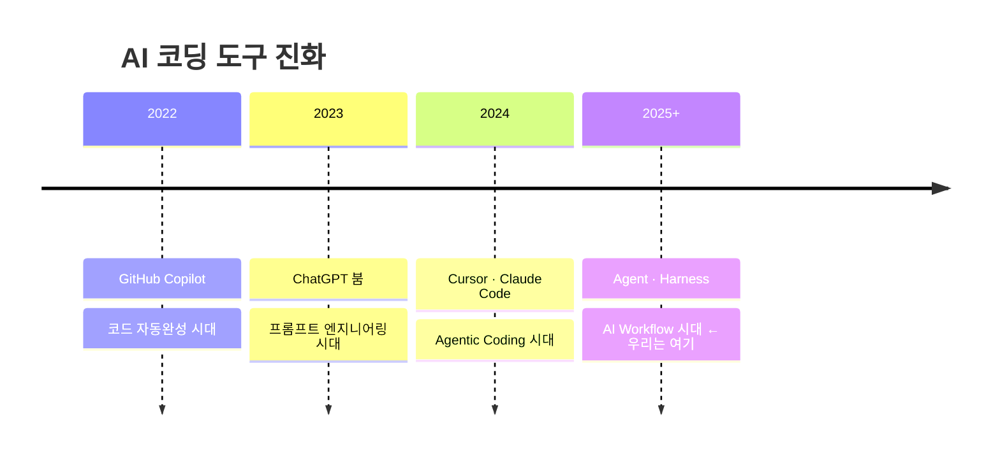
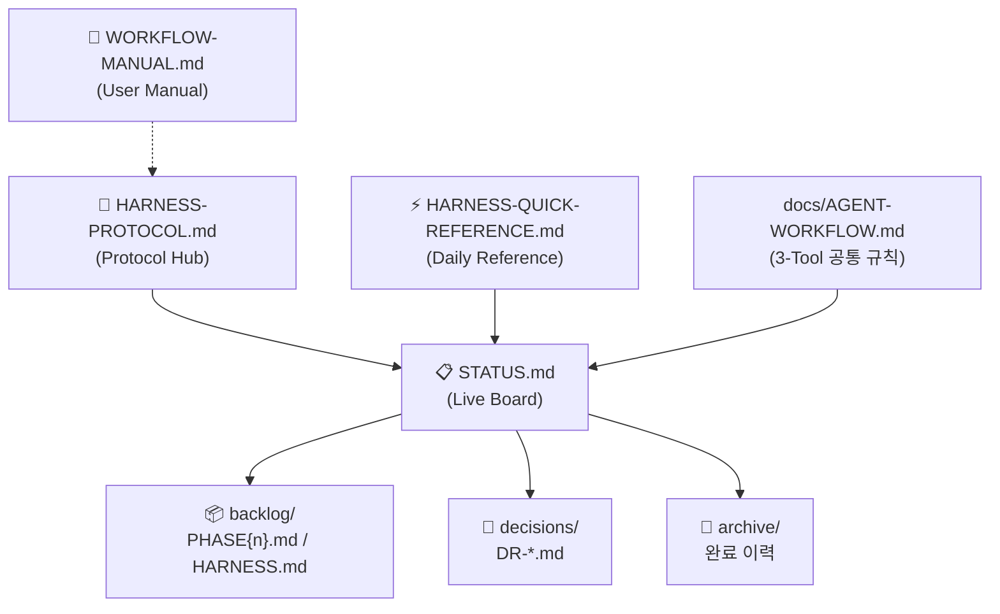
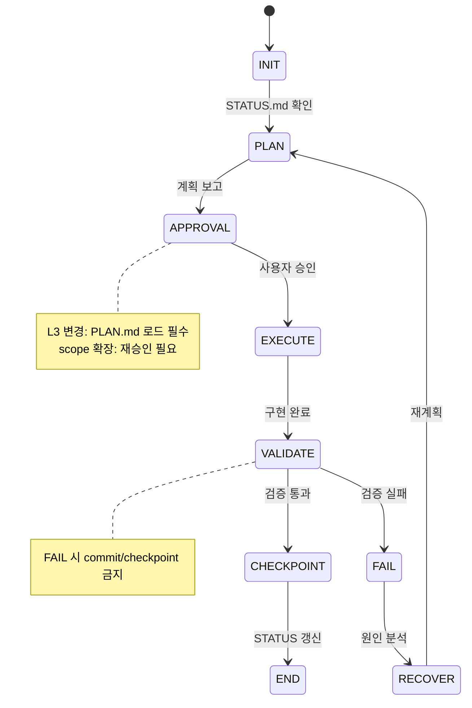
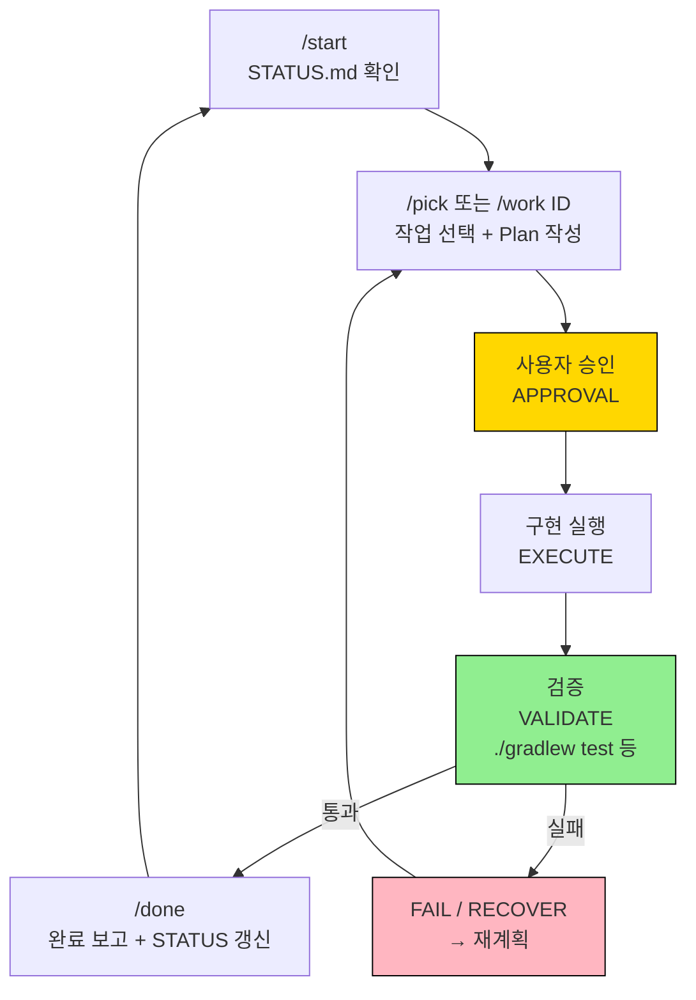

# Presentation Blueprint

```
Title:      AI와 함께 개발하기: Vibe Coding & AI Workflow Harness 실전 입문
Version:    v1.0
Author:     박경서 <Kyungseo.Park@gmail.com>
Date:       2026-05-16
Target:     26 slides / 30 min
Audience:   AI 코드 생성 경험 있지만 Workflow/Harness에 미숙한 기본 개발자
Final Deck: docs/presentations/harness-v1-team-intro-v1.0.pptx
```

---

## Brief Alignment

| Attribute | Decision |
| --- | --- |
| Purpose | 팀 내부 발표 — AI Workflow Harness v1 소개 및 Vibe Coding 실전 경험 공유 |
| Audience | AI 코드 생성 경험 있지만 Workflow/Harness에 미숙한 기본 개발자 |
| Format | PPTX 초안 (Markdown blueprint → python-pptx 렌더링). 추후 template 적용 전제. |
| Source Context | `docs/STATUS.md`, `docs/PLAN-SUMMARY.md`, `docs/AGENT-WORKFLOW.md`, `docs/HARNESS-PROTOCOL.md`, `docs/retrospectives/harness-evaluation-20260514.md`, `git log` |
| Tone & Style | Pedagogical — 직접 경험 기반, 실용적이고 진솔한 어조. 개념은 쉽게, 구조는 도식 중심으로. |
| Quality Bar | 기승전결 흐름 유기적, 복잡한 구조는 줄글 없이 diagram으로 시각화, 각 슬라이드 source 추적 가능. |

## Narrative Spine

1. AI 코딩 도구는 개인 생산성을 높여주지만, 팀 단위로 함께 쓰려면 문화와 워크플로우가 먼저 정립되어야 한다.
2. 이 프로젝트는 실전 Spring Boot MSA 개발 위에서 AI Workflow Harness를 동시에 검증하는 구조로 설계됐다.
3. 12일, 125 커밋의 여정을 통해 Phase 1 MSA와 Harness v1이 동시에 완성됐다.
4. Vibe Coding은 강력하지만 워크플로우 없이는 기술부채로 귀결된다는 핵심 한계를 가진다.
5. Harness v1은 이 한계를 4원칙(Deterministic / Stateful / Controlled / Failure-first)과 STATUS.md 중심 문서 생태계로 해결한다.
6. 상태 머신(PLAN → APPROVAL → EXECUTE → VALIDATE)과 3-Tool 운영 구조로 재현 가능한 세션을 구현한다.
7. 신규 프로젝트에도 3단계(스캐폴딩 → 첫 커밋 → 첫 세션)로 즉시 Harness를 붙일 수 있다.
8. v1은 Manual-first 기반이며, v2에서 Hook/CI 자동화로 발전한다.

## Concept Model

- **Vibe Coding:** AI와 함께 빠르게 만들고 실행하는 개발 방식. 워크플로우 없이 쓰면 맥락 유실·결정 표류·scope drift로 귀결.
- **AI Workflow Harness:** Vibe Coding의 자유도를 유지하면서 재현성·추적성·팀 공유 가능성을 확보하는 운영 체계.
- **4 설계 원칙:** Deterministic(같은 절차로 재개) / Stateful(STATUS.md 상태 유지) / Controlled(Plan→Approve 게이트) / Failure-first(FAIL/RECOVER 경로 사전 명시).
- **상태 머신:** INIT → PLAN → APPROVAL → EXECUTE → VALIDATE → CHECKPOINT → END. VALIDATE 실패 시 FAIL → RECOVER → 재계획.
- **STATUS.md:** 모든 세션과 도구가 공유하는 현재 상태의 단일 기준(SSOT). 4개 섹션: Current State / Active Work / Recent Decisions / Next Actions.
- **3-Tool 구조:** Claude Code(`.claude/commands/`) / Cursor(`.cursor/rules/`) / Codex(`AGENTS.md`) — 공통 규칙은 `docs/AGENT-WORKFLOW.md`.

## Source Traceability

| Topic | Source |
| --- | --- |
| 현재 상태 / 작업 이력 | `docs/STATUS.md` |
| 아키텍처 요약 | `docs/PLAN-SUMMARY.md` |
| Harness 평가 / Manual-First 포지셔닝 | `docs/retrospectives/harness-evaluation-20260514.md` |
| Protocol 구조 / 운영 규칙 | `docs/HARNESS-PROTOCOL.md`, `docs/harness-protocol/*.md` |
| 3-Tool 공통 운영 규칙 | `docs/AGENT-WORKFLOW.md` |
| 스캐폴딩 스크립트 | `create-harness.sh` |
| 사용자 매뉴얼 | `docs/WORKFLOW-MANUAL.md` |
| 정량 지표 (커밋 수, 기간) | `git log --oneline` |

## Validation Checklist

- [ ] v1.0 blueprint와 최종 PPTX slide count(26장) 일치
- [ ] 기승전결 내러티브 흐름이 유기적
- [ ] 복잡한 구조는 줄글 없이 diagram/ASCII로 시각화
- [ ] 각 슬라이드 Source 필드가 내부 문서와 일치
- [ ] DR-007 Bilingual Rules 적용
- [ ] Production Spec 색상/폰트 적용 확인
- [ ] Action Title이 결론을 담은 선언형 문장
- [ ] Mermaid 다이어그램은 이미지 pre-render 후 삽입 계획 확인

## Residual Risks

- Korean 폰트("Apple SD Gothic Neo") 미설치 환경에서 대체 폰트 적용 필요.
- Mermaid 다이어그램(Slide 12, 14, 20)은 PPTX에 직접 삽입 불가 — 이미지로 pre-render 후 삽입 필요.
- Screenshot 슬라이드(Slide 16, 21, 22)는 `docs/STATUS.md`와 `.claude/commands/` 실제 파일 캡처 필요.
- 청중의 AI 도구 사용 경험 수준에 따라 PART 2 설명 깊이 조정 필요.

---

## SLIDE 01 — 표지

**Action Title:** AI와 함께 개발하기: Vibe Coding & AI Workflow Harness 실전 입문

**Layout Intent:** 풀 화면 표지. 제목 대형 Bold, 하단 메타 정보.

```
┌─────────────────────────────────────────────────────────┐
│                                                         │
│                                                         │
│   AI와 함께 개발하기                                     │
│   Vibe Coding & AI Workflow Harness 실전 입문            │
│                                                         │
│                                                         │
│   ─────────────────────────────────────────────         │
│   v1.0  |  박경서 <Kyungseo.Park@gmail.com>             │
│   2026-05-16                                            │
│                                                         │
└─────────────────────────────────────────────────────────┘
```

**Speaker Notes:**
오늘 발표는 단순한 도구 소개가 아닙니다. AI와 함께 일하는 방식 자체를 어떻게 설계할 수 있는지, 실제 프로젝트로 검증한 경험을 공유합니다.

**Source:** —

---

## SLIDE 02 — 목차

**Action Title:** 4개의 파트로 여정을 따라갑니다

**Layout Intent:** 2×2 카드 그리드

```
┌──────────────────────┬──────────────────────┐
│  PART 1              │  PART 2              │
│  프로젝트 개요        │  AI 트렌드 & 기초     │
│                      │                      │
│  왜 시작했고         │  Vibe Coding이란      │
│  어디까지 왔나        │  무엇인가             │
├──────────────────────┼──────────────────────┤
│  PART 3              │  PART 4              │
│  Harness v1 개요     │  적용 가이드          │
│                      │                      │
│  구조와 철학          │  실전 사용법          │
└──────────────────────┴──────────────────────┘
```

**Source:** —

---

## ── PART 1: 프로젝트 개요 ──────────────────────────

---

## SLIDE 03 — 왜 시작했나 (PART 1 · 1/5)

**Action Title:** AI 코딩 시대, 팀 개발 문화를 먼저 정립해야 한다

**Layout Intent:** Mermaid timeline (top) + 3 bullet points + caption (bottom)

**Mermaid:**


**Body:**
- 개인 생산성은 AI가 높여준다 — 이미 입증됨
- 팀 단위 AI 워크플로우가 없으면? → 각자 다른 방식으로 AI를 쓰고, 맥락은 흩어지고, 결과물 품질은 제각각
- **이 프로젝트의 목적**: 팀이 함께 쓸 수 있는 AI 개발 문화·환경 정립

**Caption:** "도구를 쓰는 것과 도구를 잘 쓰는 것은 다르다. 팀 단위 AI 워크플로우가 필요한 이유."

**Speaker Notes:**
AI 코딩 도구는 이미 개인 생산성은 높여주고 있습니다. 그런데 팀 단위에서 AI를 어떻게 쓸지, 어떤 컨텍스트를 유지하고 어떤 결정을 기록할지를 정하지 않으면 팀 코드베이스는 AI가 만들어낸 "읽기 어려운 것들"로 채워지기 쉽습니다.

**Source:** `docs/STATUS.md § Current State`, general industry context

---

## SLIDE 04 — 프로젝트의 두 축 (PART 1 · 2/5)

**Action Title:** 실전 MSA 개발 위에서 AI 워크플로우를 동시에 검증한다

**Layout Intent:** Full-slide ASCII block diagram — 두 축(Product / Harness)을 좌우로 배치

**ASCII 모형도:**
```
┌─────────────────────────────────────────────────────┐
│               base-msa-template                     │
│                                                     │
│  ┌───────────────────┐    ┌───────────────────────┐ │
│  │   PRODUCT AXIS    │    │    HARNESS AXIS        │ │
│  │                   │    │                        │ │
│  │  Spring Boot MSA  │    │  AI Workflow Harness   │ │
│  │  Template         │◄──►│  v1                    │ │
│  │                   │    │                        │ │
│  │ · Gradle 멀티모듈  │    │ · STATUS.md (상태)     │ │
│  │ · API Gateway     │    │ · Commands (워크플로우) │ │
│  │ · JWT Auth        │    │ · State Machine        │ │
│  │ · Testcontainers  │    │ · 3-Tool 지원          │ │
│  │ · K8s (Phase 2)   │    │ · Scaffolding          │ │
│  └───────────────────┘    └───────────────────────┘ │
│                                                     │
│      "제품 개발 + 워크플로우 구축을 동시에 검증"       │
└─────────────────────────────────────────────────────┘
```

**Caption:** "단순 실험이 아닌 실전 타겟(MSA) 위에서 구축 — 상호 검증 구조"

**Speaker Notes:**
단순 AI 도구 실험이 아니라, 의미 있는 개발 타겟(실전 수준 MSA 템플릿)을 잡고 AI 워크플로우를 함께 구축합니다. 제품을 만들면서 워크플로우가 실제로 동작하는지 검증하고, 워크플로우가 개선되면서 제품 개발도 더 안정적이 되는 구조입니다.

**Source:** `docs/PLAN-SUMMARY.md`, `docs/ARCHITECTURE.md`

---

## SLIDE 05 — 개발 여정 타임라인 (PART 1 · 3/5)

**Action Title:** 12일, 125 커밋 — Phase 1과 Harness v1을 동시에 완성했다

**Layout Intent:** Horizontal timeline (top) + metrics card (right)

**Timeline 도식:**
```
May 05─────────May 07──────May 11~12──────May 14~15──────May 16
  │                │             │              │             │
  ▼                ▼             ▼              ▼             ▼
Block 3~5       Block 7~10    AI Workflow    Harness        v1 완성
MSA 기능 구현   MSA Phase 1   정합성 시도    리팩토링       + 문서화
시작            완료          + 첫 회고       (HRF) +        완료
                                            하드닝 (HRN)

──────── MSA Product 개발 ──────────────── Harness 진화 ──────────
```

**수치 카드 (우측):**
```
┌─────────────────┐
│  총 커밋   125  │
│  기간      12일  │
│  ─────────────  │
│  feat:      14  │
│  docs:      41  │
│  fix:        5  │
│  chore+     28  │
│  refactor       │
└─────────────────┘
```

**Caption:** "docs 커밋 41개 — 코드만큼 문서에 투자한 이유: AI가 읽는 문서이기 때문"

**Source:** `git log --oneline`, `docs/STATUS.md § Active Work`

---

## SLIDE 06 — 현재 단계 + v2 계획 (PART 1 · 4/5)

**Action Title:** Phase 1 · Harness v1 완료 — Phase 2와 v2를 향해 준비됨

**Layout Intent:** 2-column split (Now / Next)

**2-column 단계 도식:**
```
지금 (완료)                          다음 (계획)
────────────────────────             ────────────────────────
PRODUCT: Phase 1 ✅                  PRODUCT: Phase 2
 · Gradle 멀티모듈 구조               · K8s 배포 구조
 · JWT Auth + Redis Blacklist         · Security Hardening
 · API Gateway + Rate Limiting        · Prometheus / Grafana
 · Testcontainers 통합 테스트          · DB per Service

HARNESS: v1 ✅                       HARNESS: v2
 · Manual-First Protocol              · Hook 기반 자동 강제
 · 3-Tool 운영 구조                    · CI Gate 검증
 · STATUS.md 상태 관리                 · SSOT Config 도입
 · Scaffolding 스크립트               · 자동 drift 탐지
```

**Speaker Notes:**
v1의 핵심 한계는 "강제력 없음"입니다. 규칙은 좋아졌지만 Agent가 지키지 않아도 막을 수 없습니다. v2는 이 부분을 hook과 CI로 자동화하는 것이 목표입니다.

**Source:** `docs/STATUS.md § Current State`, `docs/backlog/PHASE2.md`

---

## SLIDE 07 — 리포지토리 안내 (PART 1 · 5/5)

**Action Title:** 검증 후 Public 전환 — 지금도 구조 전체를 참고할 수 있다

**Layout Intent:** Bullets (left) + directory tree (right)

**Body:**
- **Repo:** `github.com/kyungseo/base-msa-template`
- **현재:** Private (실사용 검증 중)
- **전환 조건:** Phase 2 안정화 + Harness v2 핵심 기능 완료 후 Public
- **포함 내용:** Spring Boot MSA Template + AI Workflow Harness 전체 구조
- **Scaffolding:** `create-harness.sh`로 신규 프로젝트에 Harness 즉시 적용

**구조 트리:**
```
base-msa-template/
├── services/            # MSA 서비스 (auth / user / todo)
├── gateway/             # API Gateway (Spring Cloud Gateway)
├── common/              # common-core 공유 모듈
├── docs/                # Harness 문서 전체
│   ├── STATUS.md        # 현재 상태 Live Board
│   ├── backlog/         # Product / Harness 백로그
│   ├── decisions/       # 결정 기록 (DR-001~)
│   └── harness-protocol/
├── .claude/             # Claude Code 설정
├── .cursor/             # Cursor 설정
└── create-harness.sh    # 스캐폴딩 스크립트
```

**Source:** `docs/ARCHITECTURE.md`, `create-harness.sh`

---

## ── PART 2: AI 트렌드 & 기초 개념 ──────────────────

---

## SLIDE 08 — AI 코딩 도구 지형도 (PART 2 · 1/4)

**Action Title:** "자동완성"에서 "에이전트"로 — 우리는 Level 3~4 구간을 다룬다

**Layout Intent:** 4-Level horizontal progression diagram

**4-Level 진화 도식:**
```
Level 1          Level 2           Level 3            Level 4
────────         ──────────        ──────────          ────────
자동완성          코드 생성          에이전틱 코딩        AI Workflow

GitHub           ChatGPT           Cursor              Claude Code
Copilot          Claude.ai         Claude Code         + Harness
                                   Codex

"다음 줄 예측"   "요청하면          "파일을 스스로       "프로젝트 상태
                 함수 작성"         찾아서 수정"         관리 포함"

                       ↑ 여기까지는 써봤다    ↑ 여기가 오늘 주제
```

**Caption:** "이 프로젝트는 Level 3~4 구간을 실전에서 12일간 검증"

**Source:** `docs/retrospectives/harness-evaluation-20260514.md`, general industry context

---

## SLIDE 09 — Vibe Coding: 가능성과 함정 (PART 2 · 2/4)

**Action Title:** Vibe Coding은 강력하다 — 워크플로우 없이 쓰면 기술부채가 된다

**Layout Intent:** 2-column Before/After + core message box

**Before / After 2-column:**
```
제어 없는 Vibe Coding              Harness 기반 Vibe Coding
──────────────────────             ────────────────────────
✗ 세션마다 맥락 초기화              ✓ STATUS.md로 세션 간 상태 유지
✗ 결정 이유를 기억 못함             ✓ DR에 결정 근거 + 되돌리기 비용 기록
✗ AI가 임의로 scope 확장            ✓ Plan → Approve 게이트로 scope 통제
✗ 무엇이 완료됐는지 불명확           ✓ Done Criteria + Validation 필수
✗ 되돌릴 방법 없음                  ✓ Reversal Cost 명시, Checkpoint 생성
✗ 팀원이 맥락을 이해할 수 없음       ✓ 추적 가능한 의사결정 체계
```

**Core Message Box:**
```
┌─────────────────────────────────────────────────────┐
│  Vibe Coding 자체가 문제가 아니다.                   │
│  워크플로우 없는 Vibe Coding이 문제다.               │
└─────────────────────────────────────────────────────┘
```

**Caption:** "AI는 빠르게 실행하고 싶어한다. 방향을 아는 것은 개발자와 워크플로우다."

**Source:** `docs/retrospectives/harness-evaluation-20260514.md`

---

## SLIDE 10 — AI Workflow Harness가 필요한 이유 (PART 2 · 3/4)

**Action Title:** Harness는 4가지 근본 문제를 구조로 해결한다

**Layout Intent:** 2×2 problem/solution diagram

**4-box 문제/해결 다이어그램:**
```
┌────────────────────────┐  ┌────────────────────────┐
│  문제 1: 맥락 유실      │  │  문제 2: 결정 표류      │
│                        │  │                        │
│  세션이 끊기면          │  │  "왜 이렇게             │
│  AI는 아무것도 모른다   │  │   결정했지?" 추적 불가  │
│  ────────────────────  │  │  ────────────────────  │
│  → STATUS.md           │  │  → DR (Decision Record)│
│    세션 간 상태 유지    │  │    근거 + 비용 기록     │
└────────────────────────┘  └────────────────────────┘

┌────────────────────────┐  ┌────────────────────────┐
│  문제 3: 품질 게이트    │  │  문제 4: 팀 공유        │
│         없음           │  │         어려움         │
│                        │  │                        │
│  검증 없이 완료 처리    │  │  내가 쓰는 방식을       │
│  → 조용히 버그 유입     │  │  팀원도 쓸 수 있나?     │
│  ────────────────────  │  │  ────────────────────  │
│  → Plan / Validate     │  │  → create-harness.sh   │
│    게이트 강제          │  │    즉시 적용 가능       │
└────────────────────────┘  └────────────────────────┘
```

**Source:** `docs/HARNESS-PROTOCOL.md`

---

## SLIDE 11 — Manual-First vs Automated 포지셔닝 (PART 2 · 4/4)

**Action Title:** v1은 상위 10~15% — v2에서 자동화 단계로 도약한다

**Layout Intent:** Spectrum bar + comparison table

**스펙트럼 도형:**
```
하위 40%         중간 40%         상위 15%          상위 5%
────────         ────────         ────────           ────────
CLAUDE.md만      CLAUDE.md        Slash Command      Hook/CI
또는 없음         + Task Prompt    + STATUS + DR       자동 강제
                 + 간단 Backlog   + Backlog            검증 스크립트
                                  + Protocol

                                      ▲
                                   v1 현재
                                   (이 프로젝트)
                                                         ▲
                                                      v2 목표
```

**비교표:**
| | v1 현재 | v2 목표 |
|---|---|---|
| 규칙 | ✅ 명문화 | ✅ |
| 강제력 | ⚠️ Agent 자율 | ✅ Hook/CI 자동 |
| 상태 관리 | ✅ Manual | ✅ + 자동 stale 감지 |

**Source:** `docs/retrospectives/harness-evaluation-20260514.md`

---

## ── PART 3: Lightweight Manual-First AI Workflow Harness v1 ──

---

## SLIDE 12 — 설계 철학 + 전체 구조 (PART 3 · 1/7)

**Action Title:** 4원칙 위에 STATUS.md 중심 문서 생태계를 구축한다

**Layout Intent:** 4-principle cards (top) + Mermaid ecosystem diagram (bottom)

**상단 — 4원칙:**
```
┌───────────────┐ ┌──────────────┐ ┌──────────────┐ ┌──────────────────┐
│ Deterministic │ │  Stateful    │ │  Controlled  │ │  Failure-first   │
│               │ │              │ │              │ │                  │
│ 같은 상태에서  │ │ STATUS.md    │ │ Plan→Approve │ │ 실패/복구 경로   │
│ 같은 절차로   │ │ 중심 현재    │ │ →Execute     │ │ 사전 명시        │
│ 재개 가능     │ │ 상태 유지    │ │ →Validate    │ │                  │
└───────────────┘ └──────────────┘ └──────────────┘ └──────────────────┘
```

**하단 — 문서 생태계 모형도:**


**Source:** `docs/AGENT-WORKFLOW.md`, `docs/HARNESS-PROTOCOL.md`

---

## SLIDE 13 — 각 문서는 하나의 역할만 갖는다 (PART 3 · 2/7)

**Action Title:** 각 문서는 하나의 역할만 갖는다 — 충돌 시 우선순위가 명확하다

**Layout Intent:** Full-width SSOT role table + emphasis box

**SSOT 역할 테이블:**

| 문서 | Canonical Source 역할 | 충돌 우선순위 |
|---|---|---|
| `STATUS.md` | 현재 상태의 유일한 기준 | 실제 파일 상태 우선 |
| `docs/decisions/DR-*.md` | 기술·운영 결정의 근거 원본 | DR 파일 우선 |
| `HARNESS-PROTOCOL.md` | Agent 실행 규칙 허브 (문서 지도) | — |
| `docs/harness-protocol/*.md` | 각 규칙 세부 사항의 canonical source | 상세 문서 우선 |
| `docs/AGENT-WORKFLOW.md` | 3-Tool 공통 운영 규칙 원본 | — |
| `CLAUDE.md` / `AGENTS.md` | 도구별 진입점 (규칙 중복 금지) | — |
| `docs/WORKFLOW-MANUAL.md` | 사람이 읽는 매뉴얼 | Agent 규칙 원본 아님 |

**강조 박스:**
```
┌──────────────────────────────────────────────────────────┐
│  원칙: 하나의 사실은 하나의 문서에만 존재한다             │
│                                                          │
│  → 문서 간 충돌 없음  → drift 없음  → Agent 혼선 없음    │
│  → 문서가 많아 보여도 역할이 겹치지 않는다               │
└──────────────────────────────────────────────────────────┘
```

**Caption:** "SSOT 원칙이 없으면 문서가 늘어날수록 어느 것이 맞는지 알 수 없게 된다"

**Speaker Notes:**
하네스를 구성하는 문서가 처음 보면 많아 보입니다. 하지만 각각의 역할이 명확하게 분리되어 있습니다. STATUS.md는 현재 상태만, DR은 결정 근거만, WORKFLOW-MANUAL.md는 사람용 설명만 담당합니다. Agent 실행 규칙의 원본은 HARNESS-PROTOCOL.md와 harness-protocol/ 하위 문서이고, WORKFLOW-MANUAL.md는 사람이 읽기 쉽게 풀어쓴 것으로 Agent 규칙의 원본이 아닙니다. 이 분리가 없으면 문서가 늘어날수록 어느 것이 맞는지 알 수 없게 됩니다.

**Source:** `docs/HARNESS-PROTOCOL.md`, `docs/harness-protocol/04-document-lifecycle.md`

---

## SLIDE 14 — 상태 머신 실행 흐름 (PART 3 · 3/7)

**Action Title:** Plan → Approve → Execute → Validate — 게이트 없이 완료 없다

**Layout Intent:** Full-width Mermaid stateDiagram-v2

**Mermaid 상태 머신:**


**Caption:** "VALIDATE 실패 시 checkpoint·commit 금지 — 게이트 준수가 품질 보장의 핵심"

**Source:** `docs/AGENT-WORKFLOW.md § State Machine`

---

## SLIDE 15 — 3-Tool 운영 구조 (PART 3 · 4/7)

**Action Title:** Claude Code · Cursor · Codex — 같은 규칙, 다른 진입점

**Layout Intent:** 3-column architecture diagram with shared layer above

**다이어그램:**
```
                   ┌────────────────────────────┐
                   │     공통 규칙 레이어          │
                   │   docs/AGENT-WORKFLOW.md    │
                   │  (Context Routing /          │
                   │   State Machine /            │
                   │   STATUS Rules)              │
                   └──────────────┬──────────────┘
                                  │
        ┌─────────────────────────┼─────────────────────┐
        ▼                         ▼                     ▼
┌───────────────┐         ┌───────────────┐     ┌───────────────┐
│  Claude Code  │         │    Cursor     │     │    Codex      │
│               │         │               │     │               │
│  CLAUDE.md    │         │  .cursor/     │     │  AGENTS.md    │
│  .claude/     │         │  rules/*.mdc  │     │               │
│  commands/    │         │               │     │               │
│  rules/       │         │  Slash cmd    │     │  수동 절차     │
│               │         │  수동 적용    │     │  (Mapping)    │
│  Slash cmd    │         │               │     │               │
│  자동 실행    │         │               │     │               │
└───────────────┘         └───────────────┘     └───────────────┘
강점: 명령/규칙            강점: 에디터 통합       강점: 독립 실행
      가장 정밀                  실시간 컨텍스트         API 자동화
```

**Speaker Notes:**
세 도구 모두 동일한 AGENT-WORKFLOW.md를 공통 규칙으로 사용합니다. 단, 진입점과 자동화 수준이 다릅니다. Claude Code가 가장 자동화 수준이 높고, Codex는 수동 절차를 따라야 합니다.

**Source:** `docs/AGENT-WORKFLOW.md § Context Routing`

---

## SLIDE 16 — 핵심: STATUS.md 중심 상태 관리 (PART 3 · 5/7)

**Action Title:** STATUS.md는 AI의 기억이자 팀의 현재 상태 단일 기준이다

**Layout Intent:** Annotated screenshot with 3 callout overlays — Active Work + Recent Decisions + Next Actions 섹션 중심 캡처

**[SCREENSHOT: docs/STATUS.md — Active Work 섹션 중심 캡처]**

```
스크린샷 오버레이 설명:

① Active Work (테이블)
   → ID · Priority · Status · Risk · Done Criteria · Verification 포함
   → Done 항목도 유지 — 세션 간 이력 역할

② Recent Decisions (테이블)
   → 후속 행동을 바꾸는 결정만 기록
   → 최근 8개 rolling window 유지
   → 단순 완료 사실은 commit history에

③ Next Actions (번호 목록)
   → 다음 세션에서 할 일 우선순위
```

**Caption:** "Agent는 항상 STATUS.md에서 시작. STATUS가 stale하면 워크플로우 전체가 흔들린다."

**Source:** `docs/STATUS.md` (live capture)

---

## SLIDE 17 — 스캐폴딩 구조 (PART 3 · 6/7)

**Action Title:** create-harness.sh 하나로 신규 프로젝트에 즉시 Harness가 붙는다

**Layout Intent:** CLI command + output directory tree

**도식:**
```
$ bash create-harness.sh --profile spring-boot ./my-new-project

        ┌─────────────────────────────────────────────┐
        │   신규 프로젝트에 자동 생성되는 구조           │
        │                                             │
        │   docs/                                     │
        │   ├── STATUS.md        ← 즉시 시작 가능      │
        │   ├── HARNESS-PROTOCOL.md                   │
        │   ├── HARNESS-QUICK-REFERENCE.md            │
        │   ├── backlog/HARNESS.md                    │
        │   └── harness-protocol/ (6개 상세 문서)      │
        │   .claude/                                  │
        │   ├── commands/ (8개 커맨드)                 │
        │   └── rules/ (git-workflow, docs-workflow)  │
        │   .cursor/rules/ (Cursor 설정)              │
        │   CLAUDE.md / AGENTS.md / AGENT-WORKFLOW.md│
        └─────────────────────────────────────────────┘

  --profile generic      기술 스택 중립 구조
  --profile spring-boot  Spring Boot 보조 규칙 포함
  --existing             기존 프로젝트 overlay (덮어쓰기 없음)
```

**Source:** `create-harness.sh`, `docs/WORKFLOW-MANUAL.md § 8`

---

## SLIDE 18 — 현재 완성도 + v2 방향 (PART 3 · 7/7)

**Action Title:** v1은 실전에서 쓸 만하다 — v2는 강제력을 더한다

**Layout Intent:** Completeness table (v1 / v2 목표)

**완성도 표:**
| 기능 | v1 | v2 목표 |
|---|---|---|
| 상태 관리 (STATUS.md) | ✅ Manual | ✅ + 자동 stale 감지 |
| Plan/Approve 게이트 | ✅ Manual | ✅ + CI 강제 |
| Validation | ✅ Manual | ✅ + 자동 스크립트 |
| 결정 기록 (DR) | ✅ Manual | ✅ + 자동 제안 |
| 3-Tool 지원 | ✅ | ✅ |
| Scaffolding | ✅ | ✅ + 템플릿 자동 갱신 |
| Stop Hook | 🔄 기본만 | ✅ 완전 자동화 |
| SSOT Config | ❌ | ✅ `.harness/config.json` |

**Caption:** "Manual-first가 안정화되면 자동화가 의미를 갖는다 — 순서가 중요"

**Source:** `docs/retrospectives/harness-evaluation-20260514.md`

---

## ── PART 4: AI Workflow Harness v1 적용 가이드 ──────

---

## SLIDE 19 — 신규 프로젝트 적용 3단계 (PART 4 · 1/6)

**Action Title:** 3단계로 어떤 프로젝트에도 Harness를 붙일 수 있다

**Layout Intent:** 3-step horizontal cards

**3단계 도식:**
```
        STEP 1                 STEP 2               STEP 3
   ─────────────────      ─────────────────      ─────────────────
   스캐폴딩 실행           첫 커밋               첫 세션 시작

   $ bash \               git add .             claude 실행 후
   create-harness.sh \    git commit \          > /start
   --profile \              -m "chore:
   spring-boot \            harness 초기 구성"
   ./my-project
                                                 STATUS.md 확인
   Harness 파일            구조 확정              첫 작업 선택
   자동 생성

   ※ 기존 프로젝트: --existing 플래그 사용 (기존 파일 덮어쓰기 없음)
```

**Source:** `create-harness.sh`, `docs/WORKFLOW-MANUAL.md`

---

## SLIDE 20 — 기본 워크플로우 사이클 (PART 4 · 2/6)

**Action Title:** 세션 시작부터 완료까지 — 5단계 사이클을 반복한다

**Layout Intent:** Mermaid flowchart cycle

**사이클 도형:**


**Speaker Notes:**
가장 중요한 것은 APPROVAL(승인)과 VALIDATE(검증)입니다. 이 두 게이트를 건너뛰면 Harness를 쓰는 의미가 없어집니다.

**Source:** `docs/AGENT-WORKFLOW.md § State Machine`

---

## SLIDE 21 — STATUS.md 읽는 법 (PART 4 · 3/6)

**Action Title:** STATUS.md 4개 섹션이 현재 상태의 전부다

**Layout Intent:** Annotated STATUS.md screenshot with 4-section callouts

**[SCREENSHOT: docs/STATUS.md 전체 화면]**

```
스크린샷 포인트:

┌─ ① Current State ──────────────────────────────┐
│  현재 Phase, 진행 중 Focus, 참조 문서 링크        │
└─────────────────────────────────────────────────┘

┌─ ② Active Work ────────────────────────────────┐
│  ID | Priority | Status | Risk | Done Criteria  │
│  Done 항목도 보존 → 세션 간 이력                  │
└─────────────────────────────────────────────────┘

┌─ ③ Recent Decisions ───────────────────────────┐
│  후속 행동을 바꾸는 결정만 기록                   │
│  최근 8개 rolling window                        │
└─────────────────────────────────────────────────┘

┌─ ④ Next Actions ───────────────────────────────┐
│  다음 세션 할 일 (우선순위 번호 순)               │
└─────────────────────────────────────────────────┘
```

**Source:** `docs/STATUS.md` (live capture)

---

## SLIDE 22 — 주요 커맨드 레퍼런스 카드 (PART 4 · 4/6)

**Action Title:** 8개 커맨드로 전체 워크플로우를 운영한다

**Layout Intent:** Screenshot or HARNESS-QUICK-REFERENCE.md command table

**[SCREENSHOT: .claude/commands/ 디렉토리 목록 또는 HARNESS-QUICK-REFERENCE.md 커맨드 섹션]**

| 커맨드 | 역할 | 언제 쓰나 |
|---|---|---|
| `/start` | 세션 시작, STATUS 확인 | 새 세션 첫 번째로 |
| `/pick` | 다음 작업 추천 | 뭘 할지 모를 때 |
| `/work <ID>` | 특정 작업 계획 수립 | 할 작업이 정해졌을 때 |
| `/resume <ID>` | 중단 작업 재개 | 이전에 멈춘 작업 |
| `/done` | 완료 보고 + STATUS 갱신 | 작업 마칠 때마다 |
| `/health` | 문서 정합성 점검 | 주기적으로 / 의심될 때 |
| `/register` | 새 작업 항목 등록 | 아이디어가 생겼을 때 |
| `/doc` | 발표·보고 산출물 생성 | 문서/PPT 만들 때 |

**Tip:** Claude Code에서 `/` 입력 시 커맨드 자동완성 지원

**Source:** `docs/HARNESS-QUICK-REFERENCE.md`, `.claude/commands/`

---

## SLIDE 23 — 실전 예시 스토리 (PART 4 · 5/6)

**Action Title:** 한 사이클 전체: 작업 선택부터 커밋까지 실제 흐름

**Layout Intent:** Conversation transcript (user/agent alternating)

**대화 형식 플로우:**
```
1. 작업 시작
   👤 > /work HRN-013

   🤖 HRN-013: create-harness.sh 스캐폴딩 스크립트 작업입니다.
      위험도: L2 (일반)
      변경 범위: create-harness.sh 신규, WORKFLOW-MANUAL §8 재구성
      Done Criteria: bash -n 통과, generic/spring-boot 프로파일 생성 확인
      진행할까요?

2. 승인 → 실행
   👤 > ㅇㅋ
   🤖 [구현 중 ...]

3. 검증 보고
   🤖 검증 완료:
      ✅ bash -n (문법 오류 없음)
      ✅ generic profile 생성 확인
      ✅ spring-boot profile 포함 파일 확인
      ✅ --existing dry-run skip 확인

4. STATUS 갱신 제안
   🤖 STATUS Update Proposal:
      · Active Work: HRN-013 → Done
      승인하시겠습니까?

5. 커밋
   feat: add create-harness.sh 스캐폴딩 스크립트 + §8 초기화 가이드 재구성
```

**Source:** `docs/STATUS.md § Active Work` (HRN-013)

---

## SLIDE 24 — 자주 하는 실수 + 팁 (PART 4 · 6/6)

**Action Title:** 이 4가지만 피하면 Harness가 제대로 작동한다

**Layout Intent:** Mistake/Symptom/Fix table + golden rule box

| ❌ 실수 | 🔴 증상 | ✅ 해결 |
|---|---|---|
| STATUS.md 건너뛰기 | 다음 세션 맥락 없음, AI가 엉뚱한 작업 시작 | 반드시 `/start`로 세션 시작 |
| Plan 없이 바로 구현 | Scope 확장, 되돌리기 어려운 변경 발생 | `/work` → 계획 확정 후 진행 |
| L3 게이트 무시 | 아키텍처 변경이 문서 없이 반영 | PLAN.md 로드 + 엄격 승인 |
| DR 없이 결정 | "왜 이렇게 됐지?" 추적 불가 | 되돌리기 비용 Medium 이상 = DR 필수 |

**황금 규칙 Box:**
```
┌──────────────────────────────────────────────────────────┐
│  AI는 빠르게 실행하고 싶어한다.                           │
│  게이트를 지키는 것은 개발자의 역할이다.                   │
│  규칙을 지키면 AI가 강력해지고, 무시하면 기술부채가 된다.  │
└──────────────────────────────────────────────────────────┘
```

**Source:** `docs/retrospectives/harness-evaluation-20260514.md`

---

## ── 마무리 ───────────────────────────────────────────

---

## SLIDE 25 — Summary

**Action Title:** 오늘 얻어갈 것 3가지

**Layout Intent:** 3-box horizontal card grid

**3-box 카드:**
```
┌───────────────────────┐ ┌───────────────────────┐ ┌───────────────────────┐
│          1            │ │          2            │ │          3            │
│                       │ │                       │ │                       │
│  Vibe Coding에는      │ │  Harness v1은         │ │  지금 바로            │
│  워크플로우가          │ │  실전에서 쓸 만한      │ │  적용 가능하다        │
│  필요하다             │ │  상태 머신 기반        │ │                       │
│                       │ │  운영 체계다           │ │  create-harness.sh   │
│  맥락 관리            │ │                       │ │  한 줄로 신규         │
│  결정 추적            │ │  Manual-first →       │ │  프로젝트에 적용      │
│  품질 게이트          │ │  v2에서 자동화         │ │                       │
└───────────────────────┘ └───────────────────────┘ └───────────────────────┘

  Repo: github.com/kyungseo/base-msa-template  (검증 후 Public 전환 예정)
```

**Source:** Synthesized from entire presentation

---

## SLIDE 26 — Q&A

**Action Title:** Q & A

**Layout Intent:** 심플 중앙 정렬

```
                    Q & A


          발표자: 박경서
                 Kyungseo.Park@gmail.com

          Repo: github.com/kyungseo/base-msa-template
```

**Source:** —

---

## Production Spec

### Screenshot 취득 대상
| Slide | 대상 파일 | 캡처 포인트 |
|---|---|---|
| 16 | `docs/STATUS.md` | Active Work + Recent Decisions 섹션 |
| 21 | `docs/STATUS.md` | 전체 구조 (4개 섹션 모두 보이도록) |
| 22 | `.claude/commands/` 목록 또는 `docs/HARNESS-QUICK-REFERENCE.md` | 커맨드 목록 섹션 |

### Diagram Rendering
- Mermaid 코드: Slide 03(timeline), Slide 12(graph TD), Slide 14(stateDiagram-v2), Slide 20(flowchart TD) — Mermaid 렌더러 또는 python-pptx + 이미지 삽입
- ASCII 블록: Slide 01, 02, 04, 05, 06, 07, 08, 09, 10, 11, 16, 17, 19, 21, 23, 24, 25 — 텍스트 박스 또는 코드 폰트

### Color Scheme (권장)
- Base: Cool Gray (#F8F9FA, #E9ECEF)
- Accent Blue: #2563EB (핵심 데이터, Action Item)
- Accent Green: #059669 (완료, 성공)
- Accent Red: #DC2626 (실패, 주의)
- Text Primary: #111827
- Text Secondary: #6B7280

### Font
- Title: Bold, 28~32pt
- Subtitle/Section: SemiBold, 20~24pt
- Body: Regular, 14~16pt
- Caption: Regular, 12pt, Gray
